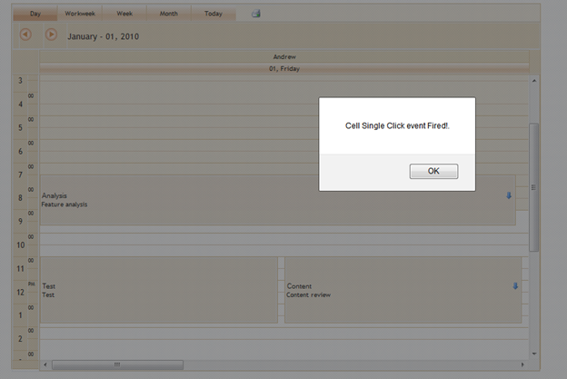

::: {style="DISPLAY: none"}
[](ms-xhelp:///?Id=d2h_url_template){#d2h_url_template}{#d2h_package_url style="WIDTH: 0px; DISPLAY: none; HEIGHT: 0px"}
:::

::: {.d2h_secondary_topic style="PADDING-BOTTOM: 10pt; MARGIN: 0pt; PADDING-LEFT: 0pt; PADDING-RIGHT: 0pt; PADDING-TOP: 0pt"}
#### Using SchedulePropertiesModel {#using-schedulepropertiesmodel style="tab-stops: 0pt"}

The steps to customize client-side events using SchedulePropertiesModel are as follows:

1.  [Create a model in the application.](http://help.syncfusion.com/ug_93/User%20Interface/ASP.NET%20MVC/Schedule/Documents/addingamodeltotheapplication.htm)

2.  Add the following code in the Index.aspx file, to create the **Schedule** control in **View**.

[]{style="FONT-FAMILY: 'Times New Roman','serif'; FONT-SIZE: 12pt"} 

+----------------------------------------------------------------------------------------------------------------------------------------------------------------------------------------------------------------------------+
| **[View]{style="FONT-FAMILY: 'Courier New'"}**[ ]{style="FONT-FAMILY: 'Courier New'; FONT-SIZE: 12pt"}                                                                                                                     |
|                                                                                                                                                                                                                            |
| [       [\<%]{style="BACKGROUND: yellow"}[=]{style="COLOR: blue"}Html.Syncfusion().Schedule()([\"FlatSchedule\"]{style="COLOR: #a31515"},[\"ScheduleModel\"]{style="COLOR: #a31515"})]{style="FONT-FAMILY: 'Courier New'"} |
|                                                                                                                                                                                                                            |
| [       .BindList(columns =\>]{style="FONT-FAMILY: 'Courier New'"}                                                                                                                                                         |
|                                                                                                                                                                                                                            |
| [       {]{style="FONT-FAMILY: 'Courier New'"}                                                                                                                                                                             |
|                                                                                                                                                                                                                            |
| [           columns.IdField([\"AppId\"]{style="COLOR: #a31515"});]{style="FONT-FAMILY: 'Courier New'"}                                                                                                                     |
|                                                                                                                                                                                                                            |
| [           columns.SubjectField([\"Subject\"]{style="COLOR: #a31515"});]{style="FONT-FAMILY: 'Courier New'"}                                                                                                              |
|                                                                                                                                                                                                                            |
| [           columns.LocationField([\"Location\"]{style="COLOR: #a31515"});]{style="FONT-FAMILY: 'Courier New'"}                                                                                                            |
|                                                                                                                                                                                                                            |
| [           columns.StartTimeField([\"StartTime\"]{style="COLOR: #a31515"});]{style="FONT-FAMILY: 'Courier New'"}                                                                                                          |
|                                                                                                                                                                                                                            |
| [           columns.EndTimeField([\"EndTime\"]{style="COLOR: #a31515"});]{style="FONT-FAMILY: 'Courier New'"}                                                                                                              |
|                                                                                                                                                                                                                            |
| [           columns.DescriptionField([\"Descrip\"]{style="COLOR: #a31515"});]{style="FONT-FAMILY: 'Courier New'"}                                                                                                          |
|                                                                                                                                                                                                                            |
| [           columns.OwnerField([\"Resource\"]{style="COLOR: #a31515"});]{style="FONT-FAMILY: 'Courier New'"}                                                                                                               |
|                                                                                                                                                                                                                            |
| [       })]{style="FONT-FAMILY: 'Courier New'"}                                                                                                                                                                            |
|                                                                                                                                                                                                                            |
| [                [%\>]{style="BACKGROUND: yellow"}]{style="FONT-FAMILY: 'Courier New'"}                                                                                                                                    |
|                                                                                                                                                                                                                            |
| []{style="FONT-FAMILY: 'Courier New'; FONT-SIZE: 12pt"}                                                                                                                                                                    |
+----------------------------------------------------------------------------------------------------------------------------------------------------------------------------------------------------------------------------+

[]{style="FONT-FAMILY: 'Times New Roman','serif'; FONT-SIZE: 12pt"} 

3.  In the controller, add the Syncfusion.Mvc.Schedule and Syncfusion.Mvc.Shared namespaces.

[]{style="FONT-FAMILY: 'Times New Roman','serif'; FONT-SIZE: 12pt"} 

+-------------------------------------------------------------------------------------------------------------------------+
| **[Controller]{style="FONT-FAMILY: 'Courier New'"}**                                                                    |
|                                                                                                                         |
| []{style="FONT-FAMILY: 'Times New Roman','serif'; FONT-SIZE: 12pt"}[]{style="FONT-FAMILY: 'Courier New'"}               |
|                                                                                                                         |
| [using]{style="FONT-FAMILY: 'Courier New'; COLOR: blue"}[ Syncfusion.Mvc.Schedule;]{style="FONT-FAMILY: 'Courier New'"} |
|                                                                                                                         |
| [using]{style="FONT-FAMILY: 'Courier New'; COLOR: blue"}[ Syncfusion.Mvc.Shared;]{style="FONT-FAMILY: 'Courier New'"}   |
|                                                                                                                         |
| []{style="FONT-FAMILY: 'Times New Roman','serif'; FONT-SIZE: 12pt"}                                                     |
+-------------------------------------------------------------------------------------------------------------------------+

[]{style="FONT-FAMILY: 'Times New Roman','serif'; FONT-SIZE: 12pt"} 

4.  Create a **SchedulePropertiesModel** in **Index** method and set **EnableClientSideEvents** property to handle client-side functions.

5.  Define client-side functions for appointment selection and cell double-click.

6.  Pass this **SchedulePropertiesModel** from Controller to View using **ViewData** class as shown below.

[]{style="FONT-FAMILY: 'Times New Roman','serif'; FONT-SIZE: 12pt"} 

+-----------------------------------------------------------------------------------------------------------------------------------------------------------------------------------------------------------------------------------+
| **[Controller]{style="FONT-FAMILY: 'Courier New'"}**                                                                                                                                                                              |
|                                                                                                                                                                                                                                   |
| []{style="FONT-FAMILY: 'Courier New'"}                                                                                                                                                                                            |
|                                                                                                                                                                                                                                   |
| [        [///]{style="COLOR: gray"}[ ]{style="COLOR: green"}[\<summary\>]{style="COLOR: gray"}]{style="FONT-FAMILY: 'Courier New'"}                                                                                               |
|                                                                                                                                                                                                                                   |
| [        [///]{style="COLOR: gray"}[ It used to bind the Schedule]{style="COLOR: green"}]{style="FONT-FAMILY: 'Courier New'"}                                                                                                     |
|                                                                                                                                                                                                                                   |
| [        [///]{style="COLOR: gray"}[ ]{style="COLOR: green"}[\</summary\>]{style="COLOR: gray"}]{style="FONT-FAMILY: 'Courier New'"}                                                                                              |
|                                                                                                                                                                                                                                   |
| [        [///]{style="COLOR: gray"}[ ]{style="COLOR: green"}[\<returns\>]{style="COLOR: gray"}[View page, it displays the Schedule]{style="COLOR: green"}[\</returns\>]{style="COLOR: gray"}]{style="FONT-FAMILY: 'Courier New'"} |
|                                                                                                                                                                                                                                   |
| [        [public]{style="COLOR: blue"} [ActionResult]{style="COLOR: #2b91af"} Index()]{style="FONT-FAMILY: 'Courier New'"}                                                                                                        |
|                                                                                                                                                                                                                                   |
| [        {]{style="FONT-FAMILY: 'Courier New'"}                                                                                                                                                                                   |
|                                                                                                                                                                                                                                   |
| [            [var]{style="COLOR: blue"} data = [new]{style="COLOR: blue"} [NorthwindDataClassesDataContext]{style="COLOR: #2b91af"}().AppointmentTables.Take(200);]{style="FONT-FAMILY: 'Courier New'"}                           |
|                                                                                                                                                                                                                                   |
| [            [SchedulePropertiesModel]{style="COLOR: #2b91af"} scheduleModel = [new]{style="COLOR: blue"} [SchedulePropertiesModel]{style="COLOR: #2b91af"}();]{style="FONT-FAMILY: 'Courier New'"}                               |
|                                                                                                                                                                                                                                   |
| [            scheduleModel.DataSource = data;]{style="FONT-FAMILY: 'Courier New'"}                                                                                                                                                |
|                                                                                                                                                                                                                                   |
| [            scheduleModel.Skins = [ScheduleSkins]{style="COLOR: #2b91af"}.Sandune;]{style="FONT-FAMILY: 'Courier New'"}                                                                                                          |
|                                                                                                                                                                                                                                   |
| [            scheduleModel.CurrentView = [ScheduleViewMode]{style="COLOR: #2b91af"}.Week;]{style="FONT-FAMILY: 'Courier New'"}                                                                                                    |
|                                                                                                                                                                                                                                   |
| **[            scheduleModel.EnableClientSideEvents = [true]{style="COLOR: blue"};]{style="FONT-FAMILY: 'Courier New'"}**[]{style="FONT-FAMILY: 'Courier New'"}                                                                   |
|                                                                                                                                                                                                                                   |
| **[            scheduleModel.ClientSideOnAppointmentSelection=[\"onAppointmentSelection\"]{style="COLOR: #a31515"};]{style="FONT-FAMILY: 'Courier New'"}**[]{style="FONT-FAMILY: 'Courier New'"}                                  |
|                                                                                                                                                                                                                                   |
| **[            scheduleModel.ClientSideOnCellDoubleClick = [\"onCellDblClick\"]{style="COLOR: #a31515"};]{style="FONT-FAMILY: 'Courier New'"}**                                                                                   |
|                                                                                                                                                                                                                                   |
| ``` {style="BACKGROUND: white"}                                                                                                                                                                                                   |
|                         scheduleModel.ClientSideOnCellSingleClick = "onCellSingleClick";                                                                                                                                          |
| ```                                                                                                                                                                                                                               |
|                                                                                                                                                                                                                                   |
| []{style="FONT-FAMILY: 'Courier New'"}                                                                                                                                                                                            |
|                                                                                                                                                                                                                                   |
| [            ViewData\[[\"ScheduleModel\"]{style="COLOR: #a31515"}\] = scheduleModel;]{style="FONT-FAMILY: 'Courier New'"}                                                                                                        |
|                                                                                                                                                                                                                                   |
| [            [return]{style="COLOR: blue"} View();]{style="FONT-FAMILY: 'Courier New'"}                                                                                                                                           |
|                                                                                                                                                                                                                                   |
| [        }]{style="FONT-FAMILY: 'Courier New'"}                                                                                                                                                                                   |
|                                                                                                                                                                                                                                   |
| []{style="FONT-FAMILY: 'Times New Roman','serif'; FONT-SIZE: 12pt"}                                                                                                                                                               |
+-----------------------------------------------------------------------------------------------------------------------------------------------------------------------------------------------------------------------------------+

[]{style="FONT-FAMILY: 'Times New Roman','serif'; FONT-SIZE: 12pt"} 

7.  Create a post method for Index action and bind the data source to **Schedule**, as shown in the code displayed below in order to work with post actions.

[]{style="FONT-FAMILY: 'Times New Roman','serif'; FONT-SIZE: 12pt"} 

+----------------------------------------------------------------------------------------------------------------------------------------------------------------------------------------------------------------------------------------------------------------------+
| **[Controller]{style="FONT-FAMILY: 'Courier New'"}**                                                                                                                                                                                                                 |
|                                                                                                                                                                                                                                                                      |
| []{style="FONT-FAMILY: 'Times New Roman','serif'; FONT-SIZE: 12pt"}                                                                                                                                                                                                  |
|                                                                                                                                                                                                                                                                      |
| [        [///]{style="COLOR: gray"}[ ]{style="COLOR: green"}[\<summary\>]{style="COLOR: gray"}]{style="FONT-FAMILY: 'Courier New'"}                                                                                                                                  |
|                                                                                                                                                                                                                                                                      |
| [        [///]{style="COLOR: gray"}[ Post Requests are mapped to this method. This method invokes the HtmlActionResult]{style="COLOR: green"}]{style="FONT-FAMILY: 'Courier New'"}                                                                                   |
|                                                                                                                                                                                                                                                                      |
| [        [///]{style="COLOR: gray"}[ from the Schedule. Required response is generated.]{style="COLOR: green"}]{style="FONT-FAMILY: 'Courier New'"}                                                                                                                  |
|                                                                                                                                                                                                                                                                      |
| [        [///]{style="COLOR: gray"}[ ]{style="COLOR: green"}[\</summary\>]{style="COLOR: gray"}]{style="FONT-FAMILY: 'Courier New'"}                                                                                                                                 |
|                                                                                                                                                                                                                                                                      |
| [        [///]{style="COLOR: gray"}[ ]{style="COLOR: green"}[\<param name=\"args\"\>]{style="COLOR: gray"}[Contains post action properties ]{style="COLOR: green"}[\</param\>]{style="COLOR: gray"}]{style="FONT-FAMILY: 'Courier New'"}                             |
|                                                                                                                                                                                                                                                                      |
| [        [///]{style="COLOR: gray"}[ ]{style="COLOR: green"}[\<returns\>]{style="COLOR: gray"}]{style="FONT-FAMILY: 'Courier New'"}                                                                                                                                  |
|                                                                                                                                                                                                                                                                      |
| [        [///]{style="COLOR: gray"}[ HtmlActionResult which returns data displayed on the Schedule]{style="COLOR: green"}]{style="FONT-FAMILY: 'Courier New'"}                                                                                                       |
|                                                                                                                                                                                                                                                                      |
| [        [///]{style="COLOR: gray"}[ ]{style="COLOR: green"}[\</returns\>]{style="COLOR: gray"}]{style="FONT-FAMILY: 'Courier New'"}[]{style="FONT-FAMILY: 'Courier New'; FONT-SIZE: 9pt"}                                                                           |
|                                                                                                                                                                                                                                                                      |
| [        \[[AcceptVerbs]{style="COLOR: #2b91af"}([HttpVerbs]{style="COLOR: #2b91af"}.Post)\]]{style="FONT-FAMILY: 'Courier New'; FONT-SIZE: 11pt"}                                                                                                                   |
|                                                                                                                                                                                                                                                                      |
| [        [public]{style="COLOR: blue"} [ActionResult]{style="COLOR: #2b91af"} Index([Params]{style="COLOR: #2b91af"} args)]{style="FONT-FAMILY: 'Courier New'; FONT-SIZE: 11pt"}                                                                                     |
|                                                                                                                                                                                                                                                                      |
| [        {]{style="FONT-FAMILY: 'Courier New'; FONT-SIZE: 11pt"}                                                                                                                                                                                                     |
|                                                                                                                                                                                                                                                                      |
| [IEnumerable]{style="FONT-FAMILY: 'Courier New'; COLOR: #2b91af; FONT-SIZE: 11pt"}[ data = [new]{style="COLOR: blue"} [NorthwindDataClassesDataContext]{style="COLOR: #2b91af"}().AppointmentTables.Take(200);]{style="FONT-FAMILY: 'Courier New'; FONT-SIZE: 11pt"} |
|                                                                                                                                                                                                                                                                      |
| [            [return]{style="COLOR: blue"} data.ScheduleActions\<[ScheduleHtmlActionResult]{style="COLOR: #2b91af"}\>();]{style="FONT-FAMILY: 'Courier New'; FONT-SIZE: 11pt"}                                                                                       |
|                                                                                                                                                                                                                                                                      |
| [        }]{style="FONT-FAMILY: 'Courier New'; FONT-SIZE: 11pt"}                                                                                                                                                                                                     |
|                                                                                                                                                                                                                                                                      |
| []{style="FONT-FAMILY: 'Times New Roman','serif'; FONT-SIZE: 12pt"}                                                                                                                                                                                                  |
+----------------------------------------------------------------------------------------------------------------------------------------------------------------------------------------------------------------------------------------------------------------------+

[]{style="FONT-FAMILY: 'Times New Roman','serif'; FONT-SIZE: 12pt"} 

+---------------------------------------------------------------------------------------------------------------------------------------------------------------------------------------------------------------------------------+
| **[\[JavaScript\]]{style="FONT-FAMILY: 'Courier New'"}**                                                                                                                                                                        |
|                                                                                                                                                                                                                                 |
| [  ]{style="FONT-FAMILY: 'Courier New'; COLOR: gray"}[    [\<]{style="COLOR: blue"}[script]{style="COLOR: maroon"} [type]{style="COLOR: red"}[=\"text/javascript\"\>]{style="COLOR: blue"}]{style="FONT-FAMILY: 'Courier New'"} |
|                                                                                                                                                                                                                                 |
| [        [// To handle the appointment selection event]{style="COLOR: darkgreen"}]{style="FONT-FAMILY: 'Courier New'"}                                                                                                          |
|                                                                                                                                                                                                                                 |
| [        [function]{style="COLOR: blue"} onAppointmentSelection(sender, args) {]{style="FONT-FAMILY: 'Courier New'"}                                                                                                            |
|                                                                                                                                                                                                                                 |
| [            [// sender - Schedule control details]{style="COLOR: darkgreen"}]{style="FONT-FAMILY: 'Courier New'"}                                                                                                              |
|                                                                                                                                                                                                                                 |
| [            [// args - id -\> selected appointment id]{style="COLOR: darkgreen"}]{style="FONT-FAMILY: 'Courier New'"}                                                                                                          |
|                                                                                                                                                                                                                                 |
| [            [// args - currentItem -\> selected appointment details]{style="COLOR: darkgreen"}]{style="FONT-FAMILY: 'Courier New'"}                                                                                            |
|                                                                                                                                                                                                                                 |
| [        }]{style="FONT-FAMILY: 'Courier New'"}                                                                                                                                                                                 |
|                                                                                                                                                                                                                                 |
| []{style="FONT-FAMILY: 'Courier New'"}                                                                                                                                                                                          |
|                                                                                                                                                                                                                                 |
| [        [// To handle the cell double click ]{style="COLOR: darkgreen"}]{style="FONT-FAMILY: 'Courier New'"}                                                                                                                   |
|                                                                                                                                                                                                                                 |
| [        [function]{style="COLOR: blue"} onCellDblClick(sender, args) {]{style="FONT-FAMILY: 'Courier New'"}                                                                                                                    |
|                                                                                                                                                                                                                                 |
| [            [// sender - Schedule control details]{style="COLOR: darkgreen"}]{style="FONT-FAMILY: 'Courier New'"}                                                                                                              |
|                                                                                                                                                                                                                                 |
| [            [// args - selectedDate -\> selected cell\'s date]{style="COLOR: darkgreen"}]{style="FONT-FAMILY: 'Courier New'"}                                                                                                  |
|                                                                                                                                                                                                                                 |
| [            [// args - selectedStartTime -\> selected cell\'s start time]{style="COLOR: darkgreen"}]{style="FONT-FAMILY: 'Courier New'"}                                                                                       |
|                                                                                                                                                                                                                                 |
| [            [// args - selectedEndTime -\> selected cell\'s end time]{style="COLOR: darkgreen"}]{style="FONT-FAMILY: 'Courier New'"}                                                                                           |
|                                                                                                                                                                                                                                 |
| [            [// args - selectedResourceId -\> selected cell\'s owner id]{style="COLOR: darkgreen"}]{style="FONT-FAMILY: 'Courier New'"}                                                                                        |
|                                                                                                                                                                                                                                 |
| [        }]{style="FONT-FAMILY: 'Courier New'"}                                                                                                                                                                                 |
|                                                                                                                                                                                                                                 |
| []{style="FONT-FAMILY: 'Courier New'"}                                                                                                                                                                                          |
|                                                                                                                                                                                                                                 |
| [// To handle the cell single click ]{style="FONT-FAMILY: 'Courier New'; COLOR: darkgreen"}[]{style="FONT-FAMILY: 'Courier New'"}                                                                                               |
|                                                                                                                                                                                                                                 |
| [        [function]{style="COLOR: blue"} onCellSingleClick(sender, args) {]{style="FONT-FAMILY: 'Courier New'"}                                                                                                                 |
|                                                                                                                                                                                                                                 |
| [            [// sender - Schedule control details]{style="COLOR: darkgreen"}]{style="FONT-FAMILY: 'Courier New'"}                                                                                                              |
|                                                                                                                                                                                                                                 |
| [            [// args - selectedDate -\> selected cell\'s date]{style="COLOR: darkgreen"}]{style="FONT-FAMILY: 'Courier New'"}                                                                                                  |
|                                                                                                                                                                                                                                 |
| [            [// args - selectedStartTime -\> selected cell\'s start time]{style="COLOR: darkgreen"}]{style="FONT-FAMILY: 'Courier New'"}                                                                                       |
|                                                                                                                                                                                                                                 |
| [            [// args - selectedEndTime -\> selected cell\'s end time]{style="COLOR: darkgreen"}]{style="FONT-FAMILY: 'Courier New'"}                                                                                           |
|                                                                                                                                                                                                                                 |
| [            [// args - selectedResourceId -\> selected cell\'s owner id]{style="COLOR: darkgreen"}]{style="FONT-FAMILY: 'Courier New'"}                                                                                        |
|                                                                                                                                                                                                                                 |
| [        }]{style="FONT-FAMILY: 'Courier New'"}                                                                                                                                                                                 |
|                                                                                                                                                                                                                                 |
| []{style="FONT-FAMILY: 'Courier New'"}                                                                                                                                                                                          |
|                                                                                                                                                                                                                                 |
| [    [\</]{style="COLOR: blue"}[script]{style="COLOR: maroon"}[\>]{style="COLOR: blue"}]{style="FONT-FAMILY: 'Courier New'"}                                                                                                    |
|                                                                                                                                                                                                                                 |
| []{style="FONT-FAMILY: 'Courier New'"}                                                                                                                                                                                          |
+---------------------------------------------------------------------------------------------------------------------------------------------------------------------------------------------------------------------------------+

 

8.  Run the application. The Schedule will appear when the cell is clicked as shown below.

{border="0"}

Figure 139: Cell Single Click Event

 

Events

+------------------------------------------------------------+-----------------------------------------------------------------------------+----------------------------------------------------------------+-----------------------------------------------------------+
| **[Event ]{style="COLOR: black"}**[]{style="COLOR: black"} | **[Description ]{style="COLOR: black"}**[]{style="COLOR: black"}            | **[Arguments ]{style="COLOR: black"}**[]{style="COLOR: black"} | **[Type ]{style="COLOR: black"}**[]{style="COLOR: black"} |
+------------------------------------------------------------+-----------------------------------------------------------------------------+----------------------------------------------------------------+-----------------------------------------------------------+
| ClientSideOnCellSingleClick                                | The ClientSideOnCellSingleClick event will be fired when a cell is clicked. | selectedDate---Selected cell' date                             | Client Side                                               |
|                                                            |                                                                             |                                                                |                                                           |
|                                                            |                                                                             | selectedStartTime---Selected cell's start time.                |                                                           |
|                                                            |                                                                             |                                                                |                                                           |
|                                                            |                                                                             | selectedEndTime---Selected cell's end time.                    |                                                           |
|                                                            |                                                                             |                                                                |                                                           |
|                                                            |                                                                             | selectedResourceId---Selected cell's resource ID.              |                                                           |
+============================================================+=============================================================================+================================================================+===========================================================+

[]{style="FONT-FAMILY: 'Calibri','sans-serif'; COLOR: black"}[]{style="COLOR: #c00000"} 

Sample Link

Refer to steps 1.1 and 1.2 for procedural steps of the sample.[]{style="COLOR: #c00000"}

[]{#related-topics}
:::
