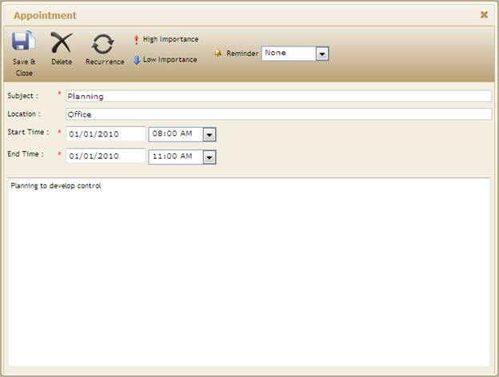

::: {style="DISPLAY: none"}
{#d2h_url_template}{#d2h_package_url style="WIDTH: 0px; DISPLAY: none; HEIGHT: 0px"}
:::

::: {.d2h_secondary_topic style="PADDING-BOTTOM: 10pt; MARGIN: 0pt; PADDING-LEFT: 0pt; PADDING-RIGHT: 0pt; PADDING-TOP: 0pt"}
##### Using SchedulePropertiesModel {#using-schedulepropertiesmodel style="tab-stops: 0pt"}

The steps to customize the Change an Appointment using SchedulePropertiesModel are as follows:

[[1.   ]{style="TEXT-DECORATION: none; text-underline: none"}]{.UGHyperlink}[Create a model in the application.]{.UGHyperlink}[ ]{.UGHyperlink}

2.   Add the following code in the Index.aspx file, to create the Schedule control in **View**.

[]{style="FONT-FAMILY: 'Calibri','sans-serif'"} 

+---------------------------------------------------------------------------------------------------------------------------------------------------------------------------------------------------------------------------------------------------------------------------------------------------------------+
| **[View\[aspx\]]{style="FONT-FAMILY: 'Calibri','sans-serif'"}**                                                                                                                                                                                                                                               |
|                                                                                                                                                                                                                                                                                                               |
| [   ]{style="FONT-FAMILY: 'Calibri','sans-serif'"}[    [\<%]{style="BACKGROUND: yellow"}[=]{style="COLOR: blue"}Html.Syncfusion().Schedule()([\"FlatSchedule\"]{style="COLOR: #a31515"} ,[\"ScheduleModel\"]{style="COLOR: #a31515"})[]{style="COLOR: #a31515"}]{style="FONT-FAMILY: 'Calibri','sans-serif'"} |
|                                                                                                                                                                                                                                                                                                               |
| [       .BindList(columns =\>]{style="FONT-FAMILY: 'Calibri','sans-serif'"}                                                                                                                                                                                                                                   |
|                                                                                                                                                                                                                                                                                                               |
| [       {]{style="FONT-FAMILY: 'Calibri','sans-serif'"}                                                                                                                                                                                                                                                       |
|                                                                                                                                                                                                                                                                                                               |
| [           columns.IdField([\"AppId\"]{style="COLOR: #a31515"});]{style="FONT-FAMILY: 'Calibri','sans-serif'"}                                                                                                                                                                                               |
|                                                                                                                                                                                                                                                                                                               |
| [           columns.SubjectField([\"Subject\"]{style="COLOR: #a31515"});]{style="FONT-FAMILY: 'Calibri','sans-serif'"}                                                                                                                                                                                        |
|                                                                                                                                                                                                                                                                                                               |
| [           columns.LocationField([\"Location\"]{style="COLOR: #a31515"});]{style="FONT-FAMILY: 'Calibri','sans-serif'"}                                                                                                                                                                                      |
|                                                                                                                                                                                                                                                                                                               |
| [           columns.StartTimeField([\"StartTime\"]{style="COLOR: #a31515"});]{style="FONT-FAMILY: 'Calibri','sans-serif'"}                                                                                                                                                                                    |
|                                                                                                                                                                                                                                                                                                               |
| [           columns.EndTimeField([\"EndTime\"]{style="COLOR: #a31515"});]{style="FONT-FAMILY: 'Calibri','sans-serif'"}                                                                                                                                                                                        |
|                                                                                                                                                                                                                                                                                                               |
| [           columns.DescriptionField([\"Descrip\"]{style="COLOR: #a31515"});]{style="FONT-FAMILY: 'Calibri','sans-serif'"}                                                                                                                                                                                    |
|                                                                                                                                                                                                                                                                                                               |
| [           columns.OwnerField([\"Resource\"]{style="COLOR: #a31515"});]{style="FONT-FAMILY: 'Calibri','sans-serif'"}                                                                                                                                                                                         |
|                                                                                                                                                                                                                                                                                                               |
| [       })]{style="FONT-FAMILY: 'Calibri','sans-serif'"}                                                                                                                                                                                                                                                      |
|                                                                                                                                                                                                                                                                                                               |
| [       [%\>]{style="BACKGROUND: yellow"}]{style="FONT-FAMILY: 'Calibri','sans-serif'"}[]{style="FONT-FAMILY: 'Calibri','sans-serif'"}                                                                                                                                                                        |
+---------------------------------------------------------------------------------------------------------------------------------------------------------------------------------------------------------------------------------------------------------------------------------------------------------------+

[]{style="FONT-FAMILY: 'Calibri','sans-serif'; BACKGROUND: yellow"} 

[]{style="FONT-FAMILY: 'Calibri','sans-serif'"} 

+-------------------------------------------------------------------------------------------------------------------------------------------------------------------------------------------------------------------------+
| **[View\[cshtml\]]{style="FONT-FAMILY: 'Calibri','sans-serif'"}**                                                                                                                                                       |
|                                                                                                                                                                                                                         |
| []{style="FONT-FAMILY: Consolas; FONT-SIZE: 9.5pt"}                                                                                                                                                                     |
|                                                                                                                                                                                                                         |
| [              [@(]{style="BACKGROUND: yellow"} Html.Syncfusion().Schedule()([\"FlatSchedule\"]{style="COLOR: #a31515"} ,[\"ScheduleModel\"]{style="COLOR: #a31515"})]{style="FONT-FAMILY: Consolas; FONT-SIZE: 9.5pt"} |
|                                                                                                                                                                                                                         |
| [       .BindList(columns =\>]{style="FONT-FAMILY: Consolas; FONT-SIZE: 9.5pt"}                                                                                                                                         |
|                                                                                                                                                                                                                         |
| [       {]{style="FONT-FAMILY: Consolas; FONT-SIZE: 9.5pt"}                                                                                                                                                             |
|                                                                                                                                                                                                                         |
| [           columns.IdField([\"AppId\"]{style="COLOR: #a31515"});]{style="FONT-FAMILY: Consolas; FONT-SIZE: 9.5pt"}                                                                                                     |
|                                                                                                                                                                                                                         |
| [           columns.SubjectField([\"Subject\"]{style="COLOR: #a31515"});]{style="FONT-FAMILY: Consolas; FONT-SIZE: 9.5pt"}                                                                                              |
|                                                                                                                                                                                                                         |
| [           columns.LocationField([\"Location\"]{style="COLOR: #a31515"});]{style="FONT-FAMILY: Consolas; FONT-SIZE: 9.5pt"}                                                                                            |
|                                                                                                                                                                                                                         |
| [           columns.StartTimeField([\"StartTime\"]{style="COLOR: #a31515"});]{style="FONT-FAMILY: Consolas; FONT-SIZE: 9.5pt"}                                                                                          |
|                                                                                                                                                                                                                         |
| [           columns.EndTimeField([\"EndTime\"]{style="COLOR: #a31515"});]{style="FONT-FAMILY: Consolas; FONT-SIZE: 9.5pt"}                                                                                              |
|                                                                                                                                                                                                                         |
| [           columns.DescriptionField([\"Descrip\"]{style="COLOR: #a31515"});]{style="FONT-FAMILY: Consolas; FONT-SIZE: 9.5pt"}                                                                                          |
|                                                                                                                                                                                                                         |
| [           columns.OwnerField([\"Resource\"]{style="COLOR: #a31515"});]{style="FONT-FAMILY: Consolas; FONT-SIZE: 9.5pt"}                                                                                               |
|                                                                                                                                                                                                                         |
| [       })[)]{style="BACKGROUND: yellow"}]{style="FONT-FAMILY: Consolas; FONT-SIZE: 9.5pt"}                                                                                                                             |
|                                                                                                                                                                                                                         |
| []{style="FONT-FAMILY: 'Calibri','sans-serif'"}                                                                                                                                                                         |
+-------------------------------------------------------------------------------------------------------------------------------------------------------------------------------------------------------------------------+

[]{style="FONT-FAMILY: 'Calibri','sans-serif'; BACKGROUND: yellow"} 

3.   In Controller, add the Syncfusion.Mvc.Schedule, Syncfusion.Mvc.Shared namespaces.

[]{style="FONT-FAMILY: 'Calibri','sans-serif'"} 

+--------------------------------------------------------------------------------------------------------------------------------------------------------------+
| **[\[Controller\]]{style="FONT-FAMILY: 'Calibri','sans-serif'"}**[[]{style="FONT-FAMILY: 'Calibri','sans-serif'; FONT-WEIGHT: normal"}]{.MsoIntenseEmphasis} |
|                                                                                                                                                              |
| [using]{style="FONT-FAMILY: 'Calibri','sans-serif'; COLOR: blue"}[ Syncfusion.Mvc.Schedule;]{style="FONT-FAMILY: 'Calibri','sans-serif'"}                    |
|                                                                                                                                                              |
| [using]{style="FONT-FAMILY: 'Calibri','sans-serif'; COLOR: blue"}[ Syncfusion.Mvc.Shared;]{style="FONT-FAMILY: 'Calibri','sans-serif'"}                      |
|                                                                                                                                                              |
| []{style="FONT-FAMILY: 'Calibri','sans-serif'"}                                                                                                              |
+--------------------------------------------------------------------------------------------------------------------------------------------------------------+

[]{style="FONT-FAMILY: 'Calibri','sans-serif'; BACKGROUND: yellow"} 

4.   Create a **SchedulePropertiesModel** in the **Index** method.

5.   Use **AllowEdit** property to change an appointment through AppointmentDoubleClick Event. Create context-menu item and set the contextMenuItems property to change an appointment through context-menu.

6.   Pass this **SchedulePropertiesModel** from **Controller** to **View** using **ViewData** class as shown below.

[]{style="FONT-FAMILY: 'Calibri','sans-serif'"} 

+--------------------------------------------------------------------------------------------------------------------------------------------------------------------------------------------------------------------------------------------+
| **[\[Controller\]]{style="FONT-FAMILY: 'Calibri','sans-serif'"}**                                                                                                                                                                          |
|                                                                                                                                                                                                                                            |
| [        [///]{style="COLOR: gray"}[ ]{style="COLOR: green"}[\<summary\>]{style="COLOR: gray"}]{style="FONT-FAMILY: 'Calibri','sans-serif'"}                                                                                               |
|                                                                                                                                                                                                                                            |
| [        [///]{style="COLOR: gray"}[ It is used to bind the Schedule]{style="COLOR: green"}]{style="FONT-FAMILY: 'Calibri','sans-serif'"}                                                                                                  |
|                                                                                                                                                                                                                                            |
| [        [///]{style="COLOR: gray"}[ ]{style="COLOR: green"}[\</summary\>]{style="COLOR: gray"}]{style="FONT-FAMILY: 'Calibri','sans-serif'"}                                                                                              |
|                                                                                                                                                                                                                                            |
| [        [///]{style="COLOR: gray"}[ ]{style="COLOR: green"}[\<returns\>]{style="COLOR: gray"}[View page, it displays the Schedule]{style="COLOR: green"}[\</returns\>]{style="COLOR: gray"}]{style="FONT-FAMILY: 'Calibri','sans-serif'"} |
|                                                                                                                                                                                                                                            |
| [        [public]{style="COLOR: blue"} [ActionResult]{style="COLOR: #2b91af"} Index()]{style="FONT-FAMILY: 'Calibri','sans-serif'"}                                                                                                        |
|                                                                                                                                                                                                                                            |
| [        {]{style="FONT-FAMILY: 'Calibri','sans-serif'"}                                                                                                                                                                                   |
|                                                                                                                                                                                                                                            |
| [ContextMenuItem]{style="FONT-FAMILY: 'Calibri','sans-serif'; COLOR: #2b91af"}[ editApp = [new]{style="COLOR: blue"} [ContextMenuItem]{style="COLOR: #2b91af"}() ]{style="FONT-FAMILY: 'Calibri','sans-serif'"}                            |
|                                                                                                                                                                                                                                            |
| [{ ]{style="FONT-FAMILY: 'Calibri','sans-serif'"}                                                                                                                                                                                          |
|                                                                                                                                                                                                                                            |
| [MenuID = [\"UpdateAppointment\"]{style="COLOR: #a31515"}, ]{style="FONT-FAMILY: 'Calibri','sans-serif'"}                                                                                                                                  |
|                                                                                                                                                                                                                                            |
| [MenuName = [\"Update Appointment\"]{style="COLOR: #a31515"}, ]{style="FONT-FAMILY: 'Calibri','sans-serif'"}                                                                                                                               |
|                                                                                                                                                                                                                                            |
| [CommandName = [ContextCommandNames]{style="COLOR: #2b91af"}.OpenAppointment ]{style="FONT-FAMILY: 'Calibri','sans-serif'"}                                                                                                                |
|                                                                                                                                                                                                                                            |
| [};]{style="FONT-FAMILY: 'Calibri','sans-serif'"}                                                                                                                                                                                          |
|                                                                                                                                                                                                                                            |
| [                [var]{style="COLOR: blue"} data = [new]{style="COLOR: blue"} [NorthwindDataClassesDataContext]{style="COLOR: #2b91af"}().AppointmentTables.Take(200);]{style="FONT-FAMILY: 'Calibri','sans-serif'"}                       |
|                                                                                                                                                                                                                                            |
| [                [SchedulePropertiesModel]{style="COLOR: #2b91af"} scheduleModel = [new]{style="COLOR: blue"} [SchedulePropertiesModel]{style="COLOR: #2b91af"}();]{style="FONT-FAMILY: 'Calibri','sans-serif'"}                           |
|                                                                                                                                                                                                                                            |
| [                scheduleModel.DataSource = data;]{style="FONT-FAMILY: 'Calibri','sans-serif'"}                                                                                                                                            |
|                                                                                                                                                                                                                                            |
| [                 scheduleModel.Skins = [ScheduleSkins]{style="COLOR: #2b91af"}.Sandune;]{style="FONT-FAMILY: 'Calibri','sans-serif'"}                                                                                                     |
|                                                                                                                                                                                                                                            |
| **[                scheduleModel.AllowEdit = [true]{style="COLOR: blue"};]{style="FONT-FAMILY: 'Calibri','sans-serif'"}**                                                                                                                  |
|                                                                                                                                                                                                                                            |
| **[scheduleModel.ContextMenuItems = [new]{style="COLOR: blue"} [List]{style="COLOR: #2b91af"}\<[ContextMenuItem]{style="COLOR: #2b91af"}\>() { editApp };]{style="FONT-FAMILY: 'Calibri','sans-serif'"}**                                  |
|                                                                                                                                                                                                                                            |
| [                ViewData\[[\"ScheduleModel\"]{style="COLOR: #a31515"}\] = scheduleModel;]{style="FONT-FAMILY: 'Calibri','sans-serif'"}                                                                                                    |
|                                                                                                                                                                                                                                            |
| [                [return]{style="COLOR: blue"} View();]{style="FONT-FAMILY: 'Calibri','sans-serif'"}                                                                                                                                       |
|                                                                                                                                                                                                                                            |
| [        }]{style="FONT-FAMILY: 'Calibri','sans-serif'"}                                                                                                                                                                                   |
|                                                                                                                                                                                                                                            |
| []{style="FONT-FAMILY: 'Calibri','sans-serif'"}                                                                                                                                                                                            |
+--------------------------------------------------------------------------------------------------------------------------------------------------------------------------------------------------------------------------------------------+

[]{style="FONT-FAMILY: 'Calibri','sans-serif'"} 

7.   Create a post method for **Index** action and bind the data source to Schedule, as shown in the code displayed below.

[[]{style="FONT-FAMILY: 'Calibri','sans-serif'"}]{.MsoIntenseEmphasis} 

+---------------------------------------------------------------------------------------------------------------------------------------------------------------------------------------------------------------------------------------------------+
| **[\[Controller\]]{style="FONT-FAMILY: 'Calibri','sans-serif'"}**                                                                                                                                                                                 |
|                                                                                                                                                                                                                                                   |
| [  ]{style="FONT-FAMILY: 'Calibri','sans-serif'; COLOR: gray"}[      [///]{style="COLOR: gray"}[ ]{style="COLOR: green"}[\<summary\>]{style="COLOR: gray"}]{style="FONT-FAMILY: 'Calibri','sans-serif'"}                                          |
|                                                                                                                                                                                                                                                   |
| [        [///]{style="COLOR: gray"}[ Post Requests are mapped to this method. This method invokes the HtmlActionResult]{style="COLOR: green"}]{style="FONT-FAMILY: 'Calibri','sans-serif'"}                                                       |
|                                                                                                                                                                                                                                                   |
| [        [///]{style="COLOR: gray"}[ from the Schedule. Required response is generated.]{style="COLOR: green"}]{style="FONT-FAMILY: 'Calibri','sans-serif'"}                                                                                      |
|                                                                                                                                                                                                                                                   |
| [        [///]{style="COLOR: gray"}[ ]{style="COLOR: green"}[\</summary\>]{style="COLOR: gray"}]{style="FONT-FAMILY: 'Calibri','sans-serif'"}                                                                                                     |
|                                                                                                                                                                                                                                                   |
| [        [///]{style="COLOR: gray"}[ ]{style="COLOR: green"}[\<param name=\"args\"\>]{style="COLOR: gray"}[Contains post action properties ]{style="COLOR: green"}[\</param\>]{style="COLOR: gray"}]{style="FONT-FAMILY: 'Calibri','sans-serif'"} |
|                                                                                                                                                                                                                                                   |
| [        [///]{style="COLOR: gray"}[ ]{style="COLOR: green"}[\<returns\>]{style="COLOR: gray"}]{style="FONT-FAMILY: 'Calibri','sans-serif'"}                                                                                                      |
|                                                                                                                                                                                                                                                   |
| [        [///]{style="COLOR: gray"}[ HtmlActionResult which returns data displayed on the Schedule]{style="COLOR: green"}]{style="FONT-FAMILY: 'Calibri','sans-serif'"}                                                                           |
|                                                                                                                                                                                                                                                   |
| [        [///]{style="COLOR: gray"}[ ]{style="COLOR: green"}[\</returns\>]{style="COLOR: gray"}]{style="FONT-FAMILY: 'Calibri','sans-serif'"}                                                                                                     |
|                                                                                                                                                                                                                                                   |
| [        \[[AcceptVerbs]{style="COLOR: #2b91af"}([HttpVerbs]{style="COLOR: #2b91af"}.Post)\]]{style="FONT-FAMILY: 'Calibri','sans-serif'"}                                                                                                        |
|                                                                                                                                                                                                                                                   |
| [        [public]{style="COLOR: blue"} [ActionResult]{style="COLOR: #2b91af"} Index([Params]{style="COLOR: #2b91af"} args, [SchedulePropertiesModel]{style="COLOR: #2b91af"} model)]{style="FONT-FAMILY: 'Calibri','sans-serif'"}                 |
|                                                                                                                                                                                                                                                   |
| [        {]{style="FONT-FAMILY: 'Calibri','sans-serif'"}                                                                                                                                                                                          |
|                                                                                                                                                                                                                                                   |
| [NorthwindDataClassesDataContext]{style="FONT-FAMILY: 'Calibri','sans-serif'; COLOR: #2b91af"}[ db = [new]{style="COLOR: blue"} [NorthwindDataClassesDataContext]{style="COLOR: #2b91af"}();]{style="FONT-FAMILY: 'Calibri','sans-serif'"}        |
|                                                                                                                                                                                                                                                   |
| [            model.SetCurrentCultureInfo();]{style="FONT-FAMILY: 'Calibri','sans-serif'"}                                                                                                                                                         |
|                                                                                                                                                                                                                                                   |
| []{style="FONT-FAMILY: 'Calibri','sans-serif'"}                                                                                                                                                                                                   |
|                                                                                                                                                                                                                                                   |
| [            [// Update existing apppointment]{style="COLOR: green"}]{style="FONT-FAMILY: 'Calibri','sans-serif'"}                                                                                                                                |
|                                                                                                                                                                                                                                                   |
| [            [if]{style="COLOR: blue"} (args.CurrentAction == [\"Edit\"]{style="COLOR: #a31515"})]{style="FONT-FAMILY: 'Calibri','sans-serif'"}                                                                                                   |
|                                                                                                                                                                                                                                                   |
| [            {]{style="FONT-FAMILY: 'Calibri','sans-serif'"}                                                                                                                                                                                      |
|                                                                                                                                                                                                                                                   |
| [                [var]{style="COLOR: blue"} filterData = db.AppointmentTables.Where(c =\> c.AppId == [Convert]{style="COLOR: #2b91af"}.ToInt32(args.AppID));]{style="FONT-FAMILY: 'Calibri','sans-serif'"}                                        |
|                                                                                                                                                                                                                                                   |
| [                [if]{style="COLOR: blue"} (filterData.Count() \> 0)]{style="FONT-FAMILY: 'Calibri','sans-serif'"}                                                                                                                                |
|                                                                                                                                                                                                                                                   |
| [                {]{style="FONT-FAMILY: 'Calibri','sans-serif'"}                                                                                                                                                                                  |
|                                                                                                                                                                                                                                                   |
| [                    [DateTime]{style="COLOR: #2b91af"} startTime = [Convert]{style="COLOR: #2b91af"}.ToDateTime(args.StartTime);]{style="FONT-FAMILY: 'Calibri','sans-serif'"}                                                                   |
|                                                                                                                                                                                                                                                   |
| [                    [DateTime]{style="COLOR: #2b91af"} endTime = [Convert]{style="COLOR: #2b91af"}.ToDateTime(args.EndTime);]{style="FONT-FAMILY: 'Calibri','sans-serif'"}                                                                       |
|                                                                                                                                                                                                                                                   |
| [                    [AppointmentTable]{style="COLOR: #2b91af"} appoint = db.AppointmentTables.Single(A =\> A.AppId == [Convert]{style="COLOR: #2b91af"}.ToInt32(args.AppID));]{style="FONT-FAMILY: 'Calibri','sans-serif'"}                      |
|                                                                                                                                                                                                                                                   |
| [                    appoint.StartTime = startTime;]{style="FONT-FAMILY: 'Calibri','sans-serif'"}                                                                                                                                                 |
|                                                                                                                                                                                                                                                   |
| [                    appoint.EndTime = endTime;]{style="FONT-FAMILY: 'Calibri','sans-serif'"}                                                                                                                                                     |
|                                                                                                                                                                                                                                                   |
| [                    appoint.Subject = args.Subject;]{style="FONT-FAMILY: 'Calibri','sans-serif'"}                                                                                                                                                |
|                                                                                                                                                                                                                                                   |
| [                    appoint.Location = args.Location;]{style="FONT-FAMILY: 'Calibri','sans-serif'"}                                                                                                                                              |
|                                                                                                                                                                                                                                                   |
| [                    appoint.Descrip = args.Description;]{style="FONT-FAMILY: 'Calibri','sans-serif'"}                                                                                                                                            |
|                                                                                                                                                                                                                                                   |
| [                    appoint.Resource = args.Owner;]{style="FONT-FAMILY: 'Calibri','sans-serif'"}                                                                                                                                                 |
|                                                                                                                                                                                                                                                   |
| [                }]{style="FONT-FAMILY: 'Calibri','sans-serif'"}                                                                                                                                                                                  |
|                                                                                                                                                                                                                                                   |
| [            }]{style="FONT-FAMILY: 'Calibri','sans-serif'"}                                                                                                                                                                                      |
|                                                                                                                                                                                                                                                   |
| [            [//to reflect in database]{style="COLOR: green"}]{style="FONT-FAMILY: 'Calibri','sans-serif'"}                                                                                                                                       |
|                                                                                                                                                                                                                                                   |
| [            db.SubmitChanges();]{style="FONT-FAMILY: 'Calibri','sans-serif'"}                                                                                                                                                                    |
|                                                                                                                                                                                                                                                   |
| [            [ActionResult]{style="COLOR: #2b91af"} result = db.AppointmentTables.ScheduleActions\<[ScheduleHtmlActionResult]{style="COLOR: #2b91af"}\>();]{style="FONT-FAMILY: 'Calibri','sans-serif'"}                                          |
|                                                                                                                                                                                                                                                   |
| [            [return]{style="COLOR: blue"} result;]{style="FONT-FAMILY: 'Calibri','sans-serif'"}                                                                                                                                                  |
|                                                                                                                                                                                                                                                   |
| [        }]{style="FONT-FAMILY: 'Calibri','sans-serif'"}                                                                                                                                                                                          |
|                                                                                                                                                                                                                                                   |
| []{style="FONT-FAMILY: 'Calibri','sans-serif'"}                                                                                                                                                                                                   |
+---------------------------------------------------------------------------------------------------------------------------------------------------------------------------------------------------------------------------------------------------+

[]{style="FONT-FAMILY: 'Calibri','sans-serif'"} 

8.   Run the application. The Schedule's appointment window will appear as shown below when the following actions happen to change an appointment.

a.       Double-click any appointment**.**

b.       Right-click an appointment and click Open Appointment.

[]{style="FONT-FAMILY: 'Calibri','sans-serif'"} 

{border="0"}

[]{style="FONT-FAMILY: 'Calibri','sans-serif'"} 

Figure 109: Appointment Dialog with Existing Appointment Details

[]{style="FONT-FAMILY: 'Calibri','sans-serif'"} 

9.   In the **Subject** box, change an appointment's subject.

10.  In the **Location** box, change the location.

11.  Change the appointment timings - start date, start time, end date and end time.

12.  In the **Description** box, change a description.

13.  On the **Appointment** dialog toolbar, click **Save** & **Close**.

[]{style="FONT-FAMILY: 'Calibri','sans-serif'"} 

[]{#related-topics}
:::
