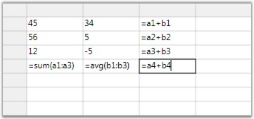

::: {style="DISPLAY: none"}
{#d2h_url_template}{#d2h_package_url style="WIDTH: 0px; DISPLAY: none; HEIGHT: 0px"}
:::

::: {.d2h_secondary_topic style="PADDING-BOTTOM: 10pt; MARGIN: 0pt; PADDING-LEFT: 0pt; PADDING-RIGHT: 0pt; PADDING-TOP: 0pt"}
##### Using the Formula Library {#using-the-formula-library style="tab-stops: 0pt"}

Essential Grid\'s Formula Library contains the mathematical functions that are available in the .NET FrameWork\'s System.Math class. In addition, there are Sum and Avg members. For a complete list of these library functions, please see the Class Reference for GridFormulaEngine. You can also add additional functions to this library using your own code.

 

{border="0"}

Figure 39: Sample Formula Library Usage

 

In the above image, cell A2 has a formula that uses four different library functions: Sqrt, Pow, Cos, and Sin.

[]{#p33} 

[]{#related-topics}
:::
