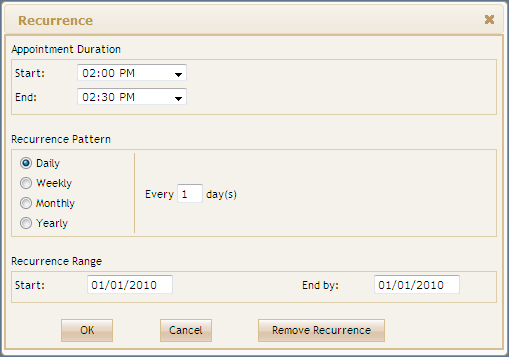

::: {style="DISPLAY: none"}
{#d2h_url_template}{#d2h_package_url style="WIDTH: 0px; DISPLAY: none; HEIGHT: 0px"}
:::

::: {.d2h_secondary_topic style="PADDING-BOTTOM: 10pt; MARGIN: 0pt; PADDING-LEFT: 0pt; PADDING-RIGHT: 0pt; PADDING-TOP: 0pt"}
##### Using View customization {#using-view-customization style="tab-stops: 0pt"}

The steps to customize recurring appointment using View Customization are as follows:

1.   Create a model in the application.[ ]{style="FONT-FAMILY: 'Calibri','sans-serif'"}

2.   Create a strongly typed view.[]{style="FONT-FAMILY: 'Calibri','sans-serif'"}

3.   In **View**, you can use  **Model** property in **DataSource** in order to bind the data source and bind the database fields into the corresponding **Schedule** fields.

[]{style="FONT-FAMILY: 'Calibri','sans-serif'"} 

+-------------------------------------------------------------------------------------------------------------------------------------------------------------------------------------------------------------------------------------+
| **[View\[aspx\]]{style="FONT-FAMILY: 'Calibri','sans-serif'"}**                                                                                                                                                                     |
|                                                                                                                                                                                                                                     |
| [    [\<%]{style="BACKGROUND: yellow"}[=]{style="COLOR: blue"}Html.Syncfusion().Schedule()([\"FlatSchedule\"]{style="COLOR: #a31515"})]{style="FONT-FAMILY: 'Calibri','sans-serif'"}[]{style="FONT-FAMILY: 'Calibri','sans-serif'"} |
|                                                                                                                                                                                                                                     |
| [       .DataSource(([IEnumerable]{style="COLOR: #2b91af"})Model)]{style="FONT-FAMILY: 'Calibri','sans-serif'"}                                                                                                                     |
|                                                                                                                                                                                                                                     |
| [       .BindList(columns =\>]{style="FONT-FAMILY: 'Calibri','sans-serif'"}                                                                                                                                                         |
|                                                                                                                                                                                                                                     |
| [       {]{style="FONT-FAMILY: 'Calibri','sans-serif'"}                                                                                                                                                                             |
|                                                                                                                                                                                                                                     |
| [           columns.IdField([\"AppId\"]{style="COLOR: #a31515"});]{style="FONT-FAMILY: 'Calibri','sans-serif'"}                                                                                                                     |
|                                                                                                                                                                                                                                     |
| [           columns.SubjectField([\"Subject\"]{style="COLOR: #a31515"});]{style="FONT-FAMILY: 'Calibri','sans-serif'"}                                                                                                              |
|                                                                                                                                                                                                                                     |
| [           columns.LocationField([\"Location\"]{style="COLOR: #a31515"});]{style="FONT-FAMILY: 'Calibri','sans-serif'"}                                                                                                            |
|                                                                                                                                                                                                                                     |
| [           columns.StartTimeField([\"StartTime\"]{style="COLOR: #a31515"});]{style="FONT-FAMILY: 'Calibri','sans-serif'"}                                                                                                          |
|                                                                                                                                                                                                                                     |
| [           columns.EndTimeField([\"EndTime\"]{style="COLOR: #a31515"});]{style="FONT-FAMILY: 'Calibri','sans-serif'"}                                                                                                              |
|                                                                                                                                                                                                                                     |
| [           columns.DescriptionField([\"Descrip\"]{style="COLOR: #a31515"});]{style="FONT-FAMILY: 'Calibri','sans-serif'"}                                                                                                          |
|                                                                                                                                                                                                                                     |
| [           columns.OwnerField([\"Resource\"]{style="COLOR: #a31515"});]{style="FONT-FAMILY: 'Calibri','sans-serif'"}                                                                                                               |
|                                                                                                                                                                                                                                     |
| [           columns.RecurrenceField([\"Recurrence\"]{style="COLOR: #a31515"});]{style="FONT-FAMILY: 'Calibri','sans-serif'"}                                                                                                        |
|                                                                                                                                                                                                                                     |
| [           columns.RecurrenceTypeField([\"RecurFrequency\"]{style="COLOR: #a31515"});]{style="FONT-FAMILY: 'Calibri','sans-serif'"}                                                                                                |
|                                                                                                                                                                                                                                     |
| [           columns.RecurrenceTypeCountField([\"RecurInterval\"]{style="COLOR: #a31515"});]{style="FONT-FAMILY: 'Calibri','sans-serif'"}                                                                                            |
|                                                                                                                                                                                                                                     |
| [       })]{style="FONT-FAMILY: 'Calibri','sans-serif'"}                                                                                                                                                                            |
|                                                                                                                                                                                                                                     |
| [    [%\>]{style="BACKGROUND: yellow"}]{style="FONT-FAMILY: 'Calibri','sans-serif'"}                                                                                                                                                |
|                                                                                                                                                                                                                                     |
| []{style="FONT-FAMILY: 'Calibri','sans-serif'"}                                                                                                                                                                                     |
+-------------------------------------------------------------------------------------------------------------------------------------------------------------------------------------------------------------------------------------+

[]{style="FONT-FAMILY: 'Calibri','sans-serif'; BACKGROUND: yellow"} 

[]{style="FONT-FAMILY: 'Calibri','sans-serif'"} 

+----------------------------------------------------------------------------------------------------------------------------------------------------------------+
| **[View\[cshtml\]]{style="FONT-FAMILY: 'Calibri','sans-serif'"}**                                                                                              |
|                                                                                                                                                                |
| [  [@(]{style="BACKGROUND: yellow"} Html.Syncfusion().Schedule()([\"FlatSchedule\"]{style="COLOR: #a31515"})]{style="FONT-FAMILY: Consolas; FONT-SIZE: 9.5pt"} |
|                                                                                                                                                                |
| [       .DataSource(([IEnumerable]{style="COLOR: #2b91af"})Model)]{style="FONT-FAMILY: Consolas; FONT-SIZE: 9.5pt"}                                            |
|                                                                                                                                                                |
| [       .BindList(columns =\>]{style="FONT-FAMILY: Consolas; FONT-SIZE: 9.5pt"}                                                                                |
|                                                                                                                                                                |
| [       {]{style="FONT-FAMILY: Consolas; FONT-SIZE: 9.5pt"}                                                                                                    |
|                                                                                                                                                                |
| [           columns.IdField([\"AppId\"]{style="COLOR: #a31515"});]{style="FONT-FAMILY: Consolas; FONT-SIZE: 9.5pt"}                                            |
|                                                                                                                                                                |
| [           columns.SubjectField([\"Subject\"]{style="COLOR: #a31515"});]{style="FONT-FAMILY: Consolas; FONT-SIZE: 9.5pt"}                                     |
|                                                                                                                                                                |
| [           columns.LocationField([\"Location\"]{style="COLOR: #a31515"});]{style="FONT-FAMILY: Consolas; FONT-SIZE: 9.5pt"}                                   |
|                                                                                                                                                                |
| [           columns.StartTimeField([\"StartTime\"]{style="COLOR: #a31515"});]{style="FONT-FAMILY: Consolas; FONT-SIZE: 9.5pt"}                                 |
|                                                                                                                                                                |
| [           columns.EndTimeField([\"EndTime\"]{style="COLOR: #a31515"});]{style="FONT-FAMILY: Consolas; FONT-SIZE: 9.5pt"}                                     |
|                                                                                                                                                                |
| [           columns.DescriptionField([\"Descrip\"]{style="COLOR: #a31515"});]{style="FONT-FAMILY: Consolas; FONT-SIZE: 9.5pt"}                                 |
|                                                                                                                                                                |
| [           columns.OwnerField([\"Resource\"]{style="COLOR: #a31515"});]{style="FONT-FAMILY: Consolas; FONT-SIZE: 9.5pt"}                                      |
|                                                                                                                                                                |
| [           columns.RecurrenceField([\"Recurrence\"]{style="COLOR: #a31515"});]{style="FONT-FAMILY: Consolas; FONT-SIZE: 9.5pt"}                               |
|                                                                                                                                                                |
| [           columns.RecurrenceTypeField([\"RecurFrequency\"]{style="COLOR: #a31515"});]{style="FONT-FAMILY: Consolas; FONT-SIZE: 9.5pt"}                       |
|                                                                                                                                                                |
| [           columns.RecurrenceTypeCountField([\"RecurInterval\"]{style="COLOR: #a31515"});]{style="FONT-FAMILY: Consolas; FONT-SIZE: 9.5pt"}                   |
|                                                                                                                                                                |
| [       })[)]{style="BACKGROUND: yellow"}]{style="FONT-FAMILY: Consolas; FONT-SIZE: 9.5pt"}                                                                    |
|                                                                                                                                                                |
| []{style="FONT-FAMILY: Consolas; FONT-SIZE: 9.5pt"}                                                                                                            |
|                                                                                                                                                                |
| []{style="FONT-FAMILY: 'Calibri','sans-serif'"}                                                                                                                |
+----------------------------------------------------------------------------------------------------------------------------------------------------------------+

[]{style="FONT-FAMILY: 'Calibri','sans-serif'; BACKGROUND: yellow"} 

[]{style="FONT-FAMILY: 'Calibri','sans-serif'; BACKGROUND: yellow"} 

4.   Set the **AllowRecurrence()** method to create/update recurring appointment.

[]{style="FONT-FAMILY: 'Calibri','sans-serif'"} 

+---------------------------------------------------------------------------------------------------------------------------------------------------------------------------------------------------------+
| **[View\[aspx\]]{style="FONT-FAMILY: 'Calibri','sans-serif'"}**                                                                                                                                         |
|                                                                                                                                                                                                         |
| [    [\<%]{style="BACKGROUND: yellow"}[=]{style="COLOR: blue"}Html.Syncfusion().Schedule()([\"FlatSchedule\"]{style="COLOR: #a31515"})]{style="FONT-FAMILY: 'Calibri','sans-serif'"}                    |
|                                                                                                                                                                                                         |
| [       .DataSource(([IEnumerable]{style="COLOR: #2b91af"})Model)]{style="FONT-FAMILY: 'Calibri','sans-serif'"}                                                                                         |
|                                                                                                                                                                                                         |
| [       .BindList(columns =\>]{style="FONT-FAMILY: 'Calibri','sans-serif'"}                                                                                                                             |
|                                                                                                                                                                                                         |
| [       {]{style="FONT-FAMILY: 'Calibri','sans-serif'"}                                                                                                                                                 |
|                                                                                                                                                                                                         |
| [           columns.IdField([\"AppId\"]{style="COLOR: #a31515"});]{style="FONT-FAMILY: 'Calibri','sans-serif'"}                                                                                         |
|                                                                                                                                                                                                         |
| [           columns.SubjectField([\"Subject\"]{style="COLOR: #a31515"});]{style="FONT-FAMILY: 'Calibri','sans-serif'"}                                                                                  |
|                                                                                                                                                                                                         |
| [           columns.LocationField([\"Location\"]{style="COLOR: #a31515"});]{style="FONT-FAMILY: 'Calibri','sans-serif'"}                                                                                |
|                                                                                                                                                                                                         |
| [           columns.StartTimeField([\"StartTime\"]{style="COLOR: #a31515"});]{style="FONT-FAMILY: 'Calibri','sans-serif'"}                                                                              |
|                                                                                                                                                                                                         |
| [           columns.EndTimeField([\"EndTime\"]{style="COLOR: #a31515"});]{style="FONT-FAMILY: 'Calibri','sans-serif'"}                                                                                  |
|                                                                                                                                                                                                         |
| [           columns.DescriptionField([\"Descrip\"]{style="COLOR: #a31515"});]{style="FONT-FAMILY: 'Calibri','sans-serif'"}                                                                              |
|                                                                                                                                                                                                         |
| [           columns.OwnerField([\"Resource\"]{style="COLOR: #a31515"});]{style="FONT-FAMILY: 'Calibri','sans-serif'"}                                                                                   |
|                                                                                                                                                                                                         |
| [           columns.RecurrenceField([\"Recurrence\"]{style="COLOR: #a31515"});]{style="FONT-FAMILY: 'Calibri','sans-serif'"}                                                                            |
|                                                                                                                                                                                                         |
| [           columns.RecurrenceTypeField([\"RecurFrequency\"]{style="COLOR: #a31515"});]{style="FONT-FAMILY: 'Calibri','sans-serif'"}                                                                    |
|                                                                                                                                                                                                         |
| [           columns.RecurrenceTypeCountField([\"RecurInterval\"]{style="COLOR: #a31515"});]{style="FONT-FAMILY: 'Calibri','sans-serif'"}                                                                |
|                                                                                                                                                                                                         |
| []{style="FONT-FAMILY: 'Calibri','sans-serif'"}                                                                                                                                                         |
|                                                                                                                                                                                                         |
| [       })]{style="FONT-FAMILY: 'Calibri','sans-serif'"}                                                                                                                                                |
|                                                                                                                                                                                                         |
| [       .CurrentView([ScheduleViewMode]{style="COLOR: #2b91af"}.Week)    ]{style="FONT-FAMILY: 'Calibri','sans-serif'"}                                                                                 |
|                                                                                                                                                                                                         |
| [       .Skins([ScheduleSkins]{style="COLOR: #2b91af"}.Sandune)]{style="FONT-FAMILY: 'Calibri','sans-serif'"}                                                                                           |
|                                                                                                                                                                                                         |
| [       .AllowAddNew([true]{style="COLOR: blue"})]{style="FONT-FAMILY: 'Calibri','sans-serif'"}                                                                                                         |
|                                                                                                                                                                                                         |
| [       .AllowEdit([true]{style="COLOR: blue"})]{style="FONT-FAMILY: 'Calibri','sans-serif'"}                                                                                                           |
|                                                                                                                                                                                                         |
| **[       .]{style="FONT-FAMILY: 'Calibri','sans-serif'"}[ ]{style="FONT-FAMILY: 'Calibri','sans-serif'"}[AllowRecurrence ([true]{style="COLOR: blue"})]{style="FONT-FAMILY: 'Calibri','sans-serif'"}** |
|                                                                                                                                                                                                         |
| [    [%\>]{style="BACKGROUND: yellow"}]{style="FONT-FAMILY: 'Calibri','sans-serif'"}                                                                                                                    |
|                                                                                                                                                                                                         |
| []{style="FONT-FAMILY: 'Calibri','sans-serif'"}                                                                                                                                                         |
+---------------------------------------------------------------------------------------------------------------------------------------------------------------------------------------------------------+

[]{style="FONT-FAMILY: 'Calibri','sans-serif'; BACKGROUND: yellow"} 

+-------------------------------------------------------------------------------------------------------------------------------------------------------------------+
| **[View\[cshtml\]]{style="FONT-FAMILY: 'Calibri','sans-serif'"}**                                                                                                 |
|                                                                                                                                                                   |
| [     [@(]{style="BACKGROUND: yellow"} Html.Syncfusion().Schedule()([\"FlatSchedule\"]{style="COLOR: #a31515"})]{style="FONT-FAMILY: Consolas; FONT-SIZE: 9.5pt"} |
|                                                                                                                                                                   |
| [       .DataSource(([IEnumerable]{style="COLOR: #2b91af"})Model)]{style="FONT-FAMILY: Consolas; FONT-SIZE: 9.5pt"}                                               |
|                                                                                                                                                                   |
| [       .BindList(columns =\>]{style="FONT-FAMILY: Consolas; FONT-SIZE: 9.5pt"}                                                                                   |
|                                                                                                                                                                   |
| [       {]{style="FONT-FAMILY: Consolas; FONT-SIZE: 9.5pt"}                                                                                                       |
|                                                                                                                                                                   |
| [           columns.IdField([\"AppId\"]{style="COLOR: #a31515"});]{style="FONT-FAMILY: Consolas; FONT-SIZE: 9.5pt"}                                               |
|                                                                                                                                                                   |
| [           columns.SubjectField([\"Subject\"]{style="COLOR: #a31515"});]{style="FONT-FAMILY: Consolas; FONT-SIZE: 9.5pt"}                                        |
|                                                                                                                                                                   |
| [           columns.LocationField([\"Location\"]{style="COLOR: #a31515"});]{style="FONT-FAMILY: Consolas; FONT-SIZE: 9.5pt"}                                      |
|                                                                                                                                                                   |
| [           columns.StartTimeField([\"StartTime\"]{style="COLOR: #a31515"});]{style="FONT-FAMILY: Consolas; FONT-SIZE: 9.5pt"}                                    |
|                                                                                                                                                                   |
| [           columns.EndTimeField([\"EndTime\"]{style="COLOR: #a31515"});]{style="FONT-FAMILY: Consolas; FONT-SIZE: 9.5pt"}                                        |
|                                                                                                                                                                   |
| [           columns.DescriptionField([\"Descrip\"]{style="COLOR: #a31515"});]{style="FONT-FAMILY: Consolas; FONT-SIZE: 9.5pt"}                                    |
|                                                                                                                                                                   |
| [           columns.OwnerField([\"Resource\"]{style="COLOR: #a31515"});]{style="FONT-FAMILY: Consolas; FONT-SIZE: 9.5pt"}                                         |
|                                                                                                                                                                   |
| [           columns.RecurrenceField([\"Recurrence\"]{style="COLOR: #a31515"});]{style="FONT-FAMILY: Consolas; FONT-SIZE: 9.5pt"}                                  |
|                                                                                                                                                                   |
| [           columns.RecurrenceTypeField([\"RecurFrequency\"]{style="COLOR: #a31515"});]{style="FONT-FAMILY: Consolas; FONT-SIZE: 9.5pt"}                          |
|                                                                                                                                                                   |
| [           columns.RecurrenceTypeCountField([\"RecurInterval\"]{style="COLOR: #a31515"});]{style="FONT-FAMILY: Consolas; FONT-SIZE: 9.5pt"}                      |
|                                                                                                                                                                   |
| []{style="FONT-FAMILY: Consolas; FONT-SIZE: 9.5pt"}                                                                                                               |
|                                                                                                                                                                   |
| [       })]{style="FONT-FAMILY: Consolas; FONT-SIZE: 9.5pt"}                                                                                                      |
|                                                                                                                                                                   |
| [       .CurrentView([ScheduleViewMode]{style="COLOR: #2b91af"}.Week)    ]{style="FONT-FAMILY: Consolas; FONT-SIZE: 9.5pt"}                                       |
|                                                                                                                                                                   |
| [       .Skins([ScheduleSkins]{style="COLOR: #2b91af"}.Sandune)]{style="FONT-FAMILY: Consolas; FONT-SIZE: 9.5pt"}                                                 |
|                                                                                                                                                                   |
| [       .AllowAddNew([true]{style="COLOR: blue"})]{style="FONT-FAMILY: Consolas; FONT-SIZE: 9.5pt"}                                                               |
|                                                                                                                                                                   |
| [       .AllowEdit([true]{style="COLOR: blue"})]{style="FONT-FAMILY: Consolas; FONT-SIZE: 9.5pt"}                                                                 |
|                                                                                                                                                                   |
| [       . AllowRecurrence ([true]{style="COLOR: blue"})]{style="FONT-FAMILY: Consolas; FONT-SIZE: 9.5pt"}                                                         |
|                                                                                                                                                                   |
| [       [)]{style="BACKGROUND: yellow"}]{style="FONT-FAMILY: Consolas; FONT-SIZE: 9.5pt"}                                                                         |
|                                                                                                                                                                   |
| []{style="FONT-FAMILY: 'Calibri','sans-serif'"}                                                                                                                   |
+-------------------------------------------------------------------------------------------------------------------------------------------------------------------+

[]{style="FONT-FAMILY: 'Calibri','sans-serif'; BACKGROUND: yellow"} 

5.   In **Controller**, add the Syncfusion.Mvc.Schedule, Syncfusion.Mvc.Shared namespaces.

[]{style="FONT-FAMILY: 'Calibri','sans-serif'"} 

+--------------------------------------------------------------------------------------------------------------------------------------------------------------+
| **[\[Controller\]]{style="FONT-FAMILY: 'Calibri','sans-serif'"}**[[]{style="FONT-FAMILY: 'Calibri','sans-serif'; FONT-WEIGHT: normal"}]{.MsoIntenseEmphasis} |
|                                                                                                                                                              |
| [using]{style="FONT-FAMILY: 'Calibri','sans-serif'; COLOR: blue"}[ Syncfusion.Mvc.Schedule;]{style="FONT-FAMILY: 'Calibri','sans-serif'"}                    |
|                                                                                                                                                              |
| [using]{style="FONT-FAMILY: 'Calibri','sans-serif'; COLOR: blue"}[ Syncfusion.Mvc.Shared;]{style="FONT-FAMILY: 'Calibri','sans-serif'"}                      |
|                                                                                                                                                              |
| []{style="FONT-FAMILY: 'Calibri','sans-serif'"}                                                                                                              |
+--------------------------------------------------------------------------------------------------------------------------------------------------------------+

[]{style="FONT-FAMILY: 'Calibri','sans-serif'; BACKGROUND: yellow"} 

6.   Set its data source and render the view.

[]{style="FONT-FAMILY: 'Calibri','sans-serif'"} 

+--------------------------------------------------------------------------------------------------------------------------------------------------------------------------------------------------------------------------------------------+
| **[\[Controller\]]{style="FONT-FAMILY: 'Calibri','sans-serif'"}**[[]{style="FONT-FAMILY: 'Calibri','sans-serif'; FONT-WEIGHT: normal"}]{.MsoIntenseEmphasis}                                                                               |
|                                                                                                                                                                                                                                            |
| [        [///]{style="COLOR: gray"}[ ]{style="COLOR: green"}[\<summary\>]{style="COLOR: gray"}]{style="FONT-FAMILY: 'Calibri','sans-serif'"}                                                                                               |
|                                                                                                                                                                                                                                            |
| [        [///]{style="COLOR: gray"}[ It is used to bind the Schedule]{style="COLOR: green"}]{style="FONT-FAMILY: 'Calibri','sans-serif'"}                                                                                                  |
|                                                                                                                                                                                                                                            |
| [        [///]{style="COLOR: gray"}[ ]{style="COLOR: green"}[\</summary\>]{style="COLOR: gray"}]{style="FONT-FAMILY: 'Calibri','sans-serif'"}                                                                                              |
|                                                                                                                                                                                                                                            |
| [        [///]{style="COLOR: gray"}[ ]{style="COLOR: green"}[\<returns\>]{style="COLOR: gray"}[View page, it displays the Schedule]{style="COLOR: green"}[\</returns\>]{style="COLOR: gray"}]{style="FONT-FAMILY: 'Calibri','sans-serif'"} |
|                                                                                                                                                                                                                                            |
| [        [public]{style="COLOR: blue"} [ActionResult]{style="COLOR: #2b91af"} Index()]{style="FONT-FAMILY: 'Calibri','sans-serif'"}                                                                                                        |
|                                                                                                                                                                                                                                            |
| [        {]{style="FONT-FAMILY: 'Calibri','sans-serif'"}                                                                                                                                                                                   |
|                                                                                                                                                                                                                                            |
| [            [var]{style="COLOR: blue"} data = [new]{style="COLOR: blue"} [NorthwindDataClassesDataContext]{style="COLOR: #2b91af"}().AppointmentTables.Take(200);]{style="FONT-FAMILY: 'Calibri','sans-serif'"}                           |
|                                                                                                                                                                                                                                            |
| [            [return]{style="COLOR: blue"} View(data);]{style="FONT-FAMILY: 'Calibri','sans-serif'"}                                                                                                                                       |
|                                                                                                                                                                                                                                            |
| [        }]{style="FONT-FAMILY: 'Calibri','sans-serif'"}                                                                                                                                                                                   |
|                                                                                                                                                                                                                                            |
| []{style="FONT-FAMILY: 'Calibri','sans-serif'"}                                                                                                                                                                                            |
+--------------------------------------------------------------------------------------------------------------------------------------------------------------------------------------------------------------------------------------------+

[]{style="FONT-FAMILY: 'Calibri','sans-serif'"} 

7.   Create a post method for Index action and bind the data source to Schedule, as shown in the code displayed below.

[[]{style="FONT-FAMILY: 'Calibri','sans-serif'"}]{.MsoIntenseEmphasis} 

+---------------------------------------------------------------------------------------------------------------------------------------------------------------------------------------------------------------------------------------------------+
| **[\[Controller\]]{style="FONT-FAMILY: 'Calibri','sans-serif'"}**[[]{style="FONT-FAMILY: 'Calibri','sans-serif'; FONT-WEIGHT: normal"}]{.MsoIntenseEmphasis}                                                                                      |
|                                                                                                                                                                                                                                                   |
| [  ]{style="FONT-FAMILY: 'Calibri','sans-serif'; COLOR: gray"}[       [///]{style="COLOR: gray"}[ ]{style="COLOR: green"}[\<summary\>]{style="COLOR: gray"}]{style="FONT-FAMILY: 'Calibri','sans-serif'"}                                         |
|                                                                                                                                                                                                                                                   |
| [        [///]{style="COLOR: gray"}[ Post Requests are mapped to this method. This method invokes the HtmlActionResult]{style="COLOR: green"}]{style="FONT-FAMILY: 'Calibri','sans-serif'"}                                                       |
|                                                                                                                                                                                                                                                   |
| [        [///]{style="COLOR: gray"}[ from the Schedule. Required response is generated.]{style="COLOR: green"}]{style="FONT-FAMILY: 'Calibri','sans-serif'"}                                                                                      |
|                                                                                                                                                                                                                                                   |
| [        [///]{style="COLOR: gray"}[ ]{style="COLOR: green"}[\</summary\>]{style="COLOR: gray"}]{style="FONT-FAMILY: 'Calibri','sans-serif'"}                                                                                                     |
|                                                                                                                                                                                                                                                   |
| [        [///]{style="COLOR: gray"}[ ]{style="COLOR: green"}[\<param name=\"args\"\>]{style="COLOR: gray"}[Contains post action properties ]{style="COLOR: green"}[\</param\>]{style="COLOR: gray"}]{style="FONT-FAMILY: 'Calibri','sans-serif'"} |
|                                                                                                                                                                                                                                                   |
| [        [///]{style="COLOR: gray"}[ ]{style="COLOR: green"}[\<returns\>]{style="COLOR: gray"}]{style="FONT-FAMILY: 'Calibri','sans-serif'"}                                                                                                      |
|                                                                                                                                                                                                                                                   |
| [        [///]{style="COLOR: gray"}[ HtmlActionResult which returns data displayed on the Schedule]{style="COLOR: green"}]{style="FONT-FAMILY: 'Calibri','sans-serif'"}                                                                           |
|                                                                                                                                                                                                                                                   |
| [        [///]{style="COLOR: gray"}[ ]{style="COLOR: green"}[\</returns\>]{style="COLOR: gray"}]{style="FONT-FAMILY: 'Calibri','sans-serif'"}                                                                                                     |
|                                                                                                                                                                                                                                                   |
| [        \[[AcceptVerbs]{style="COLOR: #2b91af"}([HttpVerbs]{style="COLOR: #2b91af"}.Post)\]]{style="FONT-FAMILY: 'Calibri','sans-serif'"}                                                                                                        |
|                                                                                                                                                                                                                                                   |
| [        [public]{style="COLOR: blue"} [ActionResult]{style="COLOR: #2b91af"} Index([Params]{style="COLOR: #2b91af"} args, [SchedulePropertiesModel]{style="COLOR: #2b91af"} model)]{style="FONT-FAMILY: 'Calibri','sans-serif'"}                 |
|                                                                                                                                                                                                                                                   |
| [        {]{style="FONT-FAMILY: 'Calibri','sans-serif'"}                                                                                                                                                                                          |
|                                                                                                                                                                                                                                                   |
| [NorthwindDataClassesDataContext]{style="FONT-FAMILY: 'Calibri','sans-serif'; COLOR: #2b91af"}[ db = [new]{style="COLOR: blue"} [NorthwindDataClassesDataContext]{style="COLOR: #2b91af"}();]{style="FONT-FAMILY: 'Calibri','sans-serif'"}        |
|                                                                                                                                                                                                                                                   |
| [int]{style="FONT-FAMILY: 'Calibri','sans-serif'; COLOR: blue"}[ intMax = db.AppointmentTables.ToList().Count \> 0 ? db.AppointmentTables.ToList().Max(p =\> p.AppId) : 1;]{style="FONT-FAMILY: 'Calibri','sans-serif'"}                          |
|                                                                                                                                                                                                                                                   |
| [            model.SetCurrentCultureInfo();]{style="FONT-FAMILY: 'Calibri','sans-serif'"}                                                                                                                                                         |
|                                                                                                                                                                                                                                                   |
| []{style="FONT-FAMILY: 'Calibri','sans-serif'"}                                                                                                                                                                                                   |
|                                                                                                                                                                                                                                                   |
| [           [// Create New appointment with Recurrence and insert into database]{style="COLOR: green"}]{style="FONT-FAMILY: 'Calibri','sans-serif'"}                                                                                              |
|                                                                                                                                                                                                                                                   |
| [            [if]{style="COLOR: blue"} (args.CurrentAction == [\"Save\"]{style="COLOR: #a31515"})]{style="FONT-FAMILY: 'Calibri','sans-serif'"}                                                                                                   |
|                                                                                                                                                                                                                                                   |
| [            {]{style="FONT-FAMILY: 'Calibri','sans-serif'"}                                                                                                                                                                                      |
|                                                                                                                                                                                                                                                   |
| [                [DateTime]{style="COLOR: #2b91af"} startTime = [Convert]{style="COLOR: #2b91af"}.ToDateTime(args.StartTime);]{style="FONT-FAMILY: 'Calibri','sans-serif'"}                                                                       |
|                                                                                                                                                                                                                                                   |
| [                [DateTime]{style="COLOR: #2b91af"} endTime = [Convert]{style="COLOR: #2b91af"}.ToDateTime(args.EndTime);]{style="FONT-FAMILY: 'Calibri','sans-serif'"}                                                                           |
|                                                                                                                                                                                                                                                   |
| [                [AppointmentTable]{style="COLOR: #2b91af"} appoint = [new]{style="COLOR: blue"} [AppointmentTable]{style="COLOR: #2b91af"}()]{style="FONT-FAMILY: 'Calibri','sans-serif'"}                                                       |
|                                                                                                                                                                                                                                                   |
| [                {]{style="FONT-FAMILY: 'Calibri','sans-serif'"}                                                                                                                                                                                  |
|                                                                                                                                                                                                                                                   |
| [                    AppId = intMax + 1,]{style="FONT-FAMILY: 'Calibri','sans-serif'"}                                                                                                                                                            |
|                                                                                                                                                                                                                                                   |
| [                    StartTime = startTime,]{style="FONT-FAMILY: 'Calibri','sans-serif'"}                                                                                                                                                         |
|                                                                                                                                                                                                                                                   |
| [                    EndTime = endTime,]{style="FONT-FAMILY: 'Calibri','sans-serif'"}                                                                                                                                                             |
|                                                                                                                                                                                                                                                   |
| [                    Subject = args.Subject,]{style="FONT-FAMILY: 'Calibri','sans-serif'"}                                                                                                                                                        |
|                                                                                                                                                                                                                                                   |
| [                    Location = args.Location,]{style="FONT-FAMILY: 'Calibri','sans-serif'"}                                                                                                                                                      |
|                                                                                                                                                                                                                                                   |
| [                    Descrip = args.Description,]{style="FONT-FAMILY: 'Calibri','sans-serif'"}                                                                                                                                                    |
|                                                                                                                                                                                                                                                   |
| [                    Resource = args.Owner,]{style="FONT-FAMILY: 'Calibri','sans-serif'"}                                                                                                                                                         |
|                                                                                                                                                                                                                                                   |
| **[                    Recurrence = [Convert]{style="COLOR: #2b91af"}.ToByte(args.Recurrence),]{style="FONT-FAMILY: 'Calibri','sans-serif'"}**                                                                                                    |
|                                                                                                                                                                                                                                                   |
| **[                    RecurFrequency = args.RecurrenceType,]{style="FONT-FAMILY: 'Calibri','sans-serif'"}**                                                                                                                                      |
|                                                                                                                                                                                                                                                   |
| **[                    RecurInterval = [Convert]{style="COLOR: #2b91af"}.ToInt32(args.RecurrenceTypeCount)]{style="FONT-FAMILY: 'Calibri','sans-serif'"}**                                                                                        |
|                                                                                                                                                                                                                                                   |
| [                };]{style="FONT-FAMILY: 'Calibri','sans-serif'"}                                                                                                                                                                                 |
|                                                                                                                                                                                                                                                   |
| []{style="FONT-FAMILY: 'Calibri','sans-serif'"}                                                                                                                                                                                                   |
|                                                                                                                                                                                                                                                   |
| [                db.AppointmentTables.InsertOnSubmit(appoint);]{style="FONT-FAMILY: 'Calibri','sans-serif'"}                                                                                                                                      |
|                                                                                                                                                                                                                                                   |
| [            }]{style="FONT-FAMILY: 'Calibri','sans-serif'"}                                                                                                                                                                                      |
|                                                                                                                                                                                                                                                   |
| [            [// Update existing apppointment with Recurrence]{style="COLOR: green"}]{style="FONT-FAMILY: 'Calibri','sans-serif'"}                                                                                                                |
|                                                                                                                                                                                                                                                   |
| [            [else]{style="COLOR: blue"} [if]{style="COLOR: blue"} (args.CurrentAction == [\"Edit\"]{style="COLOR: #a31515"})]{style="FONT-FAMILY: 'Calibri','sans-serif'"}                                                                       |
|                                                                                                                                                                                                                                                   |
| [            {]{style="FONT-FAMILY: 'Calibri','sans-serif'"}                                                                                                                                                                                      |
|                                                                                                                                                                                                                                                   |
| [                [var]{style="COLOR: blue"} filterData = db.AppointmentTables.Where(c =\> c.AppId == [Convert]{style="COLOR: #2b91af"}.ToInt32(args.AppID));]{style="FONT-FAMILY: 'Calibri','sans-serif'"}                                        |
|                                                                                                                                                                                                                                                   |
| [                [if]{style="COLOR: blue"} (filterData.Count() \> 0)]{style="FONT-FAMILY: 'Calibri','sans-serif'"}                                                                                                                                |
|                                                                                                                                                                                                                                                   |
| [                {]{style="FONT-FAMILY: 'Calibri','sans-serif'"}                                                                                                                                                                                  |
|                                                                                                                                                                                                                                                   |
| [                    [DateTime]{style="COLOR: #2b91af"} startTime = [Convert]{style="COLOR: #2b91af"}.ToDateTime(args.StartTime);]{style="FONT-FAMILY: 'Calibri','sans-serif'"}                                                                   |
|                                                                                                                                                                                                                                                   |
| [                    [DateTime]{style="COLOR: #2b91af"} endTime = [Convert]{style="COLOR: #2b91af"}.ToDateTime(args.EndTime);]{style="FONT-FAMILY: 'Calibri','sans-serif'"}                                                                       |
|                                                                                                                                                                                                                                                   |
| [                    [AppointmentTable]{style="COLOR: #2b91af"} appoint = db.AppointmentTables.Single(A =\> A.AppId == [Convert]{style="COLOR: #2b91af"}.ToInt32(args.AppID));]{style="FONT-FAMILY: 'Calibri','sans-serif'"}                      |
|                                                                                                                                                                                                                                                   |
| [                    appoint.StartTime = startTime;]{style="FONT-FAMILY: 'Calibri','sans-serif'"}                                                                                                                                                 |
|                                                                                                                                                                                                                                                   |
| [                    appoint.EndTime = endTime;]{style="FONT-FAMILY: 'Calibri','sans-serif'"}                                                                                                                                                     |
|                                                                                                                                                                                                                                                   |
| [                    appoint.Subject = args.Subject;]{style="FONT-FAMILY: 'Calibri','sans-serif'"}                                                                                                                                                |
|                                                                                                                                                                                                                                                   |
| [                    appoint.Location = args.Location;]{style="FONT-FAMILY: 'Calibri','sans-serif'"}                                                                                                                                              |
|                                                                                                                                                                                                                                                   |
| [                    appoint.Descrip = args.Description;]{style="FONT-FAMILY: 'Calibri','sans-serif'"}                                                                                                                                            |
|                                                                                                                                                                                                                                                   |
| [                    appoint.Resource = args.Owner;]{style="FONT-FAMILY: 'Calibri','sans-serif'"}                                                                                                                                                 |
|                                                                                                                                                                                                                                                   |
| **[                    appoint.Recurrence = [Convert]{style="COLOR: #2b91af"}.ToByte(args.Recurrence);]{style="FONT-FAMILY: 'Calibri','sans-serif'"}**                                                                                            |
|                                                                                                                                                                                                                                                   |
| **[                    appoint.RecurFrequency = args.RecurrenceType;]{style="FONT-FAMILY: 'Calibri','sans-serif'"}**                                                                                                                              |
|                                                                                                                                                                                                                                                   |
| **[                    appoint.RecurInterval = [Convert]{style="COLOR: #2b91af"}.ToInt32(args.RecurrenceTypeCount);]{style="FONT-FAMILY: 'Calibri','sans-serif'"}**                                                                               |
|                                                                                                                                                                                                                                                   |
| [                }]{style="FONT-FAMILY: 'Calibri','sans-serif'"}                                                                                                                                                                                  |
|                                                                                                                                                                                                                                                   |
| [            }]{style="FONT-FAMILY: 'Calibri','sans-serif'"}                                                                                                                                                                                      |
|                                                                                                                                                                                                                                                   |
| []{style="FONT-FAMILY: 'Calibri','sans-serif'"}                                                                                                                                                                                                   |
|                                                                                                                                                                                                                                                   |
| [            [//to reflect in database]{style="COLOR: green"}]{style="FONT-FAMILY: 'Calibri','sans-serif'"}                                                                                                                                       |
|                                                                                                                                                                                                                                                   |
| [            db.SubmitChanges();]{style="FONT-FAMILY: 'Calibri','sans-serif'"}                                                                                                                                                                    |
|                                                                                                                                                                                                                                                   |
| [ActionResult]{style="FONT-FAMILY: 'Calibri','sans-serif'; COLOR: #2b91af"}[ result = db.AppointmentTables.ScheduleActions\<[ScheduleHtmlActionResult]{style="COLOR: #2b91af"}\>();]{style="FONT-FAMILY: 'Calibri','sans-serif'"}                 |
|                                                                                                                                                                                                                                                   |
| [            [return]{style="COLOR: blue"} result;]{style="FONT-FAMILY: 'Calibri','sans-serif'"}                                                                                                                                                  |
|                                                                                                                                                                                                                                                   |
| [        }]{style="FONT-FAMILY: 'Calibri','sans-serif'"}                                                                                                                                                                                          |
|                                                                                                                                                                                                                                                   |
| []{style="FONT-FAMILY: 'Calibri','sans-serif'"}                                                                                                                                                                                                   |
+---------------------------------------------------------------------------------------------------------------------------------------------------------------------------------------------------------------------------------------------------+

[[]{style="FONT-FAMILY: 'Calibri','sans-serif'"}]{.MsoIntenseEmphasis} 

8.   Run the application. The Schedule's recurrence window will appear as shown below.

[]{style="FONT-FAMILY: 'Calibri','sans-serif'"} 

{border="0"}

[]{style="FONT-FAMILY: 'Calibri','sans-serif'"} 

Figure 122: Recurrence Dialog

[]{style="FONT-FAMILY: 'Calibri','sans-serif'"} 

[]{#related-topics}
:::
