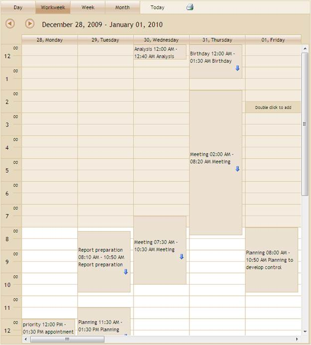
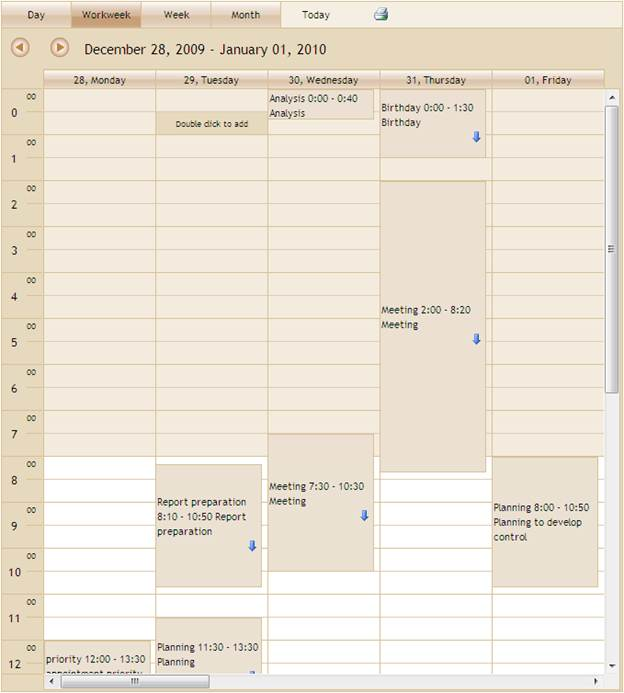

::: {style="DISPLAY: none"}
{#d2h_url_template}{#d2h_package_url style="WIDTH: 0px; DISPLAY: none; HEIGHT: 0px"}
:::

::: {.d2h_secondary_topic style="PADDING-BOTTOM: 10pt; MARGIN: 0pt; PADDING-LEFT: 0pt; PADDING-RIGHT: 0pt; PADDING-TOP: 0pt"}
#### [Using View customization]{style="FONT-FAMILY: 'Calibri','sans-serif'"} {#using-view-customization style="MARGIN-TOP: 0pt; tab-stops: 0pt"}

The steps to customize TimeMode using View Customization are as follows:

1.   [[Create a model in the application]{style="COLOR: windowtext; TEXT-DECORATION: none; text-underline: none"}]{.UGHyperlink}[.]{style="COLOR: windowtext; TEXT-DECORATION: none; text-underline: none"}

[[2.   ]{style="COLOR: windowtext; TEXT-DECORATION: none; text-underline: none"}]{.UGHyperlink}[[Create a strongly typed view.]{style="COLOR: windowtext; TEXT-DECORATION: none; text-underline: none"}]{.UGHyperlink}[[]{style="COLOR: windowtext; TEXT-DECORATION: none; text-underline: none"}]{.UGHyperlink}

3.   In View, you can use its **Model** property in **DataSource** in order to bind the data source and bind your database fields into the corresponding Schedule fields.

[]{style="FONT-FAMILY: 'Calibri','sans-serif'"} 

+--------------------------------------------------------------------------------------------------------------------------------------------------------------------------------------+
| **[View\[aspx\]]{style="FONT-FAMILY: 'Calibri','sans-serif'"}**                                                                                                                      |
|                                                                                                                                                                                      |
| []{style="FONT-FAMILY: 'Calibri','sans-serif'"}                                                                                                                                      |
|                                                                                                                                                                                      |
| [    [\<%]{style="BACKGROUND: yellow"}[=]{style="COLOR: blue"}Html.Syncfusion().Schedule()([\"FlatSchedule\"]{style="COLOR: #a31515"})]{style="FONT-FAMILY: 'Calibri','sans-serif'"} |
|                                                                                                                                                                                      |
| [       .DataSource(([IEnumerable]{style="COLOR: #2b91af"})Model)]{style="FONT-FAMILY: 'Calibri','sans-serif'"}                                                                      |
|                                                                                                                                                                                      |
| [       .BindList(columns =\>]{style="FONT-FAMILY: 'Calibri','sans-serif'"}                                                                                                          |
|                                                                                                                                                                                      |
| [       {]{style="FONT-FAMILY: 'Calibri','sans-serif'"}                                                                                                                              |
|                                                                                                                                                                                      |
| [           columns.IdField([\"AppId\"]{style="COLOR: #a31515"});]{style="FONT-FAMILY: 'Calibri','sans-serif'"}                                                                      |
|                                                                                                                                                                                      |
| [           columns.SubjectField([\"Subject\"]{style="COLOR: #a31515"});]{style="FONT-FAMILY: 'Calibri','sans-serif'"}                                                               |
|                                                                                                                                                                                      |
| [           columns.LocationField([\"Location\"]{style="COLOR: #a31515"});]{style="FONT-FAMILY: 'Calibri','sans-serif'"}                                                             |
|                                                                                                                                                                                      |
| [           columns.StartTimeField([\"StartTime\"]{style="COLOR: #a31515"});]{style="FONT-FAMILY: 'Calibri','sans-serif'"}                                                           |
|                                                                                                                                                                                      |
| [           columns.EndTimeField([\"EndTime\"]{style="COLOR: #a31515"});]{style="FONT-FAMILY: 'Calibri','sans-serif'"}                                                               |
|                                                                                                                                                                                      |
| [           columns.DescriptionField([\"Descrip\"]{style="COLOR: #a31515"});]{style="FONT-FAMILY: 'Calibri','sans-serif'"}                                                           |
|                                                                                                                                                                                      |
| [           columns.OwnerField([\"Resource\"]{style="COLOR: #a31515"});]{style="FONT-FAMILY: 'Calibri','sans-serif'"}                                                                |
|                                                                                                                                                                                      |
| [       })]{style="FONT-FAMILY: 'Calibri','sans-serif'"}                                                                                                                             |
|                                                                                                                                                                                      |
| [    [%\>]{style="BACKGROUND: yellow"}]{style="FONT-FAMILY: 'Calibri','sans-serif'"}                                                                                                 |
|                                                                                                                                                                                      |
| []{style="FONT-FAMILY: 'Calibri','sans-serif'"}                                                                                                                                      |
+--------------------------------------------------------------------------------------------------------------------------------------------------------------------------------------+

[]{style="FONT-FAMILY: 'Calibri','sans-serif'"} 

[]{style="FONT-FAMILY: 'Calibri','sans-serif'"} 

+--------------------------------------------------------------------------------------------------------------------------------------------------------------------------------------------------------------------------+
| **[View\[cshtml\]]{style="FONT-FAMILY: 'Calibri','sans-serif'"}**                                                                                                                                                        |
|                                                                                                                                                                                                                          |
| []{style="FONT-FAMILY: 'Calibri','sans-serif'"}                                                                                                                                                                          |
|                                                                                                                                                                                                                          |
| [    ]{style="FONT-FAMILY: 'Calibri','sans-serif'"}[         [@(]{style="BACKGROUND: yellow"} Html.Syncfusion().Schedule()([\"FlatSchedule\"]{style="COLOR: #a31515"})]{style="FONT-FAMILY: Consolas; FONT-SIZE: 9.5pt"} |
|                                                                                                                                                                                                                          |
| [       .DataSource(([IEnumerable]{style="COLOR: #2b91af"})Model)]{style="FONT-FAMILY: Consolas; FONT-SIZE: 9.5pt"}                                                                                                      |
|                                                                                                                                                                                                                          |
| [       .BindList(columns =\>]{style="FONT-FAMILY: Consolas; FONT-SIZE: 9.5pt"}                                                                                                                                          |
|                                                                                                                                                                                                                          |
| [       {]{style="FONT-FAMILY: Consolas; FONT-SIZE: 9.5pt"}                                                                                                                                                              |
|                                                                                                                                                                                                                          |
| [           columns.IdField([\"AppId\"]{style="COLOR: #a31515"});]{style="FONT-FAMILY: Consolas; FONT-SIZE: 9.5pt"}                                                                                                      |
|                                                                                                                                                                                                                          |
| [           columns.SubjectField([\"Subject\"]{style="COLOR: #a31515"});]{style="FONT-FAMILY: Consolas; FONT-SIZE: 9.5pt"}                                                                                               |
|                                                                                                                                                                                                                          |
| [           columns.LocationField([\"Location\"]{style="COLOR: #a31515"});]{style="FONT-FAMILY: Consolas; FONT-SIZE: 9.5pt"}                                                                                             |
|                                                                                                                                                                                                                          |
| [           columns.StartTimeField([\"StartTime\"]{style="COLOR: #a31515"});]{style="FONT-FAMILY: Consolas; FONT-SIZE: 9.5pt"}                                                                                           |
|                                                                                                                                                                                                                          |
| [           columns.EndTimeField([\"EndTime\"]{style="COLOR: #a31515"});]{style="FONT-FAMILY: Consolas; FONT-SIZE: 9.5pt"}                                                                                               |
|                                                                                                                                                                                                                          |
| [           columns.DescriptionField([\"Descrip\"]{style="COLOR: #a31515"});]{style="FONT-FAMILY: Consolas; FONT-SIZE: 9.5pt"}                                                                                           |
|                                                                                                                                                                                                                          |
| [           columns.OwnerField([\"Resource\"]{style="COLOR: #a31515"});]{style="FONT-FAMILY: Consolas; FONT-SIZE: 9.5pt"}                                                                                                |
|                                                                                                                                                                                                                          |
| [       })[)]{style="BACKGROUND: yellow"}]{style="FONT-FAMILY: Consolas; FONT-SIZE: 9.5pt"}                                                                                                                              |
|                                                                                                                                                                                                                          |
| []{style="FONT-FAMILY: 'Calibri','sans-serif'"}                                                                                                                                                                          |
+--------------------------------------------------------------------------------------------------------------------------------------------------------------------------------------------------------------------------+

[]{style="FONT-FAMILY: 'Calibri','sans-serif'"} 

[]{style="FONT-FAMILY: 'Calibri','sans-serif'"} 

4.   Set the **TimeMode()** method to activate the TimeMode for appointments and timelines.

[]{style="FONT-FAMILY: 'Calibri','sans-serif'"} 

+--------------------------------------------------------------------------------------------------------------------------------------------------------------------------------------+
| **[View\[aspx\]]{style="FONT-FAMILY: 'Calibri','sans-serif'"}**                                                                                                                      |
|                                                                                                                                                                                      |
| []{style="FONT-FAMILY: 'Calibri','sans-serif'"}                                                                                                                                      |
|                                                                                                                                                                                      |
| [    [\<%]{style="BACKGROUND: yellow"}[=]{style="COLOR: blue"}Html.Syncfusion().Schedule()([\"FlatSchedule\"]{style="COLOR: #a31515"})]{style="FONT-FAMILY: 'Calibri','sans-serif'"} |
|                                                                                                                                                                                      |
| [       .DataSource(([IEnumerable]{style="COLOR: #2b91af"})Model)]{style="FONT-FAMILY: 'Calibri','sans-serif'"}                                                                      |
|                                                                                                                                                                                      |
| [       .BindList(columns =\>]{style="FONT-FAMILY: 'Calibri','sans-serif'"}                                                                                                          |
|                                                                                                                                                                                      |
| [       {]{style="FONT-FAMILY: 'Calibri','sans-serif'"}                                                                                                                              |
|                                                                                                                                                                                      |
| [           columns.IdField([\"AppId\"]{style="COLOR: #a31515"});]{style="FONT-FAMILY: 'Calibri','sans-serif'"}                                                                      |
|                                                                                                                                                                                      |
| [           columns.SubjectField([\"Subject\"]{style="COLOR: #a31515"});]{style="FONT-FAMILY: 'Calibri','sans-serif'"}                                                               |
|                                                                                                                                                                                      |
| [           columns.LocationField([\"Location\"]{style="COLOR: #a31515"});]{style="FONT-FAMILY: 'Calibri','sans-serif'"}                                                             |
|                                                                                                                                                                                      |
| [           columns.StartTimeField([\"StartTime\"]{style="COLOR: #a31515"});]{style="FONT-FAMILY: 'Calibri','sans-serif'"}                                                           |
|                                                                                                                                                                                      |
| [           columns.EndTimeField([\"EndTime\"]{style="COLOR: #a31515"});]{style="FONT-FAMILY: 'Calibri','sans-serif'"}                                                               |
|                                                                                                                                                                                      |
| [           columns.DescriptionField([\"Descrip\"]{style="COLOR: #a31515"});]{style="FONT-FAMILY: 'Calibri','sans-serif'"}                                                           |
|                                                                                                                                                                                      |
| [           columns.OwnerField([\"Resource\"]{style="COLOR: #a31515"});]{style="FONT-FAMILY: 'Calibri','sans-serif'"}                                                                |
|                                                                                                                                                                                      |
| [       })]{style="FONT-FAMILY: 'Calibri','sans-serif'"}                                                                                                                             |
|                                                                                                                                                                                      |
| **[       .TimeMode([ScheduleTimeMode]{style="COLOR: #2b91af"}.Hours24)]{style="FONT-FAMILY: 'Calibri','sans-serif'"}**                                                              |
|                                                                                                                                                                                      |
| [       .CurrentView([ScheduleViewMode]{style="COLOR: #2b91af"}.Week)    ]{style="FONT-FAMILY: 'Calibri','sans-serif'"}                                                              |
|                                                                                                                                                                                      |
| [       .Skins([ScheduleSkins]{style="COLOR: #2b91af"}.Sandune)]{style="FONT-FAMILY: 'Calibri','sans-serif'"}                                                                        |
|                                                                                                                                                                                      |
| [    [%\>]{style="BACKGROUND: yellow"}]{style="FONT-FAMILY: 'Calibri','sans-serif'"}                                                                                                 |
|                                                                                                                                                                                      |
| []{style="FONT-FAMILY: 'Calibri','sans-serif'"}                                                                                                                                      |
+--------------------------------------------------------------------------------------------------------------------------------------------------------------------------------------+

[]{style="FONT-FAMILY: 'Calibri','sans-serif'; BACKGROUND: yellow"} 

[]{style="FONT-FAMILY: 'Calibri','sans-serif'"} 

+----------------------------------------------------------------------------------------------------------------------------------------------------------------------------------------------------------------------------------------------------------+
| **[View\[cshtml\]]{style="FONT-FAMILY: 'Calibri','sans-serif'"}**                                                                                                                                                                                        |
|                                                                                                                                                                                                                                                          |
| []{style="FONT-FAMILY: 'Calibri','sans-serif'"}                                                                                                                                                                                                          |
|                                                                                                                                                                                                                                                          |
| [    ]{style="FONT-FAMILY: 'Calibri','sans-serif'"}[@(]{style="FONT-FAMILY: Consolas; BACKGROUND: yellow; FONT-SIZE: 9.5pt"}[ Html.Syncfusion().Schedule()([\"FlatSchedule\"]{style="COLOR: #a31515"})]{style="FONT-FAMILY: Consolas; FONT-SIZE: 9.5pt"} |
|                                                                                                                                                                                                                                                          |
| [       .DataSource(([IEnumerable]{style="COLOR: #2b91af"})Model)]{style="FONT-FAMILY: Consolas; FONT-SIZE: 9.5pt"}                                                                                                                                      |
|                                                                                                                                                                                                                                                          |
| [       .BindList(columns =\>]{style="FONT-FAMILY: Consolas; FONT-SIZE: 9.5pt"}                                                                                                                                                                          |
|                                                                                                                                                                                                                                                          |
| [       {]{style="FONT-FAMILY: Consolas; FONT-SIZE: 9.5pt"}                                                                                                                                                                                              |
|                                                                                                                                                                                                                                                          |
| [           columns.IdField([\"AppId\"]{style="COLOR: #a31515"});]{style="FONT-FAMILY: Consolas; FONT-SIZE: 9.5pt"}                                                                                                                                      |
|                                                                                                                                                                                                                                                          |
| [           columns.SubjectField([\"Subject\"]{style="COLOR: #a31515"});]{style="FONT-FAMILY: Consolas; FONT-SIZE: 9.5pt"}                                                                                                                               |
|                                                                                                                                                                                                                                                          |
| [           columns.LocationField([\"Location\"]{style="COLOR: #a31515"});]{style="FONT-FAMILY: Consolas; FONT-SIZE: 9.5pt"}                                                                                                                             |
|                                                                                                                                                                                                                                                          |
| [           columns.StartTimeField([\"StartTime\"]{style="COLOR: #a31515"});]{style="FONT-FAMILY: Consolas; FONT-SIZE: 9.5pt"}                                                                                                                           |
|                                                                                                                                                                                                                                                          |
| [           columns.EndTimeField([\"EndTime\"]{style="COLOR: #a31515"});]{style="FONT-FAMILY: Consolas; FONT-SIZE: 9.5pt"}                                                                                                                               |
|                                                                                                                                                                                                                                                          |
| [           columns.DescriptionField([\"Descrip\"]{style="COLOR: #a31515"});]{style="FONT-FAMILY: Consolas; FONT-SIZE: 9.5pt"}                                                                                                                           |
|                                                                                                                                                                                                                                                          |
| [           columns.OwnerField([\"Resource\"]{style="COLOR: #a31515"});]{style="FONT-FAMILY: Consolas; FONT-SIZE: 9.5pt"}                                                                                                                                |
|                                                                                                                                                                                                                                                          |
| [       })]{style="FONT-FAMILY: Consolas; FONT-SIZE: 9.5pt"}                                                                                                                                                                                             |
|                                                                                                                                                                                                                                                          |
| [       .TimeMode([ScheduleTimeMode]{style="COLOR: #2b91af"}.Hours24)]{style="FONT-FAMILY: Consolas; FONT-SIZE: 9.5pt"}                                                                                                                                  |
|                                                                                                                                                                                                                                                          |
| [       .CurrentView([ScheduleViewMode]{style="COLOR: #2b91af"}.Week)    ]{style="FONT-FAMILY: Consolas; FONT-SIZE: 9.5pt"}                                                                                                                              |
|                                                                                                                                                                                                                                                          |
| [       .Skins([ScheduleSkins]{style="COLOR: #2b91af"}.Sandune)]{style="FONT-FAMILY: Consolas; FONT-SIZE: 9.5pt"}                                                                                                                                        |
|                                                                                                                                                                                                                                                          |
| [       [)]{style="BACKGROUND: yellow"}]{style="FONT-FAMILY: Consolas; FONT-SIZE: 9.5pt"}                                                                                                                                                                |
|                                                                                                                                                                                                                                                          |
| []{style="FONT-FAMILY: Consolas; FONT-SIZE: 9.5pt"}                                                                                                                                                                                                      |
|                                                                                                                                                                                                                                                          |
| []{style="FONT-FAMILY: 'Calibri','sans-serif'"}                                                                                                                                                                                                          |
+----------------------------------------------------------------------------------------------------------------------------------------------------------------------------------------------------------------------------------------------------------+

[]{style="FONT-FAMILY: 'Calibri','sans-serif'; BACKGROUND: yellow"} 

[]{style="FONT-FAMILY: 'Calibri','sans-serif'; BACKGROUND: yellow"} 

5.   In Controller, add the Syncfusion.Mvc.Schedule, Syncfusion.Mvc.Shared namespaces.

[]{style="FONT-FAMILY: 'Calibri','sans-serif'"} 

+-------------------------------------------------------------------------------------------------------------------------------------------+
| **[\[Controller\]]{style="FONT-FAMILY: 'Calibri','sans-serif'"}**                                                                         |
|                                                                                                                                           |
| [[]{style="FONT-FAMILY: 'Calibri','sans-serif'"}]{.MsoIntenseEmphasis}                                                                    |
|                                                                                                                                           |
| [using]{style="FONT-FAMILY: 'Calibri','sans-serif'; COLOR: blue"}[ Syncfusion.Mvc.Schedule;]{style="FONT-FAMILY: 'Calibri','sans-serif'"} |
|                                                                                                                                           |
| [using]{style="FONT-FAMILY: 'Calibri','sans-serif'; COLOR: blue"}[ Syncfusion.Mvc.Shared;]{style="FONT-FAMILY: 'Calibri','sans-serif'"}   |
|                                                                                                                                           |
| []{style="FONT-FAMILY: 'Calibri','sans-serif'"}                                                                                           |
+-------------------------------------------------------------------------------------------------------------------------------------------+

[]{style="FONT-FAMILY: 'Calibri','sans-serif'; BACKGROUND: yellow"} 

6.   Set its data source and render the view.

[]{style="FONT-FAMILY: 'Calibri','sans-serif'"} 

+--------------------------------------------------------------------------------------------------------------------------------------------------------------------------------------------------------------------------------------------+
| **[\[Controller\]]{style="FONT-FAMILY: 'Calibri','sans-serif'"}**                                                                                                                                                                          |
|                                                                                                                                                                                                                                            |
| [[]{style="FONT-FAMILY: 'Calibri','sans-serif'"}]{.MsoIntenseEmphasis}                                                                                                                                                                     |
|                                                                                                                                                                                                                                            |
| [        [///]{style="COLOR: gray"}[ ]{style="COLOR: green"}[\<summary\>]{style="COLOR: gray"}]{style="FONT-FAMILY: 'Calibri','sans-serif'"}                                                                                               |
|                                                                                                                                                                                                                                            |
| [        [///]{style="COLOR: gray"}[ It is used to bind the Schedule]{style="COLOR: green"}]{style="FONT-FAMILY: 'Calibri','sans-serif'"}                                                                                                  |
|                                                                                                                                                                                                                                            |
| [        [///]{style="COLOR: gray"}[ ]{style="COLOR: green"}[\</summary\>]{style="COLOR: gray"}]{style="FONT-FAMILY: 'Calibri','sans-serif'"}                                                                                              |
|                                                                                                                                                                                                                                            |
| [        [///]{style="COLOR: gray"}[ ]{style="COLOR: green"}[\<returns\>]{style="COLOR: gray"}[View page, it displays the Schedule]{style="COLOR: green"}[\</returns\>]{style="COLOR: gray"}]{style="FONT-FAMILY: 'Calibri','sans-serif'"} |
|                                                                                                                                                                                                                                            |
| [        [public]{style="COLOR: blue"} [ActionResult]{style="COLOR: #2b91af"} Index()]{style="FONT-FAMILY: 'Calibri','sans-serif'"}                                                                                                        |
|                                                                                                                                                                                                                                            |
| [        {]{style="FONT-FAMILY: 'Calibri','sans-serif'"}                                                                                                                                                                                   |
|                                                                                                                                                                                                                                            |
| [            [var]{style="COLOR: blue"} data = [new]{style="COLOR: blue"} [NorthwindDataClassesDataContext]{style="COLOR: #2b91af"}().AppointmentTables.Take(200);]{style="FONT-FAMILY: 'Calibri','sans-serif'"}                           |
|                                                                                                                                                                                                                                            |
| [            [return]{style="COLOR: blue"} View(data);]{style="FONT-FAMILY: 'Calibri','sans-serif'"}                                                                                                                                       |
|                                                                                                                                                                                                                                            |
| [        }]{style="FONT-FAMILY: 'Calibri','sans-serif'"}                                                                                                                                                                                   |
|                                                                                                                                                                                                                                            |
| []{style="FONT-FAMILY: 'Calibri','sans-serif'"}                                                                                                                                                                                            |
+--------------------------------------------------------------------------------------------------------------------------------------------------------------------------------------------------------------------------------------------+

[]{style="FONT-FAMILY: 'Calibri','sans-serif'"} 

7.   Create a post method for **Index** action and bind the data source to Schedule, as shown in the code displayed below.

[[]{style="FONT-FAMILY: 'Calibri','sans-serif'"}]{.MsoIntenseEmphasis} 

+------------------------------------------------------------------------------------------------------------------------------------------------------------------------------------------------------------------------------------------------------+
| **[\[Controller\]]{style="FONT-FAMILY: 'Calibri','sans-serif'"}**                                                                                                                                                                                    |
|                                                                                                                                                                                                                                                      |
| [[]{style="FONT-FAMILY: 'Calibri','sans-serif'"}]{.MsoIntenseEmphasis}                                                                                                                                                                               |
|                                                                                                                                                                                                                                                      |
| [  ]{style="FONT-FAMILY: 'Calibri','sans-serif'; COLOR: gray"}[       [///]{style="COLOR: gray"}[ ]{style="COLOR: green"}[\<summary\>]{style="COLOR: gray"}]{style="FONT-FAMILY: 'Calibri','sans-serif'"}                                            |
|                                                                                                                                                                                                                                                      |
| [        [///]{style="COLOR: gray"}[ Post Requests are mapped to this method. This method invokes the HtmlActionResult]{style="COLOR: green"}]{style="FONT-FAMILY: 'Calibri','sans-serif'"}                                                          |
|                                                                                                                                                                                                                                                      |
| [        [///]{style="COLOR: gray"}[ from the Schedule. Required response is generated.]{style="COLOR: green"}]{style="FONT-FAMILY: 'Calibri','sans-serif'"}                                                                                         |
|                                                                                                                                                                                                                                                      |
| [        [///]{style="COLOR: gray"}[ ]{style="COLOR: green"}[\</summary\>]{style="COLOR: gray"}]{style="FONT-FAMILY: 'Calibri','sans-serif'"}                                                                                                        |
|                                                                                                                                                                                                                                                      |
| [        [///]{style="COLOR: gray"}[ ]{style="COLOR: green"}[\<param name=\"args\"\>]{style="COLOR: gray"}[Contains post action properties ]{style="COLOR: green"}[\</param\>]{style="COLOR: gray"}]{style="FONT-FAMILY: 'Calibri','sans-serif'"}    |
|                                                                                                                                                                                                                                                      |
| [        [///]{style="COLOR: gray"}[ ]{style="COLOR: green"}[\<returns\>]{style="COLOR: gray"}]{style="FONT-FAMILY: 'Calibri','sans-serif'"}                                                                                                         |
|                                                                                                                                                                                                                                                      |
| [        [///]{style="COLOR: gray"}[ HtmlActionResult which returns data displayed on the Schedule]{style="COLOR: green"}]{style="FONT-FAMILY: 'Calibri','sans-serif'"}                                                                              |
|                                                                                                                                                                                                                                                      |
| [        [///]{style="COLOR: gray"}[ ]{style="COLOR: green"}[\</returns\>]{style="COLOR: gray"}]{style="FONT-FAMILY: 'Calibri','sans-serif'"}                                                                                                        |
|                                                                                                                                                                                                                                                      |
| [        \[[AcceptVerbs]{style="COLOR: #2b91af"}([HttpVerbs]{style="COLOR: #2b91af"}.Post)\]]{style="FONT-FAMILY: 'Calibri','sans-serif'"}                                                                                                           |
|                                                                                                                                                                                                                                                      |
| [        [public]{style="COLOR: blue"} [ActionResult]{style="COLOR: #2b91af"} Index([Params]{style="COLOR: #2b91af"} args)]{style="FONT-FAMILY: 'Calibri','sans-serif'"}                                                                             |
|                                                                                                                                                                                                                                                      |
| [        {]{style="FONT-FAMILY: 'Calibri','sans-serif'"}                                                                                                                                                                                             |
|                                                                                                                                                                                                                                                      |
| [IEnumerable]{style="FONT-FAMILY: 'Calibri','sans-serif'; COLOR: #2b91af"}[ data = [new]{style="COLOR: blue"} [NorthwindDataClassesDataContext]{style="COLOR: #2b91af"}().AppointmentTables.Take(200);]{style="FONT-FAMILY: 'Calibri','sans-serif'"} |
|                                                                                                                                                                                                                                                      |
| [            [return]{style="COLOR: blue"} data.ScheduleActions\<[ScheduleHtmlActionResult]{style="COLOR: #2b91af"}\>();]{style="FONT-FAMILY: 'Calibri','sans-serif'"}                                                                               |
|                                                                                                                                                                                                                                                      |
| [        }]{style="FONT-FAMILY: 'Calibri','sans-serif'"}                                                                                                                                                                                             |
|                                                                                                                                                                                                                                                      |
| []{style="FONT-FAMILY: 'Calibri','sans-serif'"}                                                                                                                                                                                                      |
+------------------------------------------------------------------------------------------------------------------------------------------------------------------------------------------------------------------------------------------------------+

[]{style="FONT-FAMILY: 'Calibri','sans-serif'"} 

8.   Run the application. The Schedule will appear as shown in the following screenshot.

[]{style="FONT-FAMILY: 'Calibri','sans-serif'"} 

{border="0"}

[]{style="FONT-FAMILY: 'Calibri','sans-serif'"} 

Figure 130: TimeMode - Hours12

[]{style="FONT-FAMILY: 'Calibri','sans-serif'"} 

{border="0"}

[]{style="FONT-FAMILY: 'Calibri','sans-serif'"} 

Figure 131: TimeMode - Hours24

[]{style="FONT-FAMILY: 'Calibri','sans-serif'"} 

[]{#_Using_SchedulePropertiesModel_12} 

 

 

 

[]{#related-topics}
:::
