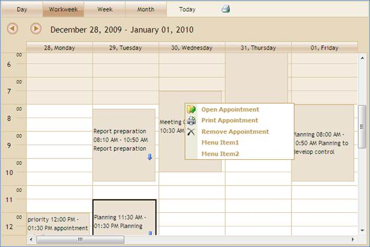

::: {style="DISPLAY: none"}
{#d2h_url_template}{#d2h_package_url style="WIDTH: 0px; DISPLAY: none; HEIGHT: 0px"}
:::

::: {.d2h_secondary_topic style="PADDING-BOTTOM: 10pt; MARGIN: 0pt; PADDING-LEFT: 0pt; PADDING-RIGHT: 0pt; PADDING-TOP: 0pt"}
#### Using View Customization {#using-view-customization style="tab-stops: 0pt"}

The steps to customize context menu using View Customization are as follows:

[[1.   ]{style="TEXT-DECORATION: none; text-underline: none"}]{.UGHyperlink}[Create a model in the application.]{.UGHyperlink}[ ]{.UGHyperlink}

2.   [Create a strongly typed view]{.UGHyperlink}[.]{style="FONT-FAMILY: 'Calibri','sans-serif'"}[]{style="FONT-FAMILY: 'Calibri','sans-serif'"}

3.   In **View**, you can use its **Model** property in DataSource in order to bind the data source and bind your database fields into the corresponding Schedule fields.

[]{style="FONT-FAMILY: 'Calibri','sans-serif'"} 

+--------------------------------------------------------------------------------------------------------------------------------------------------------------------------------------+
| **[View\[aspx\]]{style="FONT-FAMILY: 'Calibri','sans-serif'"}**                                                                                                                      |
|                                                                                                                                                                                      |
| [    [\<%]{style="BACKGROUND: yellow"}[=]{style="COLOR: blue"}Html.Syncfusion().Schedule()([\"FlatSchedule\"]{style="COLOR: #a31515"})]{style="FONT-FAMILY: 'Calibri','sans-serif'"} |
|                                                                                                                                                                                      |
| [       .DataSource(([IEnumerable]{style="COLOR: #2b91af"}) Model)]{style="FONT-FAMILY: 'Calibri','sans-serif'"}                                                                     |
|                                                                                                                                                                                      |
| [       .BindList(columns =\>]{style="FONT-FAMILY: 'Calibri','sans-serif'"}                                                                                                          |
|                                                                                                                                                                                      |
| [       {]{style="FONT-FAMILY: 'Calibri','sans-serif'"}                                                                                                                              |
|                                                                                                                                                                                      |
| [           columns.IdField([\"AppId\"]{style="COLOR: #a31515"});]{style="FONT-FAMILY: 'Calibri','sans-serif'"}                                                                      |
|                                                                                                                                                                                      |
| [           columns.SubjectField([\"Subject\"]{style="COLOR: #a31515"});]{style="FONT-FAMILY: 'Calibri','sans-serif'"}                                                               |
|                                                                                                                                                                                      |
| [           columns.LocationField([\"Location\"]{style="COLOR: #a31515"});]{style="FONT-FAMILY: 'Calibri','sans-serif'"}                                                             |
|                                                                                                                                                                                      |
| [           columns.StartTimeField([\"StartTime\"]{style="COLOR: #a31515"});]{style="FONT-FAMILY: 'Calibri','sans-serif'"}                                                           |
|                                                                                                                                                                                      |
| [           columns.EndTimeField([\"EndTime\"]{style="COLOR: #a31515"});]{style="FONT-FAMILY: 'Calibri','sans-serif'"}                                                               |
|                                                                                                                                                                                      |
| [           columns.DescriptionField([\"Descrip\"]{style="COLOR: #a31515"});]{style="FONT-FAMILY: 'Calibri','sans-serif'"}                                                           |
|                                                                                                                                                                                      |
| [           columns.OwnerField([\"Resource\"]{style="COLOR: #a31515"});]{style="FONT-FAMILY: 'Calibri','sans-serif'"}                                                                |
|                                                                                                                                                                                      |
| [       })]{style="FONT-FAMILY: 'Calibri','sans-serif'"}                                                                                                                             |
|                                                                                                                                                                                      |
| [    [%\>]{style="BACKGROUND: yellow"}]{style="FONT-FAMILY: 'Calibri','sans-serif'"}                                                                                                 |
|                                                                                                                                                                                      |
| []{style="FONT-FAMILY: 'Calibri','sans-serif'"}                                                                                                                                      |
+--------------------------------------------------------------------------------------------------------------------------------------------------------------------------------------+

[]{style="FONT-FAMILY: 'Calibri','sans-serif'"} 

[]{style="FONT-FAMILY: 'Calibri','sans-serif'"} 

+----------------------------------------------------------------------------------------------------------------------------------------------------------------------------------------------------------------------------------------------------------+
| **[View\[cshtml\]]{style="FONT-FAMILY: 'Calibri','sans-serif'"}**                                                                                                                                                                                        |
|                                                                                                                                                                                                                                                          |
| [    ]{style="FONT-FAMILY: 'Calibri','sans-serif'"}[@(]{style="FONT-FAMILY: Consolas; BACKGROUND: yellow; FONT-SIZE: 9.5pt"}[ Html.Syncfusion().Schedule()([\"FlatSchedule\"]{style="COLOR: #a31515"})]{style="FONT-FAMILY: Consolas; FONT-SIZE: 9.5pt"} |
|                                                                                                                                                                                                                                                          |
| [       .DataSource(([IEnumerable]{style="COLOR: #2b91af"}) Model)]{style="FONT-FAMILY: Consolas; FONT-SIZE: 9.5pt"}                                                                                                                                     |
|                                                                                                                                                                                                                                                          |
| [       .BindList(columns =\>]{style="FONT-FAMILY: Consolas; FONT-SIZE: 9.5pt"}                                                                                                                                                                          |
|                                                                                                                                                                                                                                                          |
| [       {]{style="FONT-FAMILY: Consolas; FONT-SIZE: 9.5pt"}                                                                                                                                                                                              |
|                                                                                                                                                                                                                                                          |
| [           columns.IdField([\"AppId\"]{style="COLOR: #a31515"});]{style="FONT-FAMILY: Consolas; FONT-SIZE: 9.5pt"}                                                                                                                                      |
|                                                                                                                                                                                                                                                          |
| [           columns.SubjectField([\"Subject\"]{style="COLOR: #a31515"});]{style="FONT-FAMILY: Consolas; FONT-SIZE: 9.5pt"}                                                                                                                               |
|                                                                                                                                                                                                                                                          |
| [           columns.LocationField([\"Location\"]{style="COLOR: #a31515"});]{style="FONT-FAMILY: Consolas; FONT-SIZE: 9.5pt"}                                                                                                                             |
|                                                                                                                                                                                                                                                          |
| [           columns.StartTimeField([\"StartTime\"]{style="COLOR: #a31515"});]{style="FONT-FAMILY: Consolas; FONT-SIZE: 9.5pt"}                                                                                                                           |
|                                                                                                                                                                                                                                                          |
| [           columns.EndTimeField([\"EndTime\"]{style="COLOR: #a31515"});]{style="FONT-FAMILY: Consolas; FONT-SIZE: 9.5pt"}                                                                                                                               |
|                                                                                                                                                                                                                                                          |
| [           columns.DescriptionField([\"Descrip\"]{style="COLOR: #a31515"});]{style="FONT-FAMILY: Consolas; FONT-SIZE: 9.5pt"}                                                                                                                           |
|                                                                                                                                                                                                                                                          |
| [           columns.OwnerField([\"Resource\"]{style="COLOR: #a31515"});]{style="FONT-FAMILY: Consolas; FONT-SIZE: 9.5pt"}                                                                                                                                |
|                                                                                                                                                                                                                                                          |
| [       })[)]{style="BACKGROUND: yellow"}]{style="FONT-FAMILY: Consolas; FONT-SIZE: 9.5pt"}                                                                                                                                                              |
|                                                                                                                                                                                                                                                          |
| []{style="FONT-FAMILY: 'Calibri','sans-serif'"}                                                                                                                                                                                                          |
+----------------------------------------------------------------------------------------------------------------------------------------------------------------------------------------------------------------------------------------------------------+

[]{style="FONT-FAMILY: 'Calibri','sans-serif'"} 

[]{style="FONT-FAMILY: 'Calibri','sans-serif'"} 

4.   Set the **ContextMenuItems()** method to show Context menu items on the appointment and Schedule cell.

[]{style="FONT-FAMILY: 'Calibri','sans-serif'"} 

+------------------------------------------------------------------------------------------------------------------------------------------------------------------------------------------------------------------+
| **[View\[aspx\]]{style="FONT-FAMILY: 'Calibri','sans-serif'"}**                                                                                                                                                  |
|                                                                                                                                                                                                                  |
| [    [\<%]{style="BACKGROUND: yellow"}[=]{style="COLOR: blue"}Html.Syncfusion().Schedule() ([\"FlatSchedule\"]{style="COLOR: #a31515"})]{style="FONT-FAMILY: 'Calibri','sans-serif'"}                            |
|                                                                                                                                                                                                                  |
| [       .DataSource (([IEnumerable]{style="COLOR: #2b91af"}) Model)]{style="FONT-FAMILY: 'Calibri','sans-serif'"}                                                                                                |
|                                                                                                                                                                                                                  |
| [       .BindList (columns =\>]{style="FONT-FAMILY: 'Calibri','sans-serif'"}                                                                                                                                     |
|                                                                                                                                                                                                                  |
| [       {]{style="FONT-FAMILY: 'Calibri','sans-serif'"}                                                                                                                                                          |
|                                                                                                                                                                                                                  |
| [           columns.IdField([\"AppId\"]{style="COLOR: #a31515"});]{style="FONT-FAMILY: 'Calibri','sans-serif'"}                                                                                                  |
|                                                                                                                                                                                                                  |
| [           columns.SubjectField([\"Subject\"]{style="COLOR: #a31515"});]{style="FONT-FAMILY: 'Calibri','sans-serif'"}                                                                                           |
|                                                                                                                                                                                                                  |
| [           columns.LocationField([\"Location\"]{style="COLOR: #a31515"});]{style="FONT-FAMILY: 'Calibri','sans-serif'"}                                                                                         |
|                                                                                                                                                                                                                  |
| [           columns.StartTimeField([\"StartTime\"]{style="COLOR: #a31515"});]{style="FONT-FAMILY: 'Calibri','sans-serif'"}                                                                                       |
|                                                                                                                                                                                                                  |
| [           columns.EndTimeField([\"EndTime\"]{style="COLOR: #a31515"});]{style="FONT-FAMILY: 'Calibri','sans-serif'"}                                                                                           |
|                                                                                                                                                                                                                  |
| [           columns.DescriptionField([\"Descrip\"]{style="COLOR: #a31515"});]{style="FONT-FAMILY: 'Calibri','sans-serif'"}                                                                                       |
|                                                                                                                                                                                                                  |
| [           columns.OwnerField([\"Resource\"]{style="COLOR: #a31515"});]{style="FONT-FAMILY: 'Calibri','sans-serif'"}                                                                                            |
|                                                                                                                                                                                                                  |
| [       })]{style="FONT-FAMILY: 'Calibri','sans-serif'"}                                                                                                                                                         |
|                                                                                                                                                                                                                  |
| **[       .ContextMenuItems(([List]{style="COLOR: #2b91af"}\<[ContextMenuItem]{style="COLOR: #2b91af"}\>)ViewData\[[\"contextMenus\"]{style="COLOR: #a31515"}\])]{style="FONT-FAMILY: 'Calibri','sans-serif'"}** |
|                                                                                                                                                                                                                  |
| [       .CurrentView([ScheduleViewMode]{style="COLOR: #2b91af"}.Day)    ]{style="FONT-FAMILY: 'Calibri','sans-serif'"}                                                                                           |
|                                                                                                                                                                                                                  |
| [       .Skins([ScheduleSkins]{style="COLOR: #2b91af"}.Sandune)]{style="FONT-FAMILY: 'Calibri','sans-serif'"}                                                                                                    |
|                                                                                                                                                                                                                  |
| [    [%\>]{style="BACKGROUND: yellow"}]{style="FONT-FAMILY: 'Calibri','sans-serif'"}                                                                                                                             |
+------------------------------------------------------------------------------------------------------------------------------------------------------------------------------------------------------------------+

[]{style="FONT-FAMILY: 'Calibri','sans-serif'; BACKGROUND: yellow; FONT-SIZE: 9.5pt"} 

[]{style="FONT-FAMILY: 'Calibri','sans-serif'"} 

+------------------------------------------------------------------------------------------------------------------------------------------------------------------------------------------------------------------+
| **[View\[cshtml\]]{style="FONT-FAMILY: 'Calibri','sans-serif'"}**                                                                                                                                                |
|                                                                                                                                                                                                                  |
| [    [@(]{style="BACKGROUND: yellow"} Html.Syncfusion().Schedule() ([\"FlatSchedule\"]{style="COLOR: #a31515"})]{style="FONT-FAMILY: Consolas; FONT-SIZE: 9.5pt"}                                                |
|                                                                                                                                                                                                                  |
| [       .DataSource (([IEnumerable]{style="COLOR: #2b91af"}) Model)]{style="FONT-FAMILY: Consolas; FONT-SIZE: 9.5pt"}                                                                                            |
|                                                                                                                                                                                                                  |
| [       .BindList (columns =\>]{style="FONT-FAMILY: Consolas; FONT-SIZE: 9.5pt"}                                                                                                                                 |
|                                                                                                                                                                                                                  |
| [       {]{style="FONT-FAMILY: Consolas; FONT-SIZE: 9.5pt"}                                                                                                                                                      |
|                                                                                                                                                                                                                  |
| [           columns.IdField([\"AppId\"]{style="COLOR: #a31515"});]{style="FONT-FAMILY: Consolas; FONT-SIZE: 9.5pt"}                                                                                              |
|                                                                                                                                                                                                                  |
| [           columns.SubjectField([\"Subject\"]{style="COLOR: #a31515"});]{style="FONT-FAMILY: Consolas; FONT-SIZE: 9.5pt"}                                                                                       |
|                                                                                                                                                                                                                  |
| [           columns.LocationField([\"Location\"]{style="COLOR: #a31515"});]{style="FONT-FAMILY: Consolas; FONT-SIZE: 9.5pt"}                                                                                     |
|                                                                                                                                                                                                                  |
| [           columns.StartTimeField([\"StartTime\"]{style="COLOR: #a31515"});]{style="FONT-FAMILY: Consolas; FONT-SIZE: 9.5pt"}                                                                                   |
|                                                                                                                                                                                                                  |
| [           columns.EndTimeField([\"EndTime\"]{style="COLOR: #a31515"});]{style="FONT-FAMILY: Consolas; FONT-SIZE: 9.5pt"}                                                                                       |
|                                                                                                                                                                                                                  |
| [           columns.DescriptionField([\"Descrip\"]{style="COLOR: #a31515"});]{style="FONT-FAMILY: Consolas; FONT-SIZE: 9.5pt"}                                                                                   |
|                                                                                                                                                                                                                  |
| [           columns.OwnerField([\"Resource\"]{style="COLOR: #a31515"});]{style="FONT-FAMILY: Consolas; FONT-SIZE: 9.5pt"}                                                                                        |
|                                                                                                                                                                                                                  |
| [       })]{style="FONT-FAMILY: Consolas; FONT-SIZE: 9.5pt"}                                                                                                                                                     |
|                                                                                                                                                                                                                  |
| [       .ContextMenuItems(([List]{style="COLOR: #2b91af"}\<[ContextMenuItem]{style="COLOR: #2b91af"}\>)ViewData\[[\"contextMenus\"]{style="COLOR: #a31515"}\])]{style="FONT-FAMILY: Consolas; FONT-SIZE: 9.5pt"} |
|                                                                                                                                                                                                                  |
| [       .CurrentView([ScheduleViewMode]{style="COLOR: #2b91af"}.Day)    ]{style="FONT-FAMILY: Consolas; FONT-SIZE: 9.5pt"}                                                                                       |
|                                                                                                                                                                                                                  |
| [       .Skins([ScheduleSkins]{style="COLOR: #2b91af"}.Sandune)[)]{style="BACKGROUND: yellow"}]{style="FONT-FAMILY: Consolas; FONT-SIZE: 9.5pt"}                                                                 |
|                                                                                                                                                                                                                  |
| []{style="FONT-FAMILY: 'Calibri','sans-serif'"}                                                                                                                                                                  |
+------------------------------------------------------------------------------------------------------------------------------------------------------------------------------------------------------------------+

[]{style="FONT-FAMILY: 'Calibri','sans-serif'; BACKGROUND: yellow; FONT-SIZE: 9.5pt"} 

[]{style="FONT-FAMILY: 'Calibri','sans-serif'; BACKGROUND: yellow; FONT-SIZE: 9.5pt"} 

5.   In Controller, add the Syncfusion.Mvc.Schedule, Syncfusion.Mvc.Shared namespaces.

[]{style="FONT-FAMILY: 'Calibri','sans-serif'"} 

+--------------------------------------------------------------------------------------------------------------------------------------------------------------+
| **[\[Controller\]]{style="FONT-FAMILY: 'Calibri','sans-serif'"}**[[]{style="FONT-FAMILY: 'Calibri','sans-serif'; FONT-WEIGHT: normal"}]{.MsoIntenseEmphasis} |
|                                                                                                                                                              |
| [using]{style="FONT-FAMILY: 'Calibri','sans-serif'; COLOR: blue"}[ Syncfusion.Mvc.Schedule;]{style="FONT-FAMILY: 'Calibri','sans-serif'"}                    |
|                                                                                                                                                              |
| [using]{style="FONT-FAMILY: 'Calibri','sans-serif'; COLOR: blue"}[ Syncfusion.Mvc.Shared;]{style="FONT-FAMILY: 'Calibri','sans-serif'"}                      |
|                                                                                                                                                              |
| []{style="FONT-FAMILY: 'Calibri','sans-serif'"}                                                                                                              |
+--------------------------------------------------------------------------------------------------------------------------------------------------------------+

[]{style="FONT-FAMILY: 'Calibri','sans-serif'; BACKGROUND: yellow; FONT-SIZE: 9.5pt"} 

6.   Set its data source and define the Context menu items and render the view.

[]{style="FONT-FAMILY: 'Calibri','sans-serif'"} 

+---------------------------------------------------------------------------------------------------------------------------------------------------------------------------------------------------------------------------------------------------------------------------------------------------+
| **[\[Controller\]]{style="FONT-FAMILY: 'Calibri','sans-serif'"}**[[]{style="FONT-FAMILY: 'Calibri','sans-serif'; FONT-WEIGHT: normal"}]{.MsoIntenseEmphasis}                                                                                                                                      |
|                                                                                                                                                                                                                                                                                                   |
| [        [///]{style="COLOR: gray"}[ ]{style="COLOR: green"}[\<summary\>]{style="COLOR: gray"}]{style="FONT-FAMILY: 'Calibri','sans-serif'"}                                                                                                                                                      |
|                                                                                                                                                                                                                                                                                                   |
| [        [///]{style="COLOR: gray"}[ It is used to bind the Schedule]{style="COLOR: green"}]{style="FONT-FAMILY: 'Calibri','sans-serif'"}                                                                                                                                                         |
|                                                                                                                                                                                                                                                                                                   |
| [        [///]{style="COLOR: gray"}[ ]{style="COLOR: green"}[\</summary\>]{style="COLOR: gray"}]{style="FONT-FAMILY: 'Calibri','sans-serif'"}                                                                                                                                                     |
|                                                                                                                                                                                                                                                                                                   |
| [        [///]{style="COLOR: gray"}[ ]{style="COLOR: green"}[\<returns\>]{style="COLOR: gray"}[View page, it displays the Schedule]{style="COLOR: green"}[\</returns\>]{style="COLOR: gray"}]{style="FONT-FAMILY: 'Calibri','sans-serif'"}                                                        |
|                                                                                                                                                                                                                                                                                                   |
| [        [public]{style="COLOR: blue"} [ActionResult]{style="COLOR: #2b91af"} Index()]{style="FONT-FAMILY: 'Calibri','sans-serif'"}                                                                                                                                                               |
|                                                                                                                                                                                                                                                                                                   |
| [        {]{style="FONT-FAMILY: 'Calibri','sans-serif'"}                                                                                                                                                                                                                                          |
|                                                                                                                                                                                                                                                                                                   |
| [                [var]{style="COLOR: blue"} data = [new]{style="COLOR: blue"} [NorthwindDataClassesDataContext]{style="COLOR: #2b91af"}().AppointmentTables.Take(200);]{style="FONT-FAMILY: 'Calibri','sans-serif'"}                                                                              |
|                                                                                                                                                                                                                                                                                                   |
| [// Creating context menu item]{style="FONT-FAMILY: 'Calibri','sans-serif'; COLOR: green"}                                                                                                                                                                                                        |
|                                                                                                                                                                                                                                                                                                   |
| [            [ContextMenuItem]{style="COLOR: #2b91af"} newapp = [new]{style="COLOR: blue"} [ContextMenuItem]{style="COLOR: #2b91af"}() ]{style="FONT-FAMILY: 'Calibri','sans-serif'"}                                                                                                             |
|                                                                                                                                                                                                                                                                                                   |
| [{ ]{style="FONT-FAMILY: 'Calibri','sans-serif'"}                                                                                                                                                                                                                                                 |
|                                                                                                                                                                                                                                                                                                   |
| [MenuID = [\"NewAppointment\"]{style="COLOR: #a31515"}, ]{style="FONT-FAMILY: 'Calibri','sans-serif'"}                                                                                                                                                                                            |
|                                                                                                                                                                                                                                                                                                   |
| [MenuName = [\"New Appointment\"]{style="COLOR: #a31515"}, ]{style="FONT-FAMILY: 'Calibri','sans-serif'"}                                                                                                                                                                                         |
|                                                                                                                                                                                                                                                                                                   |
| [CommandName = [ContextCommandNames]{style="COLOR: #2b91af"}.NewAppointment ]{style="FONT-FAMILY: 'Calibri','sans-serif'"}                                                                                                                                                                        |
|                                                                                                                                                                                                                                                                                                   |
| [};]{style="FONT-FAMILY: 'Calibri','sans-serif'"}                                                                                                                                                                                                                                                 |
|                                                                                                                                                                                                                                                                                                   |
| [            [ContextMenuItem]{style="COLOR: #2b91af"} recurMnu = [new]{style="COLOR: blue"} [ContextMenuItem]{style="COLOR: #2b91af"}() ]{style="FONT-FAMILY: 'Calibri','sans-serif'"}                                                                                                           |
|                                                                                                                                                                                                                                                                                                   |
| [{ ]{style="FONT-FAMILY: 'Calibri','sans-serif'"}                                                                                                                                                                                                                                                 |
|                                                                                                                                                                                                                                                                                                   |
| [MenuID = [\"RecurAppointment\"]{style="COLOR: #a31515"}, ]{style="FONT-FAMILY: 'Calibri','sans-serif'"}                                                                                                                                                                                          |
|                                                                                                                                                                                                                                                                                                   |
| [MenuName = [\"Recur Appointment\"]{style="COLOR: #a31515"}, ]{style="FONT-FAMILY: 'Calibri','sans-serif'"}                                                                                                                                                                                       |
|                                                                                                                                                                                                                                                                                                   |
| [CommandName = [ContextCommandNames]{style="COLOR: #2b91af"}.NewRecurringAppointment ]{style="FONT-FAMILY: 'Calibri','sans-serif'"}                                                                                                                                                               |
|                                                                                                                                                                                                                                                                                                   |
| [};]{style="FONT-FAMILY: 'Calibri','sans-serif'"}                                                                                                                                                                                                                                                 |
|                                                                                                                                                                                                                                                                                                   |
| [            [ContextMenuItem]{style="COLOR: #2b91af"} todayMnu = [new]{style="COLOR: blue"} [ContextMenuItem]{style="COLOR: #2b91af"}() ]{style="FONT-FAMILY: 'Calibri','sans-serif'"}                                                                                                           |
|                                                                                                                                                                                                                                                                                                   |
| [{ ]{style="FONT-FAMILY: 'Calibri','sans-serif'"}                                                                                                                                                                                                                                                 |
|                                                                                                                                                                                                                                                                                                   |
| [MenuID = [\"todayMnu\"]{style="COLOR: #a31515"}, ]{style="FONT-FAMILY: 'Calibri','sans-serif'"}                                                                                                                                                                                                  |
|                                                                                                                                                                                                                                                                                                   |
| [MenuName = [\"Go to Today \"]{style="COLOR: #a31515"}, ]{style="FONT-FAMILY: 'Calibri','sans-serif'"}                                                                                                                                                                                            |
|                                                                                                                                                                                                                                                                                                   |
| [CommandName = [ContextCommandNames]{style="COLOR: #2b91af"}.GoToToday ]{style="FONT-FAMILY: 'Calibri','sans-serif'"}                                                                                                                                                                             |
|                                                                                                                                                                                                                                                                                                   |
| [};]{style="FONT-FAMILY: 'Calibri','sans-serif'"}                                                                                                                                                                                                                                                 |
|                                                                                                                                                                                                                                                                                                   |
| [            [ContextMenuItem]{style="COLOR: #2b91af"} openMnu = [new]{style="COLOR: blue"} [ContextMenuItem]{style="COLOR: #2b91af"}() ]{style="FONT-FAMILY: 'Calibri','sans-serif'"}                                                                                                            |
|                                                                                                                                                                                                                                                                                                   |
| [{ ]{style="FONT-FAMILY: 'Calibri','sans-serif'"}                                                                                                                                                                                                                                                 |
|                                                                                                                                                                                                                                                                                                   |
| [MenuID = [\"OpenAppointment\"]{style="COLOR: #a31515"}, ]{style="FONT-FAMILY: 'Calibri','sans-serif'"}                                                                                                                                                                                           |
|                                                                                                                                                                                                                                                                                                   |
| [MenuName = [\"Open Appointment\"]{style="COLOR: #a31515"}, ]{style="FONT-FAMILY: 'Calibri','sans-serif'"}                                                                                                                                                                                        |
|                                                                                                                                                                                                                                                                                                   |
| [CommandName = [ContextCommandNames]{style="COLOR: #2b91af"}.OpenAppointment ]{style="FONT-FAMILY: 'Calibri','sans-serif'"}                                                                                                                                                                       |
|                                                                                                                                                                                                                                                                                                   |
| [};]{style="FONT-FAMILY: 'Calibri','sans-serif'"}                                                                                                                                                                                                                                                 |
|                                                                                                                                                                                                                                                                                                   |
| [            [ContextMenuItem]{style="COLOR: #2b91af"} quickMnu = [new]{style="COLOR: blue"} [ContextMenuItem]{style="COLOR: #2b91af"}() ]{style="FONT-FAMILY: 'Calibri','sans-serif'"}                                                                                                           |
|                                                                                                                                                                                                                                                                                                   |
| [{ ]{style="FONT-FAMILY: 'Calibri','sans-serif'"}                                                                                                                                                                                                                                                 |
|                                                                                                                                                                                                                                                                                                   |
| [MenuID = [\"PrintAppointment\"]{style="COLOR: #a31515"}, ]{style="FONT-FAMILY: 'Calibri','sans-serif'"}                                                                                                                                                                                          |
|                                                                                                                                                                                                                                                                                                   |
| [MenuName = [\"Print Appointment\"]{style="COLOR: #a31515"}, ]{style="FONT-FAMILY: 'Calibri','sans-serif'"}                                                                                                                                                                                       |
|                                                                                                                                                                                                                                                                                                   |
| [CommandName = [ContextCommandNames]{style="COLOR: #2b91af"}.QuickPrint ]{style="FONT-FAMILY: 'Calibri','sans-serif'"}                                                                                                                                                                            |
|                                                                                                                                                                                                                                                                                                   |
| [};]{style="FONT-FAMILY: 'Calibri','sans-serif'"}                                                                                                                                                                                                                                                 |
|                                                                                                                                                                                                                                                                                                   |
| [            [ContextMenuItem]{style="COLOR: #2b91af"} delMnu = [new]{style="COLOR: blue"} [ContextMenuItem]{style="COLOR: #2b91af"}() ]{style="FONT-FAMILY: 'Calibri','sans-serif'"}                                                                                                             |
|                                                                                                                                                                                                                                                                                                   |
| [{ ]{style="FONT-FAMILY: 'Calibri','sans-serif'"}                                                                                                                                                                                                                                                 |
|                                                                                                                                                                                                                                                                                                   |
| [MenuID = [\"DeleteAppointment\"]{style="COLOR: #a31515"}, ]{style="FONT-FAMILY: 'Calibri','sans-serif'"}                                                                                                                                                                                         |
|                                                                                                                                                                                                                                                                                                   |
| [MenuName = [\"Remove Appointment\"]{style="COLOR: #a31515"}, ]{style="FONT-FAMILY: 'Calibri','sans-serif'"}                                                                                                                                                                                      |
|                                                                                                                                                                                                                                                                                                   |
| [CommandName = [ContextCommandNames]{style="COLOR: #2b91af"}.DeleteAppointment ]{style="FONT-FAMILY: 'Calibri','sans-serif'"}                                                                                                                                                                     |
|                                                                                                                                                                                                                                                                                                   |
| [};]{style="FONT-FAMILY: 'Calibri','sans-serif'"}                                                                                                                                                                                                                                                 |
|                                                                                                                                                                                                                                                                                                   |
| [            [ContextMenuItem]{style="COLOR: #2b91af"} menuItem1 = [new]{style="COLOR: blue"} [ContextMenuItem]{style="COLOR: #2b91af"}() ]{style="FONT-FAMILY: 'Calibri','sans-serif'"}                                                                                                          |
|                                                                                                                                                                                                                                                                                                   |
| [{ ]{style="FONT-FAMILY: 'Calibri','sans-serif'"}                                                                                                                                                                                                                                                 |
|                                                                                                                                                                                                                                                                                                   |
| [MenuID = [\"MenuItem1\"]{style="COLOR: #a31515"}, ]{style="FONT-FAMILY: 'Calibri','sans-serif'"}                                                                                                                                                                                                 |
|                                                                                                                                                                                                                                                                                                   |
| [MenuName = [\"Menu Item1\"]{style="COLOR: #a31515"}, ]{style="FONT-FAMILY: 'Calibri','sans-serif'"}                                                                                                                                                                                              |
|                                                                                                                                                                                                                                                                                                   |
| [CommandName = [ContextCommandNames]{style="COLOR: #2b91af"}.UserDefined ]{style="FONT-FAMILY: 'Calibri','sans-serif'"}                                                                                                                                                                           |
|                                                                                                                                                                                                                                                                                                   |
| [};]{style="FONT-FAMILY: 'Calibri','sans-serif'"}                                                                                                                                                                                                                                                 |
|                                                                                                                                                                                                                                                                                                   |
| [            [ContextMenuItem]{style="COLOR: #2b91af"} menuItem2 = [new]{style="COLOR: blue"} [ContextMenuItem]{style="COLOR: #2b91af"}() ]{style="FONT-FAMILY: 'Calibri','sans-serif'"}                                                                                                          |
|                                                                                                                                                                                                                                                                                                   |
| [{ ]{style="FONT-FAMILY: 'Calibri','sans-serif'"}                                                                                                                                                                                                                                                 |
|                                                                                                                                                                                                                                                                                                   |
| [MenuID = [\"MenuItem2\"]{style="COLOR: #a31515"}, ]{style="FONT-FAMILY: 'Calibri','sans-serif'"}                                                                                                                                                                                                 |
|                                                                                                                                                                                                                                                                                                   |
| [MenuName = [\"Menu Item2\"]{style="COLOR: #a31515"}, ]{style="FONT-FAMILY: 'Calibri','sans-serif'"}                                                                                                                                                                                              |
|                                                                                                                                                                                                                                                                                                   |
| [CommandName = [ContextCommandNames]{style="COLOR: #2b91af"}.UserDefined ]{style="FONT-FAMILY: 'Calibri','sans-serif'"}                                                                                                                                                                           |
|                                                                                                                                                                                                                                                                                                   |
| [};]{style="FONT-FAMILY: 'Calibri','sans-serif'"}                                                                                                                                                                                                                                                 |
|                                                                                                                                                                                                                                                                                                   |
| [                // Adding context menu items into view data]{style="FONT-FAMILY: 'Calibri','sans-serif'; COLOR: green"}                                                                                                                                                                          |
|                                                                                                                                                                                                                                                                                                   |
| [ViewData\[[\"contextMenus\"]{style="COLOR: #a31515"}\] = [new]{style="COLOR: blue"} [List]{style="COLOR: #2b91af"}\<[ContextMenuItem]{style="COLOR: #2b91af"}\>() { newapp, recurMnu, todayMnu, openMnu, quickMnu, delMnu, menuItem1, menuItem2 };]{style="FONT-FAMILY: 'Calibri','sans-serif'"} |
|                                                                                                                                                                                                                                                                                                   |
| [                                [return]{style="COLOR: blue"} View(data);]{style="FONT-FAMILY: 'Calibri','sans-serif'"}                                                                                                                                                                          |
|                                                                                                                                                                                                                                                                                                   |
| [        }]{style="FONT-FAMILY: 'Calibri','sans-serif'"}                                                                                                                                                                                                                                          |
|                                                                                                                                                                                                                                                                                                   |
| []{style="FONT-FAMILY: 'Calibri','sans-serif'"}                                                                                                                                                                                                                                                   |
+---------------------------------------------------------------------------------------------------------------------------------------------------------------------------------------------------------------------------------------------------------------------------------------------------+

[]{style="FONT-FAMILY: 'Calibri','sans-serif'; FONT-SIZE: 9.5pt"} 

7.   Create a post method for **Index** action and bind the data source to **Schedule**, as shown in the code displayed below.

[[]{style="FONT-FAMILY: 'Calibri','sans-serif'"}]{.MsoIntenseEmphasis} 

+------------------------------------------------------------------------------------------------------------------------------------------------------------------------------------------------------------------------------------------------------+
| **[\[Controller\]]{style="FONT-FAMILY: 'Calibri','sans-serif'"}**[[]{style="FONT-FAMILY: 'Calibri','sans-serif'; FONT-WEIGHT: normal"}]{.MsoIntenseEmphasis}                                                                                         |
|                                                                                                                                                                                                                                                      |
| [  ]{style="FONT-FAMILY: 'Calibri','sans-serif'; COLOR: gray"}[       [///]{style="COLOR: gray"}[ ]{style="COLOR: green"}[\<summary\>]{style="COLOR: gray"}]{style="FONT-FAMILY: 'Calibri','sans-serif'"}                                            |
|                                                                                                                                                                                                                                                      |
| [        [///]{style="COLOR: gray"}[ Post Requests are mapped to this method. This method invokes the HtmlActionResult]{style="COLOR: green"}]{style="FONT-FAMILY: 'Calibri','sans-serif'"}                                                          |
|                                                                                                                                                                                                                                                      |
| [        [///]{style="COLOR: gray"}[ from the Schedule. Required response is generated.]{style="COLOR: green"}]{style="FONT-FAMILY: 'Calibri','sans-serif'"}                                                                                         |
|                                                                                                                                                                                                                                                      |
| [        [///]{style="COLOR: gray"}[ ]{style="COLOR: green"}[\</summary\>]{style="COLOR: gray"}]{style="FONT-FAMILY: 'Calibri','sans-serif'"}                                                                                                        |
|                                                                                                                                                                                                                                                      |
| [        [///]{style="COLOR: gray"}[ ]{style="COLOR: green"}[\<param name=\"args\"\>]{style="COLOR: gray"}[Contains post action properties ]{style="COLOR: green"}[\</param\>]{style="COLOR: gray"}]{style="FONT-FAMILY: 'Calibri','sans-serif'"}    |
|                                                                                                                                                                                                                                                      |
| [        [///]{style="COLOR: gray"}[ ]{style="COLOR: green"}[\<returns\>]{style="COLOR: gray"}]{style="FONT-FAMILY: 'Calibri','sans-serif'"}                                                                                                         |
|                                                                                                                                                                                                                                                      |
| [        [///]{style="COLOR: gray"}[ HtmlActionResult which returns data displayed on the Schedule]{style="COLOR: green"}]{style="FONT-FAMILY: 'Calibri','sans-serif'"}                                                                              |
|                                                                                                                                                                                                                                                      |
| [        [///]{style="COLOR: gray"}[ ]{style="COLOR: green"}[\</returns\>]{style="COLOR: gray"}]{style="FONT-FAMILY: 'Calibri','sans-serif'"}                                                                                                        |
|                                                                                                                                                                                                                                                      |
| [        \[[AcceptVerbs]{style="COLOR: #2b91af"}([HttpVerbs]{style="COLOR: #2b91af"}.Post)\]]{style="FONT-FAMILY: 'Calibri','sans-serif'"}                                                                                                           |
|                                                                                                                                                                                                                                                      |
| [        [public]{style="COLOR: blue"} [ActionResult]{style="COLOR: #2b91af"} Index([Params]{style="COLOR: #2b91af"} args)]{style="FONT-FAMILY: 'Calibri','sans-serif'"}                                                                             |
|                                                                                                                                                                                                                                                      |
| [        {]{style="FONT-FAMILY: 'Calibri','sans-serif'"}                                                                                                                                                                                             |
|                                                                                                                                                                                                                                                      |
| [IEnumerable]{style="FONT-FAMILY: 'Calibri','sans-serif'; COLOR: #2b91af"}[ data = [new]{style="COLOR: blue"} [NorthwindDataClassesDataContext]{style="COLOR: #2b91af"}().AppointmentTables.Take(200);]{style="FONT-FAMILY: 'Calibri','sans-serif'"} |
|                                                                                                                                                                                                                                                      |
| [                [return]{style="COLOR: blue"} data.ScheduleActions\<[ScheduleHtmlActionResult]{style="COLOR: #2b91af"}\>();]{style="FONT-FAMILY: 'Calibri','sans-serif'"}                                                                           |
|                                                                                                                                                                                                                                                      |
| [        }]{style="FONT-FAMILY: 'Calibri','sans-serif'"}                                                                                                                                                                                             |
|                                                                                                                                                                                                                                                      |
| []{style="FONT-FAMILY: 'Calibri','sans-serif'"}                                                                                                                                                                                                      |
+------------------------------------------------------------------------------------------------------------------------------------------------------------------------------------------------------------------------------------------------------+

[[]{style="FONT-FAMILY: 'Calibri','sans-serif'"}]{.MsoIntenseEmphasis} 

8.   Run the application. The **Schedule** will appear as shown in the following screenshot with the default Context menu items and custom Context menu items when right-clicked on the appointment.

[]{style="FONT-FAMILY: 'Calibri','sans-serif'"} 

{border="0"}

Figure 140: Appointment Context-Menu

[]{style="FONT-FAMILY: 'Calibri','sans-serif'; FONT-SIZE: 12pt"} 

9.   The **Schedule** will appear as shown in the following screenshot with the default context menu items and custom context menu items when right-clicked on the cell.

[]{style="FONT-FAMILY: 'Calibri','sans-serif'"} 

{border="0"}

Figure 141: Cell Context-Menu

[]{style="FONT-FAMILY: 'Calibri','sans-serif'; FONT-SIZE: 12pt"} 

[]{#related-topics}
:::
