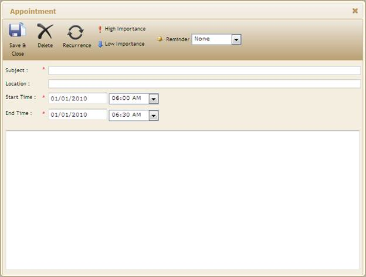

::: {style="DISPLAY: none"}
{#d2h_url_template}{#d2h_package_url style="WIDTH: 0px; DISPLAY: none; HEIGHT: 0px"}
:::

::: {.d2h_secondary_topic style="PADDING-BOTTOM: 10pt; MARGIN: 0pt; PADDING-LEFT: 0pt; PADDING-RIGHT: 0pt; PADDING-TOP: 0pt"}
##### Using View customization {#using-view-customization style="tab-stops: 0pt"}

 

The steps to customize adding appointments using View Customization are as follows:

1.   [Create a model in the application]{.UGHyperlink}[.]{style="FONT-FAMILY: 'Calibri','sans-serif'"}[ ]{style="FONT-FAMILY: 'Calibri','sans-serif'"}

2.   [Create a strongly typed view]{.UGHyperlink}[.]{style="FONT-FAMILY: 'Calibri','sans-serif'"}[ ]{style="FONT-FAMILY: 'Calibri','sans-serif'"}

3.   In **View**, you can use its **Model** property in **DataSource** in order to bind the data source and bind your database fields into the corresponding Schedule fields.

[]{style="FONT-FAMILY: 'Calibri','sans-serif'"} 

+----------------------------------------------------------------------------------------------------------------------------------------------------------------------------------------+
| **[View\[aspx\]]{style="FONT-FAMILY: 'Calibri','sans-serif'"}**                                                                                                                        |
|                                                                                                                                                                                        |
| [    [\<%]{style="BACKGROUND: yellow"}[=]{style="COLOR: blue"}Html.Syncfusion().Schedule()([\"AddAppointment\"]{style="COLOR: #a31515"})]{style="FONT-FAMILY: 'Calibri','sans-serif'"} |
|                                                                                                                                                                                        |
| [        .DataSource(Model)]{style="FONT-FAMILY: 'Calibri','sans-serif'"}                                                                                                              |
|                                                                                                                                                                                        |
| [        .Skins([ScheduleSkins]{style="COLOR: #2b91af"}.Sandune)]{style="FONT-FAMILY: 'Calibri','sans-serif'"}                                                                         |
|                                                                                                                                                                                        |
| [        .BindList(columns =\>]{style="FONT-FAMILY: 'Calibri','sans-serif'"}                                                                                                           |
|                                                                                                                                                                                        |
| [        {]{style="FONT-FAMILY: 'Calibri','sans-serif'"}                                                                                                                               |
|                                                                                                                                                                                        |
| [           columns.IdField([\"AppId\"]{style="COLOR: #a31515"});]{style="FONT-FAMILY: 'Calibri','sans-serif'"}                                                                        |
|                                                                                                                                                                                        |
| [           columns.SubjectField([\"Subject\"]{style="COLOR: #a31515"});]{style="FONT-FAMILY: 'Calibri','sans-serif'"}                                                                 |
|                                                                                                                                                                                        |
| [           columns.LocationField([\"Location\"]{style="COLOR: #a31515"});]{style="FONT-FAMILY: 'Calibri','sans-serif'"}                                                               |
|                                                                                                                                                                                        |
| [           columns.StartTimeField([\"StartTime\"]{style="COLOR: #a31515"});]{style="FONT-FAMILY: 'Calibri','sans-serif'"}                                                             |
|                                                                                                                                                                                        |
| [           columns.EndTimeField([\"EndTime\"]{style="COLOR: #a31515"});]{style="FONT-FAMILY: 'Calibri','sans-serif'"}                                                                 |
|                                                                                                                                                                                        |
| [           columns.DescriptionField([\"Descrip\"]{style="COLOR: #a31515"});]{style="FONT-FAMILY: 'Calibri','sans-serif'"}                                                             |
|                                                                                                                                                                                        |
| [           columns.OwnerField([\"Resource\"]{style="COLOR: #a31515"});]{style="FONT-FAMILY: 'Calibri','sans-serif'"}                                                                  |
|                                                                                                                                                                                        |
| [        })]{style="FONT-FAMILY: 'Calibri','sans-serif'"}                                                                                                                              |
|                                                                                                                                                                                        |
| [    [%\>]{style="BACKGROUND: yellow"}]{style="FONT-FAMILY: 'Calibri','sans-serif'"}                                                                                                   |
+----------------------------------------------------------------------------------------------------------------------------------------------------------------------------------------+

[]{style="FONT-FAMILY: 'Calibri','sans-serif'; BACKGROUND: yellow"} 

[]{style="FONT-FAMILY: 'Calibri','sans-serif'"} 

+------------------------------------------------------------------------------------------------------------------------------------------------------------------+
| **[View\[cshtml\]]{style="FONT-FAMILY: 'Calibri','sans-serif'"}**                                                                                                |
|                                                                                                                                                                  |
| [  ]{style="FONT-FAMILY: 'Calibri','sans-serif'"}[    ]{style="FONT-FAMILY: Consolas; FONT-SIZE: 9.5pt"}                                                         |
|                                                                                                                                                                  |
| [  [@(]{style="BACKGROUND: yellow"} Html.Syncfusion().Schedule()([\"AddAppointment\"]{style="COLOR: #a31515"})]{style="FONT-FAMILY: Consolas; FONT-SIZE: 9.5pt"} |
|                                                                                                                                                                  |
| [        .DataSource(Model)]{style="FONT-FAMILY: Consolas; FONT-SIZE: 9.5pt"}                                                                                    |
|                                                                                                                                                                  |
| [        .Skins([ScheduleSkins]{style="COLOR: #2b91af"}.Sandune)]{style="FONT-FAMILY: Consolas; FONT-SIZE: 9.5pt"}                                               |
|                                                                                                                                                                  |
| [        .BindList(columns =\>]{style="FONT-FAMILY: Consolas; FONT-SIZE: 9.5pt"}                                                                                 |
|                                                                                                                                                                  |
| [        {]{style="FONT-FAMILY: Consolas; FONT-SIZE: 9.5pt"}                                                                                                     |
|                                                                                                                                                                  |
| [           columns.IdField([\"AppId\"]{style="COLOR: #a31515"});]{style="FONT-FAMILY: Consolas; FONT-SIZE: 9.5pt"}                                              |
|                                                                                                                                                                  |
| [           columns.SubjectField([\"Subject\"]{style="COLOR: #a31515"});]{style="FONT-FAMILY: Consolas; FONT-SIZE: 9.5pt"}                                       |
|                                                                                                                                                                  |
| [           columns.LocationField([\"Location\"]{style="COLOR: #a31515"});]{style="FONT-FAMILY: Consolas; FONT-SIZE: 9.5pt"}                                     |
|                                                                                                                                                                  |
| [           columns.StartTimeField([\"StartTime\"]{style="COLOR: #a31515"});]{style="FONT-FAMILY: Consolas; FONT-SIZE: 9.5pt"}                                   |
|                                                                                                                                                                  |
| [           columns.EndTimeField([\"EndTime\"]{style="COLOR: #a31515"});]{style="FONT-FAMILY: Consolas; FONT-SIZE: 9.5pt"}                                       |
|                                                                                                                                                                  |
| [           columns.DescriptionField([\"Descrip\"]{style="COLOR: #a31515"});]{style="FONT-FAMILY: Consolas; FONT-SIZE: 9.5pt"}                                   |
|                                                                                                                                                                  |
| [           columns.OwnerField([\"Resource\"]{style="COLOR: #a31515"});]{style="FONT-FAMILY: Consolas; FONT-SIZE: 9.5pt"}                                        |
|                                                                                                                                                                  |
| [        })[)]{style="BACKGROUND: yellow"}]{style="FONT-FAMILY: Consolas; FONT-SIZE: 9.5pt"}                                                                     |
|                                                                                                                                                                  |
| []{style="FONT-FAMILY: Consolas; FONT-SIZE: 9.5pt"}                                                                                                              |
|                                                                                                                                                                  |
| []{style="FONT-FAMILY: 'Calibri','sans-serif'; BACKGROUND: yellow"}                                                                                              |
+------------------------------------------------------------------------------------------------------------------------------------------------------------------+

[]{style="FONT-FAMILY: 'Calibri','sans-serif'; BACKGROUND: yellow"} 

4.   Set the **AllowAddNew()** method to perform adding appointments using **CellDoubleClick** event.

[]{style="FONT-FAMILY: 'Calibri','sans-serif'"} 

+----------------------------------------------------------------------------------------------------------------------------------------------------------------------------------------+
| **[View\[aspx\]]{style="FONT-FAMILY: 'Calibri','sans-serif'"}**                                                                                                                        |
|                                                                                                                                                                                        |
| [    [\<%]{style="BACKGROUND: yellow"}[=]{style="COLOR: blue"}Html.Syncfusion().Schedule()([\"AddAppointment\"]{style="COLOR: #a31515"})]{style="FONT-FAMILY: 'Calibri','sans-serif'"} |
|                                                                                                                                                                                        |
| [        .DataSource(Model)]{style="FONT-FAMILY: 'Calibri','sans-serif'"}                                                                                                              |
|                                                                                                                                                                                        |
| [        .Skins([ScheduleSkins]{style="COLOR: #2b91af"}.Sandune)]{style="FONT-FAMILY: 'Calibri','sans-serif'"}                                                                         |
|                                                                                                                                                                                        |
| **[        .AllowAddNew([true]{style="COLOR: blue"})]{style="FONT-FAMILY: 'Calibri','sans-serif'"}**                                                                                   |
|                                                                                                                                                                                        |
| [        .BindList(columns =\>]{style="FONT-FAMILY: 'Calibri','sans-serif'"}                                                                                                           |
|                                                                                                                                                                                        |
| [        {]{style="FONT-FAMILY: 'Calibri','sans-serif'"}                                                                                                                               |
|                                                                                                                                                                                        |
| [           columns.IdField([\"AppId\"]{style="COLOR: #a31515"});]{style="FONT-FAMILY: 'Calibri','sans-serif'"}                                                                        |
|                                                                                                                                                                                        |
| [           columns.SubjectField([\"Subject\"]{style="COLOR: #a31515"});]{style="FONT-FAMILY: 'Calibri','sans-serif'"}                                                                 |
|                                                                                                                                                                                        |
| [           columns.LocationField([\"Location\"]{style="COLOR: #a31515"});]{style="FONT-FAMILY: 'Calibri','sans-serif'"}                                                               |
|                                                                                                                                                                                        |
| [           columns.StartTimeField([\"StartTime\"]{style="COLOR: #a31515"});]{style="FONT-FAMILY: 'Calibri','sans-serif'"}                                                             |
|                                                                                                                                                                                        |
| [           columns.EndTimeField([\"EndTime\"]{style="COLOR: #a31515"});]{style="FONT-FAMILY: 'Calibri','sans-serif'"}                                                                 |
|                                                                                                                                                                                        |
| [           columns.DescriptionField([\"Descrip\"]{style="COLOR: #a31515"});]{style="FONT-FAMILY: 'Calibri','sans-serif'"}                                                             |
|                                                                                                                                                                                        |
| [           columns.OwnerField([\"Resource\"]{style="COLOR: #a31515"});]{style="FONT-FAMILY: 'Calibri','sans-serif'"}                                                                  |
|                                                                                                                                                                                        |
| [        })]{style="FONT-FAMILY: 'Calibri','sans-serif'"}                                                                                                                              |
|                                                                                                                                                                                        |
| [    [%\>]{style="BACKGROUND: yellow"}]{style="FONT-FAMILY: 'Calibri','sans-serif'"}                                                                                                   |
|                                                                                                                                                                                        |
| []{style="FONT-FAMILY: 'Calibri','sans-serif'"}                                                                                                                                        |
+----------------------------------------------------------------------------------------------------------------------------------------------------------------------------------------+

[]{style="FONT-FAMILY: 'Calibri','sans-serif'; BACKGROUND: yellow"} 

[]{style="FONT-FAMILY: 'Calibri','sans-serif'"} 

+----------------------------------------------------------------------------------------------------------------------------------------------------------------------+
| **[View\[cshtml\]]{style="FONT-FAMILY: 'Calibri','sans-serif'"}**                                                                                                    |
|                                                                                                                                                                      |
| []{style="FONT-FAMILY: Consolas; FONT-SIZE: 9.5pt"}                                                                                                                  |
|                                                                                                                                                                      |
| []{style="FONT-FAMILY: Consolas; FONT-SIZE: 9.5pt"}                                                                                                                  |
|                                                                                                                                                                      |
| []{style="FONT-FAMILY: Consolas; FONT-SIZE: 9.5pt"}                                                                                                                  |
|                                                                                                                                                                      |
| [      [@(]{style="BACKGROUND: yellow"} Html.Syncfusion().Schedule()([\"AddAppointment\"]{style="COLOR: #a31515"})]{style="FONT-FAMILY: Consolas; FONT-SIZE: 9.5pt"} |
|                                                                                                                                                                      |
| [        .DataSource(Model)]{style="FONT-FAMILY: Consolas; FONT-SIZE: 9.5pt"}                                                                                        |
|                                                                                                                                                                      |
| [        .Skins([ScheduleSkins]{style="COLOR: #2b91af"}.Sandune)]{style="FONT-FAMILY: Consolas; FONT-SIZE: 9.5pt"}                                                   |
|                                                                                                                                                                      |
| [        .AllowAddNew([true]{style="COLOR: blue"})]{style="FONT-FAMILY: Consolas; FONT-SIZE: 9.5pt"}                                                                 |
|                                                                                                                                                                      |
| [        .BindList(columns =\>]{style="FONT-FAMILY: Consolas; FONT-SIZE: 9.5pt"}                                                                                     |
|                                                                                                                                                                      |
| [        {]{style="FONT-FAMILY: Consolas; FONT-SIZE: 9.5pt"}                                                                                                         |
|                                                                                                                                                                      |
| [           columns.IdField([\"AppId\"]{style="COLOR: #a31515"});]{style="FONT-FAMILY: Consolas; FONT-SIZE: 9.5pt"}                                                  |
|                                                                                                                                                                      |
| [           columns.SubjectField([\"Subject\"]{style="COLOR: #a31515"});]{style="FONT-FAMILY: Consolas; FONT-SIZE: 9.5pt"}                                           |
|                                                                                                                                                                      |
| [           columns.LocationField([\"Location\"]{style="COLOR: #a31515"});]{style="FONT-FAMILY: Consolas; FONT-SIZE: 9.5pt"}                                         |
|                                                                                                                                                                      |
| [           columns.StartTimeField([\"StartTime\"]{style="COLOR: #a31515"});]{style="FONT-FAMILY: Consolas; FONT-SIZE: 9.5pt"}                                       |
|                                                                                                                                                                      |
| [           columns.EndTimeField([\"EndTime\"]{style="COLOR: #a31515"});]{style="FONT-FAMILY: Consolas; FONT-SIZE: 9.5pt"}                                           |
|                                                                                                                                                                      |
| [           columns.DescriptionField([\"Descrip\"]{style="COLOR: #a31515"});]{style="FONT-FAMILY: Consolas; FONT-SIZE: 9.5pt"}                                       |
|                                                                                                                                                                      |
| [           columns.OwnerField([\"Resource\"]{style="COLOR: #a31515"});]{style="FONT-FAMILY: Consolas; FONT-SIZE: 9.5pt"}                                            |
|                                                                                                                                                                      |
| [        })[)]{style="BACKGROUND: yellow"}]{style="FONT-FAMILY: Consolas; FONT-SIZE: 9.5pt"}                                                                         |
|                                                                                                                                                                      |
| []{style="FONT-FAMILY: 'Calibri','sans-serif'"}                                                                                                                      |
+----------------------------------------------------------------------------------------------------------------------------------------------------------------------+

[]{style="FONT-FAMILY: 'Calibri','sans-serif'; BACKGROUND: yellow"} 

5.   Add a **ContextMenuItem** (NewAppointment) in the **ContextMenuItems** **()** method to perform adding an appointment through context-menu.

[]{style="FONT-FAMILY: 'Calibri','sans-serif'"} 

+-------------------------------------------------------------------------------------------------------------------------------------------------------------------------------------------------------------------+
| **[View\[aspx\]]{style="FONT-FAMILY: 'Calibri','sans-serif'"}**                                                                                                                                                   |
|                                                                                                                                                                                                                   |
| [    [\<%]{style="BACKGROUND: yellow"}[=]{style="COLOR: blue"}Html.Syncfusion().Schedule()([\"AddAppointment\"]{style="COLOR: #a31515"})]{style="FONT-FAMILY: 'Calibri','sans-serif'"}                            |
|                                                                                                                                                                                                                   |
| [        .DataSource(Model)]{style="FONT-FAMILY: 'Calibri','sans-serif'"}                                                                                                                                         |
|                                                                                                                                                                                                                   |
| [        .Skins([ScheduleSkins]{style="COLOR: #2b91af"}.Sandune)]{style="FONT-FAMILY: 'Calibri','sans-serif'"}                                                                                                    |
|                                                                                                                                                                                                                   |
| **[        .AllowAddNew([true]{style="COLOR: blue"})]{style="FONT-FAMILY: 'Calibri','sans-serif'"}**                                                                                                              |
|                                                                                                                                                                                                                   |
| **[        .ContextMenuItems(([List]{style="COLOR: #2b91af"}\<[ContextMenuItem]{style="COLOR: #2b91af"}\>)ViewData\[[\"ContextMenus\"]{style="COLOR: #a31515"}\])]{style="FONT-FAMILY: 'Calibri','sans-serif'"}** |
|                                                                                                                                                                                                                   |
| [        .BindList(columns =\>]{style="FONT-FAMILY: 'Calibri','sans-serif'"}                                                                                                                                      |
|                                                                                                                                                                                                                   |
| [        {]{style="FONT-FAMILY: 'Calibri','sans-serif'"}                                                                                                                                                          |
|                                                                                                                                                                                                                   |
| [           columns.IdField([\"AppId\"]{style="COLOR: #a31515"});]{style="FONT-FAMILY: 'Calibri','sans-serif'"}                                                                                                   |
|                                                                                                                                                                                                                   |
| [           columns.SubjectField([\"Subject\"]{style="COLOR: #a31515"});]{style="FONT-FAMILY: 'Calibri','sans-serif'"}                                                                                            |
|                                                                                                                                                                                                                   |
| [           columns.LocationField([\"Location\"]{style="COLOR: #a31515"});]{style="FONT-FAMILY: 'Calibri','sans-serif'"}                                                                                          |
|                                                                                                                                                                                                                   |
| [           columns.StartTimeField([\"StartTime\"]{style="COLOR: #a31515"});]{style="FONT-FAMILY: 'Calibri','sans-serif'"}                                                                                        |
|                                                                                                                                                                                                                   |
| [           columns.EndTimeField([\"EndTime\"]{style="COLOR: #a31515"});]{style="FONT-FAMILY: 'Calibri','sans-serif'"}                                                                                            |
|                                                                                                                                                                                                                   |
| [           columns.DescriptionField([\"Descrip\"]{style="COLOR: #a31515"});]{style="FONT-FAMILY: 'Calibri','sans-serif'"}                                                                                        |
|                                                                                                                                                                                                                   |
| [           columns.OwnerField([\"Resource\"]{style="COLOR: #a31515"});]{style="FONT-FAMILY: 'Calibri','sans-serif'"}                                                                                             |
|                                                                                                                                                                                                                   |
| [        })]{style="FONT-FAMILY: 'Calibri','sans-serif'"}                                                                                                                                                         |
|                                                                                                                                                                                                                   |
| [    [%\>]{style="BACKGROUND: yellow"}]{style="FONT-FAMILY: 'Calibri','sans-serif'"}                                                                                                                              |
|                                                                                                                                                                                                                   |
| []{style="FONT-FAMILY: 'Calibri','sans-serif'"}                                                                                                                                                                   |
+-------------------------------------------------------------------------------------------------------------------------------------------------------------------------------------------------------------------+

[]{style="FONT-FAMILY: 'Calibri','sans-serif'; BACKGROUND: yellow"} 

+-----------------------------------------------------------------------------------------------------------------------------------------------------------------------------------------------------------------------+
| **[View\[cshtml\]]{style="FONT-FAMILY: 'Calibri','sans-serif'"}**                                                                                                                                                     |
|                                                                                                                                                                                                                       |
| [   ]{style="FONT-FAMILY: 'Calibri','sans-serif'"}[     [@(]{style="BACKGROUND: yellow"} Html.Syncfusion().Schedule()([\"AddAppointment\"]{style="COLOR: #a31515"})]{style="FONT-FAMILY: Consolas; FONT-SIZE: 9.5pt"} |
|                                                                                                                                                                                                                       |
| [        .DataSource(Model)]{style="FONT-FAMILY: Consolas; FONT-SIZE: 9.5pt"}                                                                                                                                         |
|                                                                                                                                                                                                                       |
| [        .Skins([ScheduleSkins]{style="COLOR: #2b91af"}.Sandune)]{style="FONT-FAMILY: Consolas; FONT-SIZE: 9.5pt"}                                                                                                    |
|                                                                                                                                                                                                                       |
| [        .AllowAddNew([true]{style="COLOR: blue"})]{style="FONT-FAMILY: Consolas; FONT-SIZE: 9.5pt"}                                                                                                                  |
|                                                                                                                                                                                                                       |
| [        .ContextMenuItems(([List]{style="COLOR: #2b91af"}\<[ContextMenuItem]{style="COLOR: #2b91af"}\>)ViewData\[[\"ContextMenus\"]{style="COLOR: #a31515"}\])]{style="FONT-FAMILY: Consolas; FONT-SIZE: 9.5pt"}     |
|                                                                                                                                                                                                                       |
| [        .BindList(columns =\>]{style="FONT-FAMILY: Consolas; FONT-SIZE: 9.5pt"}                                                                                                                                      |
|                                                                                                                                                                                                                       |
| [        {]{style="FONT-FAMILY: Consolas; FONT-SIZE: 9.5pt"}                                                                                                                                                          |
|                                                                                                                                                                                                                       |
| [           columns.IdField([\"AppId\"]{style="COLOR: #a31515"});]{style="FONT-FAMILY: Consolas; FONT-SIZE: 9.5pt"}                                                                                                   |
|                                                                                                                                                                                                                       |
| [           columns.SubjectField([\"Subject\"]{style="COLOR: #a31515"});]{style="FONT-FAMILY: Consolas; FONT-SIZE: 9.5pt"}                                                                                            |
|                                                                                                                                                                                                                       |
| [           columns.LocationField([\"Location\"]{style="COLOR: #a31515"});]{style="FONT-FAMILY: Consolas; FONT-SIZE: 9.5pt"}                                                                                          |
|                                                                                                                                                                                                                       |
| [           columns.StartTimeField([\"StartTime\"]{style="COLOR: #a31515"});]{style="FONT-FAMILY: Consolas; FONT-SIZE: 9.5pt"}                                                                                        |
|                                                                                                                                                                                                                       |
| [           columns.EndTimeField([\"EndTime\"]{style="COLOR: #a31515"});]{style="FONT-FAMILY: Consolas; FONT-SIZE: 9.5pt"}                                                                                            |
|                                                                                                                                                                                                                       |
| [           columns.DescriptionField([\"Descrip\"]{style="COLOR: #a31515"});]{style="FONT-FAMILY: Consolas; FONT-SIZE: 9.5pt"}                                                                                        |
|                                                                                                                                                                                                                       |
| [           columns.OwnerField([\"Resource\"]{style="COLOR: #a31515"});]{style="FONT-FAMILY: Consolas; FONT-SIZE: 9.5pt"}                                                                                             |
|                                                                                                                                                                                                                       |
| [        })[)]{style="BACKGROUND: yellow"}]{style="FONT-FAMILY: Consolas; FONT-SIZE: 9.5pt"}                                                                                                                          |
|                                                                                                                                                                                                                       |
| []{style="FONT-FAMILY: 'Calibri','sans-serif'"}                                                                                                                                                                       |
+-----------------------------------------------------------------------------------------------------------------------------------------------------------------------------------------------------------------------+

[]{style="FONT-FAMILY: 'Calibri','sans-serif'; BACKGROUND: yellow"} 

6.   In **Controller**, add the Syncfusion.Mvc.Schedule, Syncfusion.Mvc.Shared namespaces.

[]{style="FONT-FAMILY: 'Calibri','sans-serif'"} 

+--------------------------------------------------------------------------------------------------------------------------------------------------------------+
| **[\[Controller\]]{style="FONT-FAMILY: 'Calibri','sans-serif'"}**[[]{style="FONT-FAMILY: 'Calibri','sans-serif'; FONT-WEIGHT: normal"}]{.MsoIntenseEmphasis} |
|                                                                                                                                                              |
| [using]{style="FONT-FAMILY: 'Calibri','sans-serif'; COLOR: blue"}[ Syncfusion.Mvc.Schedule;]{style="FONT-FAMILY: 'Calibri','sans-serif'"}                    |
|                                                                                                                                                              |
| [using]{style="FONT-FAMILY: 'Calibri','sans-serif'; COLOR: blue"}[ Syncfusion.Mvc.Shared;]{style="FONT-FAMILY: 'Calibri','sans-serif'"}                      |
|                                                                                                                                                              |
| []{style="FONT-FAMILY: 'Calibri','sans-serif'"}                                                                                                              |
+--------------------------------------------------------------------------------------------------------------------------------------------------------------+

[]{style="FONT-FAMILY: 'Calibri','sans-serif'; BACKGROUND: yellow"} 

7.   Create **context-menu** item for add new appointment and store it in **Viewdata** for access from view page. Set its data source and render the view.

[]{style="FONT-FAMILY: 'Calibri','sans-serif'"} 

+----------------------------------------------------------------------------------------------------------------------------------------------------------------------------------------------------------------------------------------------+
| **[\[Controller\]]{style="FONT-FAMILY: 'Calibri','sans-serif'"}**[[]{style="FONT-FAMILY: 'Calibri','sans-serif'; FONT-WEIGHT: normal"}]{.MsoIntenseEmphasis}                                                                                 |
|                                                                                                                                                                                                                                              |
| [        [///]{style="COLOR: gray"}[ ]{style="COLOR: green"}[\<summary\>]{style="COLOR: gray"}]{style="FONT-FAMILY: 'Calibri','sans-serif'"}                                                                                                 |
|                                                                                                                                                                                                                                              |
| [        [///]{style="COLOR: gray"}[ It is used to bind the Schedule]{style="COLOR: green"}]{style="FONT-FAMILY: 'Calibri','sans-serif'"}                                                                                                    |
|                                                                                                                                                                                                                                              |
| [        [///]{style="COLOR: gray"}[ ]{style="COLOR: green"}[\</summary\>]{style="COLOR: gray"}]{style="FONT-FAMILY: 'Calibri','sans-serif'"}                                                                                                |
|                                                                                                                                                                                                                                              |
| [        [///]{style="COLOR: gray"}[ ]{style="COLOR: green"}[\<returns\>]{style="COLOR: gray"}[View page, it displays the Schedule]{style="COLOR: green"}[\</returns\>]{style="COLOR: gray"}]{style="FONT-FAMILY: 'Calibri','sans-serif'"}   |
|                                                                                                                                                                                                                                              |
| [        [public]{style="COLOR: blue"} [ActionResult]{style="COLOR: #2b91af"} Index()]{style="FONT-FAMILY: 'Calibri','sans-serif'"}                                                                                                          |
|                                                                                                                                                                                                                                              |
| [        {]{style="FONT-FAMILY: 'Calibri','sans-serif'"}                                                                                                                                                                                     |
|                                                                                                                                                                                                                                              |
| [                [ContextMenuItem]{style="COLOR: #2b91af"} newapp = [new]{style="COLOR: blue"} [ContextMenuItem]{style="COLOR: #2b91af"}() ]{style="FONT-FAMILY: 'Calibri','sans-serif'"}                                                    |
|                                                                                                                                                                                                                                              |
| [{ ]{style="FONT-FAMILY: 'Calibri','sans-serif'"}                                                                                                                                                                                            |
|                                                                                                                                                                                                                                              |
| [MenuID = [\"NewAppointment\"]{style="COLOR: #a31515"}, ]{style="FONT-FAMILY: 'Calibri','sans-serif'"}                                                                                                                                       |
|                                                                                                                                                                                                                                              |
| [MenuName = [\"New Appointment\"]{style="COLOR: #a31515"}, ]{style="FONT-FAMILY: 'Calibri','sans-serif'"}                                                                                                                                    |
|                                                                                                                                                                                                                                              |
| [CommandName = [ContextCommandNames]{style="COLOR: #2b91af"}.NewAppointment ]{style="FONT-FAMILY: 'Calibri','sans-serif'"}                                                                                                                   |
|                                                                                                                                                                                                                                              |
| [};]{style="FONT-FAMILY: 'Calibri','sans-serif'"}                                                                                                                                                                                            |
|                                                                                                                                                                                                                                              |
| [                ViewData\[[\"ContextMenus\"]{style="COLOR: #a31515"}\] = [new]{style="COLOR: blue"} [List]{style="COLOR: #2b91af"}\<[ContextMenuItem]{style="COLOR: #2b91af"}\>() { newapp };]{style="FONT-FAMILY: 'Calibri','sans-serif'"} |
|                                                                                                                                                                                                                                              |
| []{style="FONT-FAMILY: 'Calibri','sans-serif'"}                                                                                                                                                                                              |
|                                                                                                                                                                                                                                              |
| [                [var]{style="COLOR: blue"} data = [new]{style="COLOR: blue"} [NorthwindDataClassesDataContext]{style="COLOR: #2b91af"}().AppointmentTables.Take(200);]{style="FONT-FAMILY: 'Calibri','sans-serif'"}                         |
|                                                                                                                                                                                                                                              |
| [                [return]{style="COLOR: blue"} View(data);]{style="FONT-FAMILY: 'Calibri','sans-serif'"}                                                                                                                                     |
|                                                                                                                                                                                                                                              |
| [        }]{style="FONT-FAMILY: 'Calibri','sans-serif'"}                                                                                                                                                                                     |
|                                                                                                                                                                                                                                              |
| []{style="FONT-FAMILY: 'Calibri','sans-serif'"}                                                                                                                                                                                              |
+----------------------------------------------------------------------------------------------------------------------------------------------------------------------------------------------------------------------------------------------+

[]{style="FONT-FAMILY: 'Calibri','sans-serif'"} 

8.   Create a post method for **Index** action and bind the data source to **Schedule**, as shown in the code displayed below:

[]{style="FONT-FAMILY: 'Calibri','sans-serif'"} 

+---------------------------------------------------------------------------------------------------------------------------------------------------------------------------------------------------------------------------------------------------+
| **[\[Controller\]]{style="FONT-FAMILY: 'Calibri','sans-serif'"}**[[]{style="FONT-FAMILY: 'Calibri','sans-serif'; FONT-WEIGHT: normal"}]{.MsoIntenseEmphasis}                                                                                      |
|                                                                                                                                                                                                                                                   |
| [  ]{style="FONT-FAMILY: 'Calibri','sans-serif'; COLOR: gray"}[      [///]{style="COLOR: gray"}[ ]{style="COLOR: green"}[\<summary\>]{style="COLOR: gray"}]{style="FONT-FAMILY: 'Calibri','sans-serif'"}                                          |
|                                                                                                                                                                                                                                                   |
| [        [///]{style="COLOR: gray"}[ Post Requests are mapped to this method. This method invokes the HtmlActionResult]{style="COLOR: green"}]{style="FONT-FAMILY: 'Calibri','sans-serif'"}                                                       |
|                                                                                                                                                                                                                                                   |
| [        [///]{style="COLOR: gray"}[ from the Schedule. Required response is generated.]{style="COLOR: green"}]{style="FONT-FAMILY: 'Calibri','sans-serif'"}                                                                                      |
|                                                                                                                                                                                                                                                   |
| [        [///]{style="COLOR: gray"}[ ]{style="COLOR: green"}[\</summary\>]{style="COLOR: gray"}]{style="FONT-FAMILY: 'Calibri','sans-serif'"}                                                                                                     |
|                                                                                                                                                                                                                                                   |
| [        [///]{style="COLOR: gray"}[ ]{style="COLOR: green"}[\<param name=\"args\"\>]{style="COLOR: gray"}[Contains post action properties ]{style="COLOR: green"}[\</param\>]{style="COLOR: gray"}]{style="FONT-FAMILY: 'Calibri','sans-serif'"} |
|                                                                                                                                                                                                                                                   |
| [        [///]{style="COLOR: gray"}[ ]{style="COLOR: green"}[\<returns\>]{style="COLOR: gray"}]{style="FONT-FAMILY: 'Calibri','sans-serif'"}                                                                                                      |
|                                                                                                                                                                                                                                                   |
| [        [///]{style="COLOR: gray"}[ HtmlActionResult which returns data displayed on the Schedule]{style="COLOR: green"}]{style="FONT-FAMILY: 'Calibri','sans-serif'"}                                                                           |
|                                                                                                                                                                                                                                                   |
| [        [///]{style="COLOR: gray"}[ ]{style="COLOR: green"}[\</returns\>]{style="COLOR: gray"}]{style="FONT-FAMILY: 'Calibri','sans-serif'"}                                                                                                     |
|                                                                                                                                                                                                                                                   |
| [        \[[AcceptVerbs]{style="COLOR: #2b91af"}([HttpVerbs]{style="COLOR: #2b91af"}.Post)\]]{style="FONT-FAMILY: 'Calibri','sans-serif'"}                                                                                                        |
|                                                                                                                                                                                                                                                   |
| [        [public]{style="COLOR: blue"} [ActionResult]{style="COLOR: #2b91af"} Index([Params]{style="COLOR: #2b91af"} args, [SchedulePropertiesModel]{style="COLOR: #2b91af"} model)]{style="FONT-FAMILY: 'Calibri','sans-serif'"}                 |
|                                                                                                                                                                                                                                                   |
| [        {]{style="FONT-FAMILY: 'Calibri','sans-serif'"}                                                                                                                                                                                          |
|                                                                                                                                                                                                                                                   |
| [NorthwindDataClassesDataContext]{style="FONT-FAMILY: 'Calibri','sans-serif'; COLOR: #2b91af"}[ db = [new]{style="COLOR: blue"} [NorthwindDataClassesDataContext]{style="COLOR: #2b91af"}();]{style="FONT-FAMILY: 'Calibri','sans-serif'"}        |
|                                                                                                                                                                                                                                                   |
| [int]{style="FONT-FAMILY: 'Calibri','sans-serif'; COLOR: blue"}[ intMax = db.AppointmentTables.ToList().Count \> 0 ? db.AppointmentTables.ToList().Max(p =\> p.AppId) : 1;]{style="FONT-FAMILY: 'Calibri','sans-serif'"}                          |
|                                                                                                                                                                                                                                                   |
| [                model.SetCurrentCultureInfo();]{style="FONT-FAMILY: 'Calibri','sans-serif'"}                                                                                                                                                     |
|                                                                                                                                                                                                                                                   |
| []{style="FONT-FAMILY: 'Calibri','sans-serif'"}                                                                                                                                                                                                   |
|                                                                                                                                                                                                                                                   |
| [            [// Create New appointment and insert into database]{style="COLOR: green"}]{style="FONT-FAMILY: 'Calibri','sans-serif'"}                                                                                                             |
|                                                                                                                                                                                                                                                   |
| [            [if]{style="COLOR: blue"} (args.CurrentAction == [\"Save\"]{style="COLOR: #a31515"})]{style="FONT-FAMILY: 'Calibri','sans-serif'"}                                                                                                   |
|                                                                                                                                                                                                                                                   |
| [            {]{style="FONT-FAMILY: 'Calibri','sans-serif'"}                                                                                                                                                                                      |
|                                                                                                                                                                                                                                                   |
| [                [DateTime]{style="COLOR: #2b91af"} startTime = [Convert]{style="COLOR: #2b91af"}.ToDateTime(args.StartTime);]{style="FONT-FAMILY: 'Calibri','sans-serif'"}                                                                       |
|                                                                                                                                                                                                                                                   |
| [                [DateTime]{style="COLOR: #2b91af"} endTime = [Convert]{style="COLOR: #2b91af"}.ToDateTime(args.EndTime);]{style="FONT-FAMILY: 'Calibri','sans-serif'"}                                                                           |
|                                                                                                                                                                                                                                                   |
| [                [AppointmentTable]{style="COLOR: #2b91af"} appoint = [new]{style="COLOR: blue"} [AppointmentTable]{style="COLOR: #2b91af"}()]{style="FONT-FAMILY: 'Calibri','sans-serif'"}                                                       |
|                                                                                                                                                                                                                                                   |
| [                {]{style="FONT-FAMILY: 'Calibri','sans-serif'"}                                                                                                                                                                                  |
|                                                                                                                                                                                                                                                   |
| [                    AppId = intMax + 1,]{style="FONT-FAMILY: 'Calibri','sans-serif'"}                                                                                                                                                            |
|                                                                                                                                                                                                                                                   |
| [                    StartTime = startTime,]{style="FONT-FAMILY: 'Calibri','sans-serif'"}                                                                                                                                                         |
|                                                                                                                                                                                                                                                   |
| [                    EndTime = endTime,]{style="FONT-FAMILY: 'Calibri','sans-serif'"}                                                                                                                                                             |
|                                                                                                                                                                                                                                                   |
| [                    Subject = args.Subject,]{style="FONT-FAMILY: 'Calibri','sans-serif'"}                                                                                                                                                        |
|                                                                                                                                                                                                                                                   |
| [                    Location = args.Location,]{style="FONT-FAMILY: 'Calibri','sans-serif'"}                                                                                                                                                      |
|                                                                                                                                                                                                                                                   |
| [                    Descrip = args.Description,]{style="FONT-FAMILY: 'Calibri','sans-serif'"}                                                                                                                                                    |
|                                                                                                                                                                                                                                                   |
| [                    Resource = args.Owner,]{style="FONT-FAMILY: 'Calibri','sans-serif'"}                                                                                                                                                         |
|                                                                                                                                                                                                                                                   |
| [                };]{style="FONT-FAMILY: 'Calibri','sans-serif'"}                                                                                                                                                                                 |
|                                                                                                                                                                                                                                                   |
| []{style="FONT-FAMILY: 'Calibri','sans-serif'"}                                                                                                                                                                                                   |
|                                                                                                                                                                                                                                                   |
| [                db.AppointmentTables.InsertOnSubmit(appoint);]{style="FONT-FAMILY: 'Calibri','sans-serif'"}                                                                                                                                      |
|                                                                                                                                                                                                                                                   |
| [                }]{style="FONT-FAMILY: 'Calibri','sans-serif'"}                                                                                                                                                                                  |
|                                                                                                                                                                                                                                                   |
| [                [//to reflect in database]{style="COLOR: green"}]{style="FONT-FAMILY: 'Calibri','sans-serif'"}                                                                                                                                   |
|                                                                                                                                                                                                                                                   |
| [                db.SubmitChanges();]{style="FONT-FAMILY: 'Calibri','sans-serif'"}                                                                                                                                                                |
|                                                                                                                                                                                                                                                   |
| [ActionResult]{style="FONT-FAMILY: 'Calibri','sans-serif'; COLOR: #2b91af"}[ result = db.AppointmentTables.ScheduleActions\<[ScheduleHtmlActionResult]{style="COLOR: #2b91af"}\>();]{style="FONT-FAMILY: 'Calibri','sans-serif'"}                 |
|                                                                                                                                                                                                                                                   |
| [                [return]{style="COLOR: blue"} result;]{style="FONT-FAMILY: 'Calibri','sans-serif'"}                                                                                                                                              |
|                                                                                                                                                                                                                                                   |
| [        }]{style="FONT-FAMILY: 'Calibri','sans-serif'"}                                                                                                                                                                                          |
|                                                                                                                                                                                                                                                   |
| []{style="FONT-FAMILY: 'Calibri','sans-serif'"}                                                                                                                                                                                                   |
+---------------------------------------------------------------------------------------------------------------------------------------------------------------------------------------------------------------------------------------------------+

[]{style="FONT-FAMILY: 'Calibri','sans-serif'"} 

9.   Run the application. The Schedule's appointment window will appear as shown below when the following actions happen in order to create a new appointment:

[]{style="FONT-FAMILY: 'Calibri','sans-serif'"} 

a.  Double-click any **Schedule** cell**.**

b.  Right-click a Schedule cell and click New Appointment.

[]{style="FONT-FAMILY: 'Calibri','sans-serif'"} 

{border="0"}

[]{style="FONT-FAMILY: 'Calibri','sans-serif'"} 

Figure 104: Add Appointment dialog

[]{style="FONT-FAMILY: 'Calibri','sans-serif'"} 

10.  In the **Subject** box, type an appointment's subject.

11.  In the **Location** box, type the location.

12.  Select the appointment timings - start date, start time, end date and end time.

13.  In the **Description** box, type a description.

14.  On the **Appointment dialog** toolbar, click **Save & Close**.

[]{style="FONT-FAMILY: 'Calibri','sans-serif'"} 

[]{#related-topics}
:::
