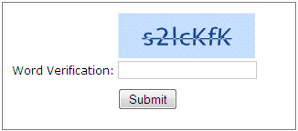
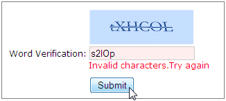

::: {style="DISPLAY: none"}
{#d2h_url_template}{#d2h_package_url style="WIDTH: 0px; DISPLAY: none; HEIGHT: 0px"}
:::

::: {.d2h_secondary_topic style="PADDING-BOTTOM: 10pt; MARGIN: 0pt; PADDING-LEFT: 0pt; PADDING-RIGHT: 0pt; PADDING-TOP: 0pt"}
#### Validating a Captcha {#validating-a-captcha style="tab-stops: 0pt"}

Captcha supports in-built validation methods to validate it with respect to an input field.

 

Methods

+--------------------------------------------------+------------------------------------------------------------------------+-------------+-----------------------------------------------------------------------------+---------------+
| Name                                             | Parameters                                                             | Return type | Description                                                                 | Refernce Link |
+--------------------------------------------------+------------------------------------------------------------------------+-------------+-----------------------------------------------------------------------------+---------------+
| [CaptchaService]{style="COLOR: #2b91af"}.IsValid | string expectedText -- the encrypted text of the Captcha               | bool        | Returns the validation state of the Captcha with respect to the input field | \-            |
|                                                  |                                                                        |             |                                                                             |               |
|                                                  | string actualText -- the text from the text box to be validated        |             |                                                                             |               |
|                                                  |                                                                        |             |                                                                             |               |
|                                                  | bool  caseSensitive -- true/false:enables or disables case sensitivity |             |                                                                             |               |
+--------------------------------------------------+------------------------------------------------------------------------+-------------+-----------------------------------------------------------------------------+---------------+

 

The following steps explain the validation of a Captcha.

1.   In **View**, create a form with an input field (with respect to which the captcha is to be validated), Captcha and a **Submit** button. **[]{style="FONT-FAMILY: 'Calibri','sans-serif'"}**

**[]{style="FONT-FAMILY: 'Calibri','sans-serif'"}** 

**[]{style="FONT-FAMILY: 'Calibri','sans-serif'"}** 

+----------------------------------------------------------------------------------------------------------------------------------------------------------------------------------------------------------------------------------------------------------------------------------------------------+
| **[View\[aspx\]]{style="FONT-FAMILY: 'Courier New'"}**                                                                                                                                                                                                                                             |
|                                                                                                                                                                                                                                                                                                    |
| **[]{style="FONT-FAMILY: 'Courier New'"}**                                                                                                                                                                                                                                                         |
|                                                                                                                                                                                                                                                                                                    |
| [\<%]{style="FONT-FAMILY: 'Courier New'; BACKGROUND: yellow"}[using]{style="FONT-FAMILY: 'Courier New'; COLOR: blue"}[ (Html.Syncfusion().BeginForm())]{style="FONT-FAMILY: 'Courier New'"}                                                                                                        |
|                                                                                                                                                                                                                                                                                                    |
| [      { [%\>]{style="BACKGROUND: yellow"}]{style="FONT-FAMILY: 'Courier New'"}                                                                                                                                                                                                                    |
|                                                                                                                                                                                                                                                                                                    |
| [            [\<%]{style="BACKGROUND: yellow"}[=]{style="COLOR: blue"}Html.Syncfusion().CaptchaControl([\"myCaptcha\"]{style="COLOR: #a31515"})[%\>]{style="BACKGROUND: yellow"}]{style="FONT-FAMILY: 'Courier New'"}                                                                              |
|                                                                                                                                                                                                                                                                                                    |
| [            Word Verification: [\<%]{style="BACKGROUND: yellow"}[=]{style="COLOR: blue"}Html.TextBox([\"myTextbox\"]{style="COLOR: #a31515"})[%\>]{style="BACKGROUND: yellow"}]{style="FONT-FAMILY: 'Courier New'"}                                                                               |
|                                                                                                                                                                                                                                                                                                    |
| [            [\<%]{style="BACKGROUND: yellow"}[=]{style="COLOR: blue"}Html.Syncfusion().ValidationMessage([\"myTextbox\"]{style="COLOR: #a31515"}) [%\>]{style="BACKGROUND: yellow"}[]{style="COLOR: #a31515"}]{style="FONT-FAMILY: 'Courier New'"}                                                |
|                                                                                                                                                                                                                                                                                                    |
| [            [\<]{style="COLOR: blue"}[input]{style="COLOR: maroon"} [type]{style="COLOR: red"}[=\"submit\"]{style="COLOR: blue"} [value]{style="COLOR: red"}[=\"Submit\"]{style="COLOR: blue"} [id]{style="COLOR: red"}[=\"Submit\"/\>]{style="COLOR: blue"}]{style="FONT-FAMILY: 'Courier New'"} |
|                                                                                                                                                                                                                                                                                                    |
| [      [\<%]{style="BACKGROUND: yellow"}} [%\>]{style="BACKGROUND: yellow"}]{style="FONT-FAMILY: 'Courier New'"}                                                                                                                                                                                   |
|                                                                                                                                                                                                                                                                                                    |
| []{style="FONT-FAMILY: 'Courier New'; BACKGROUND: yellow"}                                                                                                                                                                                                                                         |
+----------------------------------------------------------------------------------------------------------------------------------------------------------------------------------------------------------------------------------------------------------------------------------------------------+

**[]{style="FONT-FAMILY: 'Calibri','sans-serif'"}** 

**[]{style="FONT-FAMILY: 'Calibri','sans-serif'"}** 

+-------------------------------------------------------------------------------------------------------------------------------------------------------------------------------------------------------------------------------------------------------------------------------------------------------------------------+
| **[View\[cshtml\]]{style="FONT-FAMILY: 'Courier New'"}**                                                                                                                                                                                                                                                                |
|                                                                                                                                                                                                                                                                                                                         |
| **[]{style="FONT-FAMILY: 'Courier New'"}**                                                                                                                                                                                                                                                                              |
|                                                                                                                                                                                                                                                                                                                         |
| [@]{style="FONT-FAMILY: 'Courier New'; BACKGROUND: yellow"}[using]{style="FONT-FAMILY: 'Courier New'; COLOR: blue"}[ (Html.BeginForm())]{style="FONT-FAMILY: 'Courier New'"}                                                                                                                                            |
|                                                                                                                                                                                                                                                                                                                         |
| [    {]{style="FONT-FAMILY: 'Courier New'"}                                                                                                                                                                                                                                                                             |
|                                                                                                                                                                                                                                                                                                                         |
| [        ]{style="FONT-FAMILY: 'Courier New'"}[\@{]{style="FONT-FAMILY: 'Courier New'; BACKGROUND: yellow"}[ ]{style="FONT-FAMILY: 'Courier New'; COLOR: blue"}[Html.Syncfusion().CaptchaControl([\"myCaptcha\"]{style="COLOR: #a31515"}).Render();[}]{style="BACKGROUND: yellow"}]{style="FONT-FAMILY: 'Courier New'"} |
|                                                                                                                                                                                                                                                                                                                         |
| [            Word Verification: [@]{style="BACKGROUND: yellow"}Html.TextBox([\"myTextbox\"]{style="COLOR: #a31515"})]{style="FONT-FAMILY: 'Courier New'"}                                                                                                                                                               |
|                                                                                                                                                                                                                                                                                                                         |
| [            [@]{style="BACKGROUND: yellow"}Html.Syncfusion().ValidationMessage([\"myTextbox\"]{style="COLOR: #a31515"})[]{style="COLOR: #a31515"}]{style="FONT-FAMILY: 'Courier New'"}                                                                                                                                 |
|                                                                                                                                                                                                                                                                                                                         |
| [            [\<]{style="COLOR: blue"}[input]{style="COLOR: maroon"} [type]{style="COLOR: red"}[=\"submit\"]{style="COLOR: blue"} [value]{style="COLOR: red"}[=\"Submit\"]{style="COLOR: blue"} [id]{style="COLOR: red"}[=\"Submit\"/\>]{style="COLOR: blue"}]{style="FONT-FAMILY: 'Courier New'"}                      |
|                                                                                                                                                                                                                                                                                                                         |
| [        }]{style="FONT-FAMILY: 'Courier New'"}[]{style="FONT-FAMILY: 'Courier New'; BACKGROUND: yellow"}                                                                                                                                                                                                               |
+-------------------------------------------------------------------------------------------------------------------------------------------------------------------------------------------------------------------------------------------------------------------------------------------------------------------------+

[]{style="FONT-FAMILY: Consolas; BACKGROUND: yellow; FONT-SIZE: 9.5pt"} 

[]{style="FONT-FAMILY: Consolas; BACKGROUND: yellow; FONT-SIZE: 9.5pt"} 

2.   In the Controller, add the validation rules using the **IsValid** method as shown below in the form's post action.

 

 

 

+------------------------------------------------------------------------------------------------------------------------------------------------------------------------------------------------------------+
| **[\[Controller\]]{style="FONT-FAMILY: 'Courier New'"}**                                                                                                                                                   |
|                                                                                                                                                                                                            |
| **[]{style="FONT-FAMILY: 'Courier New'"}**                                                                                                                                                                 |
|                                                                                                                                                                                                            |
| [/\*Post Action for the Login Form\*/]{style="FONT-FAMILY: 'Courier New'; COLOR: green"}[]{style="FONT-FAMILY: 'Courier New'"}                                                                             |
|                                                                                                                                                                                                            |
| [        \[[AcceptVerbs]{style="COLOR: #2b91af"}([HttpVerbs]{style="COLOR: #2b91af"}.Post)\]]{style="FONT-FAMILY: 'Courier New'"}                                                                          |
|                                                                                                                                                                                                            |
| [        [public]{style="COLOR: blue"} [ActionResult]{style="COLOR: #2b91af"} Index([string]{style="COLOR: blue"} myCaptcha, [string]{style="COLOR: blue"} myTextbox)]{style="FONT-FAMILY: 'Courier New'"} |
|                                                                                                                                                                                                            |
| [        {]{style="FONT-FAMILY: 'Courier New'"}                                                                                                                                                            |
|                                                                                                                                                                                                            |
| []{style="FONT-FAMILY: 'Courier New'"}                                                                                                                                                                     |
|                                                                                                                                                                                                            |
| [            [if]{style="COLOR: blue"} (\![CaptchaService]{style="COLOR: #2b91af"}.IsValid(myCaptcha, myTextbox, [true]{style="COLOR: blue"}))]{style="FONT-FAMILY: 'Courier New'"}                        |
|                                                                                                                                                                                                            |
| [                ModelState.AddModelError([\"myTextbox\"]{style="COLOR: #a31515"}, [\"Invalid characters.Try again\"]{style="COLOR: #a31515"});]{style="FONT-FAMILY: 'Courier New'"}                       |
|                                                                                                                                                                                                            |
| []{style="FONT-FAMILY: 'Courier New'"}                                                                                                                                                                     |
|                                                                                                                                                                                                            |
| [            [return]{style="COLOR: blue"} View();]{style="FONT-FAMILY: 'Courier New'"}                                                                                                                    |
|                                                                                                                                                                                                            |
| [        }]{style="FONT-FAMILY: 'Courier New'"}                                                                                                                                                            |
|                                                                                                                                                                                                            |
| []{style="FONT-FAMILY: 'Courier New'; BACKGROUND: yellow"}                                                                                                                                                 |
+------------------------------------------------------------------------------------------------------------------------------------------------------------------------------------------------------------+

[]{style="FONT-FAMILY: 'Calibri','sans-serif'"} 

 

3.   Build and run the application.

The output is shown in the following screenshot.

 

{border="0"}

Figure 94: A form with captcha

 

On form submit, when the entered characters within the input field matches the image text, the form passes the validation, else it fails. The output on validation fail is shown in the following screenshot.

 

{border="0"}

Figure 95: A form on validation fails

 

 

[]{#related-topics}
:::
