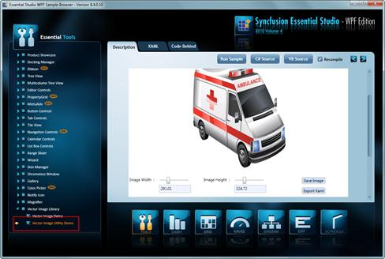
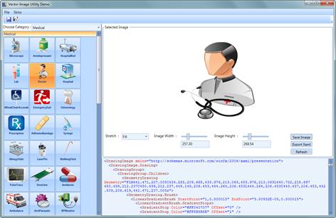

::: {style="DISPLAY: none"}
{#d2h_url_template}{#d2h_package_url style="WIDTH: 0px; DISPLAY: none; HEIGHT: 0px"}
:::

::::: {#nsbanner .d2h_main_nsbanner style="BORDER-BOTTOM: #999999 1px solid; POSITION: relative; PADDING-BOTTOM: 0px; BACKGROUND-COLOR: transparent; PADDING-LEFT: 0px; PADDING-RIGHT: 0px; DISPLAY: none; BORDER-TOP: #999999 1px solid; PADDING-TOP: 0px; LEFT: 0px"}
:::: {#TitleRow .d2h_main_titlerow style="PADDING-BOTTOM: 4px; BACKGROUND-COLOR: transparent; PADDING-LEFT: 22px; WIDTH: 100%; PADDING-RIGHT: 10px; DISPLAY: none; PADDING-TOP: 4px"}
::: {#ienav .d2h_main_ienav style="DISPLAY: none"}
{#D2HPrevious .D2HPreviousEnabled}  {#D2HNext .D2HNextEnabled}
:::
::::
:::::

:::: {#nstext .d2h_main_nstext style="PADDING-BOTTOM: 10px; BACKGROUND-COLOR: transparent; PADDING-LEFT: 22px; PADDING-RIGHT: 10px; HEIGHT: 100%; OVERFLOW: auto; PADDING-TOP: 5px" hasuserbackground="true" valign="bottom"}
::: {#d2h_breadcrumbs .d2h_breadcrumbs}
[Essential Studio User Guide Documentation](ms-xhelp:///?Id=12457748-09e3-4d74-a240-8e049cedf030){.d2h_breadcrumbsNormal}[ \> ]{.d2h_breadcrumbsLinkSeparator}[User Interface Edition](ms-xhelp:///?Id=c29296b7-531c-413b-a0ec-488ca1f7f669){.d2h_breadcrumbsNormal}[ \> ]{.d2h_breadcrumbsLinkSeparator}[Essential WPF](ms-xhelp:///?Id=7f4f82c5-151c-4262-94d0-75c4626c77bc){.d2h_breadcrumbsNormal}[ \> ]{.d2h_breadcrumbsLinkSeparator}[Essential Tools]{.d2h_breadcrumbsContentsOnly}[ \> ]{.d2h_breadcrumbsLinkSeparator}[Tools WPF Controls](ms-xhelp:///?Id=2ea58a12-9426-4a63-96b4-89eb80232c2c){.d2h_breadcrumbsNormal}[ \> ]{.d2h_breadcrumbsLinkSeparator}[Vector Images for WPF](ms-xhelp:///?Id=b7378019-866f-4d94-936e-8fb8c9d8a659){.d2h_breadcrumbsNormal}
:::

### Vector Image Utility {#vector-image-utility style="tab-stops: 0pt"}

The Vector Image utility demo is distributed along with our Dashboard samples. You can find the utility under the Vector Image Library in Essential Tools WPF Samples.

 

{border="0"}

Figure 1178: Vector Image utility location

 

The Utility opens on clicking the **Run Sample button**.

 

{border="0"}

Figure 1179: Vector Image Utility

 

More:

[ ]{#related-topics}

[{border="0" align="absMiddle"}Exporting Images as XAML](ms-xhelp:///?Id=3fd85ebb-f9d1-493d-bf3c-67349c6e6bcd){style="TEXT-DECORATION: none"}

[{border="0" align="absMiddle"}Save Vector images as various formats](ms-xhelp:///?Id=68fd4715-0783-41e4-b695-a5dde05495cf){style="TEXT-DECORATION: none"}

[{border="0" align="absMiddle"}XAML of Vector Image](ms-xhelp:///?Id=d7cfece4-3754-42a3-a572-51a19e1f9fa6){style="TEXT-DECORATION: none"}
::::
