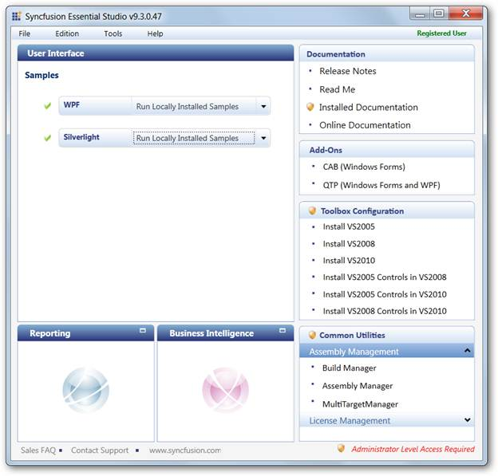
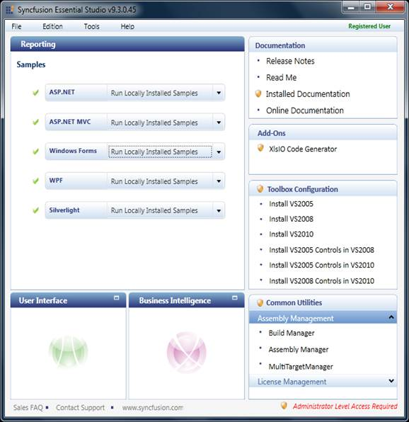
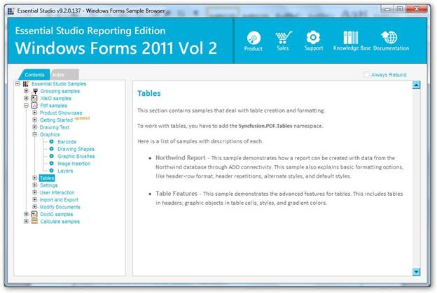

::: {style="DISPLAY: none"}
{#d2h_url_template}{#d2h_package_url style="WIDTH: 0px; DISPLAY: none; HEIGHT: 0px"}
:::

::: {.d2h_secondary_topic style="PADDING-BOTTOM: 10pt; MARGIN: 0pt; PADDING-LEFT: 0pt; PADDING-RIGHT: 0pt; PADDING-TOP: 0pt"}
##### Viewing Layers Samples {#viewing-layers-samples style="tab-stops: 0pt"}

 

To view Layers samples:

1.   Open the Syncfusion Essential Studio Dashboard.

The Essential Studio Enterprise Edition window is displayed.

{border="0"}

Essential Studio Dashboard

The **User Interface** edition panel is displayed by default.

*[]{style="FONT-SIZE: 9pt"}* 

2.   Select **Reporting** and click the drop-down button of any platform e.g. Windows Forms, listed below **Samples**. The following options are displayed when clicking on the drop-down. You can view the samples in the following three ways:

[·      ]{style="FONT-FAMILY: Symbol"}**Run Locally Installed Samples** -- to view the locally installed XlsIO samples using the sample browser

[·      ]{style="FONT-FAMILY: Symbol"}**Run Online Samples** -- to view the online XlsIO samples.

[·      ]{style="FONT-FAMILY: Symbol"}**Explore Samples** -- to locate the XlsIO samples on the disk

 

 

{border="0"}

Syncfusion Essential Studio Dashboard

 

3.   Choose **Run Locally Installed Samples**.

The Windows Forms Sample Browser displays.

{border="0"}

Windows Forms Sample Browser

 

4.   Go to **PDF samples** -\> **Graphics** -\> **Layers**.

 

For accessing ASP.NET samples:

[·    ]{style="FONT-FAMILY: Symbol; FONT-SIZE: 11pt"}Go to **ASP.NET** -\> **PDF samples** -\> **Graphics** -\> **Layers**.

 

For accessing ASP.NET MVC samples:

[·    ]{style="FONT-FAMILY: Symbol; FONT-SIZE: 11pt"}Go to **ASP.NET MVC** -\> **PDF samples** -\> **Graphics** -\> **Layers**.

 

For accessing WPF samples:

[·    ]{style="FONT-FAMILY: Symbol; FONT-SIZE: 11pt"}**Go to WPF -\> PDF samples -\> Graphics** -\> **Layers**.

 

For accessing Silverlight samples:

[·    ]{style="FONT-FAMILY: Symbol; FONT-SIZE: 11pt"}Go to **Silverlight** -\> **PDF samples** -\> **Graphics** -\> **Layers**.

 

[]{#related-topics}
:::
