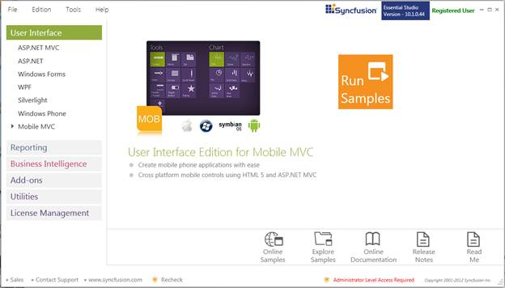
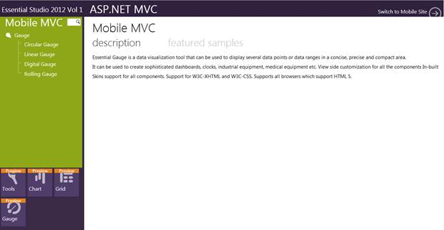

::: {style="DISPLAY: none"}
{#d2h_url_template}{#d2h_package_url style="WIDTH: 0px; DISPLAY: none; HEIGHT: 0px"}
:::

::::: {#nsbanner .d2h_main_nsbanner style="BORDER-BOTTOM: #999999 1px solid; POSITION: relative; PADDING-BOTTOM: 0px; BACKGROUND-COLOR: transparent; PADDING-LEFT: 0px; PADDING-RIGHT: 0px; DISPLAY: none; BORDER-TOP: #999999 1px solid; PADDING-TOP: 0px; LEFT: 0px"}
:::: {#TitleRow .d2h_main_titlerow style="PADDING-BOTTOM: 4px; BACKGROUND-COLOR: transparent; PADDING-LEFT: 22px; WIDTH: 100%; PADDING-RIGHT: 10px; DISPLAY: none; PADDING-TOP: 4px"}
::: {#ienav .d2h_main_ienav style="DISPLAY: none"}
{#D2HPrevious .D2HPreviousEnabled}  {#D2HNext .D2HNextEnabled}
:::
::::
:::::

::::: {#nstext .d2h_main_nstext style="PADDING-BOTTOM: 10px; BACKGROUND-COLOR: transparent; PADDING-LEFT: 22px; PADDING-RIGHT: 10px; HEIGHT: 100%; OVERFLOW: auto; PADDING-TOP: 5px" hasuserbackground="true" valign="bottom"}
::: {#d2h_breadcrumbs .d2h_breadcrumbs}
[Essential Studio User Guide Documentation](ms-xhelp:///?Id=12457748-09e3-4d74-a240-8e049cedf030){.d2h_breadcrumbsNormal}[ \> ]{.d2h_breadcrumbsLinkSeparator}[User Interface Edition](ms-xhelp:///?Id=c29296b7-531c-413b-a0ec-488ca1f7f669){.d2h_breadcrumbsNormal}[ \> ]{.d2h_breadcrumbsLinkSeparator}[Essential Mobile MVC](ms-xhelp:///?Id=74df42e3-5434-4590-9be6-3ae2f911cbbc){.d2h_breadcrumbsNormal}[ \> ]{.d2h_breadcrumbsLinkSeparator}[Essential Gauge]{.d2h_breadcrumbsContentsOnly}[ \> ]{.d2h_breadcrumbsLinkSeparator}[Installation and Deployment](ms-xhelp:///?Id=9d3a2ca7-bcf4-4ed9-8bd2-31949b9ef371){.d2h_breadcrumbsNormal}[ \> ]{.d2h_breadcrumbsLinkSeparator}[Where to Find Samples?](ms-xhelp:///?Id=89c7e3ef-f3e7-4f97-a2f9-0500b71181bc){.d2h_breadcrumbsNormal}
:::

### Viewing Samples {#viewing-samples style="TEXT-ALIGN: justify; tab-stops: 0pt"}

To view the samples, follow the steps below:

1.   Click Start\--\>**All Programs**\--\>**Syncfusion**\--\>**Essential Studio** \<version number\> \--\>**Dashboard**. Essential Studio Enterprise Edition window is displayed. 

{border="0"}

Figure 5 Syncfusion Essential Studio Dashboard

**User Interface** edition panel is selected by default.

2.   Select the **Mobile MVC** platform in the **User Interface** panel. The following options are displayed:

**Run Samples** - View the locally installed Gauge samples for ASP.NET Mobile MVC using the sample browser

**Online Samples** - To view the online Gauge samples for ASP.NET Mobile MVC

**Explore Samples** -- To locate the Mobile Gauge samples on the disk

**Download Source Code** -- To download the source for ASP.NET Mobile MVC

**Online Documentation** -- To view the online Gauge documentation for ASP.NET Mobile MVC

**Release Notes** -- To view the release notes of ASP.NET Mobile MVC

**Read Me** -- To view the read me content of User Interface Edition 

3.   Click **Run Samples**. The Essential Studio - ASP.NET Mobile MVC Edition sample browser is displayed.

{border="0"}

Figure 6 Essential Studio - ASP.NET Mobile MVC Edition Sample Browser

::: {style="BORDER-BOTTOM: windowtext 1pt solid; BORDER-LEFT: medium none; PADDING-BOTTOM: 1pt; MARGIN-TOP: 9pt; PADDING-LEFT: 0pt; PADDING-RIGHT: 0pt; MARGIN-BOTTOM: 9pt; BORDER-TOP: windowtext 1pt solid; BORDER-RIGHT: medium none; PADDING-TOP: 1pt"}
{border="0"}Note: By default, Mobile Tools MVC samples are displayed. Navigate to view the appropriate sample.
:::

4.   Select any sample and browse through features. 

[]{#related-topics}
:::::
