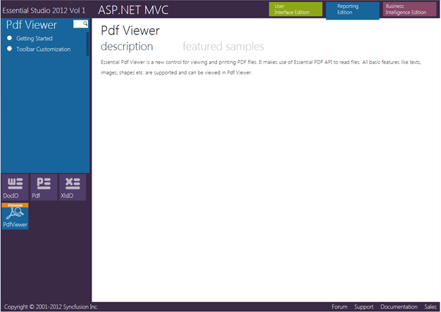

::: {style="DISPLAY: none"}
{#d2h_url_template} {#d2h_package_url style="WIDTH: 0px; DISPLAY: none; HEIGHT: 0px"}
:::

::::: {#nsbanner .d2h_main_nsbanner style="BORDER-BOTTOM: #999999 1px solid; POSITION: relative; PADDING-BOTTOM: 0px; BACKGROUND-COLOR: transparent; PADDING-LEFT: 0px; PADDING-RIGHT: 0px; DISPLAY: none; BORDER-TOP: #999999 1px solid; PADDING-TOP: 0px; LEFT: 0px"}
:::: {#TitleRow .d2h_main_titlerow style="PADDING-BOTTOM: 4px; BACKGROUND-COLOR: transparent; PADDING-LEFT: 22px; WIDTH: 100%; PADDING-RIGHT: 10px; DISPLAY: none; PADDING-TOP: 4px"}
::: {#ienav .d2h_main_ienav style="DISPLAY: none"}
{#D2HPrevious .D2HPreviousEnabled}  {#D2HNext .D2HNextEnabled}
:::
::::
:::::

:::: {#nstext .d2h_main_nstext style="PADDING-BOTTOM: 10px; BACKGROUND-COLOR: transparent; PADDING-LEFT: 22px; PADDING-RIGHT: 10px; HEIGHT: 100%; OVERFLOW: auto; PADDING-TOP: 5px" hasuserbackground="true" valign="bottom"}
::: {#d2h_breadcrumbs .d2h_breadcrumbs}
[Essential Studio User Guide Documentation](ms-xhelp:///?Id=12457748-09e3-4d74-a240-8e049cedf030){.d2h_breadcrumbsNormal} [ \> ]{.d2h_breadcrumbsLinkSeparator} [User Interface Edition](ms-xhelp:///?Id=c29296b7-531c-413b-a0ec-488ca1f7f669){.d2h_breadcrumbsNormal} [ \> ]{.d2h_breadcrumbsLinkSeparator} [Essential ASP.NET MVC](ms-xhelp:///?Id=4b14e7d1-65c4-4f67-b1aa-2c37709905a5){.d2h_breadcrumbsNormal} [ \> ]{.d2h_breadcrumbsLinkSeparator} [Essential PDF Viewer]{.d2h_breadcrumbsContentsOnly} [ \> ]{.d2h_breadcrumbsLinkSeparator} [Installation and Deployment](ms-xhelp:///?Id=db65c6c2-9fd4-412a-8bc8-59335c8c9bb6){.d2h_breadcrumbsNormal} [ \> ]{.d2h_breadcrumbsLinkSeparator} [Where to Find Samples?](ms-xhelp:///?Id=d9799d01-0569-4117-bb5f-84183f505a56){.d2h_breadcrumbsNormal}
:::

### Viewing Samples {#viewing-samples style="tab-stops: 0pt"}

To view the PdfViewer samples:

 

1.   Click **Start** -\> **All Programs**-\> **Syncfusion** -\> **Essential Studio \<x.x.x.x\>** -\> **Dashboard** -\> **UI**

[]{style="FONT-FAMILY: 'Trebuchet MS','sans-serif'; COLOR: #15428b; FONT-SIZE: 9pt"} 

{border="0"}

Figure 2: Syncfusion Essential Studio Dashboard Reporting Edition

 

To view the PdfViewer samples for MVC platform:

2.   Click the drop-down button of the **MVC** platform. The following options are displayed and you can view the samples in the following three ways:

[]{style="FONT-FAMILY: 'Trebuchet MS','sans-serif'; COLOR: #15428b; FONT-SIZE: 9pt"} 

[·      ]{style="FONT-FAMILY: Symbol"} **Run Samples**-View the locally installed PdfViewer samples for MVC using the sample browser

[·      ]{style="FONT-FAMILY: Symbol"} **Online Samples**-View the online PdfViewer samples for MVC

[·      ]{style="FONT-FAMILY: Symbol"} **Explore Samples**-Locate the samples for PdfViewer on the disk

[]{style="FONT-FAMILY: 'Trebuchet MS','sans-serif'; COLOR: #15428b; FONT-SIZE: 9pt"} 

3.   Click **Run Samples** link. Essential Studio - Reporting Edition sample browser is displayed.

[]{style="FONT-FAMILY: 'Trebuchet MS','sans-serif'; COLOR: #15428b; FONT-SIZE: 9pt"} 

{border="0"}

Figure 3: MVC Sample Browser

[]{style="FONT-FAMILY: 'Trebuchet MS','sans-serif'; COLOR: #15428b; FONT-SIZE: 9pt"} 

4.   Click **PdfViewer** from the **FishEye** panel that is displayed at the top of the page.

 

{border="0"}

Figure 4: PDF Viewer Samples for MVC

[]{style="FONT-FAMILY: 'Trebuchet MS','sans-serif'; COLOR: #15428b; FONT-SIZE: 9pt"} 

5.   A list of samples will be displayed on the left pane.

6.   Select any sample and click **Run Sample** to browse through the sample features.

[]{style="COLOR: #c00000"} 

[]{#related-topics}
::::
