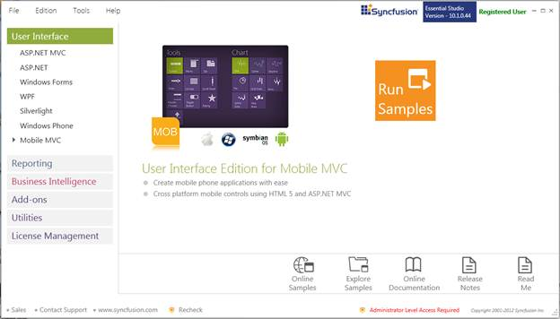
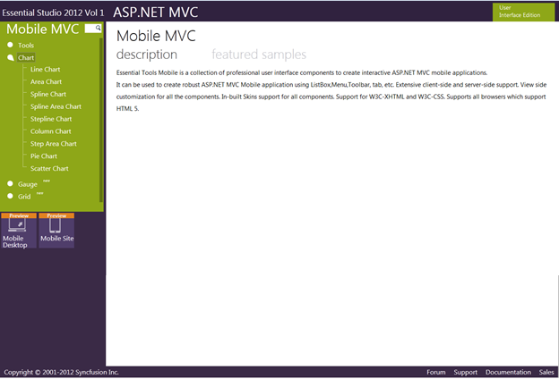

::: {style="DISPLAY: none"}
{#d2h_url_template} {#d2h_package_url style="WIDTH: 0px; DISPLAY: none; HEIGHT: 0px"}
:::

::::: {#nsbanner .d2h_main_nsbanner style="BORDER-BOTTOM: #999999 1px solid; POSITION: relative; PADDING-BOTTOM: 0px; BACKGROUND-COLOR: transparent; PADDING-LEFT: 0px; PADDING-RIGHT: 0px; DISPLAY: none; BORDER-TOP: #999999 1px solid; PADDING-TOP: 0px; LEFT: 0px"}
:::: {#TitleRow .d2h_main_titlerow style="PADDING-BOTTOM: 4px; BACKGROUND-COLOR: transparent; PADDING-LEFT: 22px; WIDTH: 100%; PADDING-RIGHT: 10px; DISPLAY: none; PADDING-TOP: 4px"}
::: {#ienav .d2h_main_ienav style="DISPLAY: none"}
{#D2HPrevious .D2HPreviousEnabled}  {#D2HNext .D2HNextEnabled}
:::
::::
:::::

::::: {#nstext .d2h_main_nstext style="PADDING-BOTTOM: 10px; BACKGROUND-COLOR: transparent; PADDING-LEFT: 22px; PADDING-RIGHT: 10px; HEIGHT: 100%; OVERFLOW: auto; PADDING-TOP: 5px" hasuserbackground="true" valign="bottom"}
::: {#d2h_breadcrumbs .d2h_breadcrumbs}
[Essential Studio User Guide Documentation](ms-xhelp:///?Id=12457748-09e3-4d74-a240-8e049cedf030){.d2h_breadcrumbsNormal} [ \> ]{.d2h_breadcrumbsLinkSeparator} [User Interface Edition](ms-xhelp:///?Id=c29296b7-531c-413b-a0ec-488ca1f7f669){.d2h_breadcrumbsNormal} [ \> ]{.d2h_breadcrumbsLinkSeparator} [Essential Mobile MVC](ms-xhelp:///?Id=74df42e3-5434-4590-9be6-3ae2f911cbbc){.d2h_breadcrumbsNormal} [ \> ]{.d2h_breadcrumbsLinkSeparator} [Essential Chart]{.d2h_breadcrumbsContentsOnly} [ \> ]{.d2h_breadcrumbsLinkSeparator} [Installation and Deployment](ms-xhelp:///?Id=6316418c-94a2-4b19-b637-a43b027933ed){.d2h_breadcrumbsNormal} [ \> ]{.d2h_breadcrumbsLinkSeparator} [Where do I find the installed samples?](ms-xhelp:///?Id=f88afc43-7a27-4bef-93e1-4ae434d1859b){.d2h_breadcrumbsNormal}
:::

### Viewing Samples {#viewing-samples style="TEXT-INDENT: -36pt; MARGIN-LEFT: 36pt; tab-stops: 36.0pt"}

**[]{style="COLOR: black"}**  

To view the samples, follow the steps below:

[]{style="COLOR: black"} 

1.   Click **Start\--\>All Programs\--\>Syncfusion\--\>Essential Studio \<version number\> \--\>Dashboard**. Essential Studio Enterprise Edition window is displayed.

[]{style="COLOR: black"} 

{border="0"}

Figure 1: Syncfusion Essential Studio Dashboard

**[]{style="COLOR: black"}**  

**User Interface Edition** panel is selected by default.

[]{style="COLOR: black"} 

2.   Select the **MOBILE MVC** platform in the **User Interface** panel. The following options are displayed.

[]{style="COLOR: black"} 

[·      ]{style="FONT-FAMILY: Symbol"} **Run Samples** - View the locally installed Tools samples for ASP.NET MOBILE MVC using the sample browser

[·      ]{style="FONT-FAMILY: Symbol"} **Online Samples** - View the online Tools samples for ASP.NET MOBILE MVC

[·      ]{style="FONT-FAMILY: Symbol"} **Explore Samples** - Locate the Mobile Tools samples on the disk

[·      ]{style="FONT-FAMILY: Symbol"} **Download Source Code** - Download the source for ASP.NET MOBILE MVC

[·      ]{style="FONT-FAMILY: Symbol"} **Online Documentation** - View the online Tools documentation for ASP.NET MOBILE MVC

[·      ]{style="FONT-FAMILY: Symbol"} **Release Notes** - View the release notes of ASP.NET MOBILE MVC

[·      ]{style="FONT-FAMILY: Symbol"} **Read Me** - View the read me content of User Interface Edition

[]{style="COLOR: black"} 

You can view the samples in the preceding three ways.

[]{style="COLOR: black"} 

3.   Click Run Samples button. Essential Studio - ASP.NET MOBILE MVC Edition sample browser is displayed.

[]{style="COLOR: black"} 

[ ]{style="BORDER-BOTTOM: black 1pt; BORDER-LEFT: black 1pt; PADDING-BOTTOM: 0pt; PADDING-LEFT: 0pt; LAYOUT-GRID-MODE: line; PADDING-RIGHT: 0pt; FONT-FAMILY: 'Times New Roman','serif'; BACKGROUND: black; COLOR: black; FONT-SIZE: 0pt; BORDER-TOP: black 1pt; BORDER-RIGHT: black 1pt; PADDING-TOP: 0pt"} [ {border="0"} ]{style="BORDER-BOTTOM: black 1pt; BORDER-LEFT: black 1pt; PADDING-BOTTOM: 0pt; PADDING-LEFT: 0pt; PADDING-RIGHT: 0pt; FONT-FAMILY: 'Times New Roman','serif'; BACKGROUND: black; COLOR: black; FONT-SIZE: 0pt; BORDER-TOP: black 1pt; BORDER-RIGHT: black 1pt; PADDING-TOP: 0pt"}

Figure 2: Essential Studio - ASP.NET MOBILE MVC Edition Sample Browser

[]{style="COLOR: black"} 

::: {style="BORDER-BOTTOM: windowtext 1pt solid; BORDER-LEFT: medium none; PADDING-BOTTOM: 1pt; MARGIN-TOP: 9pt; PADDING-LEFT: 0pt; PADDING-RIGHT: 0pt; MARGIN-BOTTOM: 9pt; BORDER-TOP: windowtext 1pt solid; BORDER-RIGHT: medium none; PADDING-TOP: 1pt"}
{border="0"}Note: By default, Mobile Tools MVC samples are displayed.
:::

[]{style="COLOR: black"} 

4.   Select any sample and browse through the features.

[]{style="COLOR: black"} 

Source Code Location

[]{style="COLOR: black"} 

Since this product is still in the preview mode, the source code will not be downloaded.

[]{#related-topics}
:::::
