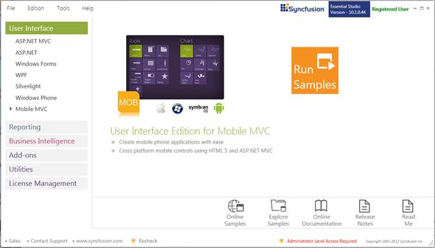
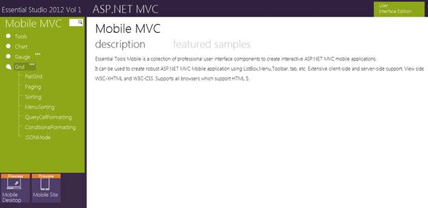

::: {style="DISPLAY: none"}
{#d2h_url_template}{#d2h_package_url style="WIDTH: 0px; DISPLAY: none; HEIGHT: 0px"}
:::

::::: {#nsbanner .d2h_main_nsbanner style="BORDER-BOTTOM: #999999 1px solid; POSITION: relative; PADDING-BOTTOM: 0px; BACKGROUND-COLOR: transparent; PADDING-LEFT: 0px; PADDING-RIGHT: 0px; DISPLAY: none; BORDER-TOP: #999999 1px solid; PADDING-TOP: 0px; LEFT: 0px"}
:::: {#TitleRow .d2h_main_titlerow style="PADDING-BOTTOM: 4px; BACKGROUND-COLOR: transparent; PADDING-LEFT: 22px; WIDTH: 100%; PADDING-RIGHT: 10px; DISPLAY: none; PADDING-TOP: 4px"}
::: {#ienav .d2h_main_ienav style="DISPLAY: none"}
{#D2HPrevious .D2HPreviousEnabled}  {#D2HNext .D2HNextEnabled}
:::
::::
:::::

:::: {#nstext .d2h_main_nstext style="PADDING-BOTTOM: 10px; BACKGROUND-COLOR: transparent; PADDING-LEFT: 22px; PADDING-RIGHT: 10px; HEIGHT: 100%; OVERFLOW: auto; PADDING-TOP: 5px" hasuserbackground="true" valign="bottom"}
::: {#d2h_breadcrumbs .d2h_breadcrumbs}
[Essential Studio User Guide Documentation](ms-xhelp:///?Id=12457748-09e3-4d74-a240-8e049cedf030){.d2h_breadcrumbsNormal}[ \> ]{.d2h_breadcrumbsLinkSeparator}[User Interface Edition](ms-xhelp:///?Id=c29296b7-531c-413b-a0ec-488ca1f7f669){.d2h_breadcrumbsNormal}[ \> ]{.d2h_breadcrumbsLinkSeparator}[Essential Mobile MVC](ms-xhelp:///?Id=74df42e3-5434-4590-9be6-3ae2f911cbbc){.d2h_breadcrumbsNormal}[ \> ]{.d2h_breadcrumbsLinkSeparator}[Essential Grid]{.d2h_breadcrumbsContentsOnly}[ \> ]{.d2h_breadcrumbsLinkSeparator}[Installation and Deployment](ms-xhelp:///?Id=75b194b1-a824-4764-885e-7bf61f97f614){.d2h_breadcrumbsNormal}[ \> ]{.d2h_breadcrumbsLinkSeparator}[Where do I find the installed samples?](ms-xhelp:///?Id=224fb9d4-f8c5-4ea3-8e41-a278338c4110){.d2h_breadcrumbsNormal}
:::

### Viewing Samples {#viewing-samples style="tab-stops: 0pt"}

 To view the samples, follow the steps below:

1.  [Click **Start** \> **All Programs** \> **Syncfusion** \> **Essential Studio \<version number\>** \> **Dashboard**. The Essential Studio Enterprise Edition window is displayed. ]{style="FONT-FAMILY: 'Arial','sans-serif'"}

 

{border="0"}

Figure 2: Syncfusion Essential Studio Dashboard

The **User Interface Edition** panel is selected by default.

2.  [Select the **MOBILE MVC** platform in the **User Interface** panel. The following options are displayed.]{style="FONT-FAMILY: 'Arial','sans-serif'"}

 

**Run Samples**---View the locally installed Mobile Grid samples for ASP.NET MVC using the sample browser

**Online Samples**---View the online Essential Grid samples for Mobile MVC

**Explore Samples**---Locate the Mobile Grid samples on the disk

**Download Source Code---**Download the source for ASP.NET MVC Mobile

**Online Documentation**---View the online Essential Grid documentation for Mobile MVC

**Release Notes**---View the release notes of MOBILE ASP.NET MVC

**Read Me**---View the read me content of User Interface Edition

 

You can view the samples in the following ways.

1.  [Click **Run Samples**. The **Essential Studio for Mobile MVC** sample browser is displayed.]{style="FONT-FAMILY: 'Arial','sans-serif'"}

 

{border="0"}

Figure 3: Essential Studio Mobile  MVC Edition Sample Browser

 {border="0"}Note: By default, Essential Tools for Mobile MVC samples are displayed.

 

[2.   Select any sample and browse through the features.]{style="FONT-FAMILY: 'Arial','sans-serif'; FONT-SIZE: 10pt"}

 

Source Code Location

Since this product is still in the preview mode, the source code will not be downloaded.

[]{#related-topics}
::::
