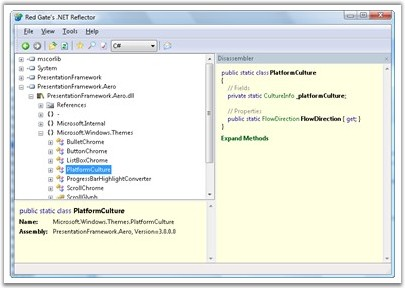
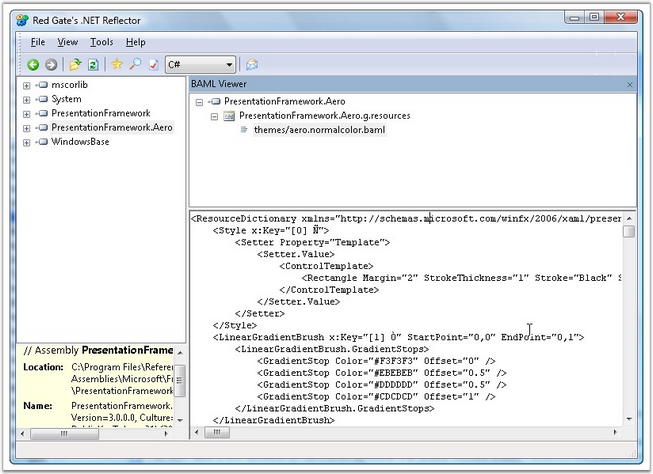

::: {style="DISPLAY: none"}
{#d2h_url_template}{#d2h_package_url style="WIDTH: 0px; DISPLAY: none; HEIGHT: 0px"}
:::

::::: {#nsbanner .d2h_main_nsbanner style="BORDER-BOTTOM: #999999 1px solid; POSITION: relative; PADDING-BOTTOM: 0px; BACKGROUND-COLOR: transparent; PADDING-LEFT: 0px; PADDING-RIGHT: 0px; DISPLAY: none; BORDER-TOP: #999999 1px solid; PADDING-TOP: 0px; LEFT: 0px"}
:::: {#TitleRow .d2h_main_titlerow style="PADDING-BOTTOM: 4px; BACKGROUND-COLOR: transparent; PADDING-LEFT: 22px; WIDTH: 100%; PADDING-RIGHT: 10px; DISPLAY: none; PADDING-TOP: 4px"}
::: {#ienav .d2h_main_ienav style="DISPLAY: none"}
{#D2HPrevious .D2HPreviousEnabled}  {#D2HNext .D2HNextEnabled}
:::
::::
:::::

:::: {#nstext .d2h_main_nstext style="PADDING-BOTTOM: 10px; BACKGROUND-COLOR: transparent; PADDING-LEFT: 22px; PADDING-RIGHT: 10px; HEIGHT: 100%; OVERFLOW: auto; PADDING-TOP: 5px" hasuserbackground="true" valign="bottom"}
::: {#d2h_breadcrumbs .d2h_breadcrumbs}
[Essential Studio User Guide Documentation](ms-xhelp:///?Id=12457748-09e3-4d74-a240-8e049cedf030){.d2h_breadcrumbsNormal}[ \> ]{.d2h_breadcrumbsLinkSeparator}[User Interface Edition](ms-xhelp:///?Id=c29296b7-531c-413b-a0ec-488ca1f7f669){.d2h_breadcrumbsNormal}[ \> ]{.d2h_breadcrumbsLinkSeparator}[Essential WPF](ms-xhelp:///?Id=7f4f82c5-151c-4262-94d0-75c4626c77bc){.d2h_breadcrumbsNormal}[ \> ]{.d2h_breadcrumbsLinkSeparator}[Essential Chart]{.d2h_breadcrumbsContentsOnly}[ \> ]{.d2h_breadcrumbsLinkSeparator}[Getting Started](ms-xhelp:///?Id=3e9bab18-db73-46ef-b3f1-95beb1826cbd){.d2h_breadcrumbsNormal}
:::

## Viewing XAML resources using Reflector + BAML viewer {#viewing-xaml-resources-using-reflector-baml-viewer style="tab-stops: 0pt"}

Embedded XAML Resources

Several Syncfusion WPF assemblies come with embedded XAML resources, like template definitions, style definitions, and so on. And it is often very useful to take a look at these embedded XAML to understand the structure of a control and thereby making it easier to customize its UI in your applications, if necessary.

[]{style="FONT-FAMILY: 'Trebuchet MS','sans-serif'; COLOR: #15428b; FONT-SIZE: 9pt"} 

The best way to take a look at these embedded XAML resources is to use the **Reflector** tool with the **BAML Viewer** plug-in.

[]{style="FONT-FAMILY: 'Trebuchet MS','sans-serif'; COLOR: #15428b; FONT-SIZE: 9pt"} 

Reflector + BAML Viewer

Reflector is a popular free tool available since the early days of .NET to help you take a deeper look at the source and resources comprising a .NET assembly. Reflector can be downloaded from the following location: [[http://www.red-gate.com/products/reflector/.]{.UGHyperlink}](http://www.red-gate.com/products/reflector/)

[]{style="FONT-FAMILY: 'Trebuchet MS','sans-serif'; COLOR: #15428b; FONT-SIZE: 9pt"} 

The following screen shot illustrates a thumbnail view of the Reflector tool.

[]{style="FONT-FAMILY: 'Trebuchet MS','sans-serif'; COLOR: #15428b; FONT-SIZE: 9pt"} 

{border="0"}

Figure 52: Reflector Tool

[]{style="FONT-FAMILY: 'Trebuchet MS','sans-serif'; COLOR: #15428b; FONT-SIZE: 9pt"} 

Once you install the Reflector, download the BAML Viewer plug-in from the following location[: ]{style="COLOR: #15428b"}[[http://www.codeplex.com/reflectoraddins/Wiki/View.aspx?title=BamlViewer]{.UGHyperlink}](http://www.codeplex.com/reflectoraddins/Wiki/View.aspx?title=BamlViewer)[.]{style="COLOR: #15428b"}

[]{style="FONT-FAMILY: 'Trebuchet MS','sans-serif'; COLOR: #15428b; FONT-SIZE: 9pt"} 

The plug-in is a single dll called **Reflector.BamlViewer.dll**. Put this dll next to the Reflector.exe and add the plug-in to the Reflector.

[]{style="FONT-FAMILY: 'Trebuchet MS','sans-serif'; COLOR: #15428b; FONT-SIZE: 9pt"} 

The following steps illustrate how to add the plug-in to the Reflector.

[]{style="FONT-FAMILY: 'Trebuchet MS','sans-serif'; COLOR: #15428b; FONT-SIZE: 9pt"} 

1.   In the Reflector tool, select the **View/Add Ins\...** menu item.

2.   In the **Add Ins** dialog box, add the above dll as an \"add-in\". This will include a new **Tools/BAML Viewer** menu item in the Reflector.

3.   Then open a WPF assembly (or Syncfusion assembly) that usually contains a BAML resource, like PresentationFramework.Aero.dll (usually found under \"%ProgramFiles%\\Reference Assemblies\\Microsoft\\Framework\\v3.0\\PresentationFramework.Aero.dll\").

4.   Then select the **Tools/BAML Viewer** menu item. This will open a new BAML Viewer view showing the embedded XAML in the above assembly.

[]{style="FONT-FAMILY: 'Trebuchet MS','sans-serif'; COLOR: #15428b; FONT-SIZE: 9pt"} 

The following screen shot illustrates the BAML Viewer showing the embedded XAML in the PresentationFramework.Aero.dll.

[]{style="FONT-FAMILY: 'Trebuchet MS','sans-serif'; COLOR: #15428b; FONT-SIZE: 9pt"} 

{border="0"}

Figure 53: BAML Viewer with Embedded XAML in WPF Assembly

[]{style="FONT-FAMILY: 'Trebuchet MS','sans-serif'; COLOR: #15428b; FONT-SIZE: 9pt"} 

Similarly, you can view the XAML resources embedded in the Syncfusion assemblies.

[]{#p22} 

[]{#related-topics}
::::
