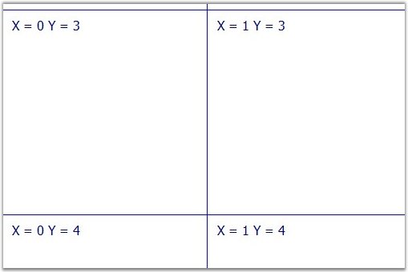
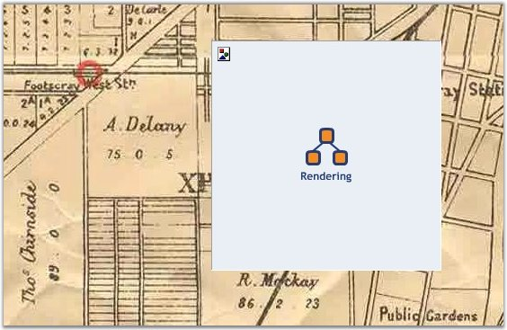

::: {style="DISPLAY: none"}
{#d2h_url_template}{#d2h_package_url style="WIDTH: 0px; DISPLAY: none; HEIGHT: 0px"}
:::

::::: {#nsbanner .d2h_main_nsbanner style="BORDER-BOTTOM: #999999 1px solid; POSITION: relative; PADDING-BOTTOM: 0px; BACKGROUND-COLOR: transparent; PADDING-LEFT: 0px; PADDING-RIGHT: 0px; DISPLAY: none; BORDER-TOP: #999999 1px solid; PADDING-TOP: 0px; LEFT: 0px"}
:::: {#TitleRow .d2h_main_titlerow style="PADDING-BOTTOM: 4px; BACKGROUND-COLOR: transparent; PADDING-LEFT: 22px; WIDTH: 100%; PADDING-RIGHT: 10px; DISPLAY: none; PADDING-TOP: 4px"}
::: {#ienav .d2h_main_ienav style="DISPLAY: none"}
{#D2HPrevious .D2HPreviousEnabled}  {#D2HNext .D2HNextEnabled}
:::
::::
:::::

:::::: {#nstext .d2h_main_nstext style="PADDING-BOTTOM: 10px; BACKGROUND-COLOR: transparent; PADDING-LEFT: 22px; PADDING-RIGHT: 10px; HEIGHT: 100%; OVERFLOW: auto; PADDING-TOP: 5px" hasuserbackground="true" valign="bottom"}
::: {#d2h_breadcrumbs .d2h_breadcrumbs}
[Essential Studio User Guide Documentation](ms-xhelp:///?Id=12457748-09e3-4d74-a240-8e049cedf030){.d2h_breadcrumbsNormal}[ \> ]{.d2h_breadcrumbsLinkSeparator}[User Interface Edition](ms-xhelp:///?Id=c29296b7-531c-413b-a0ec-488ca1f7f669){.d2h_breadcrumbsNormal}[ \> ]{.d2h_breadcrumbsLinkSeparator}[Essential ASP.NET](ms-xhelp:///?Id=25c35330-c127-4dad-9a92-ed79dc7261a6){.d2h_breadcrumbsNormal}[ \> ]{.d2h_breadcrumbsLinkSeparator}[Essential Diagram]{.d2h_breadcrumbsContentsOnly}[ \> ]{.d2h_breadcrumbsLinkSeparator}[Concepts and Features](ms-xhelp:///?Id=f9aa55fb-f8cf-43da-a8be-de231dc0d949){.d2h_breadcrumbsNormal}[ \> ]{.d2h_breadcrumbsLinkSeparator}[Optimization](ms-xhelp:///?Id=b87d4bc7-af66-4e6f-81ff-c63c4bc639b4){.d2h_breadcrumbsNormal}
:::

### Virtual Caching Type and Image Grid Cell Updating Event[]{style="FONT-SIZE: 10pt"} {#virtual-caching-type-and-image-grid-cell-updating-event style="tab-stops: 0pt"}

[]{style="FONT-FAMILY: 'Trebuchet MS','sans-serif'; COLOR: #15428b; FONT-SIZE: 9pt"} 

When the CachingMode is set to Virtual, the **ImageGridCellUpdating** event is raised, each time the control needs a tile. The OptimizedBackgroundRendering mode should be enabled for this.

 

You must write your own event handler implementation for the ImageGridCellUpdating event. The event handler receives an argument of type **Syncfusion.Web.UI.WebControls.Diagram.ImageGridCellUpdatingEventArgs** containing data related to this event. The following  Syncfusion.Web.UI.WebControls.Diagram.ImageGridCellUpdatingEventArgs members provide information specific to this event.

[]{style="FONT-FAMILY: 'Trebuchet MS','sans-serif'; COLOR: #15428b; FONT-SIZE: 9pt"} 

::: {align="center"}
  --------------------------------- -----------------------------------------------------------
  Member                            Description
  ImageOrigin.X and ImageOrigin.Y   Shows requested tile\'s left and top position.
  Magnification                     Current View magnification.
  Graphics                          System.Drawing.Graphics on which you can draw your image.
  --------------------------------- -----------------------------------------------------------
:::

[]{style="FONT-FAMILY: 'Trebuchet MS','sans-serif'; COLOR: #15428b; FONT-SIZE: 9pt"} 

To create this handler, click twice in the ImageGridCellUpdating event on the Visual Studio designer (section DiagramWebControl events).

[]{style="FONT-FAMILY: 'Trebuchet MS','sans-serif'; COLOR: #15428b; FONT-SIZE: 9pt"} 

+---------------------------------------------------------------------------------------------------------------------------------------------------------+
| **[\[C#\]]{style="FONT-FAMILY: 'Courier New'"}**                                                                                                        |
|                                                                                                                                                         |
| []{style="FONT-FAMILY: 'Courier New'"}                                                                                                                  |
|                                                                                                                                                         |
| [DiagramWebControl1_ImageGridCellUpdating([object]{style="COLOR: blue"} sender, ImageGridCellUpdatingEventArgs e);]{style="FONT-FAMILY: 'Courier New'"} |
+---------------------------------------------------------------------------------------------------------------------------------------------------------+

[]{style="FONT-FAMILY: 'Trebuchet MS','sans-serif'; COLOR: #15428b; FONT-SIZE: 9pt"} 

The following code example illustrates the usage of the ImageGridCellUpdating event.

[]{style="FONT-FAMILY: 'Trebuchet MS','sans-serif'; COLOR: #15428b; FONT-SIZE: 9pt"} 

+-----------------------------------------------------------------------------------------------------------------------------------------------------------------------------------------------------------------+
| **[\[C#\]]{style="FONT-FAMILY: 'Courier New'"}**                                                                                                                                                                |
|                                                                                                                                                                                                                 |
| []{style="FONT-FAMILY: 'Courier New'"}                                                                                                                                                                          |
|                                                                                                                                                                                                                 |
| [protected]{style="FONT-FAMILY: 'Courier New'; COLOR: blue"}[ [void]{style="COLOR: blue"} DiagramWebControl1_ImageGridCellUpdating]{style="FONT-FAMILY: 'Courier New'"}                                         |
|                                                                                                                                                                                                                 |
| [([object]{style="COLOR: blue"} sender, ImageGridCellUpdatingEventArgs e)]{style="FONT-FAMILY: 'Courier New'"}                                                                                                  |
|                                                                                                                                                                                                                 |
| [{]{style="FONT-FAMILY: 'Courier New'"}                                                                                                                                                                         |
|                                                                                                                                                                                                                 |
| [DiagramWebControl hostControl = (DiagramWebControl)sender;]{style="FONT-FAMILY: 'Courier New'"}                                                                                                                |
|                                                                                                                                                                                                                 |
| [int]{style="FONT-FAMILY: 'Courier New'; COLOR: blue"}[ nTileSize = ([int]{style="COLOR: blue"})hostControl.TileSize.Value;]{style="FONT-FAMILY: 'Courier New'"}                                                |
|                                                                                                                                                                                                                 |
| [int]{style="FONT-FAMILY: 'Courier New'; COLOR: blue"}[ x = ([int]{style="COLOR: blue"})(e.ImageOrigin.X / nTileSize);]{style="FONT-FAMILY: 'Courier New'"}                                                     |
|                                                                                                                                                                                                                 |
| [int]{style="FONT-FAMILY: 'Courier New'; COLOR: blue"}[ y = ([int]{style="COLOR: blue"})(e.ImageOrigin.Y / nTileSize);]{style="FONT-FAMILY: 'Courier New'"}                                                     |
|                                                                                                                                                                                                                 |
| []{style="FONT-FAMILY: 'Courier New'"}                                                                                                                                                                          |
|                                                                                                                                                                                                                 |
| [string]{style="FONT-FAMILY: 'Courier New'; COLOR: blue"}[ sText = [\"X = \"]{style="COLOR: #a31515"} + x.ToString() + [\" Y = \"]{style="COLOR: #a31515"} + y.ToString();]{style="FONT-FAMILY: 'Courier New'"} |
|                                                                                                                                                                                                                 |
| []{style="FONT-FAMILY: 'Courier New'"}                                                                                                                                                                          |
|                                                                                                                                                                                                                 |
| [System.Drawing.[Rectangle]{style="COLOR: #2b91af"} recTile = [new]{style="COLOR: blue"} System.Drawing.[Rectangle]{style="COLOR: #2b91af"}]{style="FONT-FAMILY: 'Courier New'"}                                |
|                                                                                                                                                                                                                 |
| [(0, 0, nTileSize, nTileSize);]{style="FONT-FAMILY: 'Courier New'"}                                                                                                                                             |
|                                                                                                                                                                                                                 |
| []{style="FONT-FAMILY: 'Courier New'"}                                                                                                                                                                          |
|                                                                                                                                                                                                                 |
| [e.Graphics.Clear(Color.White);]{style="FONT-FAMILY: 'Courier New'"}                                                                                                                                            |
|                                                                                                                                                                                                                 |
| [e.Graphics.DrawRectangle([new]{style="COLOR: blue"} Pen(Color.Blue, 1), recTile);]{style="FONT-FAMILY: 'Courier New'"}                                                                                         |
|                                                                                                                                                                                                                 |
| []{style="FONT-FAMILY: 'Courier New'"}                                                                                                                                                                          |
|                                                                                                                                                                                                                 |
| [e.Graphics.DrawString(sText, [new]{style="COLOR: blue"} Font([\"Tahoma\"]{style="COLOR: #a31515"}, 12),]{style="FONT-FAMILY: 'Courier New'"}                                                                   |
|                                                                                                                                                                                                                 |
| [new]{style="FONT-FAMILY: 'Courier New'; COLOR: blue"}[ SolidBrush(Color.Navy), 10, 10);]{style="FONT-FAMILY: 'Courier New'"}                                                                                   |
|                                                                                                                                                                                                                 |
| [}]{style="FONT-FAMILY: 'Courier New'"}                                                                                                                                                                         |
+-----------------------------------------------------------------------------------------------------------------------------------------------------------------------------------------------------------------+

[]{style="FONT-FAMILY: 'Trebuchet MS','sans-serif'; COLOR: #15428b; FONT-SIZE: 9pt"} 

The preceding code example draws a white image with a blue border and text inside.

[]{style="FONT-FAMILY: 'Trebuchet MS','sans-serif'; COLOR: #15428b; FONT-SIZE: 9pt"} 

{border="0"}

[]{style="FONT-FAMILY: 'Trebuchet MS','sans-serif'; COLOR: #15428b; FONT-SIZE: 9pt"} 

Figure 40: Virtual Catching Type Sample

[]{style="FONT-FAMILY: 'Trebuchet MS','sans-serif'; COLOR: #15428b; FONT-SIZE: 9pt"} 

The main advantage of this caching type is that the application does not use much of the server\'s memory or hard disk. Also, you can draw anything you want. For example: you can use the virtual mode to draw small images of big maps. The following code example illustrates this.

[]{style="FONT-FAMILY: 'Trebuchet MS','sans-serif'; COLOR: #15428b; FONT-SIZE: 9pt"} 

+-----------------------------------------------------------------------------------------------------------------------------------------------------------------------------------------------------------------------------------------------------------------------+
| **[\[C#\]]{style="FONT-FAMILY: 'Courier New'"}**                                                                                                                                                                                                                      |
|                                                                                                                                                                                                                                                                       |
| []{style="FONT-FAMILY: 'Courier New'"}                                                                                                                                                                                                                                |
|                                                                                                                                                                                                                                                                       |
| [protected]{style="FONT-FAMILY: 'Courier New'; COLOR: blue"}[ [void]{style="COLOR: blue"} DiagramWebControl1_ImageGridCellUpdating([object]{style="COLOR: blue"} sender, ImageGridCellUpdatingEventArgs e)]{style="FONT-FAMILY: 'Courier New'"}                       |
|                                                                                                                                                                                                                                                                       |
| [{]{style="FONT-FAMILY: 'Courier New'"}                                                                                                                                                                                                                               |
|                                                                                                                                                                                                                                                                       |
| []{style="FONT-FAMILY: 'Courier New'"}                                                                                                                                                                                                                                |
|                                                                                                                                                                                                                                                                       |
| [// get image to render]{style="FONT-FAMILY: 'Courier New'; COLOR: green"}                                                                                                                                                                                            |
|                                                                                                                                                                                                                                                                       |
| [int]{style="FONT-FAMILY: 'Courier New'; COLOR: blue"}[ nX = ([int]{style="COLOR: blue"})(e.ImageOrigin.X / 256);]{style="FONT-FAMILY: 'Courier New'"}                                                                                                                |
|                                                                                                                                                                                                                                                                       |
| [int]{style="FONT-FAMILY: 'Courier New'; COLOR: blue"}[ nY = ([int]{style="COLOR: blue"})(e.ImageOrigin.Y / 256);]{style="FONT-FAMILY: 'Courier New'"}                                                                                                                |
|                                                                                                                                                                                                                                                                       |
| []{style="FONT-FAMILY: 'Courier New'"}                                                                                                                                                                                                                                |
|                                                                                                                                                                                                                                                                       |
| [int]{style="FONT-FAMILY: 'Courier New'; COLOR: blue"}[ nIdx = nY \* 12 + nX;]{style="FONT-FAMILY: 'Courier New'"}                                                                                                                                                    |
|                                                                                                                                                                                                                                                                       |
| [if]{style="FONT-FAMILY: 'Courier New'; COLOR: blue"}[ (nIdx \< 0 \|\| nIdx \> 131) [return]{style="COLOR: blue"};]{style="FONT-FAMILY: 'Courier New'"}                                                                                                               |
|                                                                                                                                                                                                                                                                       |
| [string]{style="FONT-FAMILY: 'Courier New'; COLOR: blue"}[ strMapTilesPath = Server.MapPath([string]{style="COLOR: blue"}.Empty) + [@\"\\Files\\Maps\\Cutted\\VirtualMap\"]{style="COLOR: #a31515"};]{style="FONT-FAMILY: 'Courier New'"}                             |
|                                                                                                                                                                                                                                                                       |
| [using]{style="FONT-FAMILY: 'Courier New'; COLOR: blue"}[ (System.Drawing.[Image]{style="COLOR: #2b91af"} img = Bitmap.FromFile(strMapTilesPath + [\"\_\"]{style="COLOR: #a31515"} + nIdx + [\".bmp\"]{style="COLOR: #a31515"}))]{style="FONT-FAMILY: 'Courier New'"} |
|                                                                                                                                                                                                                                                                       |
| [{]{style="FONT-FAMILY: 'Courier New'"}                                                                                                                                                                                                                               |
|                                                                                                                                                                                                                                                                       |
| [Matrix matrix = [new]{style="COLOR: blue"} Matrix();]{style="FONT-FAMILY: 'Courier New'"}                                                                                                                                                                            |
|                                                                                                                                                                                                                                                                       |
| [matrix.Scale(img.HorizontalResolution / e.Graphics.DpiX, img.VerticalResolution / e.Graphics.DpiY);]{style="FONT-FAMILY: 'Courier New'"}                                                                                                                             |
|                                                                                                                                                                                                                                                                       |
| [e.Graphics.Transform = matrix;]{style="FONT-FAMILY: 'Courier New'"}                                                                                                                                                                                                  |
|                                                                                                                                                                                                                                                                       |
| []{style="FONT-FAMILY: 'Courier New'"}                                                                                                                                                                                                                                |
|                                                                                                                                                                                                                                                                       |
| [e.Graphics.DrawImage(img, Point.Empty);]{style="FONT-FAMILY: 'Courier New'"}                                                                                                                                                                                         |
|                                                                                                                                                                                                                                                                       |
| [}]{style="FONT-FAMILY: 'Courier New'"}                                                                                                                                                                                                                               |
|                                                                                                                                                                                                                                                                       |
| [}]{style="FONT-FAMILY: 'Courier New'"}                                                                                                                                                                                                                               |
+-----------------------------------------------------------------------------------------------------------------------------------------------------------------------------------------------------------------------------------------------------------------------+

[]{style="FONT-FAMILY: 'Trebuchet MS','sans-serif'; COLOR: #15428b; FONT-SIZE: 9pt"} 

{border="0"}

[]{style="FONT-FAMILY: 'Trebuchet MS','sans-serif'; COLOR: #15428b; FONT-SIZE: 9pt"} 

Figure 41: Sample Image

[]{style="FONT-FAMILY: 'Trebuchet MS','sans-serif'; COLOR: #15428b; FONT-SIZE: 9pt"} 

::: {style="BORDER-BOTTOM: windowtext 1pt solid; BORDER-LEFT: medium none; PADDING-BOTTOM: 1pt; MARGIN-TOP: 9pt; PADDING-LEFT: 0pt; PADDING-RIGHT: 0pt; MARGIN-BOTTOM: 9pt; BORDER-TOP: windowtext 1pt solid; BORDER-RIGHT: medium none; PADDING-TOP: 1pt"}
{border="0"}[Note]{style="BACKGROUND: white"}: DiagramWebControl will not change zoom automatically when you magnify the document. You must provide correct images for custom zoom.
:::

[]{style="FONT-FAMILY: 'Trebuchet MS','sans-serif'; COLOR: #15428b; FONT-SIZE: 9pt"} 

See Also

[]{style="FONT-FAMILY: 'Trebuchet MS','sans-serif'; COLOR: #15428b; FONT-SIZE: 9pt"} 

[Optimization,]{.UGHyperlink}[ ]{.UGHyperlink}[Properties and Events for Optimization]{.UGHyperlink}[, ]{.UGHyperlink}[Optimized Background Rendering Mode]{.UGHyperlink}[, ]{.UGHyperlink}[Optimized Content Rendering Mode]{.UGHyperlink}[, ]{.UGHyperlink}[Diagram Optimization via HTML Elements]{.UGHyperlink}[, ]{.UGHyperlink}[Diagram Caching Modes]{.UGHyperlink}[, ]{.UGHyperlink}[Optimization Customization]{.UGHyperlink}[]{.UGHyperlink}

[]{#related-topics}
::::::
