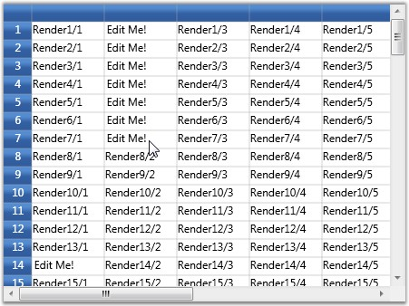

::: {style="DISPLAY: none"}
{#d2h_url_template}{#d2h_package_url style="WIDTH: 0px; DISPLAY: none; HEIGHT: 0px"}
:::

::: {.d2h_secondary_topic style="PADDING-BOTTOM: 10pt; MARGIN: 0pt; PADDING-LEFT: 0pt; PADDING-RIGHT: 0pt; PADDING-TOP: 0pt"}
#### Virtual Cells {#virtual-cells style="tab-stops: 0pt"}

The Grid control supports virtual cell architecture where the cell contents are drawn statically until a live cell is required. For example, when you move the mouse over the grid, the cells under the mouse pointer needs to handle mouse inputs. Dynamically, the static cells are turned into live cells that can handle those mouse interactions, as required. These live cells stay in scope until they are no longer needed (which is usually when they are scrolled off the screen). Using static drawing for cells, and thus minimizing the need for large numbers of live cells, provides an optimal way to display large data sources very quickly.

 

Example

 

The given cell model and the renderer hosts a virtual cell editor inside the grid cell and this cell type is used or activated only when you move your mouse over any grid cell. By default, a grid cell displays a text that is set in OnRender overridden method. When you move the mouse over this cell, it will become a live UIElement editor and not render the cell anymore. This cell is now a virtual cell that will display the cell value stored in the internal cell structure, say, "Edit Me".

 

But, when you scroll the cell outside the view port, it will switch back to a normal renderer cell. When you move the mouse over this cell again, it will display "Edit Me".

 

Placing a UIElement as soon as a cell becomes visible is a time consuming process, while static rendering of a text is faster. The UI element which is required to edit the cell will be placed only on demand (that is when you hover or click a cell for editing). Hence, this approach will greatly improve the scrolling speed.

This mechanism will be enabled only if you set SupportsRenderOptimization property to true in the constructor.

 

+----------------------------------------------------------------------------------------------------------------------------------------------------------------------------------------------------------------------------------------------------+
| [\[C#\]]{style="FONT-FAMILY: 'Courier New'; COLOR: black"}                                                                                                                                                                                         |
|                                                                                                                                                                                                                                                    |
| []{style="FONT-FAMILY: 'Courier New'"}                                                                                                                                                                                                             |
|                                                                                                                                                                                                                                                    |
| [public]{style="FONT-FAMILY: 'Courier New'; COLOR: blue"}[ [class]{style="COLOR: blue"} [VirtualizedCellModel]{style="COLOR: #2b91af"} : GridCellModel\<[VirtualizedCellRenderer]{style="COLOR: #2b91af"}\>]{style="FONT-FAMILY: 'Courier New'"}   |
|                                                                                                                                                                                                                                                    |
| [{]{style="FONT-FAMILY: 'Courier New'"}                                                                                                                                                                                                            |
|                                                                                                                                                                                                                                                    |
| [}]{style="FONT-FAMILY: 'Courier New'"}                                                                                                                                                                                                            |
|                                                                                                                                                                                                                                                    |
| []{style="FONT-FAMILY: 'Courier New'"}                                                                                                                                                                                                             |
|                                                                                                                                                                                                                                                    |
| [public]{style="FONT-FAMILY: 'Courier New'; COLOR: blue"}[ [class]{style="COLOR: blue"} [VirtualizedCellRenderer]{style="COLOR: #2b91af"} : GridVirtualizingCellRenderer\<[TextBox]{style="COLOR: #2b91af"}\>]{style="FONT-FAMILY: 'Courier New'"} |
|                                                                                                                                                                                                                                                    |
| [{]{style="FONT-FAMILY: 'Courier New'"}                                                                                                                                                                                                            |
|                                                                                                                                                                                                                                                    |
| [    [public]{style="COLOR: blue"} VirtualizedCellRenderer()]{style="FONT-FAMILY: 'Courier New'"}                                                                                                                                                  |
|                                                                                                                                                                                                                                                    |
| [    {]{style="FONT-FAMILY: 'Courier New'"}                                                                                                                                                                                                        |
|                                                                                                                                                                                                                                                    |
| [        SupportsRenderOptimization = [true]{style="COLOR: blue"};]{style="FONT-FAMILY: 'Courier New'"}                                                                                                                                            |
|                                                                                                                                                                                                                                                    |
| [        AllowRecycle = [true]{style="COLOR: blue"};]{style="FONT-FAMILY: 'Courier New'"}                                                                                                                                                          |
|                                                                                                                                                                                                                                                    |
| [        IsControlTextShown = [true]{style="COLOR: blue"};]{style="FONT-FAMILY: 'Courier New'"}                                                                                                                                                    |
|                                                                                                                                                                                                                                                    |
| [        IsFocusable = [true]{style="COLOR: blue"};]{style="FONT-FAMILY: 'Courier New'"}                                                                                                                                                           |
|                                                                                                                                                                                                                                                    |
| [    }]{style="FONT-FAMILY: 'Courier New'"}                                                                                                                                                                                                        |
|                                                                                                                                                                                                                                                    |
| []{style="FONT-FAMILY: 'Courier New'"}                                                                                                                                                                                                             |
|                                                                                                                                                                                                                                                    |
| [    [protected]{style="COLOR: blue"} [override]{style="COLOR: blue"} [void]{style="COLOR: blue"} OnRender([DrawingContext]{style="COLOR: #2b91af"} dc, RenderCellArgs rca, GridRenderStyleInfo cellInfo)]{style="FONT-FAMILY: 'Courier New'"}     |
|                                                                                                                                                                                                                                                    |
| [    {]{style="FONT-FAMILY: 'Courier New'"}                                                                                                                                                                                                        |
|                                                                                                                                                                                                                                                    |
| [        [if]{style="COLOR: blue"} (rca.CellUIElements != [null]{style="COLOR: blue"})]{style="FONT-FAMILY: 'Courier New'"}                                                                                                                        |
|                                                                                                                                                                                                                                                    |
| [            [return]{style="COLOR: blue"};]{style="FONT-FAMILY: 'Courier New'"}                                                                                                                                                                   |
|                                                                                                                                                                                                                                                    |
| []{style="FONT-FAMILY: 'Courier New'"}                                                                                                                                                                                                             |
|                                                                                                                                                                                                                                                    |
| [        [// Only if SupportsRenderOptimization is true, otherwise rca.CellVisuals is never null.]{style="COLOR: green"}]{style="FONT-FAMILY: 'Courier New'"}                                                                                      |
|                                                                                                                                                                                                                                                    |
| [        [string]{style="COLOR: blue"} s = [String]{style="COLOR: #2b91af"}.Format([\"Render{0}/{1}\"]{style="COLOR: #a31515"}, rca.RowIndex, rca.ColumnIndex);]{style="FONT-FAMILY: 'Courier New'"}                                               |
|                                                                                                                                                                                                                                                    |
| [        GridTextBoxPaint.DrawText(dc, rca.CellRect, s, cellInfo);]{style="FONT-FAMILY: 'Courier New'"}                                                                                                                                            |
|                                                                                                                                                                                                                                                    |
| [    }]{style="FONT-FAMILY: 'Courier New'"}                                                                                                                                                                                                        |
|                                                                                                                                                                                                                                                    |
| []{style="FONT-FAMILY: 'Courier New'"}                                                                                                                                                                                                             |
|                                                                                                                                                                                                                                                    |
| [    [public]{style="COLOR: blue"} [override]{style="COLOR: blue"} [void]{style="COLOR: blue"} OnInitializeContent([TextBox]{style="COLOR: #2b91af"} textBox, GridRenderStyleInfo style)]{style="FONT-FAMILY: 'Courier New'"}                      |
|                                                                                                                                                                                                                                                    |
| [    {]{style="FONT-FAMILY: 'Courier New'"}                                                                                                                                                                                                        |
|                                                                                                                                                                                                                                                    |
| [        [base]{style="COLOR: blue"}.OnInitializeContent(textBox, style);]{style="FONT-FAMILY: 'Courier New'"}                                                                                                                                     |
|                                                                                                                                                                                                                                                    |
| []{style="FONT-FAMILY: 'Courier New'"}                                                                                                                                                                                                             |
|                                                                                                                                                                                                                                                    |
| [        [Thickness]{style="COLOR: #2b91af"} margins = style.TextMargins.ToThickness();]{style="FONT-FAMILY: 'Courier New'"}                                                                                                                       |
|                                                                                                                                                                                                                                                    |
| []{style="FONT-FAMILY: 'Courier New'"}                                                                                                                                                                                                             |
|                                                                                                                                                                                                                                                    |
| [        [// TextBoxView always has a minimum margin of 2 for left and right.]{style="COLOR: green"}]{style="FONT-FAMILY: 'Courier New'"}                                                                                                          |
|                                                                                                                                                                                                                                                    |
| [        [// Margin is hard coded below so that text box behavior is properly emulated.]{style="COLOR: green"}]{style="FONT-FAMILY: 'Courier New'"}                                                                                                |
|                                                                                                                                                                                                                                                    |
| [        margins.Left = [Math]{style="COLOR: #2b91af"}.Max(0, margins.Left - 2);]{style="FONT-FAMILY: 'Courier New'"}                                                                                                                              |
|                                                                                                                                                                                                                                                    |
| [        margins.Right = [Math]{style="COLOR: #2b91af"}.Max(0, margins.Right - 2);]{style="FONT-FAMILY: 'Courier New'"}                                                                                                                            |
|                                                                                                                                                                                                                                                    |
| []{style="FONT-FAMILY: 'Courier New'"}                                                                                                                                                                                                             |
|                                                                                                                                                                                                                                                    |
| [        textBox.Padding = margins;]{style="FONT-FAMILY: 'Courier New'"}                                                                                                                                                                           |
|                                                                                                                                                                                                                                                    |
| [        textBox.BorderThickness = [new]{style="COLOR: blue"} [Thickness]{style="COLOR: #2b91af"}(0);]{style="FONT-FAMILY: 'Courier New'"}                                                                                                         |
|                                                                                                                                                                                                                                                    |
| [        VirtualizingCellsControl.SetWantsMouseInput(textBox, [true]{style="COLOR: blue"});]{style="FONT-FAMILY: 'Courier New'"}                                                                                                                   |
|                                                                                                                                                                                                                                                    |
| []{style="FONT-FAMILY: 'Courier New'"}                                                                                                                                                                                                             |
|                                                                                                                                                                                                                                                    |
| [        textBox.Text = GetControlText(style);]{style="FONT-FAMILY: 'Courier New'"}                                                                                                                                                                |
|                                                                                                                                                                                                                                                    |
| [    }]{style="FONT-FAMILY: 'Courier New'"}                                                                                                                                                                                                        |
|                                                                                                                                                                                                                                                    |
| []{style="FONT-FAMILY: 'Courier New'"}                                                                                                                                                                                                             |
|                                                                                                                                                                                                                                                    |
| [    [protected]{style="COLOR: blue"} [override]{style="COLOR: blue"} [string]{style="COLOR: blue"} GetControlTextFromEditorCore([TextBox]{style="COLOR: #2b91af"} uiElement)]{style="FONT-FAMILY: 'Courier New'"}                                 |
|                                                                                                                                                                                                                                                    |
| [    {]{style="FONT-FAMILY: 'Courier New'"}                                                                                                                                                                                                        |
|                                                                                                                                                                                                                                                    |
| [        [return]{style="COLOR: blue"} uiElement.Text;]{style="FONT-FAMILY: 'Courier New'"}                                                                                                                                                        |
|                                                                                                                                                                                                                                                    |
| [    }]{style="FONT-FAMILY: 'Courier New'"}                                                                                                                                                                                                        |
|                                                                                                                                                                                                                                                    |
| []{style="FONT-FAMILY: 'Courier New'"}                                                                                                                                                                                                             |
|                                                                                                                                                                                                                                                    |
| [    [protected]{style="COLOR: blue"} [override]{style="COLOR: blue"} [void]{style="COLOR: blue"} OnInitialize()]{style="FONT-FAMILY: 'Courier New'"}                                                                                              |
|                                                                                                                                                                                                                                                    |
| [    {]{style="FONT-FAMILY: 'Courier New'"}                                                                                                                                                                                                        |
|                                                                                                                                                                                                                                                    |
| [        [base]{style="COLOR: blue"}.OnInitialize();]{style="FONT-FAMILY: 'Courier New'"}                                                                                                                                                          |
|                                                                                                                                                                                                                                                    |
| [        ControlText = GetControlText(CurrentStyle);]{style="FONT-FAMILY: 'Courier New'"}                                                                                                                                                          |
|                                                                                                                                                                                                                                                    |
| [    }]{style="FONT-FAMILY: 'Courier New'"}                                                                                                                                                                                                        |
|                                                                                                                                                                                                                                                    |
| []{style="FONT-FAMILY: 'Courier New'"}                                                                                                                                                                                                             |
|                                                                                                                                                                                                                                                    |
| [    [protected]{style="COLOR: blue"} [override]{style="COLOR: blue"} [void]{style="COLOR: blue"} OnWireUIElement([TextBox]{style="COLOR: #2b91af"} textBox)]{style="FONT-FAMILY: 'Courier New'"}                                                  |
|                                                                                                                                                                                                                                                    |
| [    {]{style="FONT-FAMILY: 'Courier New'"}                                                                                                                                                                                                        |
|                                                                                                                                                                                                                                                    |
| [        [base]{style="COLOR: blue"}.OnWireUIElement(textBox);]{style="FONT-FAMILY: 'Courier New'"}                                                                                                                                                |
|                                                                                                                                                                                                                                                    |
| [        textBox.TextChanged += [new]{style="COLOR: blue"} [TextChangedEventHandler]{style="COLOR: #2b91af"}(textBox_TextChanged);]{style="FONT-FAMILY: 'Courier New'"}                                                                            |
|                                                                                                                                                                                                                                                    |
| [    }]{style="FONT-FAMILY: 'Courier New'"}                                                                                                                                                                                                        |
|                                                                                                                                                                                                                                                    |
| []{style="FONT-FAMILY: 'Courier New'"}                                                                                                                                                                                                             |
|                                                                                                                                                                                                                                                    |
| [    [protected]{style="COLOR: blue"} [override]{style="COLOR: blue"} [void]{style="COLOR: blue"} OnUnwireUIElement([TextBox]{style="COLOR: #2b91af"} textBox)]{style="FONT-FAMILY: 'Courier New'"}                                                |
|                                                                                                                                                                                                                                                    |
| [    {]{style="FONT-FAMILY: 'Courier New'"}                                                                                                                                                                                                        |
|                                                                                                                                                                                                                                                    |
| [        [base]{style="COLOR: blue"}.OnUnwireUIElement(textBox);]{style="FONT-FAMILY: 'Courier New'"}                                                                                                                                              |
|                                                                                                                                                                                                                                                    |
| [        textBox.TextChanged -= [new]{style="COLOR: blue"} [TextChangedEventHandler]{style="COLOR: #2b91af"}(textBox_TextChanged);]{style="FONT-FAMILY: 'Courier New'"}                                                                            |
|                                                                                                                                                                                                                                                    |
| [    }]{style="FONT-FAMILY: 'Courier New'"}                                                                                                                                                                                                        |
|                                                                                                                                                                                                                                                    |
| []{style="FONT-FAMILY: 'Courier New'"}                                                                                                                                                                                                             |
|                                                                                                                                                                                                                                                    |
| [    [void]{style="COLOR: blue"} textBox_TextChanged([object]{style="COLOR: blue"} sender, [TextChangedEventArgs]{style="COLOR: #2b91af"} e)]{style="FONT-FAMILY: 'Courier New'"}                                                                  |
|                                                                                                                                                                                                                                                    |
| [    {]{style="FONT-FAMILY: 'Courier New'"}                                                                                                                                                                                                        |
|                                                                                                                                                                                                                                                    |
| [        [TextBox]{style="COLOR: #2b91af"} textBox = ([TextBox]{style="COLOR: #2b91af"})sender;]{style="FONT-FAMILY: 'Courier New'"}                                                                                                               |
|                                                                                                                                                                                                                                                    |
| [        [if]{style="COLOR: blue"} (\![this]{style="COLOR: blue"}.IsInArrange && IsCurrentCell(textBox))]{style="FONT-FAMILY: 'Courier New'"}                                                                                                      |
|                                                                                                                                                                                                                                                    |
| [        {]{style="FONT-FAMILY: 'Courier New'"}                                                                                                                                                                                                    |
|                                                                                                                                                                                                                                                    |
| [            TraceUtil.TraceCurrentMethodInfo(textBox.Text);]{style="FONT-FAMILY: 'Courier New'"}                                                                                                                                                  |
|                                                                                                                                                                                                                                                    |
| [            [if]{style="COLOR: blue"} (!SetControlText(textBox.Text))]{style="FONT-FAMILY: 'Courier New'"}                                                                                                                                        |
|                                                                                                                                                                                                                                                    |
| [                RefreshContent(); [// reverses change.]{style="COLOR: green"}]{style="FONT-FAMILY: 'Courier New'"}                                                                                                                                |
|                                                                                                                                                                                                                                                    |
| [        }]{style="FONT-FAMILY: 'Courier New'"}                                                                                                                                                                                                    |
|                                                                                                                                                                                                                                                    |
| [    }]{style="FONT-FAMILY: 'Courier New'"}                                                                                                                                                                                                        |
|                                                                                                                                                                                                                                                    |
| []{style="FONT-FAMILY: 'Courier New'"}                                                                                                                                                                                                             |
|                                                                                                                                                                                                                                                    |
| [    [protected]{style="COLOR: blue"} [override]{style="COLOR: blue"} [void]{style="COLOR: blue"} OnGridPreviewTextInput([TextCompositionEventArgs]{style="COLOR: #2b91af"} e)]{style="FONT-FAMILY: 'Courier New'"}                                |
|                                                                                                                                                                                                                                                    |
| [    {]{style="FONT-FAMILY: 'Courier New'"}                                                                                                                                                                                                        |
|                                                                                                                                                                                                                                                    |
| [        CurrentCell.ScrollInView();]{style="FONT-FAMILY: 'Courier New'"}                                                                                                                                                                          |
|                                                                                                                                                                                                                                                    |
| [        CurrentCell.BeginEdit([true]{style="COLOR: blue"});]{style="FONT-FAMILY: 'Courier New'"}                                                                                                                                                  |
|                                                                                                                                                                                                                                                    |
| [    }]{style="FONT-FAMILY: 'Courier New'"}                                                                                                                                                                                                        |
|                                                                                                                                                                                                                                                    |
| []{style="FONT-FAMILY: 'Courier New'"}                                                                                                                                                                                                             |
|                                                                                                                                                                                                                                                    |
| [    [protected]{style="COLOR: blue"} [override]{style="COLOR: blue"} [bool]{style="COLOR: blue"} ShouldGridTryToHandlePreviewKeyDown([KeyEventArgs]{style="COLOR: #2b91af"} e)]{style="FONT-FAMILY: 'Courier New'"}                               |
|                                                                                                                                                                                                                                                    |
| [    {]{style="FONT-FAMILY: 'Courier New'"}                                                                                                                                                                                                        |
|                                                                                                                                                                                                                                                    |
| [        [if]{style="COLOR: blue"} (CurrentCellUIElement.IsFocused && e.Key != [Key]{style="COLOR: #2b91af"}.Escape)]{style="FONT-FAMILY: 'Courier New'"}                                                                                          |
|                                                                                                                                                                                                                                                    |
| [            [return]{style="COLOR: blue"} [false]{style="COLOR: blue"};]{style="FONT-FAMILY: 'Courier New'"}                                                                                                                                      |
|                                                                                                                                                                                                                                                    |
| []{style="FONT-FAMILY: 'Courier New'"}                                                                                                                                                                                                             |
|                                                                                                                                                                                                                                                    |
| [        [return]{style="COLOR: blue"} [true]{style="COLOR: blue"};]{style="FONT-FAMILY: 'Courier New'"}                                                                                                                                           |
|                                                                                                                                                                                                                                                    |
| [    }]{style="FONT-FAMILY: 'Courier New'"}                                                                                                                                                                                                        |
|                                                                                                                                                                                                                                                    |
| []{style="FONT-FAMILY: 'Courier New'"}                                                                                                                                                                                                             |
|                                                                                                                                                                                                                                                    |
| [}]{style="FONT-FAMILY: 'Courier New'"}                                                                                                                                                                                                            |
+----------------------------------------------------------------------------------------------------------------------------------------------------------------------------------------------------------------------------------------------------+

 

Here is the code to bind the above virtual cell to the grid:

 

+----------------------------------------------------------------------------------------------------------------------------------------------------------------------------------------------+
| [\[C#\]]{style="FONT-FAMILY: 'Courier New'; COLOR: black"}                                                                                                                                   |
|                                                                                                                                                                                              |
| []{style="FONT-FAMILY: 'Courier New'"}                                                                                                                                                       |
|                                                                                                                                                                                              |
| [grid.Model.CellModels.Add([\"VirtualizedCell\"]{style="COLOR: #a31515"}, [new]{style="COLOR: blue"} [VirtualizedCellModel]{style="COLOR: #2b91af"}());]{style="FONT-FAMILY: 'Courier New'"} |
|                                                                                                                                                                                              |
| [grid.Model.TableStyle.CellType = [\"VirtualizedCell\"]{style="COLOR: #a31515"};]{style="FONT-FAMILY: 'Courier New'"}                                                                        |
|                                                                                                                                                                                              |
| [grid.Model.TableStyle.CellValue = [\"Edit Me!\"]{style="COLOR: #a31515"};]{style="FONT-FAMILY: 'Courier New'"}                                                                              |
+----------------------------------------------------------------------------------------------------------------------------------------------------------------------------------------------+

[]{style="COLOR: #15428b"} 

{border="0"}

Figure 87: Virtual cells

 

 

[]{#related-topics}
:::
