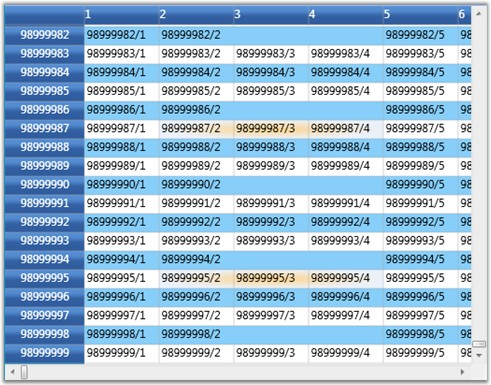

::: {style="DISPLAY: none"}
{#d2h_url_template}{#d2h_package_url style="WIDTH: 0px; DISPLAY: none; HEIGHT: 0px"}
:::

::: {.d2h_secondary_topic style="PADDING-BOTTOM: 10pt; MARGIN: 0pt; PADDING-LEFT: 0pt; PADDING-RIGHT: 0pt; PADDING-TOP: 0pt"}
#### Virtual Mode {#virtual-mode style="tab-stops: 0pt"}

Essential Grid for WPF supports virtual mode, which lets you dynamically provide data to the grid by handling an event, QueryCellInfo. This means that the grid does not store any data in its internal data structures. A virtual grid can display millions of rows as easily as it displays a dozen. The grid also exposes a second event, CommitCellInfo that lets you save the changes made in the UI, to the external data source.

 

Example

 

In this example, the Grid Control displays 99,000,000 x 1,000,000 cells (i.e., 99 million rows and 1 million columns). It is also possible to resize millions of rows instantly without any performance hits. The data is loaded only on demand through the QueryCellInfo event and the changes are saved back to the data source by the CommitCellInfo event.

 

+---------------------------------------------------------------------------------------------------------------------------------------------------------------------------------------------------------------------------------------------------------------------------------------------------------------------------------------------------+
| [\[C#\]]{style="FONT-FAMILY: 'Courier New'; COLOR: black"}                                                                                                                                                                                                                                                                                        |
|                                                                                                                                                                                                                                                                                                                                                   |
| []{style="FONT-FAMILY: 'Courier New'"}                                                                                                                                                                                                                                                                                                            |
|                                                                                                                                                                                                                                                                                                                                                   |
| [// a really large row and column count.]{style="FONT-FAMILY: 'Courier New'; COLOR: green"}                                                                                                                                                                                                                                                       |
|                                                                                                                                                                                                                                                                                                                                                   |
| [grid.Model.RowCount = 99000000; [// 99 million]{style="COLOR: green"}]{style="FONT-FAMILY: 'Courier New'"}                                                                                                                                                                                                                                       |
|                                                                                                                                                                                                                                                                                                                                                   |
| [grid.Model.ColumnCount = 1000000; [// 1 million]{style="COLOR: green"}]{style="FONT-FAMILY: 'Courier New'"}                                                                                                                                                                                                                                      |
|                                                                                                                                                                                                                                                                                                                                                   |
| []{style="FONT-FAMILY: 'Courier New'; COLOR: green"}                                                                                                                                                                                                                                                                                              |
|                                                                                                                                                                                                                                                                                                                                                   |
| [//Resize millions of rows instantly - pixel scrolling is updated accordingly.]{style="FONT-FAMILY: 'Courier New'; COLOR: green"}                                                                                                                                                                                                                 |
|                                                                                                                                                                                                                                                                                                                                                   |
| [grid.Model.RowHeights.SetRange(10, 1999999, 28);]{style="FONT-FAMILY: 'Courier New'"}                                                                                                                                                                                                                                                            |
|                                                                                                                                                                                                                                                                                                                                                   |
| [            grid.Model.RowHeights.SetRange(21111111, 21999999, 36);]{style="FONT-FAMILY: 'Courier New'"}                                                                                                                                                                                                                                         |
|                                                                                                                                                                                                                                                                                                                                                   |
| []{style="FONT-FAMILY: 'Courier New'"}                                                                                                                                                                                                                                                                                                            |
|                                                                                                                                                                                                                                                                                                                                                   |
| [// fill cell contents on demand.]{style="FONT-FAMILY: 'Courier New'; COLOR: green"}                                                                                                                                                                                                                                                              |
|                                                                                                                                                                                                                                                                                                                                                   |
| [grid.Model.QueryCellInfo += [new]{style="COLOR: blue"} [GridQueryCellInfoEventHandler]{style="COLOR: #2b91af"}(Model_QueryCellInfo);]{style="FONT-FAMILY: 'Courier New'"}                                                                                                                                                                        |
|                                                                                                                                                                                                                                                                                                                                                   |
| []{style="FONT-FAMILY: 'Courier New'; COLOR: green"}                                                                                                                                                                                                                                                                                              |
|                                                                                                                                                                                                                                                                                                                                                   |
| [// save back cell value into dictionary]{style="FONT-FAMILY: 'Courier New'; COLOR: green"}                                                                                                                                                                                                                                                       |
|                                                                                                                                                                                                                                                                                                                                                   |
| [grid.Model.CommitCellInfo += [new]{style="COLOR: blue"} [GridCommitCellInfoEventHandler]{style="COLOR: #2b91af"}(Model_CommitCellInfo);]{style="FONT-FAMILY: 'Courier New'"}                                                                                                                                                                     |
|                                                                                                                                                                                                                                                                                                                                                   |
| [Dictionary]{style="FONT-FAMILY: 'Courier New'; COLOR: #2b91af"}[\<[RowColumnIndex]{style="COLOR: #2b91af"}, [object]{style="COLOR: blue"}\> committedValues = [new]{style="COLOR: blue"} [Dictionary]{style="COLOR: #2b91af"}\<[RowColumnIndex]{style="COLOR: #2b91af"}, [object]{style="COLOR: blue"}\>();]{style="FONT-FAMILY: 'Courier New'"} |
|                                                                                                                                                                                                                                                                                                                                                   |
| []{style="FONT-FAMILY: 'Courier New'"}                                                                                                                                                                                                                                                                                                            |
|                                                                                                                                                                                                                                                                                                                                                   |
| [void]{style="FONT-FAMILY: 'Courier New'; COLOR: blue"}[ Model_CommitCellInfo([object]{style="COLOR: blue"} sender, [GridCommitCellInfoEventArgs]{style="COLOR: #2b91af"} e)]{style="FONT-FAMILY: 'Courier New'"}                                                                                                                                 |
|                                                                                                                                                                                                                                                                                                                                                   |
| [{]{style="FONT-FAMILY: 'Courier New'"}                                                                                                                                                                                                                                                                                                           |
|                                                                                                                                                                                                                                                                                                                                                   |
| [            [if]{style="COLOR: blue"} (e.Style.HasCellValue)]{style="FONT-FAMILY: 'Courier New'"}                                                                                                                                                                                                                                                |
|                                                                                                                                                                                                                                                                                                                                                   |
| [            {]{style="FONT-FAMILY: 'Courier New'"}                                                                                                                                                                                                                                                                                               |
|                                                                                                                                                                                                                                                                                                                                                   |
| [                committedValues\[e.Cell\] = e.Style.CellValue;]{style="FONT-FAMILY: 'Courier New'"}                                                                                                                                                                                                                                              |
|                                                                                                                                                                                                                                                                                                                                                   |
| [                e.Handled = [true]{style="COLOR: blue"};]{style="FONT-FAMILY: 'Courier New'"}                                                                                                                                                                                                                                                    |
|                                                                                                                                                                                                                                                                                                                                                   |
| [            }]{style="FONT-FAMILY: 'Courier New'"}                                                                                                                                                                                                                                                                                               |
|                                                                                                                                                                                                                                                                                                                                                   |
| [}]{style="FONT-FAMILY: 'Courier New'"}                                                                                                                                                                                                                                                                                                           |
|                                                                                                                                                                                                                                                                                                                                                   |
| []{style="FONT-FAMILY: 'Courier New'"}                                                                                                                                                                                                                                                                                                            |
|                                                                                                                                                                                                                                                                                                                                                   |
| [void]{style="FONT-FAMILY: 'Courier New'; COLOR: blue"}[ Model_QueryCellInfo([object]{style="COLOR: blue"} sender, [GridQueryCellInfoEventArgs]{style="COLOR: #2b91af"} e)]{style="FONT-FAMILY: 'Courier New'"}                                                                                                                                   |
|                                                                                                                                                                                                                                                                                                                                                   |
| [{]{style="FONT-FAMILY: 'Courier New'"}                                                                                                                                                                                                                                                                                                           |
|                                                                                                                                                                                                                                                                                                                                                   |
| [            [if]{style="COLOR: blue"} (e.Cell.RowIndex == 0)]{style="FONT-FAMILY: 'Courier New'"}                                                                                                                                                                                                                                                |
|                                                                                                                                                                                                                                                                                                                                                   |
| [            {]{style="FONT-FAMILY: 'Courier New'"}                                                                                                                                                                                                                                                                                               |
|                                                                                                                                                                                                                                                                                                                                                   |
| [                [if]{style="COLOR: blue"} (e.Cell.ColumnIndex \> 0)]{style="FONT-FAMILY: 'Courier New'"}                                                                                                                                                                                                                                         |
|                                                                                                                                                                                                                                                                                                                                                   |
| [                    e.Style.CellValue = e.Cell.ColumnIndex;]{style="FONT-FAMILY: 'Courier New'"}                                                                                                                                                                                                                                                 |
|                                                                                                                                                                                                                                                                                                                                                   |
| [            }]{style="FONT-FAMILY: 'Courier New'"}                                                                                                                                                                                                                                                                                               |
|                                                                                                                                                                                                                                                                                                                                                   |
| [            [else]{style="COLOR: blue"} [if]{style="COLOR: blue"} (e.Cell.RowIndex \> 0)]{style="FONT-FAMILY: 'Courier New'"}                                                                                                                                                                                                                    |
|                                                                                                                                                                                                                                                                                                                                                   |
| [            {]{style="FONT-FAMILY: 'Courier New'"}                                                                                                                                                                                                                                                                                               |
|                                                                                                                                                                                                                                                                                                                                                   |
| [                [if]{style="COLOR: blue"} (e.Cell.ColumnIndex == 0)]{style="FONT-FAMILY: 'Courier New'"}                                                                                                                                                                                                                                         |
|                                                                                                                                                                                                                                                                                                                                                   |
| [                    e.Style.CellValue = e.Cell.RowIndex;]{style="FONT-FAMILY: 'Courier New'"}                                                                                                                                                                                                                                                    |
|                                                                                                                                                                                                                                                                                                                                                   |
| [                [else]{style="COLOR: blue"} [if]{style="COLOR: blue"} (e.Cell.ColumnIndex \> 0)]{style="FONT-FAMILY: 'Courier New'"}                                                                                                                                                                                                             |
|                                                                                                                                                                                                                                                                                                                                                   |
| [                {]{style="FONT-FAMILY: 'Courier New'"}                                                                                                                                                                                                                                                                                           |
|                                                                                                                                                                                                                                                                                                                                                   |
| [                    [if]{style="COLOR: blue"} (committedValues.ContainsKey(e.Cell))]{style="FONT-FAMILY: 'Courier New'"}                                                                                                                                                                                                                         |
|                                                                                                                                                                                                                                                                                                                                                   |
| [                        e.Style.CellValue = committedValues\[e.Cell\];]{style="FONT-FAMILY: 'Courier New'"}                                                                                                                                                                                                                                      |
|                                                                                                                                                                                                                                                                                                                                                   |
| [                    [else]{style="COLOR: blue"}]{style="FONT-FAMILY: 'Courier New'"}                                                                                                                                                                                                                                                             |
|                                                                                                                                                                                                                                                                                                                                                   |
| [                        e.Style.CellValue = [String]{style="COLOR: #2b91af"}.Format([\"{0}/{1}\"]{style="COLOR: #a31515"}, e.Cell.RowIndex, e.Cell.ColumnIndex);]{style="FONT-FAMILY: 'Courier New'"}                                                                                                                                            |
|                                                                                                                                                                                                                                                                                                                                                   |
| [                }]{style="FONT-FAMILY: 'Courier New'"}                                                                                                                                                                                                                                                                                           |
|                                                                                                                                                                                                                                                                                                                                                   |
| [            }]{style="FONT-FAMILY: 'Courier New'"}                                                                                                                                                                                                                                                                                               |
|                                                                                                                                                                                                                                                                                                                                                   |
| [}]{style="FONT-FAMILY: 'Courier New'"}                                                                                                                                                                                                                                                                                                           |
+---------------------------------------------------------------------------------------------------------------------------------------------------------------------------------------------------------------------------------------------------------------------------------------------------------------------------------------------------+

 

Output

 

{border="0"}

Figure 86: Grid in Virtual Mode

[]{#related-topics}
:::
