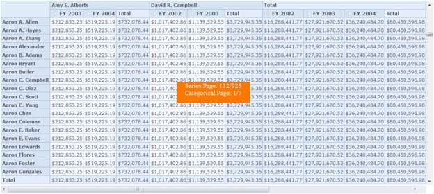

::: {style="DISPLAY: none"}
{#d2h_url_template}{#d2h_package_url style="WIDTH: 0px; DISPLAY: none; HEIGHT: 0px"}
:::

::::: {#nsbanner .d2h_main_nsbanner style="BORDER-BOTTOM: #999999 1px solid; POSITION: relative; PADDING-BOTTOM: 0px; BACKGROUND-COLOR: transparent; PADDING-LEFT: 0px; PADDING-RIGHT: 0px; DISPLAY: none; BORDER-TOP: #999999 1px solid; PADDING-TOP: 0px; LEFT: 0px"}
:::: {#TitleRow .d2h_main_titlerow style="PADDING-BOTTOM: 4px; BACKGROUND-COLOR: transparent; PADDING-LEFT: 22px; WIDTH: 100%; PADDING-RIGHT: 10px; DISPLAY: none; PADDING-TOP: 4px"}
::: {#ienav .d2h_main_ienav style="DISPLAY: none"}
{#D2HPrevious .D2HPreviousEnabled}  {#D2HNext .D2HNextEnabled}
:::
::::
:::::

:::: {#nstext .d2h_main_nstext style="PADDING-BOTTOM: 10px; BACKGROUND-COLOR: transparent; PADDING-LEFT: 22px; PADDING-RIGHT: 10px; HEIGHT: 100%; OVERFLOW: auto; PADDING-TOP: 5px" hasuserbackground="true" valign="bottom"}
## Virtual Scrolling {#virtual-scrolling style="TEXT-ALIGN: justify; LINE-HEIGHT: 115%; tab-stops: 0pt"}

Virtual Scrolling is a technique that allows the user to scroll vertically and horizontally to view the records in pages dynamically and efficiently.

Use Case Scenarios

This feature can be used in the following cases:

[·    ]{style="FONT-FAMILY: Symbol; FONT-SIZE: 11pt"}Loading large set of records at a minimal span of time.

[·    ]{style="FONT-FAMILY: Symbol; FONT-SIZE: 11pt"}Viewing a set of record dynamically with ease on scrolling.

Properties            

                                               *[Table ]{style="LINE-HEIGHT: 115%; FONT-SIZE: 9pt"}[22]{style="LINE-HEIGHT: 115%; FONT-SIZE: 9pt"}[: Properties Table]{style="LINE-HEIGHT: 115%; FONT-SIZE: 9pt"}*

::: {align="center"}
+--------------------------------+------------------------------------------------------------------------------------------------+-------------+-------------+-----------------+
| Property                       | Description                                                                                    | Type        | Data Type   | Reference links |
+--------------------------------+------------------------------------------------------------------------------------------------+-------------+-------------+-----------------+
| EnableVirtualScrolling         | Allows the user to enable or disable the virtual scrolling option.                             | Server Side | Boolean     | NA              |
+--------------------------------+------------------------------------------------------------------------------------------------+-------------+-------------+-----------------+
| EnablePaging                   | Specifies a value indicating whether the paging is enabled in the report.                      | Server side | Boolean     | NA              |
|                                |                                                                                                |             |             |                 |
|                                |                                                                                                |             |             |                 |
+--------------------------------+------------------------------------------------------------------------------------------------+-------------+-------------+-----------------+
| PagerOption.CategorialPageSize | Specifies the number of categorical columns to be displayed within a page of the OLAP control. | Server side | Integer     | NA              |
+--------------------------------+------------------------------------------------------------------------------------------------+-------------+-------------+-----------------+
| PagerOption.SeriesPageSize     | Specifies the number of series rows to be displayed within a page of the OLAP control.         | Server side | Integer     | NA              |
+--------------------------------+------------------------------------------------------------------------------------------------+-------------+-------------+-----------------+
:::

 

Sample Link

A sample is available at the following location:

* ..\\Syncfusion\\EssentialStudio\\\<Version Number\>\\BI\\Web\\OlapGrid.Web\\Samples\\3.5\\Scrolling\\Virtual Scrolling Demo*

 

Adding "Virtual Scrolling" to an Application

The virtual scrolling can be added to an application by using the below code snippet:

+--------------------------------------------------------------------------------------------------------------------------------------------------------------------------------------------------------------------------------------------------------------------------------------------------------------------------------------------------------------------------------------------------------------------------------------------------------------------------------------------------------------------------------------------------------------------------------------------------------------------------------------+
| **[\[ASPX\]]{style="FONT-FAMILY: 'Courier New'"}**                                                                                                                                                                                                                                                                                                                                                                                                                                                                                                                                                                                   |
|                                                                                                                                                                                                                                                                                                                                                                                                                                                                                                                                                                                                                                      |
| [\<]{style="FONT-FAMILY: 'Courier New'; COLOR: blue"}[syncfusion]{style="FONT-FAMILY: 'Courier New'; COLOR: maroon"}[:]{style="FONT-FAMILY: 'Courier New'; COLOR: blue"}[OlapGrid]{style="FONT-FAMILY: 'Courier New'; COLOR: maroon"}[ [ID]{style="COLOR: red"}[=\"OlapGrid1\"]{style="COLOR: blue"} [runat]{style="COLOR: red"}[=\"server\"]{style="COLOR: blue"} [EnableVirtualScrolling]{style="COLOR: red"}[=\"true\"]{style="COLOR: blue"} [Autoformat]{style="COLOR: red"}[=\"Office2010Blue\"]{style="COLOR: blue"} [/\>]{style="COLOR: blue"}]{style="FONT-FAMILY: 'Courier New'"}**[]{style="FONT-FAMILY: 'Courier New'"}** |
+--------------------------------------------------------------------------------------------------------------------------------------------------------------------------------------------------------------------------------------------------------------------------------------------------------------------------------------------------------------------------------------------------------------------------------------------------------------------------------------------------------------------------------------------------------------------------------------------------------------------------------------+

 

+----------------------------------------------------------------------------------------------------------------------------------------------------------------------------------------+
| **[\[C#\]]{style="FONT-FAMILY: 'Courier New'"}**[]{style="FONT-FAMILY: 'Courier New'; COLOR: blue"}                                                                                    |
|                                                                                                                                                                                        |
| [this]{style="FONT-FAMILY: 'Courier New'; COLOR: blue"}[.OlapGrid1.EnableVirtualScrolling = [true]{style="COLOR: blue"};]{style="FONT-FAMILY: 'Courier New'"}                          |
|                                                                                                                                                                                        |
| [OlapReport]{style="FONT-FAMILY: 'Courier New'; COLOR: #2b91af"}[ olapReport = [new]{style="COLOR: blue"} [OlapReport]{style="COLOR: #2b91af"}();]{style="FONT-FAMILY: 'Courier New'"} |
|                                                                                                                                                                                        |
| [olapReport.CurrentCubeName = [\"Adventure Works\"]{style="COLOR: #a31515"};]{style="FONT-FAMILY: 'Courier New'"}                                                                      |
|                                                                                                                                                                                        |
| [olapReport.EnablePaging = [true]{style="COLOR: blue"};]{style="FONT-FAMILY: 'Courier New'"}                                                                                           |
|                                                                                                                                                                                        |
| [olapReport.PagerOptions.SeriesPageSize = 14;    ]{style="FONT-FAMILY: 'Courier New'"}                                                                                                 |
|                                                                                                                                                                                        |
| [olapReport.PagerOptions.CategorialPageSize = 10;]{style="FONT-FAMILY: 'Courier New'"}                                                                                                 |
+----------------------------------------------------------------------------------------------------------------------------------------------------------------------------------------+

 

+--------------------------------------------------------------------------------------------------------------------------------------------------------------------------------------------------------------------------------------------+
| **[\[VB\]]{style="FONT-FAMILY: 'Courier New'"}**                                                                                                                                                                                           |
|                                                                                                                                                                                                                                            |
| [Me]{style="FONT-FAMILY: 'Courier New'; COLOR: blue"}[.OlapGrid1.EnableVirtualScrolling = [True]{style="COLOR: blue"}]{style="FONT-FAMILY: 'Courier New'"}                                                                                 |
|                                                                                                                                                                                                                                            |
| [Dim]{style="FONT-FAMILY: 'Courier New'; COLOR: blue"}[ olapReport [As]{style="COLOR: blue"} [OlapReport]{style="COLOR: #2b91af"} = [New]{style="COLOR: blue"} [OlapReport]{style="COLOR: #2b91af"}()]{style="FONT-FAMILY: 'Courier New'"} |
|                                                                                                                                                                                                                                            |
| [olapReport.CurrentCubeName = [\"Adventure Works\"]{style="COLOR: #a31515"}]{style="FONT-FAMILY: 'Courier New'"}                                                                                                                           |
|                                                                                                                                                                                                                                            |
| [olapReport.EnablePaging = [True]{style="COLOR: blue"}]{style="FONT-FAMILY: 'Courier New'"}                                                                                                                                                |
|                                                                                                                                                                                                                                            |
| [olapReport.PagerOptions.SeriesPageSize = 14]{style="FONT-FAMILY: 'Courier New'"}                                                                                                                                                          |
|                                                                                                                                                                                                                                            |
| [olapReport.PagerOptions.CategorialPageSize = 10]{style="FONT-FAMILY: 'Courier New'"}                                                                                                                                                      |
+--------------------------------------------------------------------------------------------------------------------------------------------------------------------------------------------------------------------------------------------+

 

{border="0"}

Figure 38:Virtual Scrolling

 

[]{#related-topics}
::::
