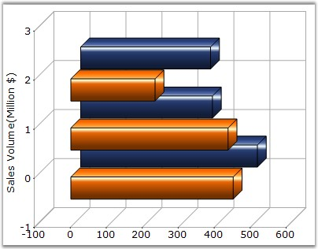

::: {style="DISPLAY: none"}
{#d2h_url_template}{#d2h_package_url style="WIDTH: 0px; DISPLAY: none; HEIGHT: 0px"}
:::

:::: {.d2h_secondary_topic style="PADDING-BOTTOM: 10pt; MARGIN: 0pt; PADDING-LEFT: 0pt; PADDING-RIGHT: 0pt; PADDING-TOP: 0pt"}
#### Visible {#visible style="tab-stops: 0pt"}

 

It turns on / off the visibility of the series.

 

::: {align="center"}
+-------------------------------------+---------------------------------------------------------------------------------+
| **Details**                                                                                                           |
+-------------------------------------+---------------------------------------------------------------------------------+
| **Possible Values**                 | [·      ]{style="FONT-FAMILY: Symbol"}**True** - Unhides the associated series. |
|                                     |                                                                                 |
|                                     | [·      ]{style="FONT-FAMILY: Symbol"}**False** - Hides the associated series.  |
+-------------------------------------+---------------------------------------------------------------------------------+
| **Default Value    **               | **True**                                                                        |
+-------------------------------------+---------------------------------------------------------------------------------+
| **2D / 3D Limitations**             | No                                                                              |
+-------------------------------------+---------------------------------------------------------------------------------+
| **Applies to Chart Element**        | All series                                                                      |
+-------------------------------------+---------------------------------------------------------------------------------+
| **Applies to Chart Types**          | All chart types                                                                 |
+-------------------------------------+---------------------------------------------------------------------------------+
:::

 

Here is sample code snippet using **Visible** property in Bar Chart.

 

+---------------------------------------------------------------------------------------------------------------------------------------------------------------------------------------------------------------------------------------------------------------+
| **[\[C#\]]{style="FONT-FAMILY: 'Courier New'; COLOR: black"}**                                                                                                                                                                                                |
|                                                                                                                                                                                                                                                               |
| **[]{style="FONT-FAMILY: 'Courier New'; COLOR: black"}**                                                                                                                                                                                                      |
|                                                                                                                                                                                                                                                               |
| [// Hides Series\[0\] and shows Series\[1\]]{style="FONT-FAMILY: 'Courier New'; COLOR: green"}                                                                                                                                                                |
|                                                                                                                                                                                                                                                               |
| [this]{style="FONT-FAMILY: 'Courier New'; COLOR: blue"}[.chartControl1.Series\[0\].Visible = ]{style="FONT-FAMILY: 'Courier New'; COLOR: black"}[false]{style="FONT-FAMILY: 'Courier New'; COLOR: blue"}[;]{style="FONT-FAMILY: 'Courier New'; COLOR: black"} |
|                                                                                                                                                                                                                                                               |
| [this]{style="FONT-FAMILY: 'Courier New'; COLOR: blue"}[.chartControl1.Series\[1\].Visible = ]{style="FONT-FAMILY: 'Courier New'; COLOR: black"}[true]{style="FONT-FAMILY: 'Courier New'; COLOR: blue"}[;]{style="FONT-FAMILY: 'Courier New'; COLOR: black"}  |
+---------------------------------------------------------------------------------------------------------------------------------------------------------------------------------------------------------------------------------------------------------------+

 

+--------------------------------------------------------------------------------------------------------------------------------------------------------------------------------------------------------------+
| **[\[VB.NET\]]{style="FONT-FAMILY: 'Courier New'; COLOR: black"}**                                                                                                                                           |
|                                                                                                                                                                                                              |
| **[]{style="FONT-FAMILY: 'Courier New'; COLOR: black"}**                                                                                                                                                     |
|                                                                                                                                                                                                              |
| [\' Hides Series\[0\] and shows Series\[1\]]{style="FONT-FAMILY: 'Courier New'; COLOR: green"}                                                                                                               |
|                                                                                                                                                                                                              |
| [Private Me]{style="FONT-FAMILY: 'Courier New'; COLOR: blue"}[.chartControl1.Series(0).Visible = ]{style="FONT-FAMILY: 'Courier New'; COLOR: black"}[False]{style="FONT-FAMILY: 'Courier New'; COLOR: blue"} |
|                                                                                                                                                                                                              |
| [Private Me]{style="FONT-FAMILY: 'Courier New'; COLOR: blue"}[.chartControl1.Series(1).Visible = ]{style="FONT-FAMILY: 'Courier New'; COLOR: black"}[True]{style="FONT-FAMILY: 'Courier New'; COLOR: blue"}  |
+--------------------------------------------------------------------------------------------------------------------------------------------------------------------------------------------------------------+

**[]{style="FONT-FAMILY: 'Courier New'; COLOR: black"}** 

{border="0"}

 

Figure 227: Second Series Visible

 

{border="0"}

 

Figure 228: Second Series Hidden

 

See Also

[]{style="FONT-FAMILY: 'Segoe UI','sans-serif'; COLOR: black"} 

[[]{style="COLOR: blue"}]{.UGHyperlink}

[[Chart Types]{style="COLOR: blue"}]{.UGHyperlink}

 

[]{#p165} 

 

[]{#related-topics}
::::
