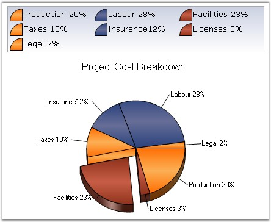

::: {style="DISPLAY: none"}
{#d2h_url_template}{#d2h_package_url style="WIDTH: 0px; DISPLAY: none; HEIGHT: 0px"}
:::

:::: {.d2h_secondary_topic style="PADDING-BOTTOM: 10pt; MARGIN: 0pt; PADDING-LEFT: 0pt; PADDING-RIGHT: 0pt; PADDING-TOP: 0pt"}
#### VisibleAllPies {#visibleallpies style="tab-stops: 0pt"}

**[]{style="FONT-FAMILY: 'Trebuchet MS','sans-serif'; FONT-SIZE: 9pt"}** 

Specifies whether the legend is to be displayed with one legend item for each slice in the pie.

[]{style="FONT-FAMILY: 'Trebuchet MS','sans-serif'; FONT-SIZE: 9pt"} 

::: {align="center"}
+-------------------------------------+--------------------------------------------------------------+
| Details                                                                                            |
+-------------------------------------+--------------------------------------------------------------+
|                                     |                                                              |
|                                     |                                                              |
|                                     |                                                              |
|                                     |                                                              |
| Possible Values                     | True - Indicates only one legend item for all slices of pie. |
|                                     |                                                              |
|                                     | False - Indicates one legend item for each slice of pie.     |
+-------------------------------------+--------------------------------------------------------------+
|                                     |                                                              |
|                                     |                                                              |
| Default Value                       | False                                                        |
+-------------------------------------+--------------------------------------------------------------+
|                                     |                                                              |
|                                     |                                                              |
| 2D / 3D Limitations                 | No                                                           |
+-------------------------------------+--------------------------------------------------------------+
|                                     |                                                              |
|                                     |                                                              |
| Applies to Chart Element            | Any Series                                                   |
+-------------------------------------+--------------------------------------------------------------+
|                                     |                                                              |
|                                     |                                                              |
| Applies to Chart Types              | Pie Chart                                                    |
+-------------------------------------+--------------------------------------------------------------+
:::

**[]{style="FONT-FAMILY: 'Trebuchet MS','sans-serif'; FONT-SIZE: 9pt"}** 

Here is the sample code snippet using VisibleAllPies in PieChart.

[]{style="FONT-FAMILY: 'Trebuchet MS','sans-serif'; FONT-SIZE: 9pt"} 

+-------------------------------------------------------------------------------------------------------------------------------------------------------------------------+
| **[\[C#\]]{style="FONT-FAMILY: 'Courier New'; COLOR: black"}**                                                                                                          |
|                                                                                                                                                                         |
| **[]{style="FONT-FAMILY: 'Courier New'; COLOR: black"}**                                                                                                                |
|                                                                                                                                                                         |
| [this]{style="FONT-FAMILY: 'Courier New'; COLOR: blue"}[.ChartWebControl1.ChartArea.VisibleAllPies = [false]{style="COLOR: blue"};]{style="FONT-FAMILY: 'Courier New'"} |
|                                                                                                                                                                         |
| [ChartWebControl1.Legend.RowsCount = 3;]{style="FONT-FAMILY: 'Courier New'"}                                                                                            |
+-------------------------------------------------------------------------------------------------------------------------------------------------------------------------+

**[]{style="FONT-FAMILY: 'Trebuchet MS','sans-serif'; FONT-SIZE: 9pt"}** 

+----------------------------------------------------------------------------------------------------------------------------------------------------------------------+
| **[\[VB.NET\]]{style="FONT-FAMILY: 'Courier New'; COLOR: black"}**                                                                                                   |
|                                                                                                                                                                      |
| **[]{style="FONT-FAMILY: 'Courier New'; COLOR: black"}**                                                                                                             |
|                                                                                                                                                                      |
| [Me]{style="FONT-FAMILY: 'Courier New'; COLOR: blue"}[.ChartWebControl1.ChartArea.VisibleAllPies = [False]{style="COLOR: blue"}]{style="FONT-FAMILY: 'Courier New'"} |
|                                                                                                                                                                      |
| [ChartWebControl1.Legend.RowsCount = 3]{style="FONT-FAMILY: 'Courier New'"}                                                                                          |
+----------------------------------------------------------------------------------------------------------------------------------------------------------------------+

**[]{style="FONT-FAMILY: 'Trebuchet MS','sans-serif'; FONT-SIZE: 9pt"}** 

{border="0"}

**[]{style="FONT-FAMILY: 'Trebuchet MS','sans-serif'; FONT-SIZE: 9pt"}** 

Figure 220: VisibleAllPies set to True

**[]{style="FONT-FAMILY: 'Trebuchet MS','sans-serif'; FONT-SIZE: 9pt"}** 

{border="0"}

**[]{style="FONT-FAMILY: 'Trebuchet MS','sans-serif'; FONT-SIZE: 9pt"}** 

Figure 221: VisibleAllPies set to False

**[]{style="FONT-FAMILY: 'Trebuchet MS','sans-serif'; FONT-SIZE: 9pt"}** 

See Also

**[]{style="FONT-FAMILY: 'Trebuchet MS','sans-serif'; FONT-SIZE: 9pt"}** 

[Pie Chart]{.UGHyperlink}[]{.UGHyperlink}

[]{#p167} 

[]{#related-topics}
::::
