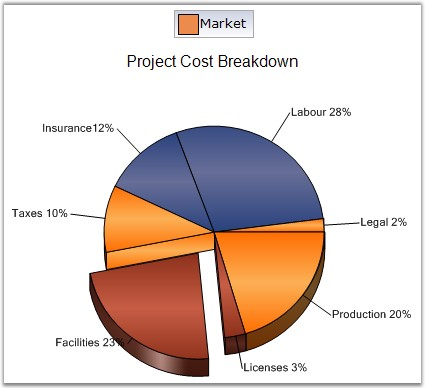

::: {style="DISPLAY: none"}
{#d2h_url_template}{#d2h_package_url style="WIDTH: 0px; DISPLAY: none; HEIGHT: 0px"}
:::

:::: {.d2h_secondary_topic style="PADDING-BOTTOM: 10pt; MARGIN: 0pt; PADDING-LEFT: 0pt; PADDING-RIGHT: 0pt; PADDING-TOP: 0pt"}
#### VisibleAllPies {#visibleallpies style="tab-stops: 0pt"}

 

Specifies whether the legend is to be displayed with one legend item for each slice in the pie.

 

::: {align="center"}
+-------------------------------------+--------------------------------------------------------------------------------------------------------+
|                                                                                                                                              |
|                                                                                                                                              |
| **Details**                                                                                                                                  |
+-------------------------------------+--------------------------------------------------------------------------------------------------------+
| **Possible Values**                 | [·      ]{style="FONT-FAMILY: Symbol"}**True** - Indicates only one legend item for all slices of pie. |
|                                     |                                                                                                        |
|                                     | [·      ]{style="FONT-FAMILY: Symbol"}**False** - Indicates one legend item for each slice of pie.     |
+-------------------------------------+--------------------------------------------------------------------------------------------------------+
| **Default Value    **               | **False**                                                                                              |
+-------------------------------------+--------------------------------------------------------------------------------------------------------+
| **2D / 3D Limitations**             | No                                                                                                     |
+-------------------------------------+--------------------------------------------------------------------------------------------------------+
| **Applies to Chart Element**        | Any Series                                                                                             |
+-------------------------------------+--------------------------------------------------------------------------------------------------------+
| **Applies to Chart Types**          | Pie Chart                                                                                              |
+-------------------------------------+--------------------------------------------------------------------------------------------------------+
:::

 

Here is the sample code snippet using VisibleAllPies in PieChart.

 

+----------------------------------------------------------------------------------------------------------------------------------------------------------------------+
| **[\[C#\]]{style="FONT-FAMILY: 'Courier New'; COLOR: black"}**                                                                                                       |
|                                                                                                                                                                      |
| **[]{style="FONT-FAMILY: 'Courier New'; COLOR: black"}**                                                                                                             |
|                                                                                                                                                                      |
| [this]{style="FONT-FAMILY: 'Courier New'; COLOR: blue"}[.chartControl1.ChartArea.VisibleAllPies = [false]{style="COLOR: blue"};]{style="FONT-FAMILY: 'Courier New'"} |
|                                                                                                                                                                      |
| [chartControl1.Legend.RowsCount = 3;]{style="FONT-FAMILY: 'Courier New'"}                                                                                            |
+----------------------------------------------------------------------------------------------------------------------------------------------------------------------+

 

+-------------------------------------------------------------------------------------------------------------------------------------------------------------------+
| **[\[VB.NET\]]{style="FONT-FAMILY: 'Courier New'; COLOR: black"}**                                                                                                |
|                                                                                                                                                                   |
| **[]{style="FONT-FAMILY: 'Courier New'; COLOR: black"}**                                                                                                          |
|                                                                                                                                                                   |
| [Me]{style="FONT-FAMILY: 'Courier New'; COLOR: blue"}[.chartControl1.ChartArea.VisibleAllPies = [False]{style="COLOR: blue"}]{style="FONT-FAMILY: 'Courier New'"} |
|                                                                                                                                                                   |
| [chartControl1.Legend.RowsCount = 3]{style="FONT-FAMILY: 'Courier New'"}                                                                                          |
+-------------------------------------------------------------------------------------------------------------------------------------------------------------------+

 

{border="0"}

 

Figure 229: VisibleAllPies set to True

 

{border="0"}

 

Figure 230: VisibleAllPies set to False

 

See Also

 

[Pie Chart]{.UGHyperlink}[]{.UGHyperlink}

 

[]{#p166} 

 

[]{#related-topics}
::::
