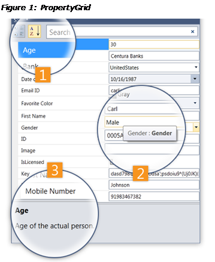

::: {style="DISPLAY: none"}
{#d2h_url_template}{#d2h_package_url style="WIDTH: 0px; DISPLAY: none; HEIGHT: 0px"}
:::

::: {.d2h_secondary_topic style="PADDING-BOTTOM: 10pt; MARGIN: 0pt; PADDING-LEFT: 0pt; PADDING-RIGHT: 0pt; PADDING-TOP: 0pt"}
#### [Visual Structure]{style="BACKGROUND: white"} {#visual-structure style="tab-stops: 0pt"}

  -- ----------------------------------------------------------
     
     {width="359" height="436"}
  -- ----------------------------------------------------------

\

1.   ButtonPanel Items

[·      ]{style="FONT-FAMILY: Symbol"}Group Button---Used to group the properties.

[·      ]{style="FONT-FAMILY: Symbol"}Sort Button---Used to sort the properties in ascending or descending order.

[·      ]{style="FONT-FAMILY: Symbol"}Search Box---Used to filter properties.

 

2.   ToolTip---Displays the name and type of the property on mouse over.

3.   Description Panel---Gives a short description about the property.

 

[]{#related-topics}
:::
