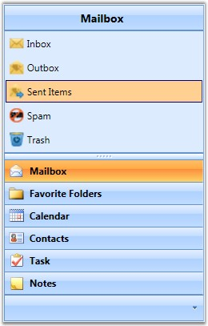
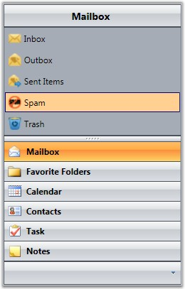
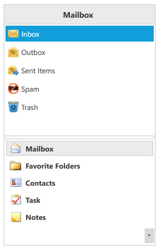

::: {style="DISPLAY: none"}
{#d2h_url_template}{#d2h_package_url style="WIDTH: 0px; DISPLAY: none; HEIGHT: 0px"}
:::

:::: {.d2h_secondary_topic style="PADDING-BOTTOM: 10pt; MARGIN: 0pt; PADDING-LEFT: 0pt; PADDING-RIGHT: 0pt; PADDING-TOP: 0pt"}
#### Visual Style {#visual-style style="tab-stops: 0pt"}

 

The appearance of the GroupBar control can be controlled using the **VisualStyle** property. VisualStyle is an attached property, which gets or sets the value for visual style. Styling can be applied to both the GroupBar control and its items. Nine built-in styles have been provided. These styles can be implemented at run time based on specified conditions.

 

::: {align="center"}
+-----------------------------------+---------------------------------------------------------------------------------------+
| Property                          | Description                                                                           |
+-----------------------------------+---------------------------------------------------------------------------------------+
| VisualStyle                       | Sets the visual style for the GroupBar control. The options provided are as follows.  |
|                                   |                                                                                       |
|                                   | []{style="FONT-FAMILY: 'Trebuchet MS','sans-serif'; COLOR: #15428b; FONT-SIZE: 9pt"}  |
|                                   |                                                                                       |
|                                   | 1.   Office2007Blue                                                                   |
|                                   |                                                                                       |
|                                   | 2.   Office2007Black                                                                  |
|                                   |                                                                                       |
|                                   | 3.   Office2007Silver                                                                 |
|                                   |                                                                                       |
|                                   | 4.   Office2010Blue                                                                   |
|                                   |                                                                                       |
|                                   | 5.   Office2010Black                                                                  |
|                                   |                                                                                       |
|                                   | 6.   Office2010Silver                                                                 |
|                                   |                                                                                       |
|                                   | 7.   Blend                                                                            |
|                                   |                                                                                       |
|                                   | 8.   Metro                                                                            |
|                                   |                                                                                       |
|                                   | 9.   Transparent                                                                      |
|                                   |                                                                                       |
|                                   |                                                                                       |
+-----------------------------------+---------------------------------------------------------------------------------------+
:::

 

These styles can be applied in XAML as follows. The example below styles the GroupBar control with the Office 2010 Blue theme.

+----------------------------------------------------------------------------------------------------------------------------------------------------------------------------------------------------------------------------------------------------------------------------------------------------------------------------------------------------------------------------------------------------------------------------------------------------------------------------------------------------------------------------------------------------------------------------------------------------------------------------------------------------------------------------------------------------------------------------------+
| **[ \[XAML\]]{style="FONT-FAMILY: 'Courier New'"}**                                                                                                                                                                                                                                                                                                                                                                                                                                                                                                                                                                                                                                                                              |
|                                                                                                                                                                                                                                                                                                                                                                                                                                                                                                                                                                                                                                                                                                                                  |
| [\<]{style="FONT-FAMILY: 'Courier New'; COLOR: blue"}[syncfusion:GroupBar]{style="FONT-FAMILY: 'Courier New'; COLOR: #a31515"}[ ]{style="FONT-FAMILY: 'Courier New'; COLOR: black"}[       ]{style="FONT-FAMILY: 'Courier New'; COLOR: black"}[ ]{style="FONT-FAMILY: 'Courier New'; COLOR: black"}[syncfusion:SkinStorage.VisualStyle]{style="FONT-FAMILY: 'Courier New'; COLOR: red"}[=\"]{style="FONT-FAMILY: 'Courier New'; COLOR: blue"}[Office2010Blue\"]{style="FONT-FAMILY: 'Courier New'; COLOR: blue"}[        ]{style="FONT-FAMILY: 'Courier New'; COLOR: black"}[/\>]{style="FONT-FAMILY: 'Courier New'; COLOR: blue"}[    ]{style="FONT-FAMILY: 'Courier New'; COLOR: black"}[]{style="FONT-FAMILY: 'Courier New'"} |
|                                                                                                                                                                                                                                                                                                                                                                                                                                                                                                                                                                                                                                                                                                                                  |
| []{style="FONT-FAMILY: 'Courier New'"}                                                                                                                                                                                                                                                                                                                                                                                                                                                                                                                                                                                                                                                                                           |
+----------------------------------------------------------------------------------------------------------------------------------------------------------------------------------------------------------------------------------------------------------------------------------------------------------------------------------------------------------------------------------------------------------------------------------------------------------------------------------------------------------------------------------------------------------------------------------------------------------------------------------------------------------------------------------------------------------------------------------+

 

Visual styles can be set in C# as follows.

 

+-------------------------------------------------------------------------------------------------------------------------------------------------------------------------------------------------------------------------------+
| **[\[C#\]]{style="FONT-FAMILY: 'Courier New'"}**                                                                                                                                                                              |
|                                                                                                                                                                                                                               |
| [SkinStorage]{style="FONT-FAMILY: 'Courier New'; COLOR: #2b91af"}[.SetVisualStyle(]{style="FONT-FAMILY: 'Courier New'"}[groupBarInstance, [\"Office2010Blue\"]{style="COLOR: #a31515"});]{style="FONT-FAMILY: 'Courier New'"} |
|                                                                                                                                                                                                                               |
| []{style="FONT-FAMILY: 'Courier New'"}                                                                                                                                                                                        |
+-------------------------------------------------------------------------------------------------------------------------------------------------------------------------------------------------------------------------------+

 

 

[]{style="FONT-FAMILY: 'Trebuchet MS','sans-serif'; COLOR: #15428b; FONT-SIZE: 9pt"} 

{border="0"}

Figure 534: GroupBar with Office2007Blue Style

***[]{style="FONT-FAMILY: 'Trebuchet MS','sans-serif'; COLOR: #15428b; FONT-SIZE: 9pt"}*** 

{border="0"}

Figure 535: GroupBar with Office2007Black Style

***[]{style="FONT-FAMILY: 'Trebuchet MS','sans-serif'; COLOR: #15428b; FONT-SIZE: 9pt"}*** 

 

{border="0"}

Figure 536: GroupBar with Metro Visual Style

[]{#related-topics}
::::
