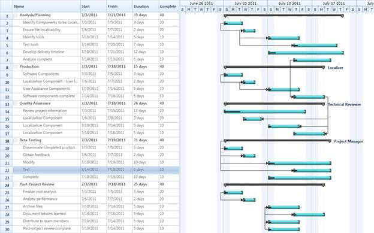
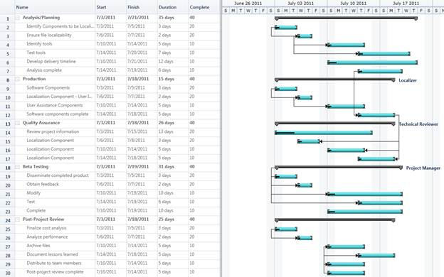
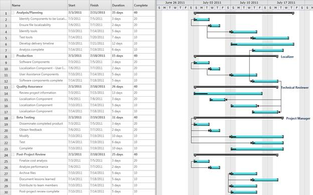
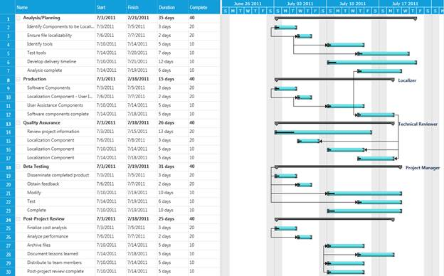

::: {style="DISPLAY: none"}
{#d2h_url_template}{#d2h_package_url style="WIDTH: 0px; DISPLAY: none; HEIGHT: 0px"}
:::

::::: {#nsbanner .d2h_main_nsbanner style="BORDER-BOTTOM: #999999 1px solid; POSITION: relative; PADDING-BOTTOM: 0px; BACKGROUND-COLOR: transparent; PADDING-LEFT: 0px; PADDING-RIGHT: 0px; DISPLAY: none; BORDER-TOP: #999999 1px solid; PADDING-TOP: 0px; LEFT: 0px"}
:::: {#TitleRow .d2h_main_titlerow style="PADDING-BOTTOM: 4px; BACKGROUND-COLOR: transparent; PADDING-LEFT: 22px; WIDTH: 100%; PADDING-RIGHT: 10px; DISPLAY: none; PADDING-TOP: 4px"}
::: {#ienav .d2h_main_ienav style="DISPLAY: none"}
{#D2HPrevious .D2HPreviousEnabled}  {#D2HNext .D2HNextEnabled}
:::
::::
:::::

:::: {#nstext .d2h_main_nstext style="PADDING-BOTTOM: 10px; BACKGROUND-COLOR: transparent; PADDING-LEFT: 22px; PADDING-RIGHT: 10px; HEIGHT: 100%; OVERFLOW: auto; PADDING-TOP: 5px" hasuserbackground="true" valign="bottom"}
::: {#d2h_breadcrumbs .d2h_breadcrumbs}
[Essential Studio User Guide Documentation](ms-xhelp:///?Id=12457748-09e3-4d74-a240-8e049cedf030){.d2h_breadcrumbsNormal}[ \> ]{.d2h_breadcrumbsLinkSeparator}[User Interface Edition](ms-xhelp:///?Id=c29296b7-531c-413b-a0ec-488ca1f7f669){.d2h_breadcrumbsNormal}[ \> ]{.d2h_breadcrumbsLinkSeparator}[Essential WPF](ms-xhelp:///?Id=7f4f82c5-151c-4262-94d0-75c4626c77bc){.d2h_breadcrumbsNormal}[ \> ]{.d2h_breadcrumbsLinkSeparator}[Essential Gantt]{.d2h_breadcrumbsContentsOnly}[ \> ]{.d2h_breadcrumbsLinkSeparator}[Concepts and Features](ms-xhelp:///?Id=b8172a4a-8718-4370-8781-8351a2959492){.d2h_breadcrumbsNormal}
:::

## Visual Style {#visual-style style="tab-stops: 0pt"}

Essential Gantt enables you to customize the appearance of the control. This supports the following themes:

[·      ]{style="FONT-FAMILY: Symbol"}Office2010Blue

[·      ]{style="FONT-FAMILY: Symbol"}Office2010Black

[·      ]{style="FONT-FAMILY: Symbol"}Office2010Silver

[·      ]{style="FONT-FAMILY: Symbol"}Metro

 

Properties

+-------------+--------------------------------------------------------+---------------------+------------------------------+-----------------+
| Property    | Description                                            | Type                | Data Type                    | Reference links |
+-------------+--------------------------------------------------------+---------------------+------------------------------+-----------------+
| VisualStyle | Gets or set the VisualStyle Property of Gantt control. | Dependency Property | Enum.                        | NA              |
|             |                                                        |                     |                              |                 |
|             |                                                        |                     | VisualStyle.Office2010Blue   |                 |
|             |                                                        |                     |                              |                 |
|             |                                                        |                     | VisualStyle.Office2010Black  |                 |
|             |                                                        |                     |                              |                 |
|             |                                                        |                     | VisualStyle.Office2010Silver |                 |
|             |                                                        |                     |                              |                 |
|             |                                                        |                     | VisualStyle.Metro            |                 |
+-------------+--------------------------------------------------------+---------------------+------------------------------+-----------------+

[]{style="FONT-FAMILY: 'Calibri','sans-serif'; COLOR: black"} 

Adding VisualStyle to Gantt Control

You can customize the theme using the *VisualStyle* property.[]{style="COLOR: #c00000"}

The following code illustrates how to set the VisualStyle of Gantt control:

 

+---------------------------------------------------------------------------------------------------------------------------------------------------------------------------------------------------------------------------------------------------------------------------------------------------------------------------------------------------------------------------------------------------------------------------------------------------------------------------------------------------------------------------------------------------+
| **[\[XAML\]]{style="FONT-FAMILY: 'Courier New'"}**                                                                                                                                                                                                                                                                                                                                                                                                                                                                                                |
|                                                                                                                                                                                                                                                                                                                                                                                                                                                                                                                                                   |
| [\<]{style="FONT-FAMILY: 'Courier New'; COLOR: blue"}[Sync]{style="FONT-FAMILY: 'Courier New'; COLOR: #a31515"}[:]{style="FONT-FAMILY: 'Courier New'; COLOR: blue"}[GanttControl]{style="FONT-FAMILY: 'Courier New'; COLOR: #a31515"}[ x]{style="FONT-FAMILY: 'Courier New'; COLOR: red"}[:]{style="FONT-FAMILY: 'Courier New'; COLOR: blue"}[Name]{style="FONT-FAMILY: 'Courier New'; COLOR: red"}[=\"Gantt\"]{style="FONT-FAMILY: 'Courier New'; COLOR: blue"}[ [VisualStyle]{style="COLOR: red"}[=\"Office2010Blue\"/\>]{style="COLOR: blue"}\ |
| \                                                                                                                                                                                                                                                                                                                                                                                                                                                                                                                                                 |
| ]{style="FONT-FAMILY: 'Courier New'"}[]{style="FONT-FAMILY: 'Courier New'; FONT-SIZE: 9.5pt"}                                                                                                                                                                                                                                                                                                                                                                                                                                                     |
+---------------------------------------------------------------------------------------------------------------------------------------------------------------------------------------------------------------------------------------------------------------------------------------------------------------------------------------------------------------------------------------------------------------------------------------------------------------------------------------------------------------------------------------------------+

[]{style="COLOR: #c00000"} 

+-----------------------------------------------------------------------------------------------------------------+
| **[\[C#\]]{style="FONT-FAMILY: 'Courier New'"}**                                                                |
|                                                                                                                 |
| [Gantt.VisualStyle = [VisualStyle]{style="COLOR: #2b91af"}.Office2010Blue;]{style="FONT-FAMILY: 'Courier New'"} |
|                                                                                                                 |
| []{style="FONT-FAMILY: 'Courier New'; FONT-SIZE: 9.5pt"}                                                        |
+-----------------------------------------------------------------------------------------------------------------+

[]{style="COLOR: #c00000"} 

{border="0"}

Figure 32: Office 2010 Blue

 

{border="0"}

Figure 33: Office 2010Silver

 

{border="0"}

Figure 34: Office2010Black

 

{border="0"}[]{style="COLOR: #c00000"}

Figure 35: Metro

[]{style="COLOR: #c00000"} 

Samples Link

To view samples:

1.   Select **Start -\> Programs -\> Syncfusion -\> Essential Studio x.x.xx -\> Dashboard**.

2.   Click **Run Samples** for WPF under User Interface Edition panel.

3.   Select **Gantt**.

4.   Expand the **Styles** item in the Sample Browser.

5.   Choose the **Gantt Visual Style** sample to launch.

[]{#related-topics}
::::
