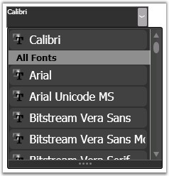
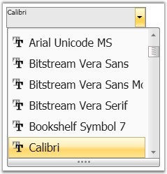

::: {style="DISPLAY: none"}
{#d2h_url_template}{#d2h_package_url style="WIDTH: 0px; DISPLAY: none; HEIGHT: 0px"}
:::

:::: {.d2h_secondary_topic style="PADDING-BOTTOM: 10pt; MARGIN: 0pt; PADDING-LEFT: 0pt; PADDING-RIGHT: 0pt; PADDING-TOP: 0pt"}
#### Visual Style {#visual-style style="tab-stops: 0pt"}

 

You can enhance the appearance of the FontListComboBox by using different visual styles that are available for the control. The visual style for the FontListComboBox is set by using the **VisualStyle** property.

 

::: {align="center"}
+-----------------------------------+----------------------------------------------------------------------------------------------+
| Property                          | Description                                                                                  |
+-----------------------------------+----------------------------------------------------------------------------------------------+
| VisualStyle                       | Sets the visual style for the FontListComboBox control. The options provided are as follows. |
|                                   |                                                                                              |
|                                   | []{style="FONT-FAMILY: 'Trebuchet MS','sans-serif'; COLOR: #15428b; FONT-SIZE: 9pt"}         |
|                                   |                                                                                              |
|                                   | [·      ]{style="FONT-FAMILY: Symbol"}Blend                                                  |
|                                   |                                                                                              |
|                                   | [·      ]{style="FONT-FAMILY: Symbol"}Office2003                                             |
|                                   |                                                                                              |
|                                   | [·      ]{style="FONT-FAMILY: Symbol"}Office2007Blue                                         |
|                                   |                                                                                              |
|                                   | [·      ]{style="FONT-FAMILY: Symbol"}Office2007Black                                        |
|                                   |                                                                                              |
|                                   | [·      ]{style="FONT-FAMILY: Symbol"}Office2007Silver                                       |
|                                   |                                                                                              |
|                                   | [·      ]{style="FONT-FAMILY: Symbol"}ShinyBlue                                              |
|                                   |                                                                                              |
|                                   | [·      ]{style="FONT-FAMILY: Symbol"}ShinyRed                                               |
|                                   |                                                                                              |
|                                   | [·      ]{style="FONT-FAMILY: Symbol"}SyncOrange                                             |
|                                   |                                                                                              |
|                                   | [·      ]{style="FONT-FAMILY: Symbol"}VS2010                                                 |
|                                   |                                                                                              |
|                                   | [·      ]{style="FONT-FAMILY: Symbol"}Metro                                                  |
|                                   |                                                                                              |
|                                   |                                                                                              |
+-----------------------------------+----------------------------------------------------------------------------------------------+
:::

 

To set the visual style for the FontListComboBox, use the following code snippet.

 

+----------------------------------------------------------------------------------------------------------------------------------------------------------------------------------------------------------------------------+
| **[\[C#\]]{style="FONT-FAMILY: 'Courier New'; COLOR: black; FONT-SIZE: 9pt"}**                                                                                                                                             |
|                                                                                                                                                                                                                            |
| []{style="FONT-FAMILY: 'Courier New'; COLOR: black; FONT-SIZE: 9pt"}                                                                                                                                                       |
|                                                                                                                                                                                                                            |
| [//for Default Style]{style="FONT-FAMILY: 'Courier New'; COLOR: green; FONT-SIZE: 9pt"}                                                                                                                                    |
|                                                                                                                                                                                                                            |
| [SkinStorage]{style="FONT-FAMILY: 'Courier New'; COLOR: #2b91af; FONT-SIZE: 9pt"}[.SetVisualStyle(fontListComboBox1, [\"Default\"]{style="COLOR: #a31515"});]{style="FONT-FAMILY: 'Courier New'; FONT-SIZE: 9pt"}          |
|                                                                                                                                                                                                                            |
| []{style="FONT-FAMILY: 'Courier New'; FONT-SIZE: 9pt"}                                                                                                                                                                     |
|                                                                                                                                                                                                                            |
| [//for Blend Style]{style="FONT-FAMILY: 'Courier New'; COLOR: green; FONT-SIZE: 9pt"}                                                                                                                                      |
|                                                                                                                                                                                                                            |
| [SkinStorage]{style="FONT-FAMILY: 'Courier New'; COLOR: #2b91af; FONT-SIZE: 9pt"}[.SetVisualStyle(fontListComboBox1, [\"Blend\"]{style="COLOR: #a31515"});]{style="FONT-FAMILY: 'Courier New'; FONT-SIZE: 9pt"}            |
|                                                                                                                                                                                                                            |
| []{style="FONT-FAMILY: 'Courier New'; FONT-SIZE: 9pt"}                                                                                                                                                                     |
|                                                                                                                                                                                                                            |
| [//for Office2007Silver]{style="FONT-FAMILY: 'Courier New'; COLOR: green; FONT-SIZE: 9pt"}                                                                                                                                 |
|                                                                                                                                                                                                                            |
| [SkinStorage]{style="FONT-FAMILY: 'Courier New'; COLOR: #2b91af; FONT-SIZE: 9pt"}[.SetVisualStyle(fontListComboBox1, [\"Office2007Silver\"]{style="COLOR: #a31515"});]{style="FONT-FAMILY: 'Courier New'; FONT-SIZE: 9pt"} |
|                                                                                                                                                                                                                            |
| []{style="FONT-FAMILY: 'Courier New'; FONT-SIZE: 9pt"}                                                                                                                                                                     |
|                                                                                                                                                                                                                            |
| [//for Office2007Blue]{style="FONT-FAMILY: 'Courier New'; COLOR: green; FONT-SIZE: 9pt"}                                                                                                                                   |
|                                                                                                                                                                                                                            |
| [SkinStorage]{style="FONT-FAMILY: 'Courier New'; COLOR: #2b91af; FONT-SIZE: 9pt"}[.SetVisualStyle(fontListComboBox1, [\"Office2007Blue\"]{style="COLOR: #a31515"});]{style="FONT-FAMILY: 'Courier New'; FONT-SIZE: 9pt"}   |
|                                                                                                                                                                                                                            |
| []{style="FONT-FAMILY: 'Courier New'; FONT-SIZE: 9pt"}                                                                                                                                                                     |
|                                                                                                                                                                                                                            |
| [//for Office2007Black]{style="FONT-FAMILY: 'Courier New'; COLOR: green; FONT-SIZE: 9pt"}                                                                                                                                  |
|                                                                                                                                                                                                                            |
| [SkinStorage]{style="FONT-FAMILY: 'Courier New'; COLOR: #2b91af; FONT-SIZE: 9pt"}[.SetVisualStyle(fontListComboBox1, [\"Office2007Black\"]{style="COLOR: #a31515"});]{style="FONT-FAMILY: 'Courier New'; FONT-SIZE: 9pt"}  |
|                                                                                                                                                                                                                            |
| []{style="FONT-FAMILY: 'Courier New'; FONT-SIZE: 9pt"}                                                                                                                                                                     |
|                                                                                                                                                                                                                            |
| [//for Office2003]{style="FONT-FAMILY: 'Courier New'; COLOR: green; FONT-SIZE: 9pt"}                                                                                                                                       |
|                                                                                                                                                                                                                            |
| [SkinStorage]{style="FONT-FAMILY: 'Courier New'; COLOR: #2b91af; FONT-SIZE: 9pt"}[.SetVisualStyle(fontListComboBox1, [\"Office2003\"]{style="COLOR: #a31515"});]{style="FONT-FAMILY: 'Courier New'; FONT-SIZE: 9pt"}       |
+----------------------------------------------------------------------------------------------------------------------------------------------------------------------------------------------------------------------------+

[]{style="FONT-FAMILY: 'Trebuchet MS','sans-serif'; COLOR: #15428b; FONT-SIZE: 9pt"} 

{border="0"}

Figure 492: FontListComboBox with \"Blend\" Visual Style

 

{border="0"}

Figure 493: FontListComboBox with \"Office2007Black\" Visual Style

 

[]{#p281} 

[]{#related-topics}
::::
