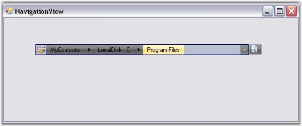
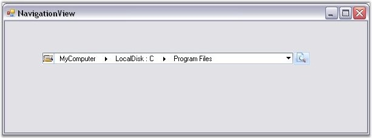
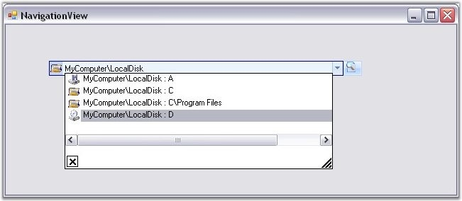

::: {style="DISPLAY: none"}
{#d2h_url_template}{#d2h_package_url style="WIDTH: 0px; DISPLAY: none; HEIGHT: 0px"}
:::

::: {.d2h_secondary_topic style="PADDING-BOTTOM: 10pt; MARGIN: 0pt; PADDING-LEFT: 0pt; PADDING-RIGHT: 0pt; PADDING-TOP: 0pt"}
#### Visual Styles {#visual-styles style="MARGIN-LEFT: 18pt; tab-stops: 18.0pt"}

 

Visual Styles enhance the appearance of the NavigationView control. NavigationView supports the following visual styles: Office 2007 and Vista.

[]{style="COLOR: #15428b"} 

{border="0"}

[            ]{style="COLOR: #15428b"}

Figure 1484: NavigationView with \"Office 2007 (Black)\" Visual Style

[]{style="COLOR: #15428b"} 

{border="0"}

[]{style="COLOR: #15428b"} 

Figure 1485: NavigationView with \"Vista\" Visual Style

[]{style="COLOR: #15428b"} 

Edit Mode Support

[]{style="COLOR: #15428b"} 

You can switch to an editable NavigationView path, allowing the user to quickly reach a location, by clicking on the text area of the NavigationView and typing the path.

[]{style="COLOR: #15428b"} 

{border="0"}

[]{style="COLOR: #15428b"} 

Figure 1486: NavigationView in Edit Mode

 

[]{#related-topics}
:::
