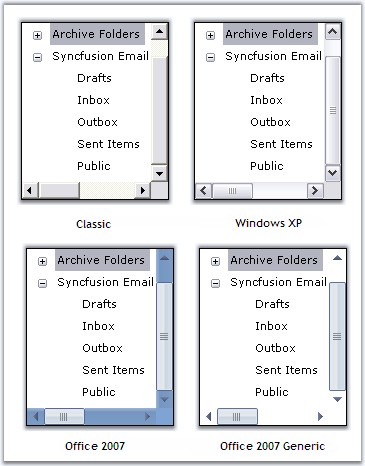
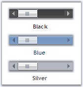
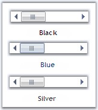

::: {style="DISPLAY: none"}
{#d2h_url_template}{#d2h_package_url style="WIDTH: 0px; DISPLAY: none; HEIGHT: 0px"}
:::

:::: {.d2h_secondary_topic style="PADDING-BOTTOM: 10pt; MARGIN: 0pt; PADDING-LEFT: 0pt; PADDING-RIGHT: 0pt; PADDING-TOP: 0pt"}
##### Visual Styles {#visual-styles style="tab-stops: 0pt"}

[]{style="COLOR: #15428b"} 

Visual Styles for the ScrollersFrame Control can be edited through **VisualStyle** property.      

[]{style="COLOR: #15428b"} 

::: {align="center"}
+-----------------------------------+-------------------------------------------------------------------------------------------------------------------------------------------+
| Property                          | Description                                                                                                                               |
+-----------------------------------+-------------------------------------------------------------------------------------------------------------------------------------------+
| VisualStyle                       | Sets the visual style for the scrollbars. The visual styles supported are,                                                                |
|                                   |                                                                                                                                           |
|                                   |                                                                                                                                           |
|                                   |                                                                                                                                           |
|                                   | [·      ]{style="FONT-FAMILY: Symbol"}Classic,                                                                                            |
|                                   |                                                                                                                                           |
|                                   | [·      ]{style="FONT-FAMILY: Symbol"}WindowsXP,                                                                                          |
|                                   |                                                                                                                                           |
|                                   | [·      ]{style="FONT-FAMILY: Symbol"}Office2007 and                                                                                      |
|                                   |                                                                                                                                           |
|                                   | [·      ]{style="FONT-FAMILY: Symbol"}Office2007Generic.                                                                                  |
+-----------------------------------+-------------------------------------------------------------------------------------------------------------------------------------------+
| OfficeColorSchemes                | Sets the office color schemes for the scrollbars when VisualStyle is set to Office2007 or Office2007Generic style. The color schemes are, |
|                                   |                                                                                                                                           |
|                                   |                                                                                                                                           |
|                                   |                                                                                                                                           |
|                                   | [·      ]{style="FONT-FAMILY: Symbol"}Blue,                                                                                               |
|                                   |                                                                                                                                           |
|                                   | [·      ]{style="FONT-FAMILY: Symbol"}Silver and                                                                                          |
|                                   |                                                                                                                                           |
|                                   | [·      ]{style="FONT-FAMILY: Symbol"}Black.                                                                                              |
+-----------------------------------+-------------------------------------------------------------------------------------------------------------------------------------------+
:::

[]{#p1180}[]{style="COLOR: #15428b"} 

+---------------------------------------------------------------------------------------------------------------------------------------------------------------------------------------------------------------------------------------------------------+
| **[\[C#\]]{style="FONT-FAMILY: 'Courier New'; COLOR: black"}**                                                                                                                                                                                          |
|                                                                                                                                                                                                                                                         |
| []{style="FONT-FAMILY: 'Courier New'; COLOR: blue"}                                                                                                                                                                                                     |
|                                                                                                                                                                                                                                                         |
| [this]{style="FONT-FAMILY: 'Courier New'; COLOR: blue"}[.scrollersFrame1.VisualStyle = Syncfusion.Windows.Forms.[ScrollBarCustomDrawStyles]{style="COLOR: teal"}.Office2007;]{style="FONT-FAMILY: 'Courier New'"}[]{style="FONT-FAMILY: 'Courier New'"} |
+---------------------------------------------------------------------------------------------------------------------------------------------------------------------------------------------------------------------------------------------------------+

[]{style="COLOR: #15428b"} 

+------------------------------------------------------------------------------------------------------------------------------------------------------------------------------------------------------------------------------------------------------+
| **[\[VB.NET\]]{style="FONT-FAMILY: 'Courier New'; COLOR: black"}**                                                                                                                                                                                   |
|                                                                                                                                                                                                                                                      |
| []{style="FONT-FAMILY: 'Courier New'; COLOR: black"}                                                                                                                                                                                                 |
|                                                                                                                                                                                                                                                      |
| [Me]{style="FONT-FAMILY: 'Courier New'; COLOR: blue"}[.scrollersFrame1.VisualStyle = Syncfusion.Windows.Forms.[ScrollBarCustomDrawStyles]{style="COLOR: teal"}.Office2007]{style="FONT-FAMILY: 'Courier New'"}[]{style="FONT-FAMILY: 'Courier New'"} |
+------------------------------------------------------------------------------------------------------------------------------------------------------------------------------------------------------------------------------------------------------+

[]{style="COLOR: #15428b"} 

{border="0"}

[]{style="COLOR: #15428b"} 

Figure 1414: Visual Style for ScrollersFrame

[]{style="COLOR: #15428b"} 

+-----------------------------------------------------------------------------------------------------------------------------------------------------------------------------------------------------------------+
| **[\[C#\]]{style="FONT-FAMILY: 'Courier New'; COLOR: black"}**                                                                                                                                                  |
|                                                                                                                                                                                                                 |
| []{style="FONT-FAMILY: 'Courier New'; COLOR: blue"}                                                                                                                                                             |
|                                                                                                                                                                                                                 |
| [this]{style="FONT-FAMILY: 'Courier New'; COLOR: blue"}[.scrollersFrame1.OfficeColorScheme = Syncfusion.Windows.Forms.[Office2007ColorScheme]{style="COLOR: teal"}.Silver;]{style="FONT-FAMILY: 'Courier New'"} |
+-----------------------------------------------------------------------------------------------------------------------------------------------------------------------------------------------------------------+

[]{style="COLOR: #15428b"} 

+--------------------------------------------------------------------------------------------------------------------------------------------------------------------------------------------------------------+
| **[\[VB.NET\]]{style="FONT-FAMILY: 'Courier New'; COLOR: black"}**                                                                                                                                           |
|                                                                                                                                                                                                              |
| []{style="FONT-FAMILY: 'Courier New'; COLOR: black"}                                                                                                                                                         |
|                                                                                                                                                                                                              |
| [Me]{style="FONT-FAMILY: 'Courier New'; COLOR: blue"}[.scrollersFrame1.OfficeColorScheme = Syncfusion.Windows.Forms.[Office2007ColorScheme]{style="COLOR: teal"}.Silver]{style="FONT-FAMILY: 'Courier New'"} |
+--------------------------------------------------------------------------------------------------------------------------------------------------------------------------------------------------------------+

[]{style="COLOR: #15428b"} 

{border="0"}

[]{style="COLOR: #15428b"} 

Figure 1415: Office2007Style Horizontal ScrollBar with Black, Blue and Silver ColorSchemes

[]{style="COLOR: #15428b"} 

{border="0"}

[]{style="COLOR: #15428b"} 

***[]{style="COLOR: #15428b"}*** 

Figure 1416: Office2007Generic Style Horizontal ScrollBar with Black, Blue and Silver ColorSchemes

**[]{style="COLOR: #15428b"}** 

Custom Colors

[]{style="COLOR: #15428b"} 

We can also apply custom colors to the ScrollersFrame by setting OfficeColorScheme to \"Managed\" and specifying the custom color through the **ApplyManagedColors** method as follows.

[]{style="COLOR: #15428b"} 

+---------------------------------------------------------------------------------------------------------------------------------------------------------------------------------------------------------------------------------------------+
| **[\[C#\]]{style="FONT-FAMILY: 'Courier New'; COLOR: black"}**                                                                                                                                                                              |
|                                                                                                                                                                                                                                             |
| []{style="COLOR: #15428b"}                                                                                                                                                                                                                  |
|                                                                                                                                                                                                                                             |
| [this]{style="FONT-FAMILY: 'Courier New'; COLOR: blue"}[.scrollersFrame1.OfficeColorScheme = Syncfusion.Windows.Forms.[Office2007ColorScheme]{style="COLOR: teal"}.Managed;]{style="FONT-FAMILY: 'Courier New'"}                            |
|                                                                                                                                                                                                                                             |
| [Office2007Colors]{style="FONT-FAMILY: 'Courier New'; COLOR: teal"}[.ApplyManagedColors([this]{style="COLOR: blue"}, [Color]{style="COLOR: teal"}.LightSkyBlue);]{style="FONT-FAMILY: 'Courier New'"}[]{style="FONT-FAMILY: 'Courier New'"} |
+---------------------------------------------------------------------------------------------------------------------------------------------------------------------------------------------------------------------------------------------+

[]{style="COLOR: #15428b"} 

+----------------------------------------------------------------------------------------------------------------------------------------------------------------------------------------------------------------+
| **[\[VB.NET\]]{style="FONT-FAMILY: 'Courier New'; COLOR: black"}**                                                                                                                                             |
|                                                                                                                                                                                                                |
| []{style="COLOR: #15428b"}                                                                                                                                                                                     |
|                                                                                                                                                                                                                |
| [Me]{style="FONT-FAMILY: 'Courier New'; COLOR: blue"}[.scrollersFrame1.OfficeColorScheme = Syncfusion.Windows.Forms.[Office2007ColorScheme.Managed]{style="COLOR: black"}]{style="FONT-FAMILY: 'Courier New'"} |
|                                                                                                                                                                                                                |
| [Office2007Colors.]{style="FONT-FAMILY: 'Courier New'; COLOR: black"}[ApplyManagedColors([Me]{style="COLOR: blue"}, [Color]{style="COLOR: black"}.LightSkyBlue)]{style="FONT-FAMILY: 'Courier New'"}           |
+----------------------------------------------------------------------------------------------------------------------------------------------------------------------------------------------------------------+

[]{style="COLOR: #15428b"} 

{border="0"}

[]{style="COLOR: #15428b"} 

Figure 1417: Custom Color = \"LightSkyBlue\"

**[]{style="COLOR: #15428b"}** 

See Also

[]{style="COLOR: #15428b"} 

[[Adding Controls to the ScrollBar]{.UGHyperlink}](../../../../../../../../Documents%20and%20Settings/sylviap/Desktop/Tools%20-%20Part%202.docx#_Adding_Controls_to_1)[]{style="COLOR: black"}

 

 

[]{#related-topics}
::::
