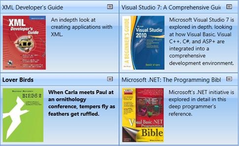
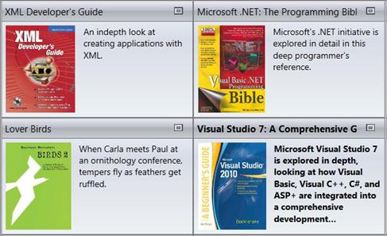
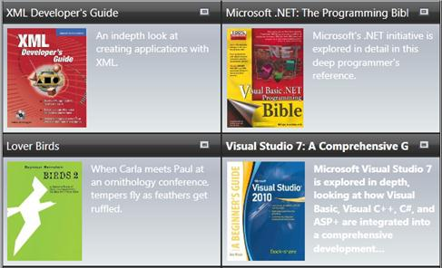
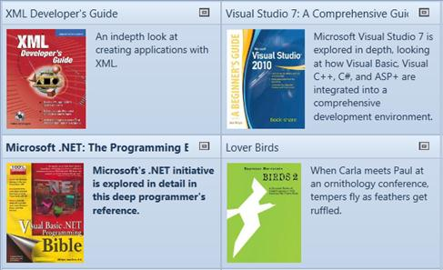
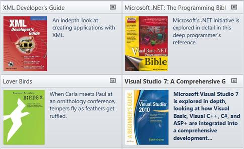
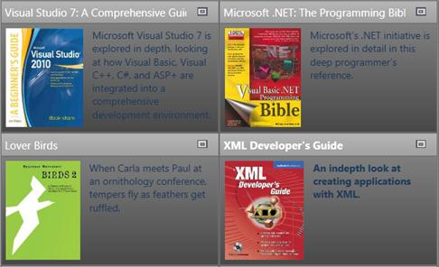
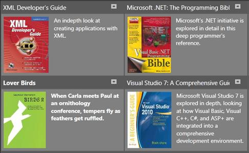
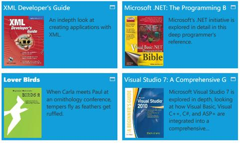
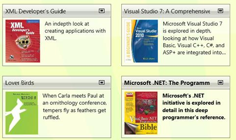

::: {style="DISPLAY: none"}
{#d2h_url_template}{#d2h_package_url style="WIDTH: 0px; DISPLAY: none; HEIGHT: 0px"}
:::

::: {.d2h_secondary_topic style="PADDING-BOTTOM: 10pt; MARGIN: 0pt; PADDING-LEFT: 0pt; PADDING-RIGHT: 0pt; PADDING-TOP: 0pt"}
#### Visual Styles {#visual-styles style="tab-stops: 0pt"}

The TileViewControl has the following built-in styles:

1.   Office2007Blue

2.   Office2007Black

3.   Office2007Silver

4.   Office2010Blue

5.   Office2010Black

6.   Office2010Silver

7.   Blend

8.   Metro

9.   Transparent

 

These styles can be applied to the control using XAML. The following code example illustrates how to apply Office2007Blue style to the TileViewControl.

           

+------------------------------------------------------------------------------------------------------------------------------------------------------------------------------------------------------------------------------------------------------------------------------------------------------------------------------------------------------------------------------------------------------------------------------------------------------------------------------------------------------------------------------------------------------------------------------+
| **[ \[XAML\]]{style="FONT-FAMILY: 'Courier New'"}**                                                                                                                                                                                                                                                                                                                                                                                                                                                                                                                          |
|                                                                                                                                                                                                                                                                                                                                                                                                                                                                                                                                                                              |
| [\<]{style="FONT-FAMILY: 'Courier New'; COLOR: blue"}[syncfusion:TileViewControl]{style="FONT-FAMILY: 'Courier New'; COLOR: #a31515"}[         ]{style="FONT-FAMILY: 'Courier New'; COLOR: black"}[syncfusion:SkinStorage.VisualStyle]{style="FONT-FAMILY: 'Courier New'; COLOR: red"}[=\"Office2010Blue\"]{style="FONT-FAMILY: 'Courier New'; COLOR: blue"}[        ]{style="FONT-FAMILY: 'Courier New'; COLOR: black"}[/\>]{style="FONT-FAMILY: 'Courier New'; COLOR: blue"}[    ]{style="FONT-FAMILY: 'Courier New'; COLOR: black"}[]{style="FONT-FAMILY: 'Courier New'"} |
|                                                                                                                                                                                                                                                                                                                                                                                                                                                                                                                                                                              |
| []{style="FONT-FAMILY: 'Courier New'"}                                                                                                                                                                                                                                                                                                                                                                                                                                                                                                                                       |
+------------------------------------------------------------------------------------------------------------------------------------------------------------------------------------------------------------------------------------------------------------------------------------------------------------------------------------------------------------------------------------------------------------------------------------------------------------------------------------------------------------------------------------------------------------------------------+

 

These styles can also be applied to the control using C# as follows.

 

+-----------------------------------------------------------------------------------------------------------------------------------------------------------------------------------------+
| **[\[C#\]]{style="FONT-FAMILY: 'Courier New'"}**                                                                                                                                        |
|                                                                                                                                                                                         |
| [SkinStorage]{style="FONT-FAMILY: 'Courier New'; COLOR: #2b91af"}[.SetVisualStyle(tileViewInstance, [\"Office2010Blue\"]{style="COLOR: #a31515"});]{style="FONT-FAMILY: 'Courier New'"} |
|                                                                                                                                                                                         |
| []{style="FONT-FAMILY: 'Courier New'"}                                                                                                                                                  |
+-----------------------------------------------------------------------------------------------------------------------------------------------------------------------------------------+

 

The following illustrations show the TileViewControl that is applied with different built-in styles.

 

{border="0"}

Figure 1084: TileViewControl with Office2007Blue Style

 

{border="0"}

Figure 1085: TileViewControl with Office2007Silver style

 

{border="0"}

Figure 1086: TileViewControl with Office2007Black style

 

{border="0"}

Figure 1087:TileViewControl with Office2010Blue style

 

{border="0"}

Figure 1088:TileViewControl with Office2010Silver style

 

{border="0"}

Figure 1089: TileViewControl with Office2010Black style

 

{border="0"}

Figure 1090: TileViewcontrol with Blend sytle

 

{border="0"}

Figure 1091: TileViewControl with Metro style

 

{border="0"}

Figure 1092: TileViewControl with Transparent style

 

[]{#related-topics}
:::
