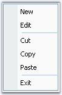

::: {style="DISPLAY: none"}
{#d2h_url_template}{#d2h_package_url style="WIDTH: 0px; DISPLAY: none; HEIGHT: 0px"}
:::

::: {.d2h_secondary_topic style="PADDING-BOTTOM: 10pt; MARGIN: 0pt; PADDING-LEFT: 0pt; PADDING-RIGHT: 0pt; PADDING-TOP: 0pt"}
##### Visual Styles for the Popup Menu {#visual-styles-for-the-popup-menu style="tab-stops: 0pt"}

 

Visual Style for a popupmenu can be controlled by using **PopupMenu.ParentBarItem.Style** property.

[]{style="COLOR: #15428b"} 

+---------------------------------------------------------------------------------------------------------------------------------------------------------------------------------------------------------------+
| **[\[C#\]]{style="FONT-FAMILY: 'Courier New'; COLOR: black"}**                                                                                                                                                |
|                                                                                                                                                                                                               |
| **[]{style="COLOR: #15428b"}**                                                                                                                                                                                |
|                                                                                                                                                                                                               |
| [this]{style="FONT-FAMILY: 'Courier New'; COLOR: blue"}[.popupMenu1.ParentBarItem.Style = Syncfusion.Windows.Forms.[VisualStyle]{style="COLOR: teal"}.Office2007Outlook;]{style="FONT-FAMILY: 'Courier New'"} |
+---------------------------------------------------------------------------------------------------------------------------------------------------------------------------------------------------------------+

[]{style="COLOR: #15428b"} 

+------------------------------------------------------------------------------------------------------------------------------------------------------------------------------------------------------------+
| **[\[VB.NET\]]{style="FONT-FAMILY: 'Courier New'; COLOR: black"}**                                                                                                                                         |
|                                                                                                                                                                                                            |
| **[]{style="COLOR: #15428b"}**                                                                                                                                                                             |
|                                                                                                                                                                                                            |
| [Me]{style="FONT-FAMILY: 'Courier New'; COLOR: blue"}[.popupMenu1.ParentBarItem.Style = Syncfusion.Windows.Forms.[VisualStyle]{style="COLOR: teal"}.Office2007Outlook]{style="FONT-FAMILY: 'Courier New'"} |
+------------------------------------------------------------------------------------------------------------------------------------------------------------------------------------------------------------+

[]{style="COLOR: #15428b"} 

{border="0"}

Figure 821: PopupMenu with VisualStyle = \"Office2007Outlook\"

**[]{style="COLOR: #15428b"}** 

See Also

**[]{style="COLOR: #15428b"}** 

[Visual Styles]{.UGHyperlink}[]{.UGHyperlink}

[]{#related-topics}
:::
