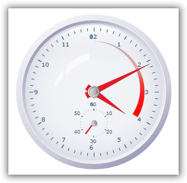
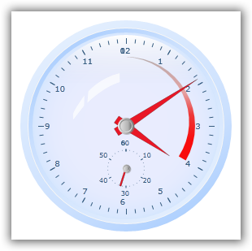
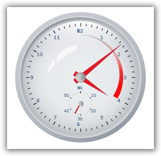
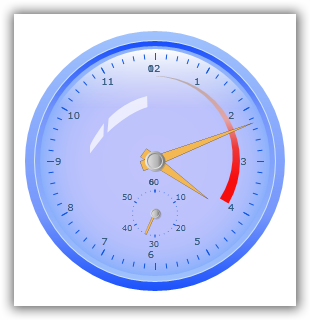
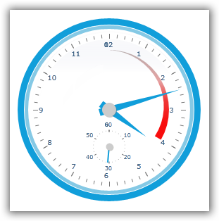
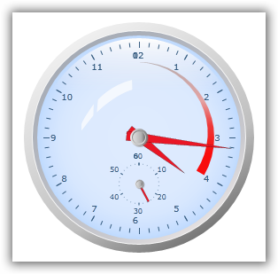
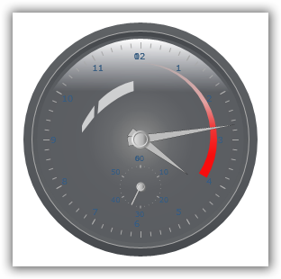
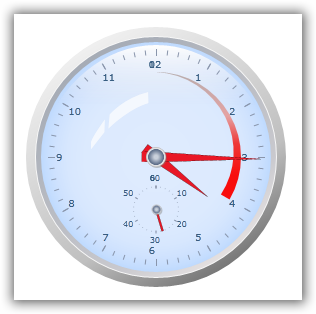

::: {style="DISPLAY: none"}
{#d2h_url_template}{#d2h_package_url style="WIDTH: 0px; DISPLAY: none; HEIGHT: 0px"}
:::

::: {.d2h_secondary_topic style="PADDING-BOTTOM: 10pt; MARGIN: 0pt; PADDING-LEFT: 0pt; PADDING-RIGHT: 0pt; PADDING-TOP: 0pt"}
##### Visual Style without Using Shared.Silverlight.dll {#visual-style-without-using-shared.silverlight.dll style="tab-stops: 0pt"}

This feature enables the user to customize the appearance of the Silverlight gauges with the predefined styles. This is useful for enriching the user experience and provides a good look and feel. In the previous implementation, these predefined styles could be applied only with the help of **Shared.Silverlight.dll** and the respective theming DLLs from the sample side.

 

[·      ]{style="FONT-FAMILY: Symbol"}All the styles available in Shared.Silverlight.DLL have been implemented, so all the themes can be applied.

[·      ]{style="FONT-FAMILY: Symbol"}This can be applied for all gauges, namely circular gauge, linear gauge, digital gauge, and rolling gauge.

[·      ]{style="FONT-FAMILY: Symbol"}This style can be applied by setting the corresponding styles to the **VisualStyle** property of all gauges.

[·      ]{style="FONT-FAMILY: Symbol"}The following styles are supported for all gauges.

[o  ]{style="FONT-FAMILY: 'Courier New'"}Default

[o  ]{style="FONT-FAMILY: 'Courier New'"}Blend

[o  ]{style="FONT-FAMILY: 'Courier New'"}Office 2007 Silver

[o  ]{style="FONT-FAMILY: 'Courier New'"}Office 2007 Blue

[o  ]{style="FONT-FAMILY: 'Courier New'"}Office 2007 Black

[o  ]{style="FONT-FAMILY: 'Courier New'"}Office 2003

[o  ]{style="FONT-FAMILY: 'Courier New'"}Metro

[o  ]{style="FONT-FAMILY: 'Courier New'"}VS2010

Use Case Scenarios

When the user needs to enrich the appearance of the gauge, they can use this feature. This feature is can be used to differentiate (highlight) the Gauges, when the user having more gauges in a single application.

 

Properties

+------------------+----------------------------------------+------------------------+------------------------------------+
| **Property**     | **Description**                        | **Type**               | **Data Type**                      |
+------------------+----------------------------------------+------------------------+------------------------------------+
| GaugeVisualStyle | Gets the list of styles to be applied. | **Enum**               | Binary, True/False                 |
+------------------+----------------------------------------+------------------------+------------------------------------+
| VisualStyle      | Sets the visual style of all gauges.   | **DependencyProperty** | GaugeVisualStyles.Blend,           |
|                  |                                        |                        |                                    |
|                  |                                        |                        | GaugeVisualStyles.VS2010,          |
|                  |                                        |                        |                                    |
|                  |                                        |                        | GaugeVisualStyles.Metro,           |
|                  |                                        |                        |                                    |
|                  |                                        |                        | GaugeVisualStyles.Office2003,      |
|                  |                                        |                        |                                    |
|                  |                                        |                        | GaugeVisualStyles.Office2007Blue,  |
|                  |                                        |                        |                                    |
|                  |                                        |                        | GaugeVisualStyles.Office2007Black, |
|                  |                                        |                        |                                    |
|                  |                                        |                        | GaugeVisualStyles.Office2007Silver |
+------------------+----------------------------------------+------------------------+------------------------------------+

[]{style="FONT-FAMILY: 'Calibri','sans-serif'; COLOR: black"} 

###### 4.1.2.13.1.1        Adding VisualStyle to an Application {#adding-visualstyle-to-an-application style="tab-stops: 0pt"}

+-----------------------------------------------------------------------------------------------------------------------------------------------------------------------------------------------------------------------------------------------------------------------------------------------------------------------------------------------------------------------------------------------------------------------------------------------------------------------------------------------------------------------------------------------------------------------------------------------------------------------------------------------------------------------+
| **[\[XAML\][  ]{style="COLOR: #a31515"}]{style="FONT-FAMILY: 'Courier New'"}**                                                                                                                                                                                                                                                                                                                                                                                                                                                                                                                                                                                        |
|                                                                                                                                                                                                                                                                                                                                                                                                                                                                                                                                                                                                                                                                       |
| [\<]{style="FONT-FAMILY: Consolas; COLOR: blue; FONT-SIZE: 9.5pt"}[syncfusion]{style="FONT-FAMILY: Consolas; COLOR: #a31515; FONT-SIZE: 9.5pt"}[:]{style="FONT-FAMILY: Consolas; COLOR: blue; FONT-SIZE: 9.5pt"}[CircularGauge]{style="FONT-FAMILY: Consolas; COLOR: #a31515; FONT-SIZE: 9.5pt"}[  [ x]{style="COLOR: red"}[:]{style="COLOR: blue"}[Name]{style="COLOR: red"}[=\"CircularGauge1\"]{style="COLOR: blue"}[ Radius]{style="COLOR: red"}[=\"130\"]{style="COLOR: blue"}[ Margin]{style="COLOR: red"}[=\"5\"]{style="COLOR: blue"}[ VisualStyle]{style="COLOR: red"}[=\"VS2010\"\>]{style="COLOR: blue"}]{style="FONT-FAMILY: Consolas; FONT-SIZE: 9.5pt"} |
|                                                                                                                                                                                                                                                                                                                                                                                                                                                                                                                                                                                                                                                                       |
| [                            ]{style="FONT-FAMILY: Consolas; COLOR: #a31515; FONT-SIZE: 9.5pt"}[\<]{style="FONT-FAMILY: Consolas; COLOR: blue; FONT-SIZE: 9.5pt"}[syncfusion]{style="FONT-FAMILY: Consolas; COLOR: #a31515; FONT-SIZE: 9.5pt"}[:]{style="FONT-FAMILY: Consolas; COLOR: blue; FONT-SIZE: 9.5pt"}[CircularGauge.Scales]{style="FONT-FAMILY: Consolas; COLOR: #a31515; FONT-SIZE: 9.5pt"}[\>]{style="FONT-FAMILY: Consolas; COLOR: blue; FONT-SIZE: 9.5pt"}[]{style="FONT-FAMILY: Consolas; FONT-SIZE: 9.5pt"}                                                                                                                                           |
|                                                                                                                                                                                                                                                                                                                                                                                                                                                                                                                                                                                                                                                                       |
| [                                ]{style="FONT-FAMILY: Consolas; COLOR: #a31515; FONT-SIZE: 9.5pt"}[\<]{style="FONT-FAMILY: Consolas; COLOR: blue; FONT-SIZE: 9.5pt"}[syncfusion]{style="FONT-FAMILY: Consolas; COLOR: #a31515; FONT-SIZE: 9.5pt"}[:]{style="FONT-FAMILY: Consolas; COLOR: blue; FONT-SIZE: 9.5pt"}[CircularScale]{style="FONT-FAMILY: Consolas; COLOR: #a31515; FONT-SIZE: 9.5pt"}[/\>]{style="FONT-FAMILY: Consolas; COLOR: blue; FONT-SIZE: 9.5pt"}                                                                                                                                                                                                |
|                                                                                                                                                                                                                                                                                                                                                                                                                                                                                                                                                                                                                                                                       |
| [                            ]{style="FONT-FAMILY: Consolas; COLOR: #a31515; FONT-SIZE: 9.5pt"}[\</]{style="FONT-FAMILY: Consolas; COLOR: blue; FONT-SIZE: 9.5pt"}[syncfusion]{style="FONT-FAMILY: Consolas; COLOR: #a31515; FONT-SIZE: 9.5pt"}[:]{style="FONT-FAMILY: Consolas; COLOR: blue; FONT-SIZE: 9.5pt"}[CircularGauge.Scales]{style="FONT-FAMILY: Consolas; COLOR: #a31515; FONT-SIZE: 9.5pt"}[\>]{style="FONT-FAMILY: Consolas; COLOR: blue; FONT-SIZE: 9.5pt"}                                                                                                                                                                                             |
|                                                                                                                                                                                                                                                                                                                                                                                                                                                                                                                                                                                                                                                                       |
| [\</]{style="FONT-FAMILY: Consolas; COLOR: blue; FONT-SIZE: 9.5pt"}[syncfusion]{style="FONT-FAMILY: Consolas; COLOR: #a31515; FONT-SIZE: 9.5pt"}[:]{style="FONT-FAMILY: Consolas; COLOR: blue; FONT-SIZE: 9.5pt"}[CircularGauge]{style="FONT-FAMILY: Consolas; COLOR: #a31515; FONT-SIZE: 9.5pt"}[\>]{style="FONT-FAMILY: Consolas; COLOR: blue; FONT-SIZE: 9.5pt"}                                                                                                                                                                                                                                                                                                   |
|                                                                                                                                                                                                                                                                                                                                                                                                                                                                                                                                                                                                                                                                       |
| **                     **                                                                                                                                                                                                                                                                                                                                                                                                                                                                                                                                                                                                                                             |
+-----------------------------------------------------------------------------------------------------------------------------------------------------------------------------------------------------------------------------------------------------------------------------------------------------------------------------------------------------------------------------------------------------------------------------------------------------------------------------------------------------------------------------------------------------------------------------------------------------------------------------------------------------------------------+

 

+--------------------------------------------------------------------------------------------------------------------------------------------------------------------------------------------------------------------+
| **[\[C#\]]{style="FONT-FAMILY: 'Courier New'"}**                                                                                                                                                                   |
|                                                                                                                                                                                                                    |
| [CircularGauge]{style="FONT-FAMILY: Consolas; COLOR: #2b91af; FONT-SIZE: 9.5pt"}[ gauge1 = [new]{style="COLOR: blue"} [CircularGauge]{style="COLOR: #2b91af"}();]{style="FONT-FAMILY: Consolas; FONT-SIZE: 9.5pt"} |
|                                                                                                                                                                                                                    |
| [gauge1.VisualStyle = [GaugeVisualStyle]{style="COLOR: #2b91af"}.VS2010;]{style="FONT-FAMILY: Consolas; FONT-SIZE: 9.5pt"}                                                                                         |
|                                                                                                                                                                                                                    |
|                                                                                                                                                                                                                    |
+--------------------------------------------------------------------------------------------------------------------------------------------------------------------------------------------------------------------+

 

{border="0"}

Figure 58: Office2007Silver

{border="0"}  

Figure 59: Office2007Blue

{border="0"}

Figure 60: Office2007Black

{border="0"}

Figure 61: Office2003

{border="0"}

Figure 62: Metro

{border="0"}

Figure 63: Default

{border="0"}

Figure 64: Blend

{border="0"}

Figure 65: VS2010

 

[]{#related-topics}
:::
