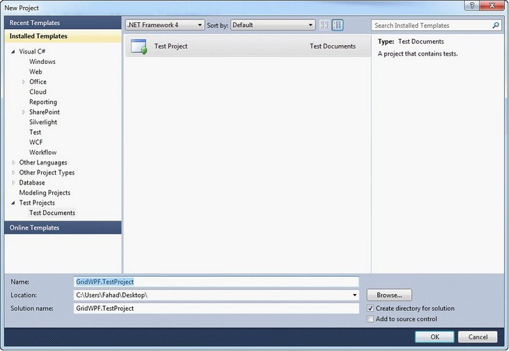
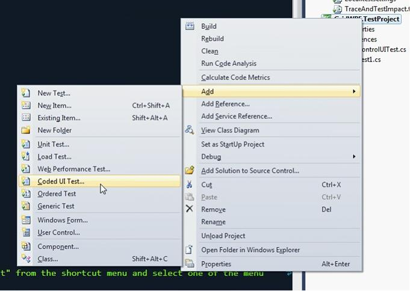
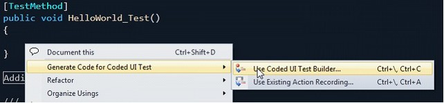
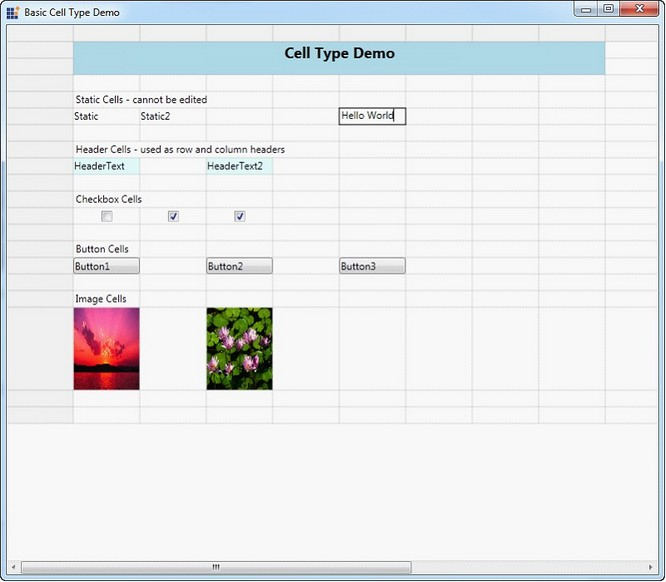
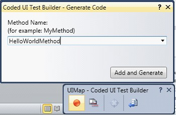
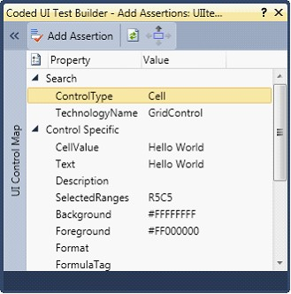
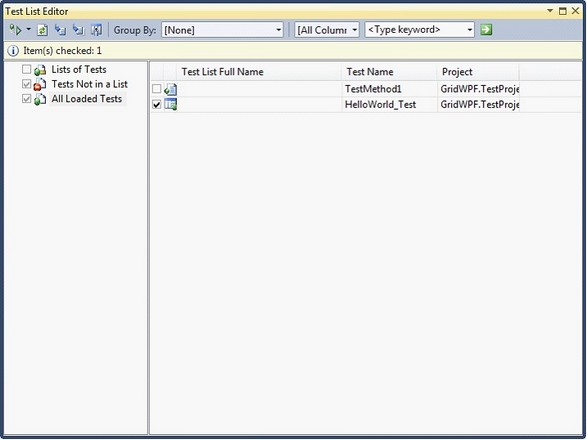
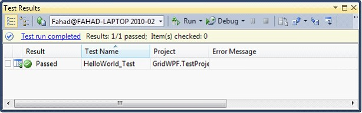

::: {style="DISPLAY: none"}
{#d2h_url_template}{#d2h_package_url style="WIDTH: 0px; DISPLAY: none; HEIGHT: 0px"}
:::

:::::::: {.d2h_secondary_topic style="PADDING-BOTTOM: 10pt; MARGIN: 0pt; PADDING-LEFT: 0pt; PADDING-RIGHT: 0pt; PADDING-TOP: 0pt"}
#### VS 2010 Coded UI Testing {#vs-2010-coded-ui-testing style="tab-stops: 0pt"}

Essential Grid WPF now supports automated UI testing with VS 2010 Coded UI technology. The Grid Test plugin blends in with the automated UI Testing framework in VS 2010 by implementing the following classes:

 

[·      ]{style="FONT-FAMILY: Symbol"}UITechnologyManager

[·      ]{style="FONT-FAMILY: Symbol"}UITestPropertyProvider

[·      ]{style="FONT-FAMILY: Symbol"}UIActionFilter

[]{style="COLOR: #15428b"} 

The architectural diagram is as follows:

{border="0"}

Figure 115: Architectural Diagram

[]{style="FONT-FAMILY: 'Calibri','sans-serif'"} 

[·      ]{style="FONT-FAMILY: Symbol"}Grid Test Plugin implements the necessary details to communicate with the VS 2010 Test Framework.

[·      ]{style="FONT-FAMILY: Symbol"}The Grid application host runs with a .NET Remoting channel hosted internally to communicate with the Test plugin through an interface. The data is then channeled across to the VS 2010 Test Framework to identify the Cells.

 

Properties

Following are the properties exposed in Coded UI Testing:

**[]{style="COLOR: #15428b"}** 

[·      ]{style="FONT-FAMILY: Symbol"}CellValue

[·      ]{style="FONT-FAMILY: Symbol"}Text

[·      ]{style="FONT-FAMILY: Symbol"}Description

[·      ]{style="FONT-FAMILY: Symbol"}SelectedRanges

[·      ]{style="FONT-FAMILY: Symbol"}Background

[·      ]{style="FONT-FAMILY: Symbol"}Foreground

[·      ]{style="FONT-FAMILY: Symbol"}Borders

[·      ]{style="FONT-FAMILY: Symbol"}Format

[·      ]{style="FONT-FAMILY: Symbol"}FormulaTag

 

Creating a Coded UI Test With Essential Grid WPF

Initial steps before creating the Coded UI Test project:

 

[·      ]{style="FONT-FAMILY: Symbol"}Prepare the Grid sample application.

[·      ]{style="FONT-FAMILY: Symbol"}Write Unit tests using VS 2010.

[·      ]{style="FONT-FAMILY: Symbol"}Testing the application with generated Coded UI Tests.

 

Preparing the Grid application

 

1.   Syncfusion.VisualStudio.TestTools.UITest.GridExtensions.dll contains implementation to easily change an existing application to the test application that the plugin would require. Add a reference to this assembly.

2.   Open App.xaml.

 

::: {style="BORDER-BOTTOM: windowtext 1pt solid; BORDER-LEFT: medium none; PADDING-BOTTOM: 1pt; MARGIN-TOP: 9pt; PADDING-LEFT: 0pt; PADDING-RIGHT: 0pt; MARGIN-BOTTOM: 9pt; BORDER-TOP: windowtext 1pt solid; BORDER-RIGHT: medium none; PADDING-TOP: 1pt"}
[{border="0"}]{style="FONT-SIZE: 12pt"}Note: The following code appears.
:::

+---------------------------------------------------------------------------------------------------------------+
| [\[XAML\]]{style="FONT-FAMILY: 'Courier New'"}                                                                |
|                                                                                                               |
| [\<Application x:Class=\"WpfApplication3.App\"]{style="FONT-FAMILY: 'Courier New'"}                           |
|                                                                                                               |
| [    xmlns=\"http://schemas.microsoft.com/winfx/2006/xaml/presentation\"]{style="FONT-FAMILY: 'Courier New'"} |
|                                                                                                               |
| [    xmlns:x=\"http://schemas.microsoft.com/winfx/2006/xaml\"]{style="FONT-FAMILY: 'Courier New'"}            |
|                                                                                                               |
| [    StartupUri=\"Window1.xaml\"\>]{style="FONT-FAMILY: 'Courier New'"}                                       |
|                                                                                                               |
| [    \<Application.Resources\>]{style="FONT-FAMILY: 'Courier New'"}                                           |
|                                                                                                               |
| [         ]{style="FONT-FAMILY: 'Courier New'"}                                                               |
|                                                                                                               |
| [    \</Application.Resources\>]{style="FONT-FAMILY: 'Courier New'"}                                          |
|                                                                                                               |
| [\</Application\>]{style="FONT-FAMILY: 'Courier New'"}                                                        |
+---------------------------------------------------------------------------------------------------------------+

[]{style="FONT-FAMILY: 'Calibri','sans-serif'"} 

3.   Change Application to Syncfusion:GridControlTestApplication as follows.

 

+------------------------------------------------------------------------------------------------------------------------+
| [\[XAML\]]{style="FONT-FAMILY: 'Calibri','sans-serif'"}                                                                |
|                                                                                                                        |
| [\<syncfusion:GridControlTestApplication x:Class=\"WpfApplication3.App\"]{style="FONT-FAMILY: 'Calibri','sans-serif'"} |
|                                                                                                                        |
| [    xmlns=\"http://schemas.microsoft.com/winfx/2006/xaml/presentation\"]{style="FONT-FAMILY: 'Calibri','sans-serif'"} |
|                                                                                                                        |
| [    xmlns:syncfusion=\"http://schemas.syncfusion.com/wpf\"]{style="FONT-FAMILY: 'Calibri','sans-serif'"}              |
|                                                                                                                        |
| [    xmlns:x=\"http://schemas.microsoft.com/winfx/2006/xaml\"]{style="FONT-FAMILY: 'Calibri','sans-serif'"}            |
|                                                                                                                        |
| [    StartupUri=\"Window1.xaml\"\>]{style="FONT-FAMILY: 'Calibri','sans-serif'"}                                       |
|                                                                                                                        |
| [    \<syncfusion:GridControlTestApplication.Resources\>]{style="FONT-FAMILY: 'Calibri','sans-serif'"}                 |
|                                                                                                                        |
| []{style="FONT-FAMILY: 'Calibri','sans-serif'"}                                                                        |
|                                                                                                                        |
| [    \</syncfusion:GridControlTestApplication.Resources\>]{style="FONT-FAMILY: 'Calibri','sans-serif'"}                |
|                                                                                                                        |
| [\</syncfusion:GridControlTestApplication\>]{style="FONT-FAMILY: 'Calibri','sans-serif'"}                              |
+------------------------------------------------------------------------------------------------------------------------+

[]{style="COLOR: #15428b"} 

4.   For the code behind file (App.xaml.cs), make sure to inherit from GridControlTestApplication.

**[]{style="COLOR: #15428b"}** 

+-------------------------------------------------------------------------------------------------+
| [namespace WpfApplication3]{style="FONT-FAMILY: 'Courier New'"}                                 |
|                                                                                                 |
| [{]{style="FONT-FAMILY: 'Courier New'"}                                                         |
|                                                                                                 |
| [    /// \<summary\>]{style="FONT-FAMILY: 'Courier New'"}                                       |
|                                                                                                 |
| [    /// Interaction logic for App.xaml]{style="FONT-FAMILY: 'Courier New'"}                    |
|                                                                                                 |
| [    /// \</summary\>]{style="FONT-FAMILY: 'Courier New'"}                                      |
|                                                                                                 |
| [    public partial class App : GridControlTestApplication]{style="FONT-FAMILY: 'Courier New'"} |
|                                                                                                 |
| [    {]{style="FONT-FAMILY: 'Courier New'"}                                                     |
|                                                                                                 |
| [    }]{style="FONT-FAMILY: 'Courier New'"}                                                     |
|                                                                                                 |
| [}]{style="FONT-FAMILY: 'Courier New'"}                                                         |
+-------------------------------------------------------------------------------------------------+

[]{style="COLOR: #15428b"} 

5.   Build the application to make it ready for testing.

 

::: {style="BORDER-BOTTOM: windowtext 1pt solid; BORDER-LEFT: medium none; PADDING-BOTTOM: 1pt; MARGIN-TOP: 9pt; PADDING-LEFT: 0pt; PADDING-RIGHT: 0pt; MARGIN-BOTTOM: 9pt; BORDER-TOP: windowtext 1pt solid; BORDER-RIGHT: medium none; PADDING-TOP: 1pt"}
[{border="0"}]{style="FONT-SIZE: 12pt"}Note: The GridControlTestApplication works only with a single Grid instance in the window. For multiple instances the IGridInteropService interface has to be implemented.
:::

 

Creating Unit Tests with VS2010

**[]{style="COLOR: #15428b"}** 

1.   Create a new Test Project in VS2010,

{border="0"}

Figure 116: New Project

**[]{style="COLOR: #15428b"}** 

***[]{style="COLOR: #15428b"}*** 

2.   Add a new Coded UI Test item for the project.

 

{border="0"}

 Figure 117: Add Coded UI Test

 

 

3.   Add a TestMethod called HelloWorld_Test.

[]{style="COLOR: #15428b"} 

The following code illustrates this.

 

+-----------------------------------------------------------------------------+
| [      \[TestMethod\]]{style="FONT-FAMILY: 'Courier New'"}                  |
|                                                                             |
| [        public void HelloWorld_Test()]{style="FONT-FAMILY: 'Courier New'"} |
|                                                                             |
| [        {]{style="FONT-FAMILY: 'Courier New'"}                             |
|                                                                             |
| []{style="FONT-FAMILY: 'Courier New'"}                                      |
|                                                                             |
| [        }]{style="FONT-FAMILY: 'Courier New'"}                             |
+-----------------------------------------------------------------------------+

[]{style="COLOR: #15428b"} 

4.   Build and run the Grid application that you configured.

[·      ]{style="FONT-FAMILY: Symbol"}Right-click on the TestMethod body and then select as below,

{border="0"}

Figure 118: Generate Code

***[]{style="COLOR: #15428b"}*** 

***[]{style="COLOR: #15428b"}*** 

5.   Click on the record button to perform actions, you can add a Hello World text in a grid cell \[x, y\] in this scenario.

[]{style="COLOR: #15428b"} 

{border="0"}

Figure 119: UI Recorder

***[]{style="COLOR: #15428b"}*** 

[]{style="FONT-FAMILY: 'Calibri','sans-serif'"} 

{border="0"}

Figure 120: Hello World Text In a Cell

***[]{style="COLOR: #15428b"}*** 

[]{style="COLOR: #15428b"} 

6.   Click on Generate code in the Coded UI Test Builder.

{border="0"}

Figure 121: Add And Generate

[]{style="COLOR: #15428b"} 

7.   You can assert the cell value using the cross-hair present in the Coded UI Test builder.

8.   Click on the cross-hair and hover to the Hello World cell.

::: {style="BORDER-BOTTOM: windowtext 1pt solid; BORDER-LEFT: medium none; PADDING-BOTTOM: 1pt; MARGIN-TOP: 9pt; PADDING-LEFT: 0pt; PADDING-RIGHT: 0pt; MARGIN-BOTTOM: 9pt; BORDER-TOP: windowtext 1pt solid; BORDER-RIGHT: medium none; PADDING-TOP: 1pt"}
{border="0"}Note:  The assert window is displayed as below.
:::

[]{style="COLOR: #15428b"} 

[]{style="COLOR: #15428b"} 

{border="0"}

Figure 122: Assert Window

***[]{style="COLOR: #15428b"}*** 

9.   Add asserts to the properties displayed in the assert window and generate the assert method.

10.  Close the Coded UI Test builder.

*[]{style="COLOR: #15428b"}* 

::: {style="BORDER-BOTTOM: windowtext 1pt solid; BORDER-LEFT: medium none; PADDING-BOTTOM: 1pt; MARGIN-TOP: 9pt; PADDING-LEFT: 0pt; PADDING-RIGHT: 0pt; MARGIN-BOTTOM: 9pt; BORDER-TOP: windowtext 1pt solid; BORDER-RIGHT: medium none; PADDING-TOP: 1pt"}
Note: Coded UI Unit Test is created.
:::

The following code generates automatically.

[]{style="COLOR: #15428b"} 

+-------------------------------------------------------------------------------------------+
| [\[TestMethod\]]{style="FONT-FAMILY: 'Calibri','sans-serif'"}                             |
|                                                                                           |
| [        public void HelloWorld_Test()]{style="FONT-FAMILY: 'Calibri','sans-serif'"}      |
|                                                                                           |
| [        {]{style="FONT-FAMILY: 'Calibri','sans-serif'"}                                  |
|                                                                                           |
| [            this.UIMap.HelloWorldMethod();]{style="FONT-FAMILY: 'Calibri','sans-serif'"} |
|                                                                                           |
| [            this.UIMap.HelloWorldAssert();]{style="FONT-FAMILY: 'Calibri','sans-serif'"} |
|                                                                                           |
| [        }]{style="FONT-FAMILY: 'Calibri','sans-serif'"}                                  |
+-------------------------------------------------------------------------------------------+

**[]{style="COLOR: #15428b"}** 

Testing the Application with Generated Coded UI Test

1.   Build and run the Grid WPF application.

2.   Build the test project and run the Unit tests using VS 2010.

[]{style="COLOR: #15428b"} 

{border="0"}

Figure 123: Test List

 

3.   Run the test HelloWorld_Test.

[o  ]{style="FONT-FAMILY: 'Courier New'"}This will automatically focus the running Grid application and perform automated testing.

::: {style="BORDER-BOTTOM: windowtext 1pt solid; BORDER-LEFT: medium none; PADDING-BOTTOM: 1pt; MARGIN-TOP: 9pt; PADDING-LEFT: 0pt; PADDING-RIGHT: 0pt; MARGIN-BOTTOM: 9pt; BORDER-TOP: windowtext 1pt solid; BORDER-RIGHT: medium none; PADDING-TOP: 1pt"}
 

[{border="0"}]{style="FONT-SIZE: 12pt"}Note: The sample test procedure mentioned above requires the sample to be run individually, in normal automated testing, this would be included in the TestInitialize method to start the application.
:::

**[]{style="COLOR: #15428b"}** 

{border="0"}\
Figure 124: *Test Result*

**** 

**** 

[]{#related-topics}
::::::::
