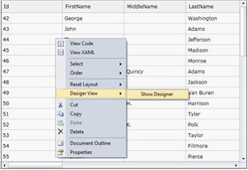
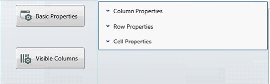
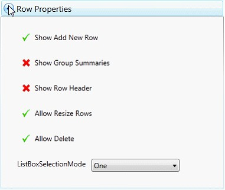
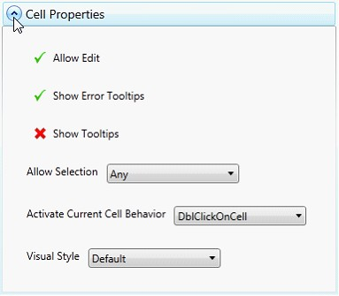
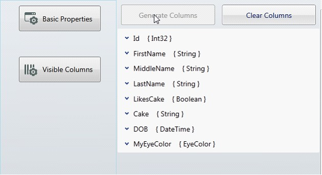
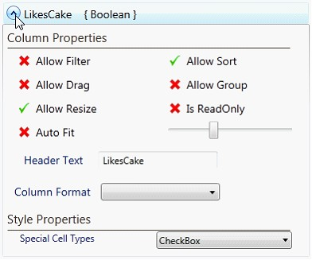

::: {style="DISPLAY: none"}
{#d2h_url_template}{#d2h_package_url style="WIDTH: 0px; DISPLAY: none; HEIGHT: 0px"}
:::

::::: {#nsbanner .d2h_main_nsbanner style="BORDER-BOTTOM: #999999 1px solid; POSITION: relative; PADDING-BOTTOM: 0px; BACKGROUND-COLOR: transparent; PADDING-LEFT: 0px; PADDING-RIGHT: 0px; DISPLAY: none; BORDER-TOP: #999999 1px solid; PADDING-TOP: 0px; LEFT: 0px"}
:::: {#TitleRow .d2h_main_titlerow style="PADDING-BOTTOM: 4px; BACKGROUND-COLOR: transparent; PADDING-LEFT: 22px; WIDTH: 100%; PADDING-RIGHT: 10px; DISPLAY: none; PADDING-TOP: 4px"}
::: {#ienav .d2h_main_ienav style="DISPLAY: none"}
{#D2HPrevious .D2HPreviousEnabled}  {#D2HNext .D2HNextEnabled}
:::
::::
:::::

:::: {#nstext .d2h_main_nstext style="PADDING-BOTTOM: 10px; BACKGROUND-COLOR: transparent; PADDING-LEFT: 22px; PADDING-RIGHT: 10px; HEIGHT: 100%; OVERFLOW: auto; PADDING-TOP: 5px" hasuserbackground="true" valign="bottom"}
::: {#d2h_breadcrumbs .d2h_breadcrumbs}
[Essential Studio User Guide Documentation](ms-xhelp:///?Id=12457748-09e3-4d74-a240-8e049cedf030){.d2h_breadcrumbsNormal}[ \> ]{.d2h_breadcrumbsLinkSeparator}[User Interface Edition](ms-xhelp:///?Id=c29296b7-531c-413b-a0ec-488ca1f7f669){.d2h_breadcrumbsNormal}[ \> ]{.d2h_breadcrumbsLinkSeparator}[Essential Silverlight](ms-xhelp:///?Id=66221bd1-ba2e-43c2-94a7-618f50e01d24){.d2h_breadcrumbsNormal}[ \> ]{.d2h_breadcrumbsLinkSeparator}[Essential Grid]{.d2h_breadcrumbsContentsOnly}[ \> ]{.d2h_breadcrumbsLinkSeparator}[Concepts and Features](ms-xhelp:///?Id=8126789d-b192-4c3c-9e36-f0119f12b8b9){.d2h_breadcrumbsNormal}[ \> ]{.d2h_breadcrumbsLinkSeparator}[Grid Data Control](ms-xhelp:///?Id=274d1d61-9e05-49c5-b342-4e032fc4daa1){.d2h_breadcrumbsNormal}
:::

### VS2010 Designer support {#vs2010-designer-support style="tab-stops: 0pt"}

GridDataControl provides a rich design-time experience by utilizing a designer, which allows users to modify the various grid settings, affecting the look and feel of a grid.

Once the grid has an ItemsSource assigned, the grid designer populates with numerous options and allows you to edit the basic grid properties and the properties of individual columns. Any change in any of these properties in the designer will have an immediate impact on the XAML code, allowing the designer to make the grid easy to use and more user-friendly.

Activating Designer

1.   Open the design window, right-click on the grid and then select **Designer View, Show Designer**. Ensure that the grid has been assigned an ItemsSource; you will then see the Designer window.

[]{style="FONT-FAMILY: 'Calibri','sans-serif'"} 

{border="0"}

Figure 174: Activating Designer

[]{style="FONT-FAMILY: 'Calibri','sans-serif'"} 

[]{style="FONT-FAMILY: 'Calibri','sans-serif'"} 

{border="0"}

Figure 175: Designer

[]{style="FONT-FAMILY: 'Calibri','sans-serif'"} 

Basic Properties

The Basic Properties option lets you modify the overall settings of a grid. These properties are categorized into three types: Column Properties, Row Properties, and Cell Properties.

{border="0"}

Figure 176: Basic Properties

**[]{style="FONT-FAMILY: 'Trebuchet MS','sans-serif'; COLOR: #15428b; FONT-SIZE: 9pt"}** 

The **Column Properties** section provides various column options such as AutoPopulate Columns, AutoPopulate Relations, Allow Sort, Allow Drag Columns, Allow Resize Columns, Show Column Options, Show Filters, Show Group Drop Area, and Column Sizer options.

[]{style="FONT-FAMILY: 'Trebuchet MS','sans-serif'; COLOR: #15428b; FONT-SIZE: 9pt"} 

{border="0"}

Figure 177: Column Properties

The **Row Properties** section explores the row-related properties such as Show Add New, Show Group Summaries, Show Row Header, Allow Resize Rows, Allow Delete, and List Box Selection Modes.

{border="0"}

Figure 178: Row Properties

The **Cell Properties** section explores cell-level properties such as Allow Edit, Show Error ToolTips, Show ToolTips, Allow Selection options, Activate Current Cell Behavior options, and Visual Style options.

{border="0"}

Figure 179: Cell Properties

Visible Columns

This section automatically generates a property listing for each visible column in the grid. Each listing includes column-level properties such as Allow Filter, Allow Sort, Allow Drag, Allow Group, Allow Resize, Is Read Only, AutoFit, Width, Header Text, Column Format options, and Cell Type options.

Below is what you see when you click the Visible Columns button.

{border="0"}

Figure 180:Visible Columns

Click the Generate Columns button to populate the properties for each visible column. You can clear the visible column settings by clicking the Clear Columns button.

{border="0"}

Figure 181: Property listing for a column named FirstName

***[]{style="FONT-FAMILY: 'Trebuchet MS','sans-serif'; COLOR: #15428b; FONT-SIZE: 9pt"}*** 

{border="0"}

Figure 182: First Name

Special Cell Types

The Special Cell Types combo box lists the various cell types applicable to the column. It also automatically deducts the column type of the grid columns and sets the cell type. For example, if the column is a Boolean type, it will automatically have a check box.

{border="0"}

Figure 183: Special Cell Types

 

[]{#related-topics}
::::
