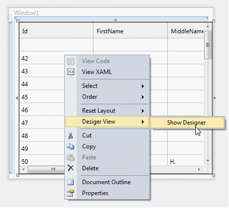
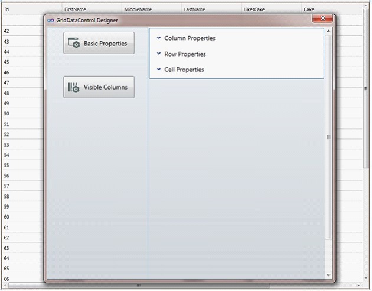
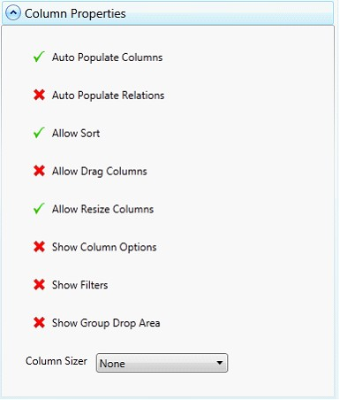
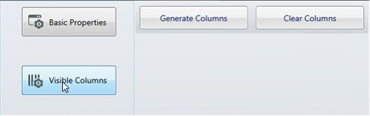
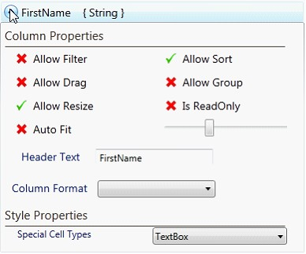
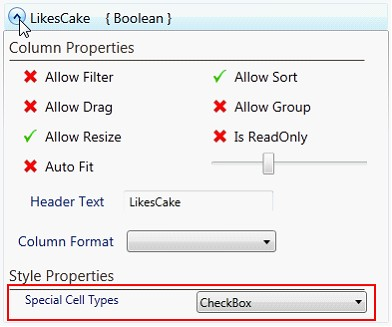

::: {style="DISPLAY: none"}
{#d2h_url_template}{#d2h_package_url style="WIDTH: 0px; DISPLAY: none; HEIGHT: 0px"}
:::

::::: {#nsbanner .d2h_main_nsbanner style="BORDER-BOTTOM: #999999 1px solid; POSITION: relative; PADDING-BOTTOM: 0px; BACKGROUND-COLOR: transparent; PADDING-LEFT: 0px; PADDING-RIGHT: 0px; DISPLAY: none; BORDER-TOP: #999999 1px solid; PADDING-TOP: 0px; LEFT: 0px"}
:::: {#TitleRow .d2h_main_titlerow style="PADDING-BOTTOM: 4px; BACKGROUND-COLOR: transparent; PADDING-LEFT: 22px; WIDTH: 100%; PADDING-RIGHT: 10px; DISPLAY: none; PADDING-TOP: 4px"}
::: {#ienav .d2h_main_ienav style="DISPLAY: none"}
{#D2HPrevious .D2HPreviousEnabled}  {#D2HNext .D2HNextEnabled}
:::
::::
:::::

::::::: {#nstext .d2h_main_nstext style="PADDING-BOTTOM: 10px; BACKGROUND-COLOR: transparent; PADDING-LEFT: 22px; PADDING-RIGHT: 10px; HEIGHT: 100%; OVERFLOW: auto; PADDING-TOP: 5px" hasuserbackground="true" valign="bottom"}
::: {#d2h_breadcrumbs .d2h_breadcrumbs}
[Essential Studio User Guide Documentation](ms-xhelp:///?Id=12457748-09e3-4d74-a240-8e049cedf030){.d2h_breadcrumbsNormal}[ \> ]{.d2h_breadcrumbsLinkSeparator}[User Interface Edition](ms-xhelp:///?Id=c29296b7-531c-413b-a0ec-488ca1f7f669){.d2h_breadcrumbsNormal}[ \> ]{.d2h_breadcrumbsLinkSeparator}[Essential WPF](ms-xhelp:///?Id=7f4f82c5-151c-4262-94d0-75c4626c77bc){.d2h_breadcrumbsNormal}[ \> ]{.d2h_breadcrumbsLinkSeparator}[Essential Grid]{.d2h_breadcrumbsContentsOnly}[ \> ]{.d2h_breadcrumbsLinkSeparator}[Installation and Deployment](ms-xhelp:///?Id=094c35c7-db8e-4341-9619-16644b2a4e34){.d2h_breadcrumbsNormal}[ \> ]{.d2h_breadcrumbsLinkSeparator}[Grid WPF Controls](ms-xhelp:///?Id=1249c159-5431-465a-b1af-1cf1e5e90ac8){.d2h_breadcrumbsNormal}[ \> ]{.d2h_breadcrumbsLinkSeparator}[GridData Control](ms-xhelp:///?Id=e9aeb59d-d6ab-4862-87f7-4f169b1d763e){.d2h_breadcrumbsNormal}
:::

### VS2010 Designer support  {#vs2010-designer-support style="tab-stops: 0pt"}

GridDataControl provides rich design time experience by associating a designer. This allows the users to modify the various grid settings to change the look and feel of the grid.

 

The grid designer is populated with numerous options when ItemsSource assigned to the grid. This enables the users to edit the basic grid properties and the properties of individual column. Changes in any of these properties in the designer will have an immediate impact on its XAML code and hence the designer makes the grid more user-friendly.

 

Activating Designer

1.   Open Design window.

2.   Right-click on the grid.

::: {style="BORDER-BOTTOM: windowtext 1pt solid; BORDER-LEFT: medium none; PADDING-BOTTOM: 1pt; MARGIN-TOP: 9pt; PADDING-LEFT: 0pt; PADDING-RIGHT: 0pt; MARGIN-BOTTOM: 9pt; BORDER-TOP: windowtext 1pt solid; BORDER-RIGHT: medium none; PADDING-TOP: 1pt"}
 

Note: An edit menu opens.
:::

 

 

{border="0"}

Figure 245: *Edit Menu*

 

3.   Select Designer View -\> Show Designer.

::: {style="BORDER-BOTTOM: windowtext 1pt solid; BORDER-LEFT: medium none; PADDING-BOTTOM: 1pt; MARGIN-TOP: 9pt; PADDING-LEFT: 0pt; PADDING-RIGHT: 0pt; MARGIN-BOTTOM: 9pt; BORDER-TOP: windowtext 1pt solid; BORDER-RIGHT: medium none; PADDING-TOP: 1pt"}
{border="0"}Note: Ensure that the grid is assigned with an ItemsSource.
:::

4.   Designer Window is displayed.

**[]{style="FONT-FAMILY: 'Calibri','sans-serif'"}** 

Designer Window has two options:

 

[·      ]{style="FONT-FAMILY: Symbol"}Basic Properties - Modify the overall settings of the grid.

[·      ]{style="FONT-FAMILY: Symbol"}Visible Columns - Automatically generates a property list for each visible column in the grid.

 

{border="0"}

Figure 246: Designer Window

[]{style="FONT-FAMILY: 'Calibri','sans-serif'; COLOR: #4f81bd"} 

Basic Properties

 

This option enables the users to modify the overall settings of the grid. The properties are categorized into three types:

 

[·      ]{style="FONT-FAMILY: Symbol"}Column Properties

[·      ]{style="FONT-FAMILY: Symbol"}Row Properties

[·      ]{style="FONT-FAMILY: Symbol"}Cell Properties

 

{border="0"}

Figure 247: Basic Properties

 

 

Column Properties

 

This section explores the various column options such as Auto Populate Columns, Auto Populate Relations, Allow Sort, Allow Drag Columns, Allow Resize Columns, Show Column Options, Show Filters, Show Group Drop Area and Column Sizer combo box.

 

1.   Select as you require in this list.

 

{border="0"}

Figure 248: Column Properties

[]{style="FONT-FAMILY: 'Calibri','sans-serif'"} 

Row Properties

 

 This section explores the row-related properties such as Show Add New, Show Group Summaries, Show Row Header, Allow Resize Rows, Allow Delete and List Box Selection Modes combo box.

 

Select as you require in this list.

 

{border="0"}

Figure 249: Row Properties

 

Cell Properties

 

This section explores cell level properties such as Allow Edit, Show Error Tooltips, Show Tooltips, Allow Selection combo box, Activate Current Cell Behavior combo box and Visual Style combo box.

 

{border="0"}

Figure 250: Cell Properties

*[]{style="FONT-FAMILY: 'Calibri','sans-serif'"}* 

Select as you require in this list.

Visible Columns

 

This section automatically generates a property list for each visible column in the grid. Each list includes the column level properties such as Allow Filter, Allow Sort, Allow Drag, Allow Group, Allow Resize, Is Read Only, Auto fit, Width, Header Text field, Column Format combo box and Cell Type combo box.

 

[·      ]{style="FONT-FAMILY: Symbol"}Click Visible Columns.

[·      ]{style="FONT-FAMILY: Symbol"}Two options are displayed

[o  ]{style="FONT-FAMILY: 'Courier New'"}Generate Columns

[o  ]{style="FONT-FAMILY: 'Courier New'"}Clear Columns

 

{border="0"}

Figure 251: Visual Column Options

[]{style="FONT-FAMILY: 'Calibri','sans-serif'"} 

Generate Columns

1.   Click Generate Columns to populate the properties for each visible column.

::: {style="BORDER-BOTTOM: windowtext 1pt solid; BORDER-LEFT: medium none; PADDING-BOTTOM: 1pt; MARGIN-TOP: 9pt; PADDING-LEFT: 0pt; PADDING-RIGHT: 0pt; MARGIN-BOTTOM: 9pt; BORDER-TOP: windowtext 1pt solid; BORDER-RIGHT: medium none; PADDING-TOP: 1pt"}
[{border="0"}]{style="FONT-SIZE: 12pt"}Note: Property list for visible column in the grid displays.
:::

 

{border="0"}

Figure 252: Property List of Visible Column In the Grid

 

2.   Select as you require.

 

{border="0"}

Figure 253: First Name Column Property List

 

 

Special Cell Types

This combo box lists the various possible cell types applicable to the column. It also automatically deducts the column type of the grid columns and sets the CellType of it. For example, if the column is of Boolean type, it will automatically have a CheckBox.

 

{border="0"}

Figure 254: Special Cell Types

 

Clear Columns

 

Click Clear Columns to clear the visible column settings.

**[]{style="COLOR: #15428b"}** 

[]{style="COLOR: #15428b"} 

[]{#related-topics}
:::::::
