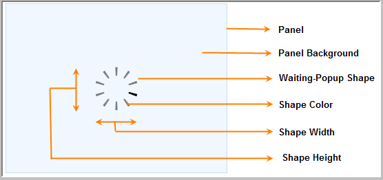

::: {style="DISPLAY: none"}
{#d2h_url_template}{#d2h_package_url style="WIDTH: 0px; DISPLAY: none; HEIGHT: 0px"}
:::

::: {.d2h_secondary_topic style="PADDING-BOTTOM: 10pt; MARGIN: 0pt; PADDING-LEFT: 0pt; PADDING-RIGHT: 0pt; PADDING-TOP: 0pt"}
#### Waiting Popup Control using HTML5 {#waiting-popup-control-using-html5 style="tab-stops: 0pt"}

 

This control is the same as the Waiting Pop-up control of MVC tools, except that it is designed using the HTML5 Canvas element. Hence, images can't be used in the Waiting Pop-up; the 4 in-built shapes are used instead. 

This is a client-side control and so it can be loaded a lot quicker than the ordinary Waiting Pop-up.

The following figure gives you a basic idea of the structure and appearance of the Waiting Pop-up in HTML5:

 

{border="0"}

Figure 340: Waiting Pop-up in HTML 5

 

Use Case Scenarios

You can load the control in lesser time because all processes are in the client-side.

You can customize the look and feel of the Waiting Pop-up in HTML5 using the 4 built-in shapes .

 

 

Where do I find Installed samples?

To view the samples:

1.   Click **Dashboard**. The Essential Studio Enterprise Edition window is displayed.  

2.   Click the **Run Locally Installed Samples** link.

3.   Select **Tools** from the drop-down.

4.   Select the **Waiting Pop-**up tab and browse through the samples.

 

More:

[ ]{#related-topics}

[{border="0" align="absMiddle"}Adding Waiting pop-up in HTML5 to an MVC application](ms-xhelp:///?Id=571b79a8-9c1c-4ccd-a41a-a06e777f6682){style="TEXT-DECORATION: none"}

[{border="0" align="absMiddle"}Properties and Methods](ms-xhelp:///?Id=d612d3bd-698a-4ef4-a220-19f4dfd554ea){style="TEXT-DECORATION: none"}

[{border="0" align="absMiddle"}Features of the Waiting pop-up in HTML5](ms-xhelp:///?Id=b4db16c5-8c0a-47f4-98bf-200ec7354297){style="TEXT-DECORATION: none"}
:::
