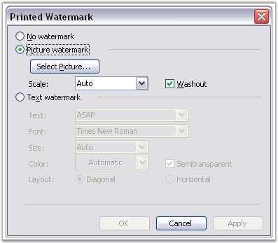
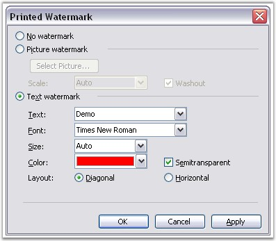

::: {style="DISPLAY: none"}
{#d2h_url_template}{#d2h_package_url style="WIDTH: 0px; DISPLAY: none; HEIGHT: 0px"}
:::

:::::::: {.d2h_secondary_topic style="PADDING-BOTTOM: 10pt; MARGIN: 0pt; PADDING-LEFT: 0pt; PADDING-RIGHT: 0pt; PADDING-TOP: 0pt"}
#### Watermark {#watermark style="tab-stops: 0pt"}

 

**Watermark** class represents printed watermark in the Word document.

 

To insert a watermark into the Word document, open the **Format** menu, point to **Background**, and then click **Printed Watermark**. There are two types of watermarks.

 

[·      ]{style="FONT-FAMILY: Symbol"}Picture Watermark

[·      ]{style="FONT-FAMILY: Symbol"}Text Watermark

 

The type of watermark is defined by using the **Type** property. This property returns the object of type, WatermarkType. It includes the following options.

 

[·      ]{style="FONT-FAMILY: Symbol"}**NoWatermark**: document does not have watermark

[·      ]{style="FONT-FAMILY: Symbol"}**PictureWatermark**: document has picture watermark

[·      ]{style="FONT-FAMILY: Symbol"}**TextWatermark**: document has text watermark

 

You can create a Picture Watermark or Text Watermark, but you cannot create an object of the Watermark class.

 

Watermark is a paragraph item. It is found in the first paragraph of the header / footer subdocument. DocIO Watermark is accessible through the **WordDocument.Watermark** property.

 

**Class Hierarchy**

 

ParagraphItem

            \|

            Watermark

 

**Public Properties**

 

::: {align="center"}
  ------------ ----------------------------------
  **Name**     **Description**
  EntityType   Gets the type of the entity.  
  Type         Gets or sets the watermark type.
  ------------ ----------------------------------
:::

 

**Picture Watermark**

 

**PictureWatermark** class represents the picture watermark in the Word document.

 

{border="0"}

Figure 29: Selecting Picture Watermark in Printed Watermark Dialog Box

 

**Picture** property defines the picture to be used as the watermark. **Scaling** property defines the watermark scaling (in percents). **Washout** property defines whether the washout effect is to be applied to the watermark. Default value for **Washout** property is set to **True**.

 

**Class Hierarchy**

 

ParagraphItem

            \|

            Watermark

                        \|

                                 PictureWatermark

 

**Public Constructors**

 

::: {align="center"}
  ------------------------------------------------ -------------------------------------------------------------
  Name                                             Description
  PictureWatermark.PictureWatermark()              Initializes a new instance of the PictureWatermark class.  
  PictureWatermark.PictureWatermark(Image, bool)   Initializes a new instance of the PictureWatermark class.
  ------------------------------------------------ -------------------------------------------------------------
:::

 

Public Properties

 

::: {align="center"}
  ------------ --------------------------------------------------------
  Name         Description
  EntityType   Gets the type of the entity.  
  Picture      Gets or sets picture for Picture watermark.  
  Scaling      Gets or sets picture scaling in percents.  
  Washout      Gets or sets Washout property for Picture watermark.  
  ------------ --------------------------------------------------------
:::

 

The following example illustrates how to use the PictureWatermark class.                       

 

+------------------------------------------------------------------------------------------------------------------------------------------------------------------------------------------------+
| **[\[C#\]]{style="FONT-FAMILY: 'Courier New'; COLOR: black"}**                                                                                                                                 |
|                                                                                                                                                                                                |
| []{style="COLOR: black"}                                                                                                                                                                       |
|                                                                                                                                                                                                |
| [IWordDocument]{style="FONT-FAMILY: 'Courier New'; COLOR: teal"}[ doc = [new]{style="COLOR: blue"} [WordDocument]{style="COLOR: teal"}();]{style="FONT-FAMILY: 'Courier New'"}                 |
|                                                                                                                                                                                                |
| [doc.EnsureMinimal();]{style="FONT-FAMILY: 'Courier New'"}                                                                                                                                     |
|                                                                                                                                                                                                |
| [PictureWatermark]{style="FONT-FAMILY: 'Courier New'; COLOR: teal"}[ picWatermark = [new]{style="COLOR: blue"} [PictureWatermark]{style="COLOR: teal"}();]{style="FONT-FAMILY: 'Courier New'"} |
|                                                                                                                                                                                                |
| [picWatermark.Scaling = 120f;]{style="FONT-FAMILY: 'Courier New'"}                                                                                                                             |
|                                                                                                                                                                                                |
| [picWatermark.Washout = [true]{style="COLOR: blue"};]{style="FONT-FAMILY: 'Courier New'"}                                                                                                      |
|                                                                                                                                                                                                |
| [doc.Watermark = picWatermark;]{style="FONT-FAMILY: 'Courier New'"}                                                                                                                            |
|                                                                                                                                                                                                |
| [picWatermark.Picture = [Image]{style="COLOR: teal"}.FromFile(ImagesPath + [\"Water lilies.jpg\"]{style="COLOR: maroon"});]{style="FONT-FAMILY: 'Courier New'"}                                |
+------------------------------------------------------------------------------------------------------------------------------------------------------------------------------------------------+

 

+------------------------------------------------------------------------------------------------------------------------------------------------------------------------------------------------------+
| **[\[VB.NET\]]{style="FONT-FAMILY: 'Courier New'; COLOR: black"}**                                                                                                                                   |
|                                                                                                                                                                                                      |
| []{style="COLOR: black"}                                                                                                                                                                             |
|                                                                                                                                                                                                      |
| [Dim]{style="FONT-FAMILY: 'Courier New'; COLOR: blue"}[ doc [As]{style="COLOR: blue"} IWordDocument = [New]{style="COLOR: blue"} WordDocument()]{style="FONT-FAMILY: 'Courier New'"}                 |
|                                                                                                                                                                                                      |
| [doc.EnsureMinimal()]{style="FONT-FAMILY: 'Courier New'"}                                                                                                                                            |
|                                                                                                                                                                                                      |
| [Dim]{style="FONT-FAMILY: 'Courier New'; COLOR: blue"}[ picWatermark [As]{style="COLOR: blue"} PictureWatermark = [New]{style="COLOR: blue"} PictureWatermark()]{style="FONT-FAMILY: 'Courier New'"} |
|                                                                                                                                                                                                      |
| [picWatermark.Scaling = 120f]{style="FONT-FAMILY: 'Courier New'"}                                                                                                                                    |
|                                                                                                                                                                                                      |
| [picWatermark.Washout = [True]{style="COLOR: blue"}]{style="FONT-FAMILY: 'Courier New'"}                                                                                                             |
|                                                                                                                                                                                                      |
| [doc.Watermark = picWatermark]{style="FONT-FAMILY: 'Courier New'"}                                                                                                                                   |
|                                                                                                                                                                                                      |
| [picWatermark.Picture = Image.FromFile(ImagesPath & [\"Water lilies.jpg\"]{style="COLOR: maroon"})]{style="FONT-FAMILY: 'Courier New'"}                                                              |
+------------------------------------------------------------------------------------------------------------------------------------------------------------------------------------------------------+

 

**Text Watermark**

 

**TextWatermark** class represents the text watermark in the Word document. The following screen shot illustrates the Text Watermark settings.

 

{border="0"}

Figure 30: Selecting Text Watermark in Printed Watermark Dialog Box

 

**Text** property defines the text of the Text Watermark. **FontName** property defines the name of the text font. Default font name is **Times New Roman**. **Size** property defines the font size. Default font size is **36**. **Color** property defines the color of the text (font). Default font color is **Color.Gray**. **Semitransparent** property defines whether the text watermark is semi-transparent. Default value for this property is set to **True**.

 

**Layout** property defines the layout for the watermark.

 

[·      ]{style="FONT-FAMILY: Symbol"}**Diagonal**: diagonal watermark layout

[·      ]{style="FONT-FAMILY: Symbol"}**Horizontal**: horizontal watermark layout

 

Layout property returns the value of the **WatermarkLayout** type. Default layout is **Diagonal**.

 

**Class Hierarchy**

 

ParagraphItem

            \|

            Watermark

                        \|

                                TextWatermark

 

**Public Properties**

 

::: {align="center"}
  -------------------------------------------------------------------- --------------------------------------------------------
  Name                                                                 Description
  TextWatermark.TextWatermark ()                                       Initializes a new instance of the TextWatermark class.
  TextWatermark.TextWatermark (string)                                 Initializes a new instance of the TextWatermark class.
  TextWatermark.TextWatermark (string, string, int, WatermarkLayout)   Initializes a new instance of the TextWatermark class.
  -------------------------------------------------------------------- --------------------------------------------------------
:::

 

Public Properties

 

::: {align="center"}
  ----------------- -----------------------------------------------------------
  Name              Description
  Color             Gets or sets text watermark color.  
  EntityType        Gets the type of the entity.  
  FontName          Gets or sets watermark text\'s font name.  
  Layout            Gets or sets layout for Text watermark.  
  Semitransparent   Gets or sets semitransparent property for Text watermark.
  Size              Gets or sets the text watermark size (in points).
  Text              Gets or sets watermark text.
  ----------------- -----------------------------------------------------------
:::

 

The following example illustrates how to use the TextWatermark class.

 

+-------------------------------------------------------------------------------------------------------------------------------------------------------------------------------------------+
| **[\[C#\]]{style="FONT-FAMILY: 'Courier New'; COLOR: black"}**                                                                                                                            |
|                                                                                                                                                                                           |
| []{style="COLOR: black"}                                                                                                                                                                  |
|                                                                                                                                                                                           |
| [IWordDocument]{style="FONT-FAMILY: 'Courier New'; COLOR: teal"}[ doc = [new]{style="COLOR: blue"} [WordDocument]{style="COLOR: teal"}();]{style="FONT-FAMILY: 'Courier New'"}            |
|                                                                                                                                                                                           |
| [doc.EnsureMinimal();]{style="FONT-FAMILY: 'Courier New'"}                                                                                                                                |
|                                                                                                                                                                                           |
| [TextWatermark]{style="FONT-FAMILY: 'Courier New'; COLOR: teal"}[ textWatermark = [new]{style="COLOR: blue"} [TextWatermark]{style="COLOR: teal"}();]{style="FONT-FAMILY: 'Courier New'"} |
|                                                                                                                                                                                           |
| [doc.Watermark = textWatermark;]{style="FONT-FAMILY: 'Courier New'"}                                                                                                                      |
|                                                                                                                                                                                           |
| [textWatermark.Size = 96;]{style="FONT-FAMILY: 'Courier New'"}                                                                                                                            |
|                                                                                                                                                                                           |
| [textWatermark.Layout = [WatermarkLayout]{style="COLOR: teal"}.Horizontal;]{style="FONT-FAMILY: 'Courier New'"}                                                                           |
|                                                                                                                                                                                           |
| [textWatermark.Semitransparent = [false]{style="COLOR: blue"};]{style="FONT-FAMILY: 'Courier New'"}                                                                                       |
|                                                                                                                                                                                           |
| [textWatermark.Color = [Color]{style="COLOR: teal"}.Black;]{style="FONT-FAMILY: 'Courier New'"}                                                                                           |
|                                                                                                                                                                                           |
| [textWatermark.Text = [\"TextWatermark\"]{style="COLOR: maroon"}; ]{style="FONT-FAMILY: 'Courier New'"}                                                                                   |
+-------------------------------------------------------------------------------------------------------------------------------------------------------------------------------------------+

 

+-------------------------------------------------------------------------------------------------------------------------------------------------------------------------------------------------+
| **[\[VB.NET\]]{style="FONT-FAMILY: 'Courier New'; COLOR: black"}**                                                                                                                              |
|                                                                                                                                                                                                 |
|                                                                                                                                                                                                 |
|                                                                                                                                                                                                 |
| [Dim]{style="FONT-FAMILY: 'Courier New'; COLOR: blue"}[ doc [As]{style="COLOR: blue"} IWordDocument = [New]{style="COLOR: blue"} WordDocument()]{style="FONT-FAMILY: 'Courier New'"}            |
|                                                                                                                                                                                                 |
| [doc.EnsureMinimal()]{style="FONT-FAMILY: 'Courier New'"}                                                                                                                                       |
|                                                                                                                                                                                                 |
| [Dim]{style="FONT-FAMILY: 'Courier New'; COLOR: blue"}[ textWatermark [As]{style="COLOR: blue"} TextWatermark = [New]{style="COLOR: blue"} TextWatermark()]{style="FONT-FAMILY: 'Courier New'"} |
|                                                                                                                                                                                                 |
| [doc.Watermark = textWatermark]{style="FONT-FAMILY: 'Courier New'"}                                                                                                                             |
|                                                                                                                                                                                                 |
| [textWatermark.Size = 96]{style="FONT-FAMILY: 'Courier New'"}                                                                                                                                   |
|                                                                                                                                                                                                 |
| [textWatermark.Layout = WatermarkLayout.Horizontal]{style="FONT-FAMILY: 'Courier New'"}                                                                                                         |
|                                                                                                                                                                                                 |
| [textWatermark.Semitransparent = [False]{style="COLOR: blue"}]{style="FONT-FAMILY: 'Courier New'"}                                                                                              |
|                                                                                                                                                                                                 |
| [textWatermark.Color = Color.Black]{style="FONT-FAMILY: 'Courier New'"}                                                                                                                         |
|                                                                                                                                                                                                 |
| [textWatermark.Text = [\"TextWatermark\"]{style="COLOR: maroon"}]{style="FONT-FAMILY: 'Courier New'"}                                                                                           |
+-------------------------------------------------------------------------------------------------------------------------------------------------------------------------------------------------+

[]{#related-topics}
::::::::
