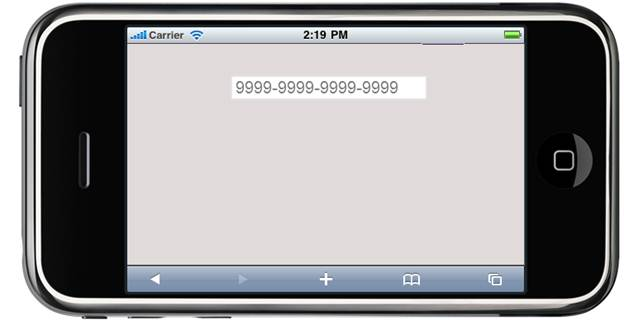

::: {style="DISPLAY: none"}
{#d2h_url_template} {#d2h_package_url style="WIDTH: 0px; DISPLAY: none; HEIGHT: 0px"}
:::

:::: {.d2h_secondary_topic style="PADDING-BOTTOM: 10pt; MARGIN: 0pt; PADDING-LEFT: 0pt; PADDING-RIGHT: 0pt; PADDING-TOP: 0pt"}
#### Watermark text {#watermark-text style="tab-stops: 0pt"}

MaskEdit textbox supports watermarking. A watermark text is a background text that appears in a text box without interfering the text entry or readability of the text entered in the textbox. It can be used to display a ready instruction or important information for the user. It appears as an auto text before the test is entered and disappears once the user starts entering text.

[]{style="FONT-FAMILY: 'Calibri','sans-serif'; FONT-SIZE: 11pt; FONT-WEIGHT: normal"} 

Properties

 

 

  --------------- ------------------------------------------ ------------------------ ------------------ ------------
  Name            Description                                Type of the property     Value it accepts   Dependency
  WaterMarkText   Sets the water mark text to be displayed   [string]{.UGHyperlink}   Alphanumeric       NA
  --------------- ------------------------------------------ ------------------------ ------------------ ------------

 

Using Builder

The following steps will guide you in setting the watermark text for the MaskEdit through the Builder:

1.   In **View**, invoke the MaskEdit textbox helper followed by the **WaterMarkText** method with the desired mask as argument.

[[ []{style="TEXT-DECORATION: none"} ]{style="FONT-FAMILY: 'Calibri','sans-serif'"}]{.underline}  

+-----------------------------------------------------------------------------------------------------------------------------------------------------------------------------------------------------------------------------------------------------------------------------------------------------------------------------------------+
| **[\[ASPX\]]{style="FONT-FAMILY: 'Courier New'"}**                                                                                                                                                                                                                                                                                      |
|                                                                                                                                                                                                                                                                                                                                         |
| [  ]{style="FONT-FAMILY: 'Courier New'"} [\<%]{style="FONT-FAMILY: 'Courier New'; BACKGROUND: yellow"} [{]{style="FONT-FAMILY: 'Courier New'"}                                                                                                                                                                                          |
|                                                                                                                                                                                                                                                                                                                                         |
| [        ]{style="FONT-FAMILY: 'Courier New'"} [Html.MobSyncfusion().MaskEditTextbox([\"maskCredit\"]{style="COLOR: #a31515"}).Mask([\"9999-9999-9999-9999\"]{style="COLOR: #a31515"}).**WaterMarkText**([\"9999-9999-9999-9999\"]{style="COLOR: #a31515"})]{style="FONT-FAMILY: 'Courier New'"} []{style="FONT-FAMILY: 'Courier New'"} |
|                                                                                                                                                                                                                                                                                                                                         |
| [                          .Render();]{style="FONT-FAMILY: 'Courier New'"}                                                                                                                                                                                                                                                              |
|                                                                                                                                                                                                                                                                                                                                         |
| [                      }[%\>]{style="BACKGROUND: yellow"}]{style="FONT-FAMILY: 'Courier New'"}                                                                                                                                                                                                                                          |
|                                                                                                                                                                                                                                                                                                                                         |
| **[\[Razor\]]{style="FONT-FAMILY: 'Courier New'"}**                                                                                                                                                                                                                                                                                     |
|                                                                                                                                                                                                                                                                                                                                         |
| [\@{]{style="FONT-FAMILY: 'Courier New'; BACKGROUND: yellow"} []{style="FONT-FAMILY: 'Courier New'"}                                                                                                                                                                                                                                    |
|                                                                                                                                                                                                                                                                                                                                         |
| [        ]{style="FONT-FAMILY: 'Courier New'"} [Html.MobSyncfusion().MaskEditTextbox([\"maskCredit\"]{style="COLOR: #a31515"}).Mask([\"9999-9999-9999-9999\"]{style="COLOR: #a31515"}).**WaterMarkText**([\"9999-9999-9999-9999\"]{style="COLOR: #a31515"})]{style="FONT-FAMILY: 'Courier New'"} []{style="FONT-FAMILY: 'Courier New'"} |
|                                                                                                                                                                                                                                                                                                                                         |
| [                          .Render();]{style="FONT-FAMILY: 'Courier New'"}                                                                                                                                                                                                                                                              |
|                                                                                                                                                                                                                                                                                                                                         |
| [                      [}]{style="BACKGROUND: yellow"}]{style="FONT-FAMILY: 'Courier New'"}                                                                                                                                                                                                                                             |
|                                                                                                                                                                                                                                                                                                                                         |
| []{style="FONT-FAMILY: Consolas; BACKGROUND: yellow; FONT-SIZE: 9.5pt"}                                                                                                                                                                                                                                                                 |
+-----------------------------------------------------------------------------------------------------------------------------------------------------------------------------------------------------------------------------------------------------------------------------------------------------------------------------------------+

[[]{style="TEXT-DECORATION: none"}]{.underline}  

2.   Run the application.

 

Using Properties Model

The following steps will guide you in setting of the watermark text for the MaskEdit through the Properties model.

1.   In the **Controller**, create an instance of **MaskEditTextBoxModel**, set the **WaterMark** property and pass the instance through view specific data to View as given below:[]{style="FONT-FAMILY: 'Calibri','sans-serif'"}

[]{style="FONT-FAMILY: 'Calibri','sans-serif'"} 

+--------------------------------------------------------------------------------------------------------------------------------------------------------------------------------------------------------------------------------------------------------------------------------------------------------------------------------------+
| **[\[Controller\]]{style="FONT-FAMILY: 'Courier New'"}**                                                                                                                                                                                                                                                                             |
|                                                                                                                                                                                                                                                                                                                                      |
| [public]{style="FONT-FAMILY: 'Courier New'; COLOR: blue"} [ [ActionResult]{style="COLOR: #2b91af"} Index()]{style="FONT-FAMILY: 'Courier New'"}                                                                                                                                                                                      |
|                                                                                                                                                                                                                                                                                                                                      |
| [        {]{style="FONT-FAMILY: 'Courier New'"}                                                                                                                                                                                                                                                                                      |
|                                                                                                                                                                                                                                                                                                                                      |
| [            [MaskEditTextBoxModel]{style="COLOR: #2b91af"} myModel = [new]{style="COLOR: blue"}[MaskEditTextBoxModel]{style="COLOR: #2b91af"}();]{style="FONT-FAMILY: 'Courier New'"}                                                                                                                                               |
|                                                                                                                                                                                                                                                                                                                                      |
| [            myModel.Mask = [\"]{style="COLOR: #a31515"}]{style="FONT-FAMILY: 'Courier New'"} [9999-9999-9999-9999]{style="FONT-FAMILY: 'Courier New'; COLOR: #a31515"} [\"]{style="FONT-FAMILY: 'Courier New'; COLOR: #a31515"} [;]{style="FONT-FAMILY: 'Courier New'"}                                                             |
|                                                                                                                                                                                                                                                                                                                                      |
| **[            myModel.WaterMarkText = [\"]{style="COLOR: #a31515"}]{style="FONT-FAMILY: 'Courier New'"}** [9999-9999-9999-9999]{style="FONT-FAMILY: 'Courier New'; COLOR: #a31515"} **[\"]{style="FONT-FAMILY: 'Courier New'; COLOR: #a31515"}** **[;]{style="FONT-FAMILY: 'Courier New'"}** []{style="FONT-FAMILY: 'Courier New'"} |
|                                                                                                                                                                                                                                                                                                                                      |
| [            ViewData\[[\"myMaskEdit\"]{style="COLOR: #a31515"}\] = myModel;]{style="FONT-FAMILY: 'Courier New'"}                                                                                                                                                                                                                    |
|                                                                                                                                                                                                                                                                                                                                      |
| [            [return]{style="COLOR: blue"} View();]{style="FONT-FAMILY: 'Courier New'"}                                                                                                                                                                                                                                              |
|                                                                                                                                                                                                                                                                                                                                      |
| [        }]{style="FONT-FAMILY: 'Courier New'"} []{style="FONT-FAMILY: Consolas; BACKGROUND: yellow; FONT-SIZE: 9.5pt"}                                                                                                                                                                                                              |
+--------------------------------------------------------------------------------------------------------------------------------------------------------------------------------------------------------------------------------------------------------------------------------------------------------------------------------------+

**[]{style="FONT-FAMILY: 'Calibri','sans-serif'"}**  

2.   In **View**, invoke the MaskEdit textbox helper with the ViewData key as the first argument.

 

+-----------------------------------------------------------------------------------------------------------------------------------------------------------------------------------------------------------------------------------+
| **[\[ASPX\]]{style="FONT-FAMILY: 'Courier New'"}** [  ]{style="FONT-FAMILY: 'Courier New'"} [\<%]{style="FONT-FAMILY: 'Courier New'; BACKGROUND: yellow"} [{                                ]{style="FONT-FAMILY: 'Courier New'"} |
|                                                                                                                                                                                                                                   |
| [    Html.MobSyncfusion().]{style="FONT-FAMILY: 'Courier New'"} [MaskEditTextbox]{style="FONT-FAMILY: 'Courier New'"} [([\"myMaskEdit\")]{style="COLOR: #a31515"}]{style="FONT-FAMILY: 'Courier New'"}                            |
|                                                                                                                                                                                                                                   |
| [                          .Render();]{style="FONT-FAMILY: 'Courier New'"}                                                                                                                                                        |
|                                                                                                                                                                                                                                   |
| [       }[%\>]{style="BACKGROUND: yellow"}]{style="FONT-FAMILY: 'Courier New'"}                                                                                                                                                   |
|                                                                                                                                                                                                                                   |
| **[\[Razor\]]{style="FONT-FAMILY: 'Courier New'"}**                                                                                                                                                                               |
|                                                                                                                                                                                                                                   |
| [    ]{style="FONT-FAMILY: 'Courier New'"} [\@{]{style="FONT-FAMILY: 'Courier New'; BACKGROUND: yellow"} []{style="FONT-FAMILY: 'Courier New'"}                                                                                   |
|                                                                                                                                                                                                                                   |
| [           Html.MobSyncfusion().]{style="FONT-FAMILY: 'Courier New'"} [MaskEditTextbox]{style="FONT-FAMILY: 'Courier New'"} [([\"myMaskEdit\"]{style="COLOR: #a31515"})]{style="FONT-FAMILY: 'Courier New'"}                     |
|                                                                                                                                                                                                                                   |
| [                          .Render();]{style="FONT-FAMILY: 'Courier New'"}                                                                                                                                                        |
|                                                                                                                                                                                                                                   |
| [       [}]{style="BACKGROUND: yellow"}]{style="FONT-FAMILY: 'Courier New'"} []{style="FONT-FAMILY: Consolas; BACKGROUND: yellow; FONT-SIZE: 9.5pt"}                                                                              |
+-----------------------------------------------------------------------------------------------------------------------------------------------------------------------------------------------------------------------------------+

::: {style="BORDER-BOTTOM: windowtext 1pt solid; BORDER-LEFT: medium none; PADDING-BOTTOM: 1pt; MARGIN-TOP: 9pt; PADDING-LEFT: 0pt; PADDING-RIGHT: 0pt; MARGIN-BOTTOM: 9pt; BORDER-TOP: windowtext 1pt solid; BORDER-RIGHT: medium none; PADDING-TOP: 1pt"}
{border="0"}Note: The second argument of the above MaskEdit textbox helper should match the view data key from the controller to fetch the properties.
:::

3.   Run the application.

The following screenshot illustrates the output:

{border="0"}

Figure 250 MaskEdit textbox with Watermark text

 

[]{#related-topics}
::::
