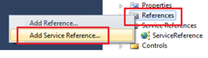
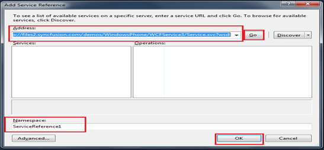

::: {style="DISPLAY: none"}
{#d2h_url_template}{#d2h_package_url style="WIDTH: 0px; DISPLAY: none; HEIGHT: 0px"}
:::

::::: {.d2h_secondary_topic style="PADDING-BOTTOM: 10pt; MARGIN: 0pt; PADDING-LEFT: 0pt; PADDING-RIGHT: 0pt; PADDING-TOP: 0pt"}
#####  WCF Data Binding {#wcf-data-binding style="tab-stops: 0pt"}

 

Data Binding using WCF enables to populate the items into the AutoComplete control from a website. It is done by creating a WCF service and by including the ServiceReference into the application

::: {style="BORDER-BOTTOM: windowtext 1pt solid; BORDER-LEFT: medium none; PADDING-BOTTOM: 1pt; MARGIN-TOP: 9pt; PADDING-LEFT: 0pt; PADDING-RIGHT: 0pt; MARGIN-BOTTOM: 9pt; BORDER-TOP: windowtext 1pt solid; BORDER-RIGHT: medium none; PADDING-TOP: 1pt"}
Note: To know how to Host a WCF service kindly refer the section "5.1 How To Create WCF Data Binding Service"
:::

 

Once the Service is successfully hosted onto the internet a link to download the configuration files and codes to implement the data communication will be displayed.

 

The steps to configure WCF to Implement in AutoComplete Control are shown as follows:

 

[Note: This sample is shown using List\<\> as the data type since the same has been used during the deployment of the SyncFusion's Service application]{.NoteChar}

 

The present link of SyncFusion's Service Reference is:

<http://files2.syncfusion.com/demos/WindowsPhone/WCFService3/Service.svc?wsdl>[[]{style="COLOR: #4f81bd"}]{.underline}

 

1.   As explained in the previous examples, open the sample in Visual Studio

2.   Right click Reference tab in Solution Explorer and select ** Add Service Reference**

 

{border="0"}

Figure 15: Add Service Reference

                      

 

3.   Enter the above link in the url tab, name the service and click OK

{border="0"}

Figure 16: Adding the url and configuring the service reference

 

4.   Once the service reference is being configured into the application go to the code page which contains the AutoComplete control and include the following namespaces:

 

 

+--------------------------------------------------------------------------------------------------------------------------------+
| **[\[C#\]]{style="FONT-FAMILY: 'Courier New'"}**                                                                               |
|                                                                                                                                |
| [using]{style="FONT-FAMILY: 'Courier New'; COLOR: blue"}[ SampleBrowser.ServiceReference;]{style="FONT-FAMILY: 'Courier New'"} |
|                                                                                                                                |
| [using]{style="FONT-FAMILY: 'Courier New'; COLOR: blue"}[ System.ServiceModel;]{style="FONT-FAMILY: 'Courier New'"}            |
|                                                                                                                                |
| [using]{style="FONT-FAMILY: 'Courier New'; COLOR: blue"}[ System.Runtime.Serialization;]{style="FONT-FAMILY: 'Courier New'"}   |
|                                                                                                                                |
| [using]{style="FONT-FAMILY: 'Courier New'; COLOR: blue"}[ System.Collections.ObjectModel;]{style="FONT-FAMILY: 'Courier New'"} |
|                                                                                                                                |
| []{style="FONT-FAMILY: 'Courier New'"}                                                                                         |
+--------------------------------------------------------------------------------------------------------------------------------+

**     **

5.   Add the following code to populate the AutoComplete Control:

+--------------------------------------------------------------------------------------------------------------------------------------------------------------------------------------------------------------------------------------------------------------------------------+
| **[\[C#\]]{style="FONT-FAMILY: 'Courier New'"}**                                                                                                                                                                                                                               |
|                                                                                                                                                                                                                                                                                |
| [  [class]{style="COLOR: blue"} [autocomplete]{style="COLOR: #2b91af"}:usercontrol]{style="FONT-FAMILY: 'Courier New'"}                                                                                                                                                        |
|                                                                                                                                                                                                                                                                                |
| []{style="FONT-FAMILY: 'Courier New'"}                                                                                                                                                                                                                                         |
|                                                                                                                                                                                                                                                                                |
| []{style="FONT-FAMILY: 'Courier New'"}                                                                                                                                                                                                                                         |
|                                                                                                                                                                                                                                                                                |
| [    {]{style="FONT-FAMILY: 'Courier New'"}                                                                                                                                                                                                                                    |
|                                                                                                                                                                                                                                                                                |
| [        ImyserviceClient channel = [new]{style="COLOR: blue"} ImyserviceClient([\"BasicHttpBinding_Imyservice\"]{style="COLOR: #a31515"});  [// channel is created for commumication, ]{style="COLOR: green"}]{style="FONT-FAMILY: 'Courier New'"}                            |
|                                                                                                                                                                                                                                                                                |
| [        [//ImyserviceClient is the class used by sync fusion in the service]{style="COLOR: green"}]{style="FONT-FAMILY: 'Courier New'"}                                                                                                                                       |
|                                                                                                                                                                                                                                                                                |
| []{style="FONT-FAMILY: 'Courier New'"}                                                                                                                                                                                                                                         |
|                                                                                                                                                                                                                                                                                |
| [        autocomplete()]{style="FONT-FAMILY: 'Courier New'"}                                                                                                                                                                                                                   |
|                                                                                                                                                                                                                                                                                |
| [        {]{style="FONT-FAMILY: 'Courier New'"}                                                                                                                                                                                                                                |
|                                                                                                                                                                                                                                                                                |
| []{style="FONT-FAMILY: 'Courier New'"}                                                                                                                                                                                                                                         |
|                                                                                                                                                                                                                                                                                |
| [            channel.getautoCompleted += [new]{style="COLOR: blue"} [EventHandler]{style="COLOR: #2b91af"}\<getautoCompletedEventArgs\>(channel_getautoCompleted); [// event handler to invoke once]{style="COLOR: green"}]{style="FONT-FAMILY: 'Courier New'"}                |
|                                                                                                                                                                                                                                                                                |
| [            [// the data in fetched]{style="COLOR: green"}]{style="FONT-FAMILY: 'Courier New'"}                                                                                                                                                                               |
|                                                                                                                                                                                                                                                                                |
| []{style="FONT-FAMILY: 'Courier New'"}                                                                                                                                                                                                                                         |
|                                                                                                                                                                                                                                                                                |
| [            channel.getautoAsync(); [// function to fetch the data]{style="COLOR: green"}]{style="FONT-FAMILY: 'Courier New'"}                                                                                                                                                |
|                                                                                                                                                                                                                                                                                |
| [        }]{style="FONT-FAMILY: 'Courier New'"}                                                                                                                                                                                                                                |
|                                                                                                                                                                                                                                                                                |
| [        [public]{style="COLOR: blue"} [static]{style="COLOR: blue"} [List]{style="COLOR: #2b91af"}\<[string]{style="COLOR: blue"}\> word = [new]{style="COLOR: blue"} [List]{style="COLOR: #2b91af"}\<[string]{style="COLOR: blue"}\>();]{style="FONT-FAMILY: 'Courier New'"} |
|                                                                                                                                                                                                                                                                                |
| []{style="FONT-FAMILY: 'Courier New'"}                                                                                                                                                                                                                                         |
|                                                                                                                                                                                                                                                                                |
| [        [void]{style="COLOR: blue"} channel_getautoCompleted([object]{style="COLOR: blue"} sender, getautoCompletedEventArgs e)]{style="FONT-FAMILY: 'Courier New'"}                                                                                                          |
|                                                                                                                                                                                                                                                                                |
| [        {]{style="FONT-FAMILY: 'Courier New'"}                                                                                                                                                                                                                                |
|                                                                                                                                                                                                                                                                                |
| [            word.Clear(); ]{style="FONT-FAMILY: 'Courier New'"}                                                                                                                                                                                                               |
|                                                                                                                                                                                                                                                                                |
| [            [foreach]{style="COLOR: blue"} ([string]{style="COLOR: blue"} i [in]{style="COLOR: blue"} e.Result)]{style="FONT-FAMILY: 'Courier New'"}                                                                                                                          |
|                                                                                                                                                                                                                                                                                |
| [            {]{style="FONT-FAMILY: 'Courier New'"}                                                                                                                                                                                                                            |
|                                                                                                                                                                                                                                                                                |
| [                word.Add(i); [// add the data one by one into the list-word]{style="COLOR: green"}]{style="FONT-FAMILY: 'Courier New'"}                                                                                                                                       |
|                                                                                                                                                                                                                                                                                |
| []{style="FONT-FAMILY: 'Courier New'"}                                                                                                                                                                                                                                         |
|                                                                                                                                                                                                                                                                                |
| [            }]{style="FONT-FAMILY: 'Courier New'"}                                                                                                                                                                                                                            |
|                                                                                                                                                                                                                                                                                |
| []{style="FONT-FAMILY: 'Courier New'"}                                                                                                                                                                                                                                         |
|                                                                                                                                                                                                                                                                                |
| [            [this]{style="COLOR: blue"}.autoComplete1.CustomSource = ServicesClass.word; [// populate the autocomplete contorl]{style="COLOR: green"}]{style="FONT-FAMILY: 'Courier New'"}                                                                                    |
|                                                                                                                                                                                                                                                                                |
| [        }]{style="FONT-FAMILY: 'Courier New'"}                                                                                                                                                                                                                                |
|                                                                                                                                                                                                                                                                                |
| [    ]{style="FONT-FAMILY: 'Courier New'"}                                                                                                                                                                                                                                     |
|                                                                                                                                                                                                                                                                                |
| []{style="FONT-FAMILY: 'Courier New'"}                                                                                                                                                                                                                                         |
|                                                                                                                                                                                                                                                                                |
| [    }]{style="FONT-FAMILY: 'Courier New'"}                                                                                                                                                                                                                                    |
|                                                                                                                                                                                                                                                                                |
| []{style="FONT-FAMILY: 'Courier New'"}                                                                                                                                                                                                                                         |
+--------------------------------------------------------------------------------------------------------------------------------------------------------------------------------------------------------------------------------------------------------------------------------+

**     **

::: {style="BORDER-BOTTOM: windowtext 1pt solid; BORDER-LEFT: medium none; PADDING-BOTTOM: 1pt; MARGIN-TOP: 9pt; PADDING-LEFT: 0pt; PADDING-RIGHT: 0pt; MARGIN-BOTTOM: 9pt; BORDER-TOP: windowtext 1pt solid; BORDER-RIGHT: medium none; PADDING-TOP: 1pt"}
Note: Other factors such as timeout, endpoints while creating a service, binding option has to be configured as per the requirement. The above WCF sample procedure is just to brief out the possibilities of binding the data dynamically
:::

 

 

[]{#related-topics}
:::::
