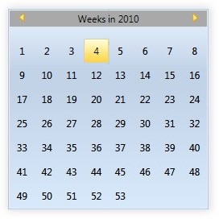
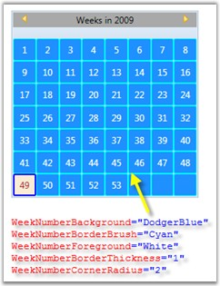
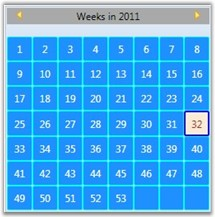
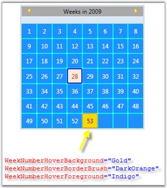

::: {style="DISPLAY: none"}
{#d2h_url_template}{#d2h_package_url style="WIDTH: 0px; DISPLAY: none; HEIGHT: 0px"}
:::

::: {.d2h_secondary_topic style="PADDING-BOTTOM: 10pt; MARGIN: 0pt; PADDING-LEFT: 0pt; PADDING-RIGHT: 0pt; PADDING-TOP: 0pt"}
#### Week Numbers Grid {#week-numbers-grid style="tab-stops: 0pt"}

It is now possible to edit weekly date in CalendarEdit control. This is achieved by using the **IsShowWeekNumbersGrid** property.

 

The following code snippet illustrates this.

 

+--------------------------------------------------------------------------------------------------------------------------------------------------------------------------------------------------------------------------------------------------------------------------------------------------------------------------------------------------------------------------------------------------------------------------------------------------------------------------------------------------------------------------------------------------------------------------------------------------------------------------------------------------------------------------------------------------------------+
| **[\[XAML\]]{style="FONT-FAMILY: 'Courier New'; COLOR: black"}**                                                                                                                                                                                                                                                                                                                                                                                                                                                                                                                                                                                                                                             |
|                                                                                                                                                                                                                                                                                                                                                                                                                                                                                                                                                                                                                                                                                                              |
| []{style="FONT-FAMILY: 'Courier New'; COLOR: blue"}                                                                                                                                                                                                                                                                                                                                                                                                                                                                                                                                                                                                                                                          |
|                                                                                                                                                                                                                                                                                                                                                                                                                                                                                                                                                                                                                                                                                                              |
| [\<!\--Calendar Edit\--\>]{style="FONT-FAMILY: 'Courier New'; COLOR: green"}                                                                                                                                                                                                                                                                                                                                                                                                                                                                                                                                                                                                                                 |
|                                                                                                                                                                                                                                                                                                                                                                                                                                                                                                                                                                                                                                                                                                              |
| [\<]{style="FONT-FAMILY: 'Courier New'; COLOR: blue"}[syncfusion]{style="FONT-FAMILY: 'Courier New'; COLOR: #a31515"}[:]{style="FONT-FAMILY: 'Courier New'; COLOR: blue"}[CalendarEdit ]{style="FONT-FAMILY: 'Courier New'; COLOR: #a31515"}[Name]{style="FONT-FAMILY: 'Courier New'; COLOR: red"}[=\"calendar\"]{style="FONT-FAMILY: 'Courier New'; COLOR: blue"}                                                                                                                                                                                                                                                                                                                                           |
|                                                                                                                                                                                                                                                                                                                                                                                                                                                                                                                                                                                                                                                                                                              |
| [                                           ]{style="FONT-FAMILY: 'Courier New'; COLOR: #a31515"}[IsShowWeekNumbersGrid]{style="FONT-FAMILY: 'Courier New'; COLOR: red"}[=\"{]{style="FONT-FAMILY: 'Courier New'; COLOR: blue"}[Binding]{style="FONT-FAMILY: 'Courier New'; COLOR: #a31515"}[ ElementName ]{style="FONT-FAMILY: 'Courier New'; COLOR: red"}[=                             cbShowWeekNumbersGrid,]{style="FONT-FAMILY: 'Courier New'; COLOR: blue"}[ Path]{style="FONT-FAMILY: 'Courier New'; COLOR: red"}[=IsChecked,]{style="FONT-FAMILY: 'Courier New'; COLOR: blue"}[ Mode]{style="FONT-FAMILY: 'Courier New'; COLOR: red"}[=TwoWay}/\>]{style="FONT-FAMILY: 'Courier New'; COLOR: blue"} |
|                                                                                                                                                                                                                                                                                                                                                                                                                                                                                                                                                                                                                                                                                                              |
| []{style="FONT-FAMILY: 'Courier New'; COLOR: blue"}                                                                                                                                                                                                                                                                                                                                                                                                                                                                                                                                                                                                                                                          |
|                                                                                                                                                                                                                                                                                                                                                                                                                                                                                                                                                                                                                                                                                                              |
| [\<]{style="FONT-FAMILY: 'Courier New'; COLOR: blue"}[CheckBox]{style="FONT-FAMILY: 'Courier New'; COLOR: #a31515"}[ Name]{style="FONT-FAMILY: 'Courier New'; COLOR: red"}[=\"cbShowWeekNumbersGrid\"]{style="FONT-FAMILY: 'Courier New'; COLOR: blue"}[ IsChecked]{style="FONT-FAMILY: 'Courier New'; COLOR: red"}[=\"False\" ]{style="FONT-FAMILY: 'Courier New'; COLOR: blue"}[IsEnabled]{style="FONT-FAMILY: 'Courier New'; COLOR: red"}[=\"False\"\>]{style="FONT-FAMILY: 'Courier New'; COLOR: blue"}                                                                                                                                                                                                  |
|                                                                                                                                                                                                                                                                                                                                                                                                                                                                                                                                                                                                                                                                                                              |
| [              ]{style="FONT-FAMILY: 'Courier New'; COLOR: blue"}[Show Week Numbers Grid]{style="FONT-FAMILY: 'Courier New'; COLOR: #a31515"}[\</]{style="FONT-FAMILY: 'Courier New'; COLOR: blue"}[CheckBox]{style="FONT-FAMILY: 'Courier New'; COLOR: #a31515"}[\>]{style="FONT-FAMILY: 'Courier New'; COLOR: blue"}                                                                                                                                                                                                                                                                                                                                                                                       |
+--------------------------------------------------------------------------------------------------------------------------------------------------------------------------------------------------------------------------------------------------------------------------------------------------------------------------------------------------------------------------------------------------------------------------------------------------------------------------------------------------------------------------------------------------------------------------------------------------------------------------------------------------------------------------------------------------------------+

**[]{style="FONT-FAMILY: 'Trebuchet MS','sans-serif'; COLOR: #15428b; FONT-SIZE: 9pt"}** 

+-----------------------------------------------------------------------------------------------------------------------------------------------------------------------------------------------------------+
| **[\[C#\]]{style="FONT-FAMILY: 'Courier New'; COLOR: black"}**                                                                                                                                            |
|                                                                                                                                                                                                           |
| []{style="FONT-FAMILY: 'Courier New'; COLOR: black"}                                                                                                                                                      |
|                                                                                                                                                                                                           |
| [//Binding IsShowWeekNumbersGrid property to CheckBox]{style="FONT-FAMILY: 'Courier New'; COLOR: green"}                                                                                                  |
|                                                                                                                                                                                                           |
| [Binding]{style="FONT-FAMILY: 'Courier New'; COLOR: #2b91af"}[ b = [new]{style="COLOR: blue"} [Binding]{style="COLOR: #2b91af"}();]{style="FONT-FAMILY: 'Courier New'"}                                   |
|                                                                                                                                                                                                           |
| [b.Source = calendar;]{style="FONT-FAMILY: 'Courier New'"}                                                                                                                                                |
|                                                                                                                                                                                                           |
| [b.Mode = [BindingMode]{style="COLOR: #2b91af"}.TwoWay;]{style="FONT-FAMILY: 'Courier New'"}                                                                                                              |
|                                                                                                                                                                                                           |
| [b.Path = [new]{style="COLOR: blue"} [PropertyPath]{style="COLOR: #2b91af"}([\"IsShowWeekNumbersGrid\"]{style="COLOR: #a31515"});             ]{style="FONT-FAMILY: 'Courier New'"}                       |
|                                                                                                                                                                                                           |
| [BindingOperations]{style="FONT-FAMILY: 'Courier New'; COLOR: #2b91af"}[.SetBinding(cbShowWeekNumbersGrid, [CheckBox]{style="COLOR: #2b91af"}.IsCheckedProperty, b);]{style="FONT-FAMILY: 'Courier New'"} |
+-----------------------------------------------------------------------------------------------------------------------------------------------------------------------------------------------------------+

 

Run the code. The output is as follows:

{border="0"}

Figure 72: IsShowWeekNumbersGrid Property set as True

**[]{style="FONT-FAMILY: 'Trebuchet MS','sans-serif'; COLOR: #15428b; FONT-SIZE: 9pt"}** 

1\. Changing Week Number Grid's Default Properties

You can set the color for the border brush, background and foreground for the cells in the Week Numbers Grid. You can also set the corner radius and thickness for the border of the cells in the Week Numbers Grid.

 

The following code snippet illustrates this.

 

+---------------------------------------------------------------------------------------------------------------------------------------------------------------------------------------------------------------------------------------------+
| **[\[XAML\]]{style="FONT-FAMILY: 'Courier New'; COLOR: black"}**                                                                                                                                                                            |
|                                                                                                                                                                                                                                             |
| []{style="FONT-FAMILY: 'Courier New'; COLOR: blue"}                                                                                                                                                                                         |
|                                                                                                                                                                                                                                             |
| [\<!\--Calendar Edit with Week Number Default Properties\--\>]{style="FONT-FAMILY: 'Courier New'; COLOR: green"}                                                                                                                            |
|                                                                                                                                                                                                                                             |
| [\<]{style="FONT-FAMILY: 'Courier New'; COLOR: blue"}[syncfusion]{style="FONT-FAMILY: 'Courier New'; COLOR: #a31515"}[:]{style="FONT-FAMILY: 'Courier New'; COLOR: blue"}[CalendarEdit]{style="FONT-FAMILY: 'Courier New'; COLOR: #a31515"} |
|                                                                                                                                                                                                                                             |
| [          WeekNumberBackground]{style="FONT-FAMILY: 'Courier New'; COLOR: red"}[=\"DodgerBlue\"]{style="FONT-FAMILY: 'Courier New'; COLOR: blue"}[ ]{style="FONT-FAMILY: 'Courier New'; COLOR: red"}                                       |
|                                                                                                                                                                                                                                             |
| [          WeekNumberBorderBrush]{style="FONT-FAMILY: 'Courier New'; COLOR: red"}[=\"Cyan\"]{style="FONT-FAMILY: 'Courier New'; COLOR: blue"}[ ]{style="FONT-FAMILY: 'Courier New'; COLOR: red"}                                            |
|                                                                                                                                                                                                                                             |
| [          WeekNumberForeground]{style="FONT-FAMILY: 'Courier New'; COLOR: red"}[=\"White\"]{style="FONT-FAMILY: 'Courier New'; COLOR: blue"}[ ]{style="FONT-FAMILY: 'Courier New'; COLOR: red"}                                            |
|                                                                                                                                                                                                                                             |
| [          WeekNumberBorderThickness]{style="FONT-FAMILY: 'Courier New'; COLOR: red"}[=\"1\"]{style="FONT-FAMILY: 'Courier New'; COLOR: blue"}[ ]{style="FONT-FAMILY: 'Courier New'; COLOR: red"}                                           |
|                                                                                                                                                                                                                                             |
| [          WeekNumberCornerRadius]{style="FONT-FAMILY: 'Courier New'; COLOR: red"}[=\"2\"]{style="FONT-FAMILY: 'Courier New'; COLOR: blue"}                                                                                                 |
|                                                                                                                                                                                                                                             |
| [/\>]{style="FONT-FAMILY: 'Courier New'; COLOR: blue"}                                                                                                                                                                                      |
+---------------------------------------------------------------------------------------------------------------------------------------------------------------------------------------------------------------------------------------------+

**[]{style="FONT-FAMILY: 'Trebuchet MS','sans-serif'; COLOR: #15428b; FONT-SIZE: 9pt"}** 

+------------------------------------------------------------------------------------------------------------------------------------------------------------------------------------------------------------------------------------------------------------------------------------------------------------------------------------------------------------------------+
| **[\[C#\]]{style="FONT-FAMILY: 'Courier New'; COLOR: black"}**                                                                                                                                                                                                                                                                                                         |
|                                                                                                                                                                                                                                                                                                                                                                        |
| []{style="FONT-FAMILY: 'Courier New'; COLOR: black"}                                                                                                                                                                                                                                                                                                                   |
|                                                                                                                                                                                                                                                                                                                                                                        |
| [//Calendar Edit with Week Number Default Properties]{style="FONT-FAMILY: 'Courier New'; COLOR: green"}                                                                                                                                                                                                                                                                |
|                                                                                                                                                                                                                                                                                                                                                                        |
| [CalendarEdit]{style="FONT-FAMILY: 'Courier New'; COLOR: #2b91af"}[ calendar = ]{style="FONT-FAMILY: 'Courier New'; COLOR: black"}[new]{style="FONT-FAMILY: 'Courier New'; COLOR: blue"}[ ]{style="FONT-FAMILY: 'Courier New'; COLOR: black"}[CalendarEdit]{style="FONT-FAMILY: 'Courier New'; COLOR: #2b91af"}[();]{style="FONT-FAMILY: 'Courier New'; COLOR: black"} |
|                                                                                                                                                                                                                                                                                                                                                                        |
| [calendar.WeekNumberBorderBrush = ]{style="FONT-FAMILY: 'Courier New'; COLOR: black"}[Brushes]{style="FONT-FAMILY: 'Courier New'; COLOR: #2b91af"}[.Cyan;]{style="FONT-FAMILY: 'Courier New'; COLOR: black"}                                                                                                                                                           |
|                                                                                                                                                                                                                                                                                                                                                                        |
| [calendar.WeekNumberCornerRadius = ]{style="FONT-FAMILY: 'Courier New'; COLOR: black"}[new]{style="FONT-FAMILY: 'Courier New'; COLOR: blue"}[ ]{style="FONT-FAMILY: 'Courier New'; COLOR: black"}[CornerRadius]{style="FONT-FAMILY: 'Courier New'; COLOR: #2b91af"}[(2);]{style="FONT-FAMILY: 'Courier New'; COLOR: black"}                                            |
|                                                                                                                                                                                                                                                                                                                                                                        |
| [calendar.WeekNumberBorderThickness = ]{style="FONT-FAMILY: 'Courier New'; COLOR: black"}[new]{style="FONT-FAMILY: 'Courier New'; COLOR: blue"}[ ]{style="FONT-FAMILY: 'Courier New'; COLOR: black"}[Thickness]{style="FONT-FAMILY: 'Courier New'; COLOR: #2b91af"}[(1);]{style="FONT-FAMILY: 'Courier New'; COLOR: black"}                                            |
|                                                                                                                                                                                                                                                                                                                                                                        |
| [calendar.WeekNumberBackground = ]{style="FONT-FAMILY: 'Courier New'; COLOR: black"}[Brushes]{style="FONT-FAMILY: 'Courier New'; COLOR: #2b91af"}[.DodgerBlue;]{style="FONT-FAMILY: 'Courier New'; COLOR: black"}                                                                                                                                                      |
|                                                                                                                                                                                                                                                                                                                                                                        |
| [calendar.WeekNumberForeground = ]{style="FONT-FAMILY: 'Courier New'; COLOR: black"}[Brushes]{style="FONT-FAMILY: 'Courier New'; COLOR: #2b91af"}[.White;]{style="FONT-FAMILY: 'Courier New'; COLOR: black"}                                                                                                                                                           |
+------------------------------------------------------------------------------------------------------------------------------------------------------------------------------------------------------------------------------------------------------------------------------------------------------------------------------------------------------------------------+

 

Run the code. The output is as follows:

 

{border="0"}

Figure 73: WeekNumber Default Properties

 

2\. Changing Week Number Grid's Selection Properties

You can set the border brush, background and foreground color for the required cell in the Week Numbers Grid. You can also set the corner radius and thickness for the border of the selected cell in the Week Numbers Grid.

 

The following code snippet illustrates this.

 

+---------------------------------------------------------------------------------------------------------------------------------------------------------------------------------------------------------------------------------------------+
| **[\[XAML\]]{style="FONT-FAMILY: 'Courier New'; COLOR: black"}**                                                                                                                                                                            |
|                                                                                                                                                                                                                                             |
| []{style="FONT-FAMILY: 'Courier New'; COLOR: blue"}                                                                                                                                                                                         |
|                                                                                                                                                                                                                                             |
| [\<!\--Calendar Edit with Week Number Selection Properties\--\>]{style="FONT-FAMILY: 'Courier New'; COLOR: green"}                                                                                                                          |
|                                                                                                                                                                                                                                             |
| [\<]{style="FONT-FAMILY: 'Courier New'; COLOR: blue"}[syncfusion]{style="FONT-FAMILY: 'Courier New'; COLOR: #a31515"}[:]{style="FONT-FAMILY: 'Courier New'; COLOR: blue"}[CalendarEdit]{style="FONT-FAMILY: 'Courier New'; COLOR: #a31515"} |
|                                                                                                                                                                                                                                             |
| [          WeekNumberSelectionBackground]{style="FONT-FAMILY: 'Courier New'; COLOR: red"}[=\"AntiqueWhite\"]{style="FONT-FAMILY: 'Courier New'; COLOR: blue"}[ ]{style="FONT-FAMILY: 'Courier New'; COLOR: red"}                            |
|                                                                                                                                                                                                                                             |
| [          WeekNumberSelectionBorderBrush]{style="FONT-FAMILY: 'Courier New'; COLOR: red"}[=\"Blue\"]{style="FONT-FAMILY: 'Courier New'; COLOR: blue"}[ ]{style="FONT-FAMILY: 'Courier New'; COLOR: red"}                                   |
|                                                                                                                                                                                                                                             |
| [          WeekNumberSelectionForeground]{style="FONT-FAMILY: 'Courier New'; COLOR: red"}[=\"Brown\"]{style="FONT-FAMILY: 'Courier New'; COLOR: blue"}[ ]{style="FONT-FAMILY: 'Courier New'; COLOR: red"}                                   |
|                                                                                                                                                                                                                                             |
| [          WeekNumberSelectionBorderThickness]{style="FONT-FAMILY: 'Courier New'; COLOR: red"}[=\"2\"]{style="FONT-FAMILY: 'Courier New'; COLOR: blue"}[ ]{style="FONT-FAMILY: 'Courier New'; COLOR: red"}                                  |
|                                                                                                                                                                                                                                             |
| [          WeekNumberSelectionBorderCornerRadius]{style="FONT-FAMILY: 'Courier New'; COLOR: red"}[=\"2\"]{style="FONT-FAMILY: 'Courier New'; COLOR: blue"}                                                                                  |
|                                                                                                                                                                                                                                             |
| [/\>]{style="FONT-FAMILY: 'Courier New'; COLOR: blue"}                                                                                                                                                                                      |
+---------------------------------------------------------------------------------------------------------------------------------------------------------------------------------------------------------------------------------------------+

**[]{style="FONT-FAMILY: 'Trebuchet MS','sans-serif'; COLOR: #15428b; FONT-SIZE: 9pt"}** 

+------------------------------------------------------------------------------------------------------------------------------------------------------------------------------------------------------------------------------------------------------------------------------------------------------------------------------------------------------------------------+
| **[\[C#\]]{style="FONT-FAMILY: 'Courier New'; COLOR: black"}**                                                                                                                                                                                                                                                                                                         |
|                                                                                                                                                                                                                                                                                                                                                                        |
| []{style="FONT-FAMILY: 'Courier New'; COLOR: black"}                                                                                                                                                                                                                                                                                                                   |
|                                                                                                                                                                                                                                                                                                                                                                        |
| [//  Calendar Edit with Week Number Selection Properties]{style="FONT-FAMILY: 'Courier New'; COLOR: green"}                                                                                                                                                                                                                                                            |
|                                                                                                                                                                                                                                                                                                                                                                        |
| [CalendarEdit]{style="FONT-FAMILY: 'Courier New'; COLOR: #2b91af"}[ calendar = ]{style="FONT-FAMILY: 'Courier New'; COLOR: black"}[new]{style="FONT-FAMILY: 'Courier New'; COLOR: blue"}[ ]{style="FONT-FAMILY: 'Courier New'; COLOR: black"}[CalendarEdit]{style="FONT-FAMILY: 'Courier New'; COLOR: #2b91af"}[();]{style="FONT-FAMILY: 'Courier New'; COLOR: black"} |
|                                                                                                                                                                                                                                                                                                                                                                        |
| []{style="FONT-FAMILY: 'Courier New'; COLOR: black"}                                                                                                                                                                                                                                                                                                                   |
|                                                                                                                                                                                                                                                                                                                                                                        |
| [calendar.WeekNumberSelectionBorderBrush = ]{style="FONT-FAMILY: 'Courier New'; COLOR: black"}[Brushes]{style="FONT-FAMILY: 'Courier New'; COLOR: #2b91af"}[.Blue;]{style="FONT-FAMILY: 'Courier New'; COLOR: black"}                                                                                                                                                  |
|                                                                                                                                                                                                                                                                                                                                                                        |
| [calendar.WeekNumberSelectionBorderCornerRadius = ]{style="FONT-FAMILY: 'Courier New'; COLOR: black"}[new]{style="FONT-FAMILY: 'Courier New'; COLOR: blue"}[ ]{style="FONT-FAMILY: 'Courier New'; COLOR: black"}[CornerRadius]{style="FONT-FAMILY: 'Courier New'; COLOR: #2b91af"}[(2);]{style="FONT-FAMILY: 'Courier New'; COLOR: black"}                             |
|                                                                                                                                                                                                                                                                                                                                                                        |
| [calendar.WeekNumberSelectionBorderThickness = ]{style="FONT-FAMILY: 'Courier New'; COLOR: black"}[new]{style="FONT-FAMILY: 'Courier New'; COLOR: blue"}[ ]{style="FONT-FAMILY: 'Courier New'; COLOR: black"}[Thickness]{style="FONT-FAMILY: 'Courier New'; COLOR: #2b91af"}[(2);]{style="FONT-FAMILY: 'Courier New'; COLOR: black"}                                   |
|                                                                                                                                                                                                                                                                                                                                                                        |
| [calendar.WeekNumberSelectionBackground = ]{style="FONT-FAMILY: 'Courier New'; COLOR: black"}[Brushes]{style="FONT-FAMILY: 'Courier New'; COLOR: #2b91af"}[.AntiqueWhite;]{style="FONT-FAMILY: 'Courier New'; COLOR: black"}                                                                                                                                           |
|                                                                                                                                                                                                                                                                                                                                                                        |
| [calendar.WeekNumberSelectionForeground = ]{style="FONT-FAMILY: 'Courier New'; COLOR: black"}[Brushes]{style="FONT-FAMILY: 'Courier New'; COLOR: #2b91af"}[.Brown;]{style="FONT-FAMILY: 'Courier New'; COLOR: black"}                                                                                                                                                  |
+------------------------------------------------------------------------------------------------------------------------------------------------------------------------------------------------------------------------------------------------------------------------------------------------------------------------------------------------------------------------+

 

Run the code. The output is as follows:

 

{border="0"}

Figure 74: WeekNumber Selection Properties

***[]{style="FONT-FAMILY: 'Trebuchet MS','sans-serif'; COLOR: #15428b; FONT-SIZE: 9pt"}*** 

3\. Changing Week Number Mouse Over Properties

You can set the border brush, background and foreground color for the cell focused in the Week Numbers Grid.

 

The following code snippet illustrates this.

 

+---------------------------------------------------------------------------------------------------------------------------------------------------------------------------------------------------------------------------------------------+
| **[\[XAML\]]{style="FONT-FAMILY: 'Courier New'; COLOR: black"}**                                                                                                                                                                            |
|                                                                                                                                                                                                                                             |
| []{style="FONT-FAMILY: 'Courier New'; COLOR: blue"}                                                                                                                                                                                         |
|                                                                                                                                                                                                                                             |
| [\<!\--Calendar Edit with Week Number Mouse Over Properties\--\>]{style="FONT-FAMILY: 'Courier New'; COLOR: green"}                                                                                                                         |
|                                                                                                                                                                                                                                             |
| [\<]{style="FONT-FAMILY: 'Courier New'; COLOR: blue"}[syncfusion]{style="FONT-FAMILY: 'Courier New'; COLOR: #a31515"}[:]{style="FONT-FAMILY: 'Courier New'; COLOR: blue"}[CalendarEdit]{style="FONT-FAMILY: 'Courier New'; COLOR: #a31515"} |
|                                                                                                                                                                                                                                             |
| [          WeekNumberHoverBackground]{style="FONT-FAMILY: 'Courier New'; COLOR: red"}[=\"Gold\"]{style="FONT-FAMILY: 'Courier New'; COLOR: blue"}[ ]{style="FONT-FAMILY: 'Courier New'; COLOR: red"}                                        |
|                                                                                                                                                                                                                                             |
| [          WeekNumberHoverBorderBrush]{style="FONT-FAMILY: 'Courier New'; COLOR: red"}[=\"DarkOrange\"]{style="FONT-FAMILY: 'Courier New'; COLOR: blue"}[ ]{style="FONT-FAMILY: 'Courier New'; COLOR: red"}                                 |
|                                                                                                                                                                                                                                             |
| [          WeekNumberHoverForeground]{style="FONT-FAMILY: 'Courier New'; COLOR: red"}[=\"Indigo\"]{style="FONT-FAMILY: 'Courier New'; COLOR: blue"}[ ]{style="FONT-FAMILY: 'Courier New'; COLOR: red"}                                      |
|                                                                                                                                                                                                                                             |
| [/\>]{style="FONT-FAMILY: 'Courier New'; COLOR: blue"}                                                                                                                                                                                      |
+---------------------------------------------------------------------------------------------------------------------------------------------------------------------------------------------------------------------------------------------+

**[]{style="FONT-FAMILY: 'Trebuchet MS','sans-serif'; COLOR: #15428b; FONT-SIZE: 9pt"}** 

+-----------------------------------------------------------------------------------------------------------------------------------------------------------------------------------------------------------------------------------------------------------------------------------------------------------------------------------------------------------------------------+
| **[\[C#\]]{style="FONT-FAMILY: 'Courier New'; COLOR: black"}**                                                                                                                                                                                                                                                                                                              |
|                                                                                                                                                                                                                                                                                                                                                                             |
| []{style="FONT-FAMILY: 'Courier New'; COLOR: black"}                                                                                                                                                                                                                                                                                                                        |
|                                                                                                                                                                                                                                                                                                                                                                             |
| [//  Calendar Edit with Week Number Mouse Over Properties]{style="FONT-FAMILY: 'Courier New'; COLOR: green"}                                                                                                                                                                                                                                                                |
|                                                                                                                                                                                                                                                                                                                                                                             |
| [CalendarEdit]{style="FONT-FAMILY: 'Courier New'; COLOR: #2b91af"}[ calendar = ]{style="FONT-FAMILY: 'Courier New'; COLOR: black"}[new]{style="FONT-FAMILY: 'Courier New'; COLOR: blue"}[ ]{style="FONT-FAMILY: 'Courier New'; COLOR: black"}[CalendarEdit]{style="FONT-FAMILY: 'Courier New'; COLOR: #2b91af"}[();     ]{style="FONT-FAMILY: 'Courier New'; COLOR: black"} |
|                                                                                                                                                                                                                                                                                                                                                                             |
| [calendar.WeekNumberHoverBorderBrush = ]{style="FONT-FAMILY: 'Courier New'; COLOR: black"}[Brushes]{style="FONT-FAMILY: 'Courier New'; COLOR: #2b91af"}[.DarkOrange;]{style="FONT-FAMILY: 'Courier New'; COLOR: black"}                                                                                                                                                     |
|                                                                                                                                                                                                                                                                                                                                                                             |
| [calendar.WeekNumberHoverBackground = ]{style="FONT-FAMILY: 'Courier New'; COLOR: black"}[Brushes]{style="FONT-FAMILY: 'Courier New'; COLOR: #2b91af"}[.Gold;]{style="FONT-FAMILY: 'Courier New'; COLOR: black"}                                                                                                                                                            |
|                                                                                                                                                                                                                                                                                                                                                                             |
| [calendar.WeekNumberHoverForeground = ]{style="FONT-FAMILY: 'Courier New'; COLOR: black"}[Brushes]{style="FONT-FAMILY: 'Courier New'; COLOR: #2b91af"}[.Indigo;]{style="FONT-FAMILY: 'Courier New'; COLOR: black"}                                                                                                                                                          |
+-----------------------------------------------------------------------------------------------------------------------------------------------------------------------------------------------------------------------------------------------------------------------------------------------------------------------------------------------------------------------------+

 

Run the code. The output is as follows:

 

{border="0"}

Figure 75: WeekNumber MouseOver Properties

[]{#p42} 

[]{#related-topics}
:::
