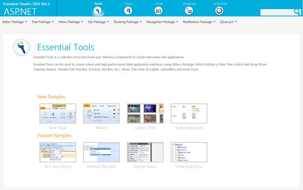
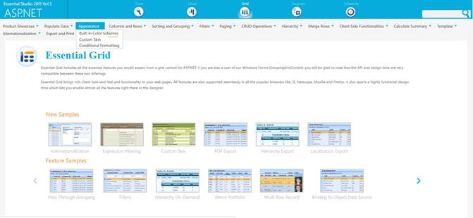

::: {style="DISPLAY: none"}
{#d2h_url_template}{#d2h_package_url style="WIDTH: 0px; DISPLAY: none; HEIGHT: 0px"}
:::

::: {.d2h_secondary_topic style="PADDING-BOTTOM: 10pt; MARGIN: 0pt; PADDING-LEFT: 0pt; PADDING-RIGHT: 0pt; PADDING-TOP: 0pt"}
##### Where do I find Installed samples? {#where-do-i-find-installed-samples style="tab-stops: 0pt"}

Viewing Samples

To view the samples:

1.   Click Dashboard. The Essential Studio Enterprise Edition window is displayed.

The User Interface Edition panel is displayed by default.

2.   Click the drop-down button of ASP.NET platform.

3.   Click the **Run Locally Installed Samples** link. The Essential Studio ASP.NET Edition sample browser is displayed.

{border="0"}

Figure 127: ASP.NET Edition Sample Browser

[]{style="FONT-SIZE: 9pt"} 

4.   Select **Grid**.[]{style="FONT-SIZE: 9pt"}

5.   Select **Custom color** **schemes** samples from the **Appearance** tab provided and browse through the features.[]{style="FONT-SIZE: 9pt"}

[]{style="FONT-SIZE: 9pt"} 

{border="0"}

**[]{style="FONT-STYLE: normal"}** 

Figure 128: ASP.NET Grid Sample Browser**[]{style="FONT-STYLE: normal"}**

 

Source Code Location

The full source code of the GridGroupingControl will be available on the purchase of the product.

In order to go the source code location, go to-

***\[Location where you have installed Syncfusion Products\]***[à]{style="FONT-FAMILY: Wingdings"} **** ***Essential Studio\\vx.x.x.x\\Web\\Grid.Grouping.Web\\Src***

[]{#related-topics}
:::
