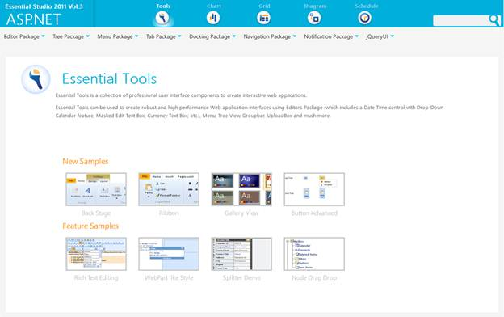
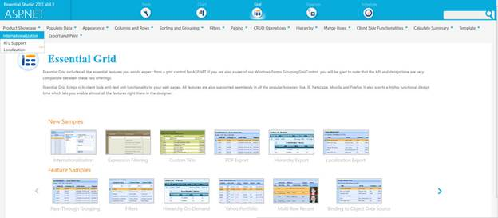

::: {style="DISPLAY: none"}
{#d2h_url_template}{#d2h_package_url style="WIDTH: 0px; DISPLAY: none; HEIGHT: 0px"}
:::

::::: {#nsbanner .d2h_main_nsbanner style="BORDER-BOTTOM: #999999 1px solid; POSITION: relative; PADDING-BOTTOM: 0px; BACKGROUND-COLOR: transparent; PADDING-LEFT: 0px; PADDING-RIGHT: 0px; DISPLAY: none; BORDER-TOP: #999999 1px solid; PADDING-TOP: 0px; LEFT: 0px"}
:::: {#TitleRow .d2h_main_titlerow style="PADDING-BOTTOM: 4px; BACKGROUND-COLOR: transparent; PADDING-LEFT: 22px; WIDTH: 100%; PADDING-RIGHT: 10px; DISPLAY: none; PADDING-TOP: 4px"}
::: {#ienav .d2h_main_ienav style="DISPLAY: none"}
{#D2HPrevious .D2HPreviousEnabled}  {#D2HNext .D2HNextEnabled}
:::
::::
:::::

:::: {#nstext .d2h_main_nstext style="PADDING-BOTTOM: 10px; BACKGROUND-COLOR: transparent; PADDING-LEFT: 22px; PADDING-RIGHT: 10px; HEIGHT: 100%; OVERFLOW: auto; PADDING-TOP: 5px" hasuserbackground="true" valign="bottom"}
::: {#d2h_breadcrumbs .d2h_breadcrumbs}
[Essential Studio User Guide Documentation](ms-xhelp:///?Id=12457748-09e3-4d74-a240-8e049cedf030){.d2h_breadcrumbsNormal}[ \> ]{.d2h_breadcrumbsLinkSeparator}[User Interface Edition](ms-xhelp:///?Id=c29296b7-531c-413b-a0ec-488ca1f7f669){.d2h_breadcrumbsNormal}[ \> ]{.d2h_breadcrumbsLinkSeparator}[Essential ASP.NET](ms-xhelp:///?Id=25c35330-c127-4dad-9a92-ed79dc7261a6){.d2h_breadcrumbsNormal}[ \> ]{.d2h_breadcrumbsLinkSeparator}[Essential Grid]{.d2h_breadcrumbsContentsOnly}[ \> ]{.d2h_breadcrumbsLinkSeparator}[Concepts and Features](ms-xhelp:///?Id=9e489974-524d-457c-9881-e458b1321685){.d2h_breadcrumbsNormal}[ \> ]{.d2h_breadcrumbsLinkSeparator}[Localization](ms-xhelp:///?Id=a0edf727-e68d-42b1-b365-6f774bb95a8d){.d2h_breadcrumbsNormal}
:::

### Where do I find Installed samples? {#where-do-i-find-installed-samples style="tab-stops: 0pt"}

Viewing Samples

To view the samples:

1.   Click Dashboard. The Essential Studio Enterprise Edition window is displayed.

The User Interface Edition panel is displayed by default.

2.   Click the drop-down button of ASP.NET platform.

3.   Click the **Run Locally Installed Samples** link. The Essential Studio ASP.NET Edition sample browser is displayed.

{border="0"}

**[Figure ]{style="FONT-STYLE: normal"}[143]{style="FONT-STYLE: normal"}[: ASP.NET Edition Sample Browser]{style="FONT-STYLE: normal"}[]{style="FONT-STYLE: normal"}**

4.   Select **Grid**.[]{style="FONT-SIZE: 9pt"}

5.   Select **Localization** samples from the **Internationalization** tab provided and browse through the features.[]{style="FONT-SIZE: 9pt"}

[]{style="FONT-SIZE: 9pt"} 

{border="0"}

**[]{style="FONT-STYLE: normal"}** 

Figure 144: ASP.NET Grid Sample Browser**[]{style="FONT-STYLE: normal"}**

 

Source Code Location

The full source code of the GridGroupingControl will be available on the purchase of the product.

In order to go the source code location, go to-

***\[Location where you have installed Syncfusion Products\]***[à]{style="FONT-FAMILY: Wingdings"} **** ***Essential Studio\\vx.x.x.x\\Web\\Grid.Grouping.Web\\Src***

 

[]{#related-topics}
::::
