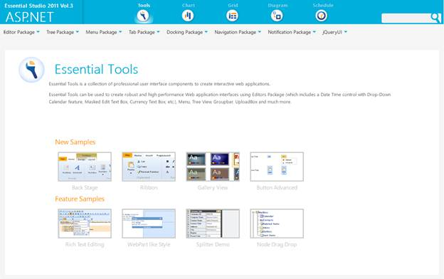
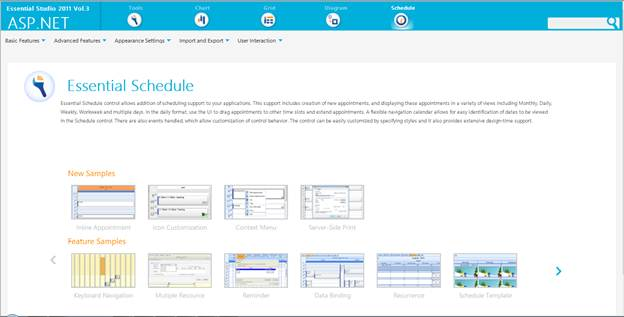

::: {style="DISPLAY: none"}
{#d2h_url_template}{#d2h_package_url style="WIDTH: 0px; DISPLAY: none; HEIGHT: 0px"}
:::

::: {.d2h_secondary_topic style="PADDING-BOTTOM: 10pt; MARGIN: 0pt; PADDING-LEFT: 0pt; PADDING-RIGHT: 0pt; PADDING-TOP: 0pt"}
#### Where do I find Installed samples? {#where-do-i-find-installed-samples style="tab-stops: 0pt"}

Viewing Samples

To view the samples:

1.   Click Dashboard. The Essential Studio Enterprise Edition window is displayed.

2.   Click the Run Locally Installed Samples link. The Essential Studio ASP.NET Edition sample browser is displayed.

{border="0"}

Figure 84: ASP.NET Edition Sample Browser

 

3.   Select **Schedule** from the drop-down.

 {border="0"}

Figure 85: ASP.NET Schedule Sample browser

4.   Select any sample from **Inline Appointments** under the **Basic Features** tab and browse through the features.

 

[]{#related-topics}
:::
