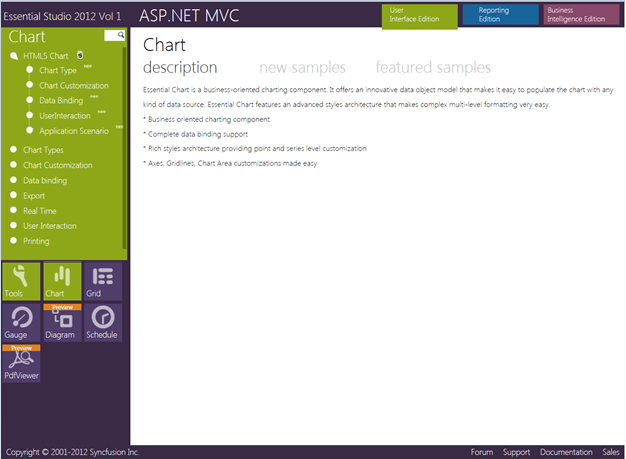

::: {style="DISPLAY: none"}
{#d2h_url_template} {#d2h_package_url style="WIDTH: 0px; DISPLAY: none; HEIGHT: 0px"}
:::

::::: {#nsbanner .d2h_main_nsbanner style="BORDER-BOTTOM: #999999 1px solid; POSITION: relative; PADDING-BOTTOM: 0px; BACKGROUND-COLOR: transparent; PADDING-LEFT: 0px; PADDING-RIGHT: 0px; DISPLAY: none; BORDER-TOP: #999999 1px solid; PADDING-TOP: 0px; LEFT: 0px"}
:::: {#TitleRow .d2h_main_titlerow style="PADDING-BOTTOM: 4px; BACKGROUND-COLOR: transparent; PADDING-LEFT: 22px; WIDTH: 100%; PADDING-RIGHT: 10px; DISPLAY: none; PADDING-TOP: 4px"}
::: {#ienav .d2h_main_ienav style="DISPLAY: none"}
{#D2HPrevious .D2HPreviousEnabled}  {#D2HNext .D2HNextEnabled}
:::
::::
:::::

:::: {#nstext .d2h_main_nstext style="PADDING-BOTTOM: 10px; BACKGROUND-COLOR: transparent; PADDING-LEFT: 22px; PADDING-RIGHT: 10px; HEIGHT: 100%; OVERFLOW: auto; PADDING-TOP: 5px" hasuserbackground="true" valign="bottom"}
::: {#d2h_breadcrumbs .d2h_breadcrumbs}
[Essential Studio User Guide Documentation](ms-xhelp:///?Id=12457748-09e3-4d74-a240-8e049cedf030){.d2h_breadcrumbsNormal} [ \> ]{.d2h_breadcrumbsLinkSeparator} [User Interface Edition](ms-xhelp:///?Id=c29296b7-531c-413b-a0ec-488ca1f7f669){.d2h_breadcrumbsNormal} [ \> ]{.d2h_breadcrumbsLinkSeparator} [Essential ASP.NET MVC](ms-xhelp:///?Id=4b14e7d1-65c4-4f67-b1aa-2c37709905a5){.d2h_breadcrumbsNormal} [ \> ]{.d2h_breadcrumbsLinkSeparator} [Essential Chart in HTML 5]{.d2h_breadcrumbsContentsOnly} [ \> ]{.d2h_breadcrumbsLinkSeparator} [Installation and Deployment](ms-xhelp:///?Id=7bf30603-8f1c-4b85-a33c-79d985a28d31){.d2h_breadcrumbsNormal}
:::

## Where do I find samples? {#where-do-i-find-samples style="tab-stops: 0pt"}

[]{style="FONT-FAMILY: 'Trebuchet MS','sans-serif'; COLOR: #15428b; FONT-SIZE: 9pt"} 

This section covers the location of the installed samples and describes the procedure to run the samples through the sample browser and online. It also lists the location of utilities, assemblies and source code.

[]{style="COLOR: black"} 

Sample Installation Location

[]{style="COLOR: black"} 

The ASP.NET MVC samples are installed in the following location, locally on the disk:

[]{style="COLOR: black"} 

\...\\My Documents\\Syncfusion\\EssentialStudio\\\<Version Number\>\\MVC\\chartmvc\\Samples\\3.5

 

Viewing Samples

**[]{style="COLOR: black"}**  

To view the samples, follow the steps below:

 

1.   Click **Start\--\>All Programs\--\>Syncfusion\--\>Essential Studio \<version number\> \--\>Dashboard**. **Syncfusion Essential Studio Dashboard \<version number\>** window is displayed.

 

{border="0"}

Figure 1: Syncfusion Essential Studio Dashboard

[]{style="COLOR: black"} 

2.   In the Dashboard window, click Run Samples for ASP.NET MVC in the User Interface Edition panel. The ASP.NET MVC Sample Browser window is displayed.

[]{style="COLOR: black"} 

{border="0"}

Figure 2: ASP.NET MVC Sample Browser

[]{style="COLOR: black"} 

3.   Click **Essential Chart** under **Other Products**. The Chart samples are displayed.

 

[]{style="COLOR: black"} 

 

{border="0"}

Figure 3: Chart Samples Displayed in the ASP.NET MVC Sample Browser

***[]{style="COLOR: black"}***  

***[]{style="COLOR: black"}***  

4\. Select any sample and browse through the features.

[]{style="COLOR: black"} 

Source Code Location

[]{style="COLOR: black"} 

The default location of the Essential Chart MVC source code is:

 

***\[System Drive\]:\\Program Files\\Syncfusion\\Essential Studio\\\<Version Number\>\\MVC\\Chart.MVC***

[]{style="COLOR: black"} 

[]{#related-topics}
::::
