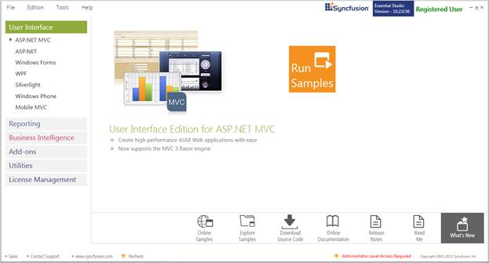
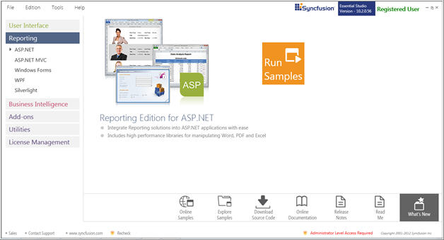
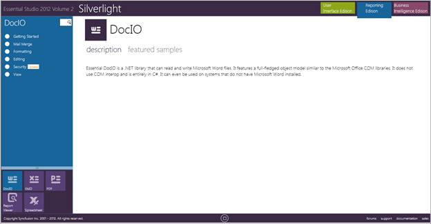
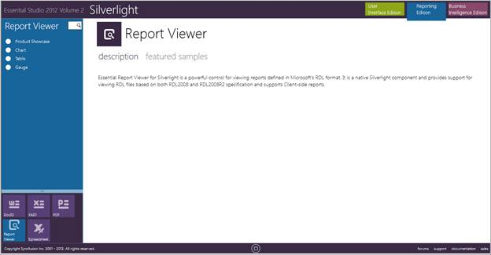

::: {style="DISPLAY: none"}
{#d2h_url_template}{#d2h_package_url style="WIDTH: 0px; DISPLAY: none; HEIGHT: 0px"}
:::

::::: {#nsbanner .d2h_main_nsbanner style="BORDER-BOTTOM: #999999 1px solid; POSITION: relative; PADDING-BOTTOM: 0px; BACKGROUND-COLOR: transparent; PADDING-LEFT: 0px; PADDING-RIGHT: 0px; DISPLAY: none; BORDER-TOP: #999999 1px solid; PADDING-TOP: 0px; LEFT: 0px"}
:::: {#TitleRow .d2h_main_titlerow style="PADDING-BOTTOM: 4px; BACKGROUND-COLOR: transparent; PADDING-LEFT: 22px; WIDTH: 100%; PADDING-RIGHT: 10px; DISPLAY: none; PADDING-TOP: 4px"}
::: {#ienav .d2h_main_ienav style="DISPLAY: none"}
{#D2HPrevious .D2HPreviousEnabled}  {#D2HNext .D2HNextEnabled}
:::
::::
:::::

::::: {#nstext .d2h_main_nstext style="PADDING-BOTTOM: 10px; BACKGROUND-COLOR: transparent; PADDING-LEFT: 22px; PADDING-RIGHT: 10px; HEIGHT: 100%; OVERFLOW: auto; PADDING-TOP: 5px" hasuserbackground="true" valign="bottom"}
::: {#d2h_breadcrumbs .d2h_breadcrumbs}
[Essential Studio User Guide Documentation](ms-xhelp:///?Id=12457748-09e3-4d74-a240-8e049cedf030){.d2h_breadcrumbsNormal}[ \> ]{.d2h_breadcrumbsLinkSeparator}[Reporting Edition](ms-xhelp:///?Id=027aa5b6-6676-4f93-ad23-c20e8c45792e){.d2h_breadcrumbsNormal}[ \> ]{.d2h_breadcrumbsLinkSeparator}[Essential Report Viewer](ms-xhelp:///?Id=35081cc7-4b81-4ef5-97d2-894ad584b907){.d2h_breadcrumbsNormal}[ \> ]{.d2h_breadcrumbsLinkSeparator}[Report Viewer Silverlight]{.d2h_breadcrumbsContentsOnly}[ \> ]{.d2h_breadcrumbsLinkSeparator}[Installation and Deployment](ms-xhelp:///?Id=357c83ad-9d54-41a2-b28b-6f201f4f554f){.d2h_breadcrumbsNormal}
:::

## Where to Find Samples? {#where-to-find-samples style="tab-stops: 0pt"}

 

This section covers the location of the installed samples and describes the procedure to run the samples through the sample browser and online. It also lists the location of utilities, assemblies and source code.

 

Sample Installation Location

 

The Essential ReportViewer samples for Silverlight are installed under the following location, locally on the disk:

 

::: {style="BORDER-BOTTOM: windowtext 1pt solid; BORDER-LEFT: medium none; PADDING-BOTTOM: 1pt; MARGIN-TOP: 9pt; PADDING-LEFT: 0pt; PADDING-RIGHT: 0pt; MARGIN-BOTTOM: 9pt; BORDER-TOP: windowtext 1pt solid; BORDER-RIGHT: medium none; PADDING-TOP: 1pt"}
\<InstalledLocation\>\\Syncfusion\\EssentialStudio\\\<Version Number\>\\Samples\\Silverlight\\ReportViewer.Silverlight
:::

**** 

Viewing Samples

[]{style="BACKGROUND: yellow"} 

To view the samples:

 

1.   Click **Start** \> **All Programs** \> **Syncfusion** \> **Essential Studio \<version number\>** \> **Dashboard**. The Syncfusion Essential Studio Dashboard window is displayed. The UI samples are displayed by default.

 

{border="0"}

Figure 3: Syncfusion Essential Studio Dashboard

 

2.   Select **Reporting** edition.

 

{border="0"}

Figure 4: Syncfusion Essential Studio Reporting Edition Dashboard []{style="FONT-STYLE: normal"}

*[]{style="FONT-SIZE: 9pt"}* 

3.   Click **Silverlight**.

 

***[{border="0"}]{style="FONT-SIZE: 9pt"}**[Note: You can view the samples using three ways:]{style="FONT-SIZE: 9pt"}***

 

[·      ]{style="FONT-FAMILY: Symbol"}**Run Samples -** View the locally installed Reporting Edition Silverlight samples using the sample browser

[·      ]{style="FONT-FAMILY: Symbol"}**Online Samples -** View the online samples of Silverlight

[·      ]{style="FONT-FAMILY: Symbol"}**Explore Samples** - Locate the samples on the disk

 

4.   Click **Run Samples** link. The Syncfusion Essential Studio Silverlight Reporting Edition sample browser is displayed.

 

{border="0"}

Figure 5: Reporting Edition Silverlight Sample Browser

 

5.   Select **Report Viewer** from the bottom-left pane to view the samples of Report Viewer.

 

{border="0"}

Figure 6: Report Viewer Sample

 

6.   Select any sample and browse through the features.

 

[]{#related-topics}
:::::
