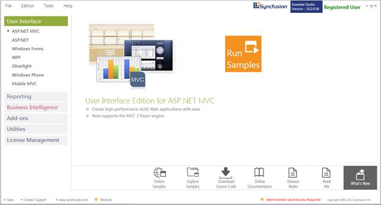
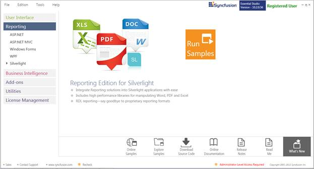
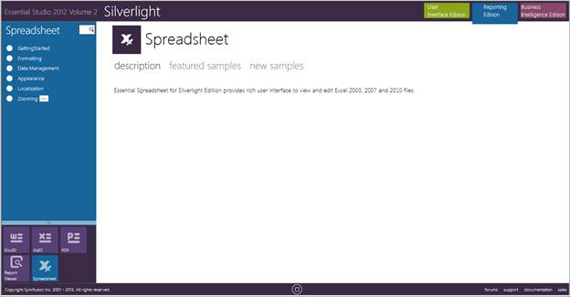

::: {style="DISPLAY: none"}
{#d2h_url_template}{#d2h_package_url style="WIDTH: 0px; DISPLAY: none; HEIGHT: 0px"}
:::

::::: {#nsbanner .d2h_main_nsbanner style="BORDER-BOTTOM: #999999 1px solid; POSITION: relative; PADDING-BOTTOM: 0px; BACKGROUND-COLOR: transparent; PADDING-LEFT: 0px; PADDING-RIGHT: 0px; DISPLAY: none; BORDER-TOP: #999999 1px solid; PADDING-TOP: 0px; LEFT: 0px"}
:::: {#TitleRow .d2h_main_titlerow style="PADDING-BOTTOM: 4px; BACKGROUND-COLOR: transparent; PADDING-LEFT: 22px; WIDTH: 100%; PADDING-RIGHT: 10px; DISPLAY: none; PADDING-TOP: 4px"}
::: {#ienav .d2h_main_ienav style="DISPLAY: none"}
{#D2HPrevious .D2HPreviousEnabled}  {#D2HNext .D2HNextEnabled}
:::
::::
:::::

:::: {#nstext .d2h_main_nstext style="PADDING-BOTTOM: 10px; BACKGROUND-COLOR: transparent; PADDING-LEFT: 22px; PADDING-RIGHT: 10px; HEIGHT: 100%; OVERFLOW: auto; PADDING-TOP: 5px" hasuserbackground="true" valign="bottom"}
::: {#d2h_breadcrumbs .d2h_breadcrumbs}
[Essential Studio User Guide Documentation](ms-xhelp:///?Id=12457748-09e3-4d74-a240-8e049cedf030){.d2h_breadcrumbsNormal}[ \> ]{.d2h_breadcrumbsLinkSeparator}[Reporting Edition](ms-xhelp:///?Id=027aa5b6-6676-4f93-ad23-c20e8c45792e){.d2h_breadcrumbsNormal}[ \> ]{.d2h_breadcrumbsLinkSeparator}[Essential Spreadsheet](ms-xhelp:///?Id=25812fa4-b4ea-4485-bbfb-30849a783142){.d2h_breadcrumbsNormal}[ \> ]{.d2h_breadcrumbsLinkSeparator}[Spreadsheet Silverlight]{.d2h_breadcrumbsContentsOnly}[ \> ]{.d2h_breadcrumbsLinkSeparator}[Installation and Deployment](ms-xhelp:///?Id=352416cf-2b98-45d2-bde8-e9da447c0455){.d2h_breadcrumbsNormal}
:::

## Where to Find Samples? {#where-to-find-samples style="TEXT-ALIGN: justify; tab-stops: 0pt"}

This section covers the location of the installed samples and describes the procedure to run the samples through the sample browser and online. It also lists the location of utilities, assemblies and source code.

 

**Sample Installation Location**

 

The Essential Spreadsheet for Silverlight samples are installed in the following location, locally on the disk:

***\...\\My Documents\\Syncfusion\\EssentialStudio\\\<Version Number\>\\Silverlight\\Spreadsheet.Silverlight\\ ***

 

Viewing Samples

 

To view the samples:

 

1.   Click **Start\--\>All Programs\--\>Syncfusion\--\>Essential Studio \<version number\> \--\>Dashboard. Syncfusion Essential Studio Dashboard \<version number\>** window is displayed. The UI edition is displayed by default.

{border="0"}

 Figure 1: Syncfusion Essential Studio Dashboard

 

2.   In the dashboard window, click **Run Samples** for Silverlight under **Reporting** Edition panel. The Silverlight Sample Browser window is displayed.

 {border="0"}

Figure 2: Syncfusion Essential Studio Dashboard

 

***[{border="0"}]{style="FONT-SIZE: 9pt"}**[Note: You can view the samples in any of the following three ways:]{style="FONT-SIZE: 9pt"}***

 

[·    ]{style="FONT-FAMILY: Symbol; FONT-SIZE: 11pt"}**Run Samples**-Click to view the locally installed samples.

[·    ]{style="FONT-FAMILY: Symbol; FONT-SIZE: 11pt"}**Online Samples**-Click to view online samples.

[·    ]{style="FONT-FAMILY: Symbol; FONT-SIZE: 11pt"}**Explore Samples**-Explore Silverlight samples on disk.

 

DocIO samples are displayed by default.

{border="0"}

Figure 3: Default Silverlight Sample

 

3.   Select **Spreadsheet** from the bottom-left pane. The Spreadsheet samples will be displayed.

 

{border="0"}

Figure 4: Spreadsheet Sample

 

 

Source Code Location

 

The default location of the Essential Spreadsheet for Silverlight source code is:

 

*** \[System Drive\]:\\Program Files\\Syncfusion\\Essential Studio\\\<Version Number\>\\Silverlight\\Spreadsheet.silverlight\\Src***

**** 

[]{#related-topics}
::::
