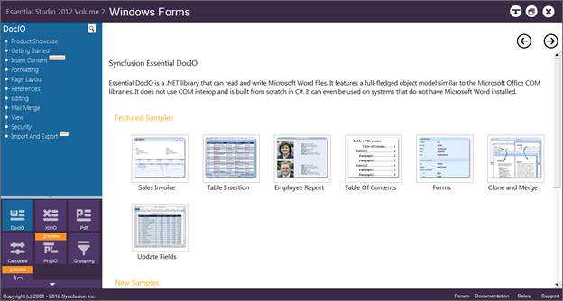
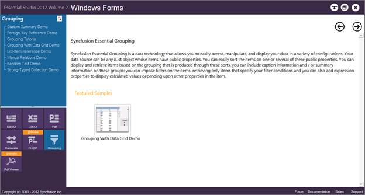
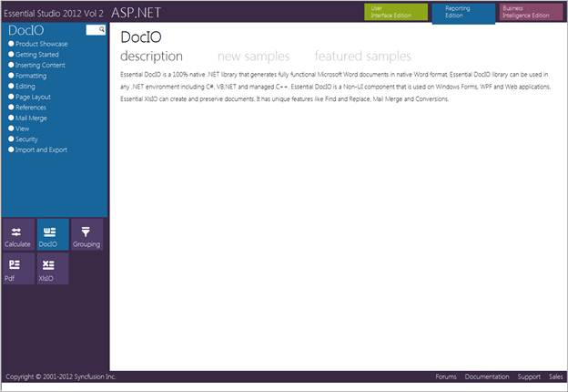
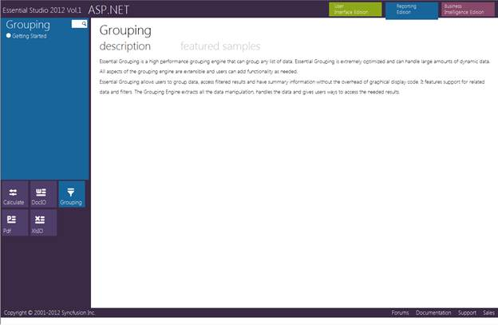

::: {style="DISPLAY: none"}
{#d2h_url_template}{#d2h_package_url style="WIDTH: 0px; DISPLAY: none; HEIGHT: 0px"}
:::

::::: {#nsbanner .d2h_main_nsbanner style="BORDER-BOTTOM: #999999 1px solid; POSITION: relative; PADDING-BOTTOM: 0px; BACKGROUND-COLOR: transparent; PADDING-LEFT: 0px; PADDING-RIGHT: 0px; DISPLAY: none; BORDER-TOP: #999999 1px solid; PADDING-TOP: 0px; LEFT: 0px"}
:::: {#TitleRow .d2h_main_titlerow style="PADDING-BOTTOM: 4px; BACKGROUND-COLOR: transparent; PADDING-LEFT: 22px; WIDTH: 100%; PADDING-RIGHT: 10px; DISPLAY: none; PADDING-TOP: 4px"}
::: {#ienav .d2h_main_ienav style="DISPLAY: none"}
{#D2HPrevious .D2HPreviousEnabled}  {#D2HNext .D2HNextEnabled}
:::
::::
:::::

:::::: {#nstext .d2h_main_nstext style="PADDING-BOTTOM: 10px; BACKGROUND-COLOR: transparent; PADDING-LEFT: 22px; PADDING-RIGHT: 10px; HEIGHT: 100%; OVERFLOW: auto; PADDING-TOP: 5px" hasuserbackground="true" valign="bottom"}
::: {#d2h_breadcrumbs .d2h_breadcrumbs}
[Essential Studio User Guide Documentation](ms-xhelp:///?Id=12457748-09e3-4d74-a240-8e049cedf030){.d2h_breadcrumbsNormal}[ \> ]{.d2h_breadcrumbsLinkSeparator}[Reporting Edition](ms-xhelp:///?Id=027aa5b6-6676-4f93-ad23-c20e8c45792e){.d2h_breadcrumbsNormal}[ \> ]{.d2h_breadcrumbsLinkSeparator}[Essential Grouping](ms-xhelp:///?Id=37faf36d-c8f0-4c7d-90e1-39deecb620a6){.d2h_breadcrumbsNormal}[ \> ]{.d2h_breadcrumbsLinkSeparator}[Installation and Deployment](ms-xhelp:///?Id=d4d83d37-20a9-4084-a66e-f0126e9f5d92){.d2h_breadcrumbsNormal}
:::

## Where to Find Samples? {#where-to-find-samples style="tab-stops: 0pt"}

 

This section provides the location of the installed samples and describes the procedure to run the samples in the sample browser and online. It also lists the location of utilities, assemblies, and source code.

 

Sample Installation Location

Sample install locations for different platforms are listed below:

 

Windows Forms Samples -- The Grouping Windows Forms samples are installed in the following location:

[·      ]{style="FONT-FAMILY: Symbol"}\[Install Location\]:\\\...\\Syncfusion\\Essential Studio\\\[Version Number\]\\Windows\\Grouping.Windows\\Samples\\2.0

[·      ]{style="FONT-FAMILY: Symbol"}ASP.NET Samples -- The Grouping Web samples are installed in the following location:

[·      ]{style="FONT-FAMILY: Symbol"}\[Install Location\]:\\\...\\Syncfusion\\Essential Studio\\\[Version Number\]\\Web\\Grouping.Web\\Samples\\3.5

[]{style="FONT-FAMILY: 'Trebuchet MS','sans-serif'; COLOR: #15428b; FONT-SIZE: 9pt"} 

Viewing Samples

To view the samples:

1    Click **Start** **[à]{style="FONT-FAMILY: Wingdings"}All Programs** **[à]{style="FONT-FAMILY: Wingdings"} Syncfusion** **[à]{style="FONT-FAMILY: Wingdings"} Essential Studio \<version number\>** **[à]{style="FONT-FAMILY: Wingdings"} Dashboard.**

The UI Edition samples are displayed by default.

 

{border="0"}[]{style="FONT-FAMILY: 'Trebuchet MS','sans-serif'; COLOR: #15428b; FONT-SIZE: 9pt"}

Figure 2: Syncfusion Essential Studio Dashboard

 

2    Select **Reporting** Edition.

{border="0"}*[]{style="FONT-FAMILY: 'Trebuchet MS','sans-serif'; COLOR: #15428b; FONT-SIZE: 9pt"}*

Figure 3: Syncfusion Essential Studio Dashboard

*[]{style="FONT-FAMILY: 'Trebuchet MS','sans-serif'; COLOR: #15428b; FONT-SIZE: 9pt"}* 

 

The steps to view the Grouping samples in various platforms are discussed below:

**[]{style="FONT-FAMILY: 'Trebuchet MS','sans-serif'; COLOR: #15428b; FONT-SIZE: 9pt"}** 

Windows

1.   In the Dashboard window, click **Run Samples** for **Windows Forms** under **Reporting Edition panel.** The **Windows Forms** Sample Browser window is displayed.

::: {style="BORDER-BOTTOM: windowtext 1pt solid; BORDER-LEFT: medium none; PADDING-BOTTOM: 1pt; MARGIN-TOP: 9pt; PADDING-LEFT: 0pt; PADDING-RIGHT: 0pt; MARGIN-BOTTOM: 9pt; BORDER-TOP: windowtext 1pt solid; BORDER-RIGHT: medium none; PADDING-TOP: 1pt"}
Note: You can view the samples in any of the following three ways:
:::

[·      ]{style="FONT-FAMILY: Symbol"}**Run Samples** -- Click to view the locally installed samples.

[·      ]{style="FONT-FAMILY: Symbol"}**Online Samples** -- Click to view online samples.

[·      ]{style="FONT-FAMILY: Symbol"}**Explore Samples --** Explore Windows Forms samples on disk.

 

{border="0"}

Figure 4: Windows Forms Sample Browser

[]{style="FONT-FAMILY: 'Trebuchet MS','sans-serif'; COLOR: #15428b; FONT-SIZE: 9pt"} 

2.   Click **Grouping** from the bottom-left pane. The Grouping samples are displayed.

 

{border="0"}

Figure 5: Grouping samples displayed in the Windows Forms Sample Browser

[]{style="FONT-FAMILY: 'Trebuchet MS','sans-serif'; COLOR: #15428b; FONT-SIZE: 9pt"} 

3    Select any sample and browse through the features.

[]{style="FONT-FAMILY: 'Trebuchet MS','sans-serif'; COLOR: #15428b; FONT-SIZE: 9pt"} 

ASP.NET

**[]{style="FONT-FAMILY: 'Trebuchet MS','sans-serif'; COLOR: #15428b; FONT-SIZE: 9pt"}** 

1    In the Dashboard window, click **Run Samples** for **ASP.NET** under **Reporting Edition panel**. The ASP.NET Sample Browser window is displayed.

::: {style="BORDER-BOTTOM: windowtext 1pt solid; BORDER-LEFT: medium none; PADDING-BOTTOM: 1pt; MARGIN-TOP: 9pt; PADDING-LEFT: 0pt; PADDING-RIGHT: 0pt; MARGIN-BOTTOM: 9pt; BORDER-TOP: windowtext 1pt solid; BORDER-RIGHT: medium none; PADDING-TOP: 1pt"}
Note: You can view the samples in any of the three ways displayed:
:::

[]{style="FONT-FAMILY: 'Trebuchet MS','sans-serif'; COLOR: #15428b; FONT-SIZE: 9pt"} 

[]{style="FONT-FAMILY: 'Trebuchet MS','sans-serif'; COLOR: #15428b; FONT-SIZE: 9pt"} 

{border="0"}

Figure 6: ASP.NET Sample Browser

 

2    Click **Grouping** from the bottom-left pane. The Grouping samples are displayed.

[]{style="LINE-HEIGHT: 115%; FONT-FAMILY: 'Trebuchet MS','sans-serif'; COLOR: #15428b; FONT-SIZE: 9pt"} 

{border="0"}

Figure 7: Grouping samples displayed in the ASP.NET Sample Browser

[]{style="LINE-HEIGHT: 115%; FONT-FAMILY: 'Trebuchet MS','sans-serif'; COLOR: #15428b; FONT-SIZE: 9pt"} 

3    Select any sample and browse through the features.

**[            ]{style="FONT-FAMILY: 'Trebuchet MS','sans-serif'; COLOR: #15428b; FONT-SIZE: 9pt"}**[]{style="FONT-FAMILY: 'Trebuchet MS','sans-serif'; COLOR: #15428b; FONT-SIZE: 9pt"}

Source Code Location

**[]{style="FONT-FAMILY: 'Trebuchet MS','sans-serif'; COLOR: #15428b; FONT-SIZE: 9pt"}** 

Windows Forms Source Code

The default location of the Windows Forms Grouping source code is:

**\[System Drive\]:\\Program Files\\Syncfusion\\Essential Studio\\\[Version Number\]\\Windows\\Grouping.Windows\\Src**

 

**ASP.NET Source Code**

The default location of the ASP.NET Grouping source code is:

**\[System Drive\]:\\Program Files\\Syncfusion\\Essential Studio\\\[Version Number\]\\Web\\Grouping.Web\\Src**

 

 

[]{#related-topics}
::::::
