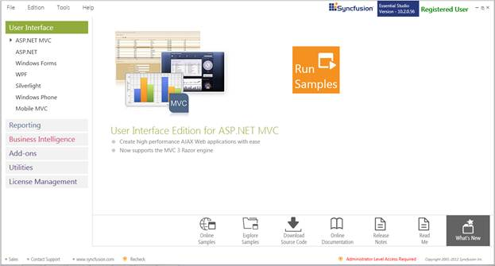
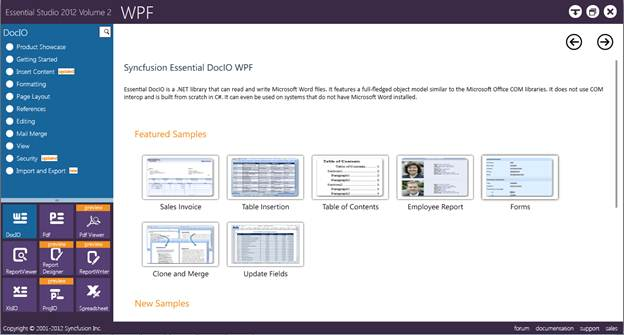
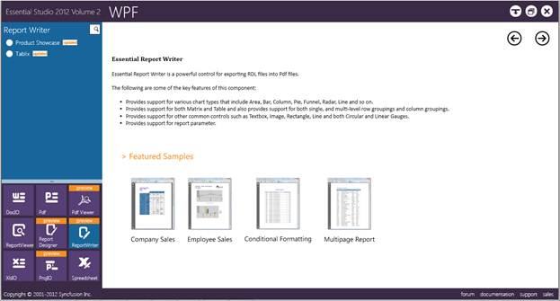

::: {style="DISPLAY: none"}
{#d2h_url_template}{#d2h_package_url style="WIDTH: 0px; DISPLAY: none; HEIGHT: 0px"}
:::

::::: {#nsbanner .d2h_main_nsbanner style="BORDER-BOTTOM: #999999 1px solid; POSITION: relative; PADDING-BOTTOM: 0px; BACKGROUND-COLOR: transparent; PADDING-LEFT: 0px; PADDING-RIGHT: 0px; DISPLAY: none; BORDER-TOP: #999999 1px solid; PADDING-TOP: 0px; LEFT: 0px"}
:::: {#TitleRow .d2h_main_titlerow style="PADDING-BOTTOM: 4px; BACKGROUND-COLOR: transparent; PADDING-LEFT: 22px; WIDTH: 100%; PADDING-RIGHT: 10px; DISPLAY: none; PADDING-TOP: 4px"}
::: {#ienav .d2h_main_ienav style="DISPLAY: none"}
{#D2HPrevious .D2HPreviousEnabled}  {#D2HNext .D2HNextEnabled}
:::
::::
:::::

::: {#nstext .d2h_main_nstext style="PADDING-BOTTOM: 10px; BACKGROUND-COLOR: transparent; PADDING-LEFT: 22px; PADDING-RIGHT: 10px; HEIGHT: 100%; OVERFLOW: auto; PADDING-TOP: 5px" hasuserbackground="true" valign="bottom"}
## Where to Find Samples? {#where-to-find-samples style="tab-stops: 0pt"}

This section covers the location of the installed samples and describes the procedure to run the samples through the sample browser and online. It also lists the location of utilities, assemblies, and source code.[]{style="COLOR: #c00000"}

 

Viewing Samples Installed on the Disk

The Report Writer for WPF samples are installed locally on the disk in the following location.

[ ]{style="COLOR: black"}\<InstallLocation\>\\Syncfusion\\EssentialStudio\\\<VersionNumber\>\\Samples\\Reports\\WPF\\ReportWriter.WPF\\Samples[]{style="COLOR: black"}

 

Viewing Samples on the Dashboard

To access the samples in the dashboard perform the following steps:

1.   Click **Start**\>**All Programs**\>**Syncfusion**\>**Essential Studio \<version number\>** \>**Dashboard**.

 

The Essential Studio Enterprise Edition dashboard is displayed. The **User Interface** edition panel is displayed by default.

 

{border="0"}

Figure 1: Essential Studio Dashboard

 

2.   Select the **Reporting** edition panel.

 

{border="0"}

Figure 2: Essential Studio Reporting Dashboard

3.   Select **WPF** from the samples listed. The following options will be displayed. You can view the samples in the following three ways:

[·      ]{style="FONT-FAMILY: Symbol"}**Run Samples---**View the locally installed Report Writer samples for WPF using the sample browser.

[·      ]{style="FONT-FAMILY: Symbol"}**Online Samples---**View the online samples for WPF.

[·      ]{style="FONT-FAMILY: Symbol"}**Explore Samples---**Locate the WPF samples on the disk.

 

{border="0"}

Figure 3: Essential Studio Reporting WPF Dashboard

 

4.   Click **Report Writer** from the bottom-left pane.

 

{border="0"}

Figure 4: Essential Studio WPF Report Writer Samples

 

[]{#related-topics}
:::
