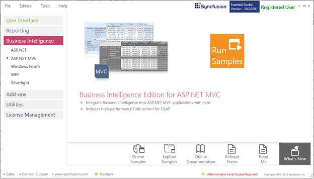
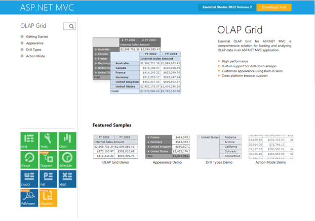

::: {style="DISPLAY: none"}
{#d2h_url_template}{#d2h_package_url style="WIDTH: 0px; DISPLAY: none; HEIGHT: 0px"}
:::

::::: {#nsbanner .d2h_main_nsbanner style="BORDER-BOTTOM: #999999 1px solid; POSITION: relative; PADDING-BOTTOM: 0px; BACKGROUND-COLOR: transparent; PADDING-LEFT: 0px; PADDING-RIGHT: 0px; DISPLAY: none; BORDER-TOP: #999999 1px solid; PADDING-TOP: 0px; LEFT: 0px"}
:::: {#TitleRow .d2h_main_titlerow style="PADDING-BOTTOM: 4px; BACKGROUND-COLOR: transparent; PADDING-LEFT: 22px; WIDTH: 100%; PADDING-RIGHT: 10px; DISPLAY: none; PADDING-TOP: 4px"}
::: {#ienav .d2h_main_ienav style="DISPLAY: none"}
{#D2HPrevious .D2HPreviousEnabled}  {#D2HNext .D2HNextEnabled}
:::
::::
:::::

::::: {#nstext .d2h_main_nstext style="PADDING-BOTTOM: 10px; BACKGROUND-COLOR: transparent; PADDING-LEFT: 22px; PADDING-RIGHT: 10px; HEIGHT: 100%; OVERFLOW: auto; PADDING-TOP: 5px" hasuserbackground="true" valign="bottom"}
::: {#d2h_breadcrumbs .d2h_breadcrumbs}
[Essential Studio User Guide Documentation](ms-xhelp:///?Id=12457748-09e3-4d74-a240-8e049cedf030){.d2h_breadcrumbsNormal}[ \> ]{.d2h_breadcrumbsLinkSeparator}[Business Intelligence Edition](ms-xhelp:///?Id=fdf33dd8-62b2-47b9-ad7b-fc50e590bca5){.d2h_breadcrumbsNormal}[ \> ]{.d2h_breadcrumbsLinkSeparator}[Essential BI ASP.NET MVC](ms-xhelp:///?Id=32b055b8-3bdf-473c-bb73-f99a534ce79c){.d2h_breadcrumbsNormal}[ \> ]{.d2h_breadcrumbsLinkSeparator}[Essential BI Grid]{.d2h_breadcrumbsContentsOnly}[ \> ]{.d2h_breadcrumbsLinkSeparator}[Installation and Deployment](ms-xhelp:///?Id=1f20b70b-bb6c-4ae2-811f-5b58f30e2205){.d2h_breadcrumbsNormal}
:::

## Where to Find Samples?[]{#_Samples_Installation_Location} {#where-to-find-samples style="tab-stops: 0pt"}

[]{#_Sample_Installation_Location}Sample Installation Location

The OLAP Grid samples are installed in the following location, locally on the disk:

 

Windows XP:[]{style="FONT-WEIGHT: normal"}

C:\\Syncfusion\\Essential Studio\<version number\>\\MVC\\OlapGrid.MVC\\Samples\\

 

Windows 7/Vista:[]{style="FONT-WEIGHT: normal"}

C:\\Users\\\<User Name\>\\AppData\\Local\\Syncfusion\\EssentialStudio\\Essential Studio\<version number\>\\MVC\\OlapGrid.MVC\\Samples\\

Viewing Samples

To view the samples:

[]{style="FONT-FAMILY: 'Calibri','sans-serif'; COLOR: black"} 

1.   Click **Start**\--\>**All Programs**\--\>**Syncfusion**\--\>**Essential Studio \<version number\>** \--\>**Dashboard**. Syncfusion Essential Studio Dashboard \<version number\> window is displayed.

 

[]{style="FONT-FAMILY: 'Calibri','sans-serif'; COLOR: black"} 

 

{border="0"}

Figure 1: Syncfusion Essential Studio Dashboard

[]{style="FONT-FAMILY: 'Calibri','sans-serif'; COLOR: black"} 

2.   In the Dashboard window, click **Run Samples** for ASP.NET MVC under **Business Intelligence** Edition panel. The ASP.NET MVC Sample Browser window is displayed.

[]{style="FONT-FAMILY: 'Calibri','sans-serif'; COLOR: black"} 

::: {style="BORDER-BOTTOM: windowtext 1pt solid; BORDER-LEFT: medium none; PADDING-BOTTOM: 1pt; MARGIN-TOP: 9pt; PADDING-LEFT: 0pt; PADDING-RIGHT: 0pt; MARGIN-BOTTOM: 9pt; BORDER-TOP: windowtext 1pt solid; BORDER-RIGHT: medium none; PADDING-TOP: 1pt"}
{border="0"}Note: You can view the samples in any of the following three ways:
:::

[]{style="FONT-FAMILY: 'Calibri','sans-serif'; COLOR: black"} 

[·      ]{style="FONT-FAMILY: Symbol"}**Run Samples** - Click to view the locally installed samples.

[·      ]{style="FONT-FAMILY: Symbol"}**Online Samples** - Click to view online samples.

[·      ]{style="FONT-FAMILY: Symbol"}**Explore Samples** - Explore ASP.NET MVC samples on disk.

 

3.   The OlapGrid samples are displayed.

 

{border="0"}

Figure 2: OLAP Grid MVC Samples

 

4.   Select any sample and browse through the features.

[]{#related-topics}
:::::
