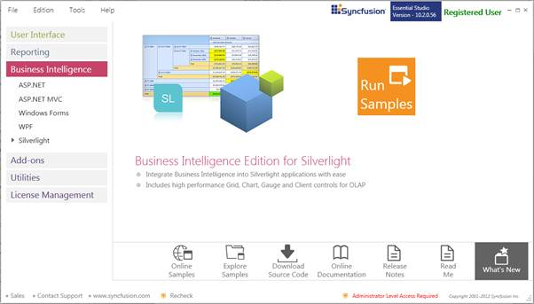
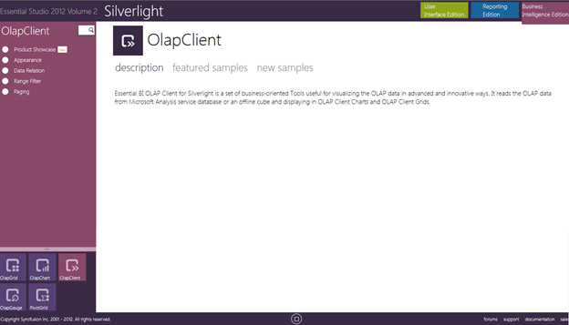

::: {style="DISPLAY: none"}
{#d2h_url_template}{#d2h_package_url style="WIDTH: 0px; DISPLAY: none; HEIGHT: 0px"}
:::

::::: {#nsbanner .d2h_main_nsbanner style="BORDER-BOTTOM: #999999 1px solid; POSITION: relative; PADDING-BOTTOM: 0px; BACKGROUND-COLOR: transparent; PADDING-LEFT: 0px; PADDING-RIGHT: 0px; DISPLAY: none; BORDER-TOP: #999999 1px solid; PADDING-TOP: 0px; LEFT: 0px"}
:::: {#TitleRow .d2h_main_titlerow style="PADDING-BOTTOM: 4px; BACKGROUND-COLOR: transparent; PADDING-LEFT: 22px; WIDTH: 100%; PADDING-RIGHT: 10px; DISPLAY: none; PADDING-TOP: 4px"}
::: {#ienav .d2h_main_ienav style="DISPLAY: none"}
{#D2HPrevious .D2HPreviousEnabled}  {#D2HNext .D2HNextEnabled}
:::
::::
:::::

::::: {#nstext .d2h_main_nstext style="PADDING-BOTTOM: 10px; BACKGROUND-COLOR: transparent; PADDING-LEFT: 22px; PADDING-RIGHT: 10px; HEIGHT: 100%; OVERFLOW: auto; PADDING-TOP: 5px" hasuserbackground="true" valign="bottom"}
::: {#d2h_breadcrumbs .d2h_breadcrumbs}
[Essential Studio User Guide Documentation](ms-xhelp:///?Id=12457748-09e3-4d74-a240-8e049cedf030){.d2h_breadcrumbsNormal}[ \> ]{.d2h_breadcrumbsLinkSeparator}[Business Intelligence Edition](ms-xhelp:///?Id=fdf33dd8-62b2-47b9-ad7b-fc50e590bca5){.d2h_breadcrumbsNormal}[ \> ]{.d2h_breadcrumbsLinkSeparator}[Essential BI Silverlight](ms-xhelp:///?Id=c006b39c-6aa2-4637-b7de-3e7b6cb3f9f9){.d2h_breadcrumbsNormal}[ \> ]{.d2h_breadcrumbsLinkSeparator}[Essential BI Client]{.d2h_breadcrumbsContentsOnly}[ \> ]{.d2h_breadcrumbsLinkSeparator}[Installation and Deployment](ms-xhelp:///?Id=4c75cca2-c11e-425c-a2ca-84d112f22422){.d2h_breadcrumbsNormal}
:::

## Where to Find Samples? {#where-to-find-samples style="tab-stops: 0pt"}

This section covers the location of the installed samples and describes the procedure to run the samples through the Sample Browser and online. It also provides the location of the source code.

[]{#_Sample_Installation_Location} 

[Sample Installation Location]{#SampleInstallationLocation}

The samples will be in installed in the following location:

 

Windows XP:

***C:\\Syncfusion\\EssentialStudio\\\<version number\>\\\\BI\\Silverlight\\OlapClient.SL***

**** 

Windows 7/Vista:

***C:\\Users\\\<User_Name\>\\AppData\\Local\\ Syncfusion\\EssentialStudio\\\<version number\>\\\\BI\\Silverlight\\OlapClient.SL*** ****

[]{#_Viewing_Samples} 

[Viewing Samples]{#ViewingSamples}

To run the sample:

1.   Click Start[à]{style="FONT-FAMILY: Wingdings"}All Programs[à]{style="FONT-FAMILY: Wingdings"}Syncfusion[à]{style="FONT-FAMILY: Wingdings"}Essential Studio \<version number\> [à]{style="FONT-FAMILY: Wingdings"}Dashboard.

 

 

{border="0"}

Figure 2: Syncfusion Dashboard

 

 

2.   On the Dashboard window, click **Run Samples** for Silverlight under BI Edition. The BI Silverlight Sample Browser window will be displayed.

::: {style="BORDER-BOTTOM: windowtext 1pt solid; BORDER-LEFT: medium none; PADDING-BOTTOM: 1pt; MARGIN-TOP: 9pt; PADDING-LEFT: 0pt; PADDING-RIGHT: 0pt; MARGIN-BOTTOM: 9pt; BORDER-TOP: windowtext 1pt solid; BORDER-RIGHT: medium none; PADDING-TOP: 1pt"}
{border="0"}Note: You can view the samples in any of the following three ways:
:::

 

[·      ]{style="FONT-FAMILY: Symbol"}**Run Samples** - Click to view the locally installed samples.

[·      ]{style="FONT-FAMILY: Symbol"}**Online Samples** - Click to view online samples.

[·      ]{style="FONT-FAMILY: Symbol"}**Explore Samples** - Explore BI Silverlight samples on the disk.

 

{border="0"}

Figure 3: Essential Studio BI 2011

 

 

3.   Click OlapClient icon on Silverlight Sample Browser. The Olap Client samples are displayed.

   

 

{border="0"}

Figure 4: OlapClient Samples Location

 

Source Code Location

The following is the default location of the OLAP Client source code:

\[System Drive\]:\\Program Files\\Syncfusion\\Essential Studio\\\[Version Number\]\\BI\\OlapClient.Silverlight\\Src

 

[]{#related-topics}
:::::
