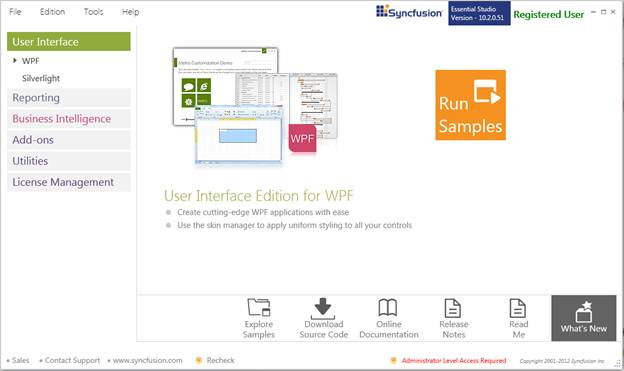
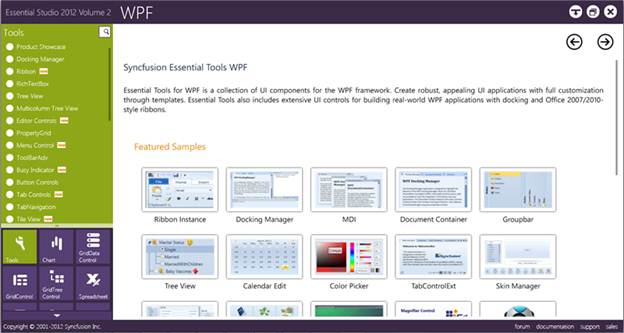
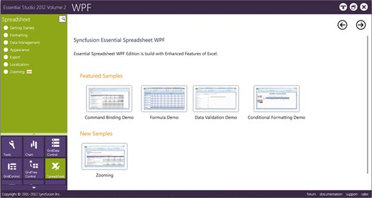

::: {style="DISPLAY: none"}
{#d2h_url_template}{#d2h_package_url style="WIDTH: 0px; DISPLAY: none; HEIGHT: 0px"}
:::

::::: {#nsbanner .d2h_main_nsbanner style="BORDER-BOTTOM: #999999 1px solid; POSITION: relative; PADDING-BOTTOM: 0px; BACKGROUND-COLOR: transparent; PADDING-LEFT: 0px; PADDING-RIGHT: 0px; DISPLAY: none; BORDER-TOP: #999999 1px solid; PADDING-TOP: 0px; LEFT: 0px"}
:::: {#TitleRow .d2h_main_titlerow style="PADDING-BOTTOM: 4px; BACKGROUND-COLOR: transparent; PADDING-LEFT: 22px; WIDTH: 100%; PADDING-RIGHT: 10px; DISPLAY: none; PADDING-TOP: 4px"}
::: {#ienav .d2h_main_ienav style="DISPLAY: none"}
{#D2HPrevious .D2HPreviousEnabled}  {#D2HNext .D2HNextEnabled}
:::
::::
:::::

::::: {#nstext .d2h_main_nstext style="PADDING-BOTTOM: 10px; BACKGROUND-COLOR: transparent; PADDING-LEFT: 22px; PADDING-RIGHT: 10px; HEIGHT: 100%; OVERFLOW: auto; PADDING-TOP: 5px" hasuserbackground="true" valign="bottom"}
::: {#d2h_breadcrumbs .d2h_breadcrumbs}
[Essential Studio User Guide Documentation](ms-xhelp:///?Id=12457748-09e3-4d74-a240-8e049cedf030){.d2h_breadcrumbsNormal}[ \> ]{.d2h_breadcrumbsLinkSeparator}[User Interface Edition](ms-xhelp:///?Id=c29296b7-531c-413b-a0ec-488ca1f7f669){.d2h_breadcrumbsNormal}[ \> ]{.d2h_breadcrumbsLinkSeparator}[Essential WPF](ms-xhelp:///?Id=7f4f82c5-151c-4262-94d0-75c4626c77bc){.d2h_breadcrumbsNormal}[ \> ]{.d2h_breadcrumbsLinkSeparator}[Essential Spreadsheet]{.d2h_breadcrumbsContentsOnly}[ \> ]{.d2h_breadcrumbsLinkSeparator}[Installation and Deployment](ms-xhelp:///?Id=a621d2d4-dd6d-4124-8641-25e517036714){.d2h_breadcrumbsNormal}
:::

## Where to Find Samples? {#where-to-find-samples style="tab-stops: 0pt"}

This section covers the location of the installed samples and describes the procedure to run the samples through the sample browser and online. It also lists the location of utilities, assemblies and source code.

 

Sample Installation Location

 

The Essential Spreadsheet for WPF samples are installed in the following location, locally on the disk:

***\...\\My Documents\\Syncfusion\\EssentialStudio\\\<Version Number\>\\WPF\\Spreadsheet.WPF\\Samples\\3.5\\ ***

 

**Viewing Samples**

 

Follow the steps to view the samples:

 

1.   Click **[Start]{style="FONT-FAMILY: 'Calibri','sans-serif'; FONT-SIZE: 11pt"}** \> **[All Programs]{style="FONT-FAMILY: 'Calibri','sans-serif'; FONT-SIZE: 11pt"}** \> **[Syncfusion]{style="FONT-FAMILY: 'Calibri','sans-serif'; FONT-SIZE: 11pt"}** \> **[Essential]{style="FONT-FAMILY: 'Calibri','sans-serif'; FONT-SIZE: 11pt"}** **[Studio]{style="FONT-FAMILY: 'Calibri','sans-serif'; FONT-SIZE: 11pt"}** \<version number\> \>**[Dashboard]{style="FONT-FAMILY: 'Calibri','sans-serif'; FONT-SIZE: 11pt"}**. The Syncfusion Essential Studio Dashboard \<version number\> window is displayed.

 

{border="0"}

Figure 1: Syncfusion Essential Studio Dashboard

 

2.   In the Dashboard window, click **[Run Samples]{style="FONT-FAMILY: 'Calibri','sans-serif'; FONT-SIZE: 11pt"}** for WPF under **[User Interface]{style="FONT-FAMILY: 'Calibri','sans-serif'; FONT-SIZE: 11pt"}** Edition panel. The WPF Sample Browser window is displayed.

 

::: {style="BORDER-BOTTOM: windowtext 1pt solid; BORDER-LEFT: medium none; PADDING-BOTTOM: 1pt; MARGIN-TOP: 9pt; PADDING-LEFT: 0pt; PADDING-RIGHT: 0pt; MARGIN-BOTTOM: 9pt; BORDER-TOP: windowtext 1pt solid; BORDER-RIGHT: medium none; PADDING-TOP: 1pt"}
{border="0"}Note: You can view the samples in any of the following three ways:
:::

 

[·      ]{style="FONT-FAMILY: Symbol"}**Run Samples** - Click to view the locally installed samples

[·      ]{style="FONT-FAMILY: Symbol"}**Run Online Samples** - Click to view online samples

[·      ]{style="FONT-FAMILY: Symbol"}**Explore Samples** - Explore WPF samples on disk

 

3.   Tools samples are displayed by default.

 

 

 

{border="0"}

Figure 2: Default WPF Sample

 

4.   Select **[Spreadsheet]{style="FONT-FAMILY: 'Calibri','sans-serif'; FONT-SIZE: 11pt"}**. The Spreadsheet samples are displayed.

 

{border="0"}

Figure 3: Spreadsheet Sample

 

 

Source Code Location

The default location of the Essential Spreadsheet for WPF source code is:

 

***\[System Drive\]:\\Program Files\\Syncfusion\\Essential Studio\\\<Version Number\>\\WPF\\Spreadsheet.WPF\\Src***

 

[]{#related-topics}
:::::
